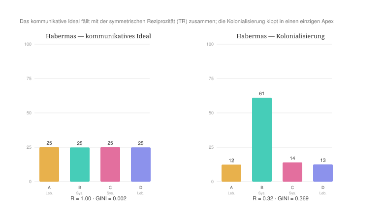
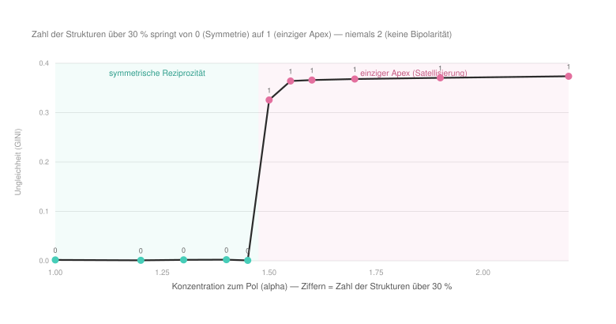
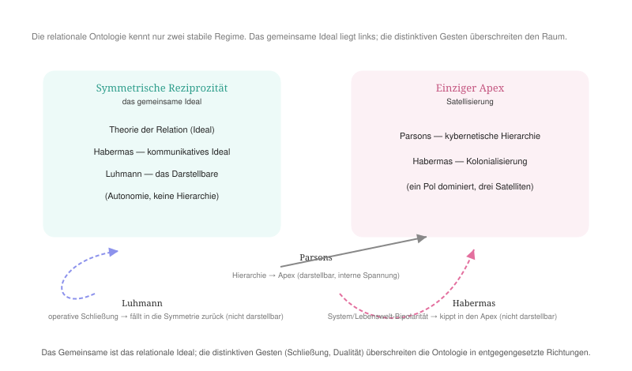

#+AUTHOR: Christian Papilloud
#+LANGUAGE: de
#+OPTIONS: toc:nil num:nil H:4 ^:nil
#+STARTUP: showall
#+LATEX_CLASS: book
#+LATEX_CLASS_OPTIONS: [11pt,a4paper]
#+CITE_EXPORT: csl chicago-author-date-de.csl
#+BIBLIOGRAPHY: Bericht.bib

* Kapitel 5 — Jürgen Habermas' kommunikatives Handeln
:PROPERTIES:
:STATUS: DRAFT
:END:

Jürgen Habermas' Theorie des kommunikativen Handelns vollendet das Dreieck der großen Kontrastrahmen, den wir mit dem Rahmen der TR vergleichen. Habermas' Theorierahmen ist das genaue Spiegelbild Luhmanns Theorie der sozialen Systeme. Wo Luhmann die operative Schließung zur Grundlagen seines Theorierahmens macht und auf jede legitimierende Reziprozität verzichtet, macht Habermas die kommunikative Reziprozität zum expliziten Apriori seines Theorierahmens. Die Verständigung, die gegenseitige Anerkennung von Geltungsansprüchen bilden die Grundlage der sozialen Integration. Genau deshalb erlaubt die Untersuchung Habermas' Theorierahmen den Ertrag der Auseinandersetzung mit den Theorie von Talcott Parsons und Niklas Luhmann zu vervollständigen. Erneut verwenden wir unseren Gabarit in sieben Schritten, und in einem abschließenden Abschnitt 5.8 ziehen wir die vergleichende Synthese zu unserem ersten Vergleich zwischen der TR und den Theorierahmen von Parsons, Luhmann und Habermas.

** 5.1 Ontologische Korrespondenz und Residuum
Habermas denkt die Gesellschaft auf zwei Ebenen. Die Lebenswelt wird kommunikativ über drei Leistungen bzw. über die kulturelle Reproduktion, die soziale Integration und die Sozialisation reproduziert [cite:@habermas1981tkh2 274]. Das System dagegen wird durch Steuerungsmedien gesteuert. Im System werden die Wirtschaft durch das Geld und die staatliche Verwaltung durch die Macht geführt. Daraus ergibt sich die folgende Korrespondenz zwischen den Relationsstrukturen der TR und dem Theorierahmen Habermas. Die Wirtschaft (C) entspricht dem ökonomischen System (Geld), die Politik (B) dem administrativen System (Macht), die Kultur (A) der kulturellen Reproduktion und die Medien (D) der sozialen Integration bzw. der Öffentlichkeit. Somit stehen sich zwei Systempole (B, C) und zwei Lebensweltpole (A, D) gegenüber.

Das Residuum ist auch hier ein Ergebnis. Der digitale Zwilling behandelt die vier Relationsstrukturen symmetrisch und kann nicht zwei Modi der Integration — die mediengesteuerte Integration und die kommunikativ reproduzierte Integration — unterscheiden. Anders als bei Luhmann jedoch fällt der grundlegende Ausgangslage Habermas' Theorie — die Reziprozität als Grundlage des Rahmens — mit derjenigen des digitalen Zwillings zusammen. Der Theorierahmen von Habermas kann deshalb vom digitalen Zwilling deutlich besser als Luhmanns Theorierahmen dargestellt werden. Sein Ideal sollte sich unmittelbar abbilden lassen, seine kritische Diagnose (die Kolonialisierung der Lebenswelt) sollte im digitalen Zwilling als Pathologie der Konzentration dargestellt werden können.

** 5.2 Theoretischer Kern
Die erste Orientierung im Habermas' Theorierahmen ist das kommunikative Handeln. Es ist auf Verständigung angelegt und unterscheidet sich kategorial vom erfolgsorientierten Handeln. Die Moral und das Recht gewährleisten, „daß die Grundlage verständigungsorientierten Handelns und damit die soziale Integration der Lebenswelt nicht zerfällt“ [cite:@habermas1981tkh1; @habermas1981tkh2 274]. Die Reziprozität erhält in diesem Zusammenhang explizit ihre normative Begründung.

Die zweite Orientierung ist die Lebenswelt als intersubjektiv geteilter Horizont. Eine Handlungssituation bildet stets das Zentrum der Lebenswelt, die nach einen wandelbaren Horizont entwickelt wird und in ihrer Gesamtheit nie einbezogen werden kann [cite:@habermas1981tkh2 224]. Die Lebenswelt wird somit kommunikativ reproduziert, und sie wird nicht über ein Medium gesteuert.

Die dritte Orientierung im Habermas' Theorierahmen ist mit dem Diskurs zu den Steuerungsmedien des Systems verbunden. Geld und Macht sind kalkulierbare, manipulierbare Größen, auf die die Akteure eine objektivierende, am eigenen Erfolg orientierte Position beziehen. Diese Medien sind auf zweckrationales Handeln zugeschnitten [cite:@habermas1981tkh2 407]. Die Verwendung von diesen Medien führen zur Ausdifferenzierung der Teilsysteme Wirtschaft und Staatsverwaltung, die sich somit von den Bereichen unterscheiden, die die kulturelle Reproduktion, die soziale Integration und die Sozialisation in der Gesellschaft leisten [cite:@habermas1981tkh2 274].

Die vierte Orientierung ist die vom System getriebene Kolonialisierung der Lebenswelt. Sie tritt ein, wenn „die geldgesteuerten und machtgesteuerten Subsysteme Wirtschaft und Staat mit monetären und bürokratischen Mitteln in die symbolische Reproduktion der Lebenswelt eingreifen“ [cite:@habermas1981tkh2 532]. Das ist die kritische normativ vorgeschlagene Diagnose Habermas': die Systemimperative überwältigen die kommunikativ zu reproduzierenden Bereiche der Lebenswelt.

** 5.3 Operationalisierung in zwei Modi
Um Habermas' Theorierahmen im digitalen Zwilling abzubilden, unternehmen wir zwei Läufe. Im ersten Lauf bilden Habermas' kommunikatives Ideal, nach dem die kommunikative Reziprozität in der Gesellschaft herrscht. Wir schreiben entsprechend ein symmetrisches, zirkulationsreiches Profil, davon es erwartet wird, dass es mit den Vorgaben der TR übereinstimmt. Im zweiten Lauf bilden wir die vom System gesteuerten Kolonialisierung der Lebenswelt mit der entsprechenden Eigendynamik der Systemmedien. Die Ketten der Sequenzen innerhalb der Relationsstrukturen lenken die Zirkulation auf die Systemmedien bzw. auf die Relationsstrukturen B und C (Macht, Geld), und es wird erwartet, dass eine erhöhte Konzentration zum Pol (alpha) die Wirtschaft und den Staat auf Kosten von der Kultur und der Öffentlichkeit wachsen lässt. Die beiden Profile liegen als =profil_Habermas_ideal.csv= und =profil_Habermas_kolonisierung.csv= im Anhang bei.

** 5.4 Vorregistrierte Hypothesen
Unsere Simulation vom Habermas' Theorierahmen kontrolliert für die folgenden Hypothesen. /H1/: Das kommunikative Ideal reproduziert den symmetrischen, reziproken Zustand der TR. Oder anders gesagt: Habermas’ normatives Ideal fällt mit dem relationalen Ideal zusammen. /H2/: Die Kolonialisierung sollte eine bipolare Asymmetrie erzeugen. Die Wirtschaft und der Staat (die mit den Relationsstrukturen B, C assoziiert werden) herrschen über die Kultur und die Öffentlichkeit (die mit den Relationsstrukturen A, D simuliert werden). In diesem Fall wird erwartet, dass die Reziprozität sinkt, und somit dass Habermas' Theorierahmen sein eigenes Alleinstellungsmerkmal aufweist und sich von Parsons' Theorierahmen (einziger Apex) sowie von Luhmanns Theorie sozialer Systeme und der TR (Symmetrie) unterscheidet. /H3/: Habermas' Muster ist spezifisch 2-gegen-2 bzw. B, C gegen A, D, wie dies die Kolonialisierungsthese voraussetzt.

** 5.5 Lauf und Ergebnisse
Die Läufe werden wie im Fall von Parsons und Luhmann entwickelt bzw. sie verlaufen rechnerisch, deterministisch und auf der Grundlage vom neutralen Szenario der perfekten Relation bzw. im Keim 1. Das Ergebnis bestätigt H1 und widerlegt H2 und H3. Diese Widerlegung ist der eigentliche Befund.

| Kennzahl | TR (Referenz) | Habermas-Ideal | Habermas-Kolonialisierung |
|-------+--------+--------+---------|
| Ungleichheit (GINI) | 0,002 | 0,002 | ~0,37 |
| Reziprozität | 0,997 | 0,997 | ~0,31 |
| Größen A·K / B·P / C·W / D·M | 25/25/25/25 | 25/25/25/25 | ~13 / ~61 / ~14 / ~12 |
| Satellisierung | — | — | Kultur, Wirtschaft, Medien |

H1 ist bestätigt. Das kommunikative Ideal stimmt exakt mit dem symmetrischen, reziproken Zustand der TR überein. H2 und entsprechend H3 können nicht unterstützt werden. Die Kolonialisierung, davon Habermas spricht, erzeugt keine asymmetrische Dualität System/Lebenswelt im digitalen Zwilling, sondern sie führt stets zu einem einzigen Apex, der stets die Herrschaft der Politik (Macht) unterstreicht, die selbst die Wirtschaft satellisiert. Bei Habermas befinden wir uns dann in einem ähnlichen Fall wie bei Parsons.

#+NAME: fig:habermas-ideal-kolonisierung
#+CAPTION: Links das kommunikative Ideal, das mit der symmetrischen Reziprozität der TR zusammenfällt; rechts die Kolonialisierung, die in einen einzigen Apex kippt (die Macht herrscht über drei Satelliten).

** 5.6 Robustheit
Der Befund ist robust. Bei Veränderung der Kettenkonfiguration und des Keimes kann der digitale Zwilling keine stabile Bipolarität erzeugen. Es entsteht entweder einen symmetrischen Zustand, oder die Macht satellisiert die drei anderen Relationsstrukturen. Der Grund liegt in der Verbreitungsdynamik der Relationsstrukturen selbst, die der digitale Zwilling simuliert. Eine selbständige Relationsstruktur, die sich verbreitet, wächst und wird mächtiger, weil sie die anderen Relationsstrukturen schwächt bzw. diese anderen Relationsstrukturen ihre eigene Dynamik aufzwingt. Im digitalen Zwilling geschieht es proportional zum Produkt der Größen der Relationsstrukturen, was bedeutet, dass eine Relationsstruktur, die mächtiger wird, die anderen Relationsstrukturen immer stärker satellisiert und dabei selbst immer stärker wird, bis diese Satellisierung so stark ist, dass sie die satellisierende Relationsstruktur selbst gefährdet. Deshalb können zwei gleich starke Relationsstrukturen nicht stabil koexistieren. Jede minimale Asymmetrie zwischen ihnen wird verstärkt, bis eine Relationsstruktur gewinnt und die anderen Relationsstrukturen satellisiert. Ein Zwei-Apex-Zustand bildet im digitalen Zwilling deshalb nur einen flüchtigen Moment in der Entwicklung von Satellisierungsstrategien und kann demzufolge nicht stabilisiert werden. Dies stimmt mit der relationalen Ontologie der TR, die genau zwei stabile Regime kennt — die symmetrische Reziprozität und den einzigen Apex. Wenn etwa die Konzentration zum Pol (alpha) bei symmetrischen Ketten gesteigert wird, so springt die Zahl der herrschenden Relationsstruktur von null (Symmetrie) auf eins (Apex), aber sie kann niemals zwei herrschende Relationsstrukturen gleichzeitig ergeben.

#+NAME: fig:habermas-bifurkation
#+CAPTION: Bei wachsender Konzentration springt die Zahl der herrschenden Relationsstrukturen von 0 (symmetrische Reziprozität) auf 1 (einziger Apex) — niemals auf 2.

** 5.7 Lesart
Auf der dreistufigen Skala der sozialen Ungleichheiten, die der digitale Zwilling misst, zeigt sich die Kolonialisierung der Lebenswelt als die Dynamik der Produktion von einer transversalen Ungleichheit, die weitere horizontalen und vertikalen Ungleichheiten zuerst in der Wirtschaft (C mit einem Reziprozitätswert von 0,35) und dann verstärkt in der Lebenswelt (etwa A mit einem Reziprozitätswert von 0,28) produziert. Diese Berücksichtigung der Verbreitung von sozialen Ungleichheiten in den beherrschten Relationsstrukturen vervollständigt die Lesart einer grundlegenden Unterscheidung zwischen Habermas' Theorierahmen und dem Rahmen der TR. Unterschiedlich als Habermas setzt die TR keine Opposition zwischen dem System und der Lebenswelt voraus. Im Rahmen der TR ist jede Relationsstruktur potentiell Kolonisatorin und Kolonisierte. Die Herrschaft von einer Relationsstruktur ist eine emergente Eigenschaft aller Relationsstrukturen, die nicht a priori zu bestimmten Relationsstrukturen zugeschrieben wird. Habermas' kategoriale Unterscheidung zwischen dem System und der Lebenswelt und seine Auffassung des normativen Vorrangs der kommunikativen Reproduktion ist eine inhaltliche Festlegung, von der die TR absieht. Oder anders gesagt: Habermas' kategoriale Unterscheidung setzt eine Reziprozitätsdynamik innerhalb des Systems zwischen der Wirtschaft und dem Verwaltungsapparat, die identisch funktionieren soll, damit die Herrschaft vom System in der Theorie gewährleistet werden kann, was gegen die Annahme geht, die die TR unterstützt, nach dem die Wirtschaft und das Verwaltungsapparat nach einem eigenen modus operandi und einer entsprechenden eigenen Konsekration von diesem modus operandi funktionieren würden. Mit Habermas sollte dann angenommen werden, dass die Reziprozität nicht nur in der Lebenswelt existiere, in der es gegen die Herrschaft des Systems widerstanden wird, sondern auch im System, in dem es gegen die Herrschaft der Lebenswelt widerstanden wird. Diese Ausgangslage von zwei Systemen gegen zwei anderen Systemen produziert formal eine Blockade in einem Herrschaftsverhältnis, das nicht abgebaut werden kann. Das ist zugleich der Grund, warum der digitale Zwilling diese Bipolarität nicht abbilden kann: Die relationale Ontologie kennt keine eingebaute 2-gegen-2-Strukturen, sondern nur die monistische Konzentrationsdynamik zu einer herrschenden Relationsstruktur, die zum Vorteil von einer anderen Relationsstruktur abgebrochen werden kann.

Diese Lesart erlaubt auch, Habermas’ eigene Kritik an Luhmann genau zu verorten. Habermas wirft Luhmann vor, „schlicht voraus[zusetzen; CP], daß die Strukturen der Intersubjektivität zerfallen“ würden, was die Individuen aus ihrer Lebenswelt herauslösen würde [cite:@habermas1985diskurs 409]. Dagegen wirkt die herrschaftsfreie, verständigungsorientierte Kommunikation [cite:@habermas1971theorie 138]. Unser Befund zeigt, warum diese Auseinandersetzung unauflöslich ist. Habermas und Luhmann konvergieren in der relationalen Konfiguration (selbstständige, differenzierte Systeme), aber sie unterscheiden sich in Bezug auf die Grundannahmen, wobei beide Autoren zur ähnlichen Folge kommen. Luhmanns operative Schließung gewährleistet die Unterscheidung der Systeme unter Ausschluss jeglicher Art von Einflussnahme der Systeme aufeinander, wenn Habermas' Kommunikationsansatz eine solche operative Schließung nicht unterstützt, davon der Preis die blockierte Asymmetrie zwischen System und Lebenswelt ist, die von keinen der beiden Polen verändert werden kann bzw. nicht beeinflusst werden kann. Oder anders bzw. relational umformuliert: Bei Habermas produziert die Kolonialisierung der Lebenswelt als Spezialfall der Satellisierung -- ähnlich wie bei Parsons -- den Widerstand als Anti-Satellisierung an der Seite der Lebenswelt, daraus sich die Logik der dopplten Apex herausgebildet wird und System wie Lebenswelt in einer Asymmetrie aufbewahrt, die konstant reproduziert wird.

** 5.8 Vergleichende Synthese: Parsons, Luhmann, Habermas
Talcott Parsons, Niklas Luhmann und Jürgen Habermas vertreten mit ihren jeweiligen Theorierahmen drei unterschiedlichen Standpunkte zu relationalen Ansätzen in der Soziologie, die im digitalen Zwilling der TR abgebildet werden können, damit es veranschaulicht werden kann, welche Ansätzen dieser Theorierahmen mit der TR geteilt und nicht geteilt werden können. Aus diesem Vergleich ergibt sich eine Gemeinsamkeit, die im Ideal der Theorierahmen liegt. Was Parsons die integrierte Ordnung, Luhmann die funktionale hierarchielose Differenzierung und Habermas die kommunikativ reproduzierte Lebenswelt nennen, stimmt im digitalen Zwilling mit dem Zustand der symmetrischen, reziproken Selbstständigkeit der vier Relationsstrukturen überein, der das Ideal der TR darstellt.

Der Unterschied zwischen diesen Rahmen und der TR liegt in der eigenen Geste der jeweiligen Autoren und in ihrem Verhältnis zur relationalen Ontologie. Parsons kann im digitalen Zwilling dargestellt werden. Seine kybernetische Hierarchie passt im relationalen Rahmen der TR, und der digitale Zwilling deckt seine verborgene Konsequenz auf, die die Satellisierung jeder Ordnung von Relationen durch die Politik ist. Gleichzeitig befindet sich die Unterscheidung von Parsons gerade in dieser typischen Satellisierung, die weitere Formen der Satellisierung durch andere Relationsstrukturen fast vollständig ausschließt bzw. unwahrscheinlich macht. Luhmann und Habermas dagegen überschreiten die relationale Ontologie der TR einerseits ab der Grundlage ihres Theorierahmen und andererseits jeweils in entgegengesetzte Richtungen. Luhmanns operative Schließung überschreitet sie „nach unten“. Der digitale Zwilling kann Luhmanns operative Schließung nicht darstellen und kehrt deshalb zur Ausgangslage der perfekte Relation bzw. der symmetrischen Reziprozität zurück. Habermas' System/Lebenswelt-Dualität überschreitet die TR „nach oben“. Die von Habermas vorgesehene Bipolarität des Systems kann der digitale Zwilling nicht abbilden, und er produziert eine Satellisierung mit einem einzigen Apex (Politik).

#+NAME: fig:synthese-drei
#+CAPTION: Drei Wege in einem relationalen Raum. Das gemeinsame Ideal ist die symmetrische Reziprozität; Parsons’ Hierarchie ist darstellbar (interne Spannung); Luhmanns Schließung und Habermas’ Dualität überschreiten die relationale Ontologie der TR in entgegengesetzte Richtungen.

Diese Ergebnisse bedeuten, dass der Rahmen der TR einerseits diese drei Ansätze einbezieht, sie aber im Vergleich zu den Theorierahmen von Parsons, Luhmann und Habermas anders aufgreift. Im Rahmen der Theorie der Relation gibt es sowohl die Perspektive von einer operativen Schließung und von einer Satellisierung, die sich gegenseitig beeinflussen, weshalb die TR nicht zu einer operativen Schließung der Relationsstrukturen ohne Satellisierung (Luhmann), nicht zu einer dualen Satellisierung (Habermas) und nicht zu einer einzigen Satellisierung (Parsons) gelangt. Die operative Schließung von Relationsstrukturen aufgrund ihrer besonderen Ordnung der Sequenzen (die Kette im digitalen Zwilling) stärkt diese Relationsstruktur und ihren Einfluss auf andere Relationsstrukturen, deren operative Schließung deshalb geschwächt wird, was sich aber im Lauf der Entwicklung von Relationsstrukturen unterschiedlich auf diese Relationsstrukturen auswirkt. Eine satellisierende Relationsstruktur in einer bestimmten Zeit kann zu einer satellisierten Relationsstruktur werden, wenn sie geschwächt wird. Und sie kann geschwächt werden, weil die Zirkulation von Akteuren zu ihrer Einschreibung mit Vermittlungsinstanzen der Relationsstrukturen weniger optimal verläuft. Dieser Ansatz der Zirkulation ist das, was die TR von den drei Theorierahmen, mit denen wir sie verglichen haben, unterscheidet und schließlich eine im Rahmen der TR kohärente Integration von der operativen Schließung der Relationsstrukturen und deren Satellisierungsmacht bereitstellt.

Nach dieser vergleichende Analyse vom Theorierahmen der TR und seinen distinktiven Merkmalen zu Theorierahmen, die eine unterschiedliche Position zu einer relationalen Ontologie beziehen, kommen wir zu Theorierahmen, die fester in der relationalen Ontologie eingeschrieben werden und der relationalen Soziologie wichtige Grundimpulsen gegeben haben. Wir fangen mit dem Theorierahmen von Harrison White um die Analyse der Gesellschaft als Netzwerk.

** Literatur
#+print_bibliography:
