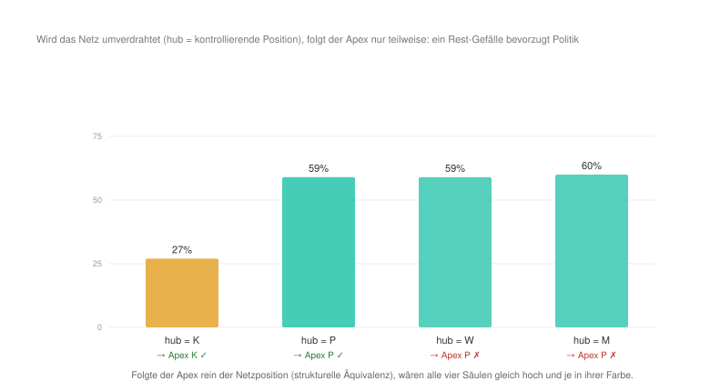

#+AUTHOR: Christian Papilloud
#+LANGUAGE: de
#+OPTIONS: toc:nil num:nil H:4 ^:nil
#+STARTUP: showall
#+LATEX_CLASS: book
#+LATEX_CLASS_OPTIONS: [11pt,a4paper]
#+CITE_EXPORT: csl chicago-author-date-de.csl
#+BIBLIOGRAPHY: Bericht.bib

* Kapitel 6 — Netzwerkanalyse: Harrison White
:PROPERTIES:
:STATUS: DRAFT
:END:
Mit Harrison White begegnet die TR einen Rahmen, der ihr verwandt ist. Anders als Parsons, Luhmann und Habermas ist Whites netzwerktheoretische Soziologie grundlegend relational. Sie kennt keine vorgegebenen Funktionssphären, keine substantiellen Akteure, keine Spitzeninstanz, sondern Identitäten, Bindungen und Positionen, die sich wechselseitig ko-konstituieren. Auf dem Papier steht Whites Netzwerktheorie der TR deshalb näher als jeder der bisher behandelten Theorierahmen. Der Kontrast verschiebt sich entsprechend von der relationalen Ontologie zu dem, was diese relationale Ontologie ausmacht bzw. ihre treibende Kraft darstellt. Bei Whites Netzwerktheorie ist es nicht die Reziprozität wie in der TR, sondern die Kontrolle. Sein Begriff der Positionen versteht White nicht in einem Einschreibungsverhältnis mit Vermittlungsinstanzen der Gesellschaft, sondern als reine relationale Position, die strukturell äquivalent sind. Dies bildet die Ausgangslage von unserer Behandlung Whites Netzwerktheorie mit dem digitalen Zwilling der TR, die wir nach den gleichen Stufen entwickeln, wie wir es mit Parsons, Luhmann und Habermas gemacht haben.

** 6.1 Ontologische Korrespondenz und Residuum
Im digitalen Zwilling der TR entspricht Whites netzwerkartige Auffassung von Positionen den vier Relationsstrukturen die zu vier Netzwerkpositionen werden, die allein strukturell durch ihr Beziehungsmuster — ihre strukturelle Äquivalenz, die im digitalen Zwilling die Sequenzen von Relationsstrukturen darstellen — definiert sind. Die Akteure in den Akteurkategorien der TR entsprechen Whites Auffassung von Identitäten, die nach einem "footing" bzw. nach Kontrolle suchen. Die Ketten der Relationsstrukturen im digitalen Zwilling entsprechen den Bindungen und, enger gefasst, den Vakanzketten der Mobilität in Whites Theorierahmen. Aus dieser Überführung von Whites Theorierahmen in den digitalen Zwilling der TR ergibt sich ein doppeltes Residuum.

Erstens entleert White die Positionen von jedem Gehalt, weshalb in seinem Theorierahmen eine Position ein reines Beziehungsmuster darstellt. Da diese Positionen nicht von einem Inhalt bestimmt werden, werden zwei Identitäten die mit zwei strukturell äquivalenten Positionen verbunden sind, austauschbar. Die Relationsstrukturen im digitalen Zwilling, damit Whites Positionen in Verbindung gesetzt werden, enthalten im Unterschied zu Whites Auffassung von Positionen Vermittlungsinstanzen, die nach der TR nicht gegenseitig ausgetauscht werden können. Genau diese Unterscheidung — Position ohne Gehalt vs. Relationsstruktur mit Vermittlungsinstanzen — ist die im Methodenkapitel angekündigte Kontrastachse. Wie wir es sehen werden, kann der digitale Zwilling einen solchen Kontrast nicht verfehlen, und es wird entsprechend erwartet, dass er den Kontrast markiert. Zweitens ist Whites Kernansatz mit dem Begriff der Kontrolle verbunden bzw. nicht mit einem Begriff der Reziprozität. An der Seite des digitalen Zwillings kann deshalb erwartet werden, dass die Reziprozitätsmetrik Whites Kontrolldynamik tendenziell als Asymmetrie abbilden wird. Schließlich drittens haben die /switchings/ zwischen Netzwerk-Domänen, die für White wichtig sind, weil dort entsteht die Bedeutung für die Akteure, keine saubere Entsprechung im digitalen Zwilling und bleiben deshalb ausdrücklich als Residuum vermerkt.

** 6.2 Theoretischer Kern
Die Überführung Whites Theorierahmen in den digitalen Zwilling stützt sich auf vier Grundorientierungen, die wie folgt beschrieben werden können.

Die erste Orientierung ist der Kontrolltrieb. Nach White ist die Identität kein Substrat, sondern das Ergebnis von Kontrollanstrengungen im unruhigen Kontext: „Identities spring up out of efforts at control in turbulent context“ [cite:@white2008identity 1]. Identitäten suchen einen Halt bzw. ein "footing" im Universum der Kontingenz. Entscheidend — und für den Kontrast zur Herrschaft folgenreich — ist Whites ausdrückliche Klarstellung, dass dieser Kontrollbegriff zunächst nichts mit Herrschaft über andere zu tun hat. Kontrolle „does not have anything to do with domination over other identities“ [cite:@white2008identity 1]. Kontrolle heißt Selbstverortung und nicht Unterwerfung, und genau diese Bestimmung werden wir im digitalen Zwilling auf die Probe stellen.

Die zweite Orientierung ist die Bestimmung der Positionen durch strukturelle Äquivalenz. Einen Halt zu gewinnen heißt bei White strukturelle Äquivalenz zu erzeugen: „to gain footings means to fashion structural equivalence“ [cite:@white2008identity 7]. Positionen und Rollen sind nicht inhaltlich aufgrund von besonderen immanenten Merkmalen bestimmt, sondern rein relational definiert. Es sind Blöcke gleicher Beziehungsmuster, wie dies die Methode des Blockmodelling formuliert: Soziale Struktur wird aus mehreren Netzwerken als ein System von Rollen und Positionen rekonstruiert, die durch ihre Äquivalenzklassen bestimmt sind [cite:@whiteboorman1976social 730]. Dies ist das, was wir oben beschrieben haben, wenn wir gesagt haben, dass nach White Positionen Stellungen im Beziehungsgeflecht signalisieren.

Die dritte Orientierung bezieht sich auf die Kristallisation der Kontrolle in drei Disziplinen. Nach White werden die Kontrollanstrengungen zu drei Typen sozialer Formation verfestigt: „I introduce three different species of disciplines — Interfaces, Arenas and Councils" [cite:@white2008identity 9], die er im dritten Kapitel seines Buches /Identity and Control/ ausführlich beschreibt [cite:@white2008identity 63 ff.]. Das Interface konstruiert eine Ordnung in Bezug auf die Qualität und Produktion (etwa der Markt in der Wirtschaft). Das Council baut diese Ordnung über Vermittlung und Einbettung auf (wie ein Gremium von einer Behörde oder einer Firma). Die Arena entwickelt eine Ordnung über Auswahl und Prestige (etwa die Wahl von Mitgliedern in einem Verein). Interessant für unsere Diskussion ist die Art und Weise, wie White diese drei Disziplinen der Kontrolle ausdrücklich neben Parsons’ analytischem Funktionsschema bzw. sie demselben analytischen Ort zuschreibt, den Parsons mit seinem AGIL-Muster zu besetzen versucht [cite:@white2008identity 112ff.]. Die drei Disziplinen sind drei Arten und Weisen, wie aus der Suche nach der Kontrolle die Ordnung entsteht.

Die vierte Orientierung ist die Mobilität als Zirkulation durch Positionen. Whites frühes Modell der Vakanzketten versteht die Mobilität nicht im Sinne der Mobilität von Personen, sondern im Sinne der Mobilität von Leerstellen bzw. von Vakanzen bzw. von Positionen, die leer sind. Eine Vakanz wandert durch eine Kette von Positionen, während sich die Personen gegen diese Vakanz bewegen [cite:@white1970chains]. Märkte schließlich begreift White als Rollenstrukturen, die aus aufeinander bezogenen Netzwerken hervorgehen [cite:@white2002markets]. In beiden Fällen ist die Position der Knoten der Zirkulation, und genau hier berührt Whites Theorierahmen die TR am unmittelbarsten.

Quer zu diesen vier Orientierungen geht schließlich Whites These über die Entstehung von Ungleichheiten. Ungleichheiten ergeben sich für White nicht aus einem verborgenen Plan und sie können nicht als Ziel der gesellschaftlichen Entwicklung konzipiert werden. Ungleichheiten bilden ein unbeabsichtigtes Nebenprodukt der Suche nach der Kontrolle, des „getting action“. Geplante Ungleichheiten, wenn sie existieren, erreichen nie das Ausmaß jener, die sich als unbeabsichtigte Nebenprodukte der Suche nach der Kontrolle ergeben. Solche unvorhersehbare Ungleichheiten sind am bedeutsamsten gerade an den Bruchstellen zwischen sozialen Formationen [cite:@white2008identity 184]. Die Herrschaft entspringt mithin der relationalen Dynamik selbst. In seinem französischen Aufsatz zur Herrschaft aus 1995 fasst White sie als „Grammatik der Domination“, die aus den netzwerkartigen Passagen und aus den Umschaltungen hervorgeht und sich in ihnen niederschlägt [cite:@white1995domination 705]. Dass die Kontrolle „nichts mit Herrschaft zu tun hat“ und die Herrschaft gleichwohl als Nebenprodukt der Kontrolle entsteht, ist kein Widerspruch, sondern Whites genaue Pointe und der Punkt, an dem ihn der digitale Zwilling am schärfsten prüfen kann.

** 6.3 Operationalisierung
Die vier Orientierungen können als Reglerprofil formalisiert werden, das dann in den digitalen Zwilling überführt werden kann. Der Kontrolltrieb (O1) erhöht die Konzentration zum dominanten Pol (alpha) auf 1,6. Jede Identität sucht ihren Halt, jeder Akteur sucht nach der Kontrolle. Die strukturelle Äquivalenz (O2) wird durch symmetrische, gehaltlose Ketten abgebildet. Damit sagt der digitale Zwilling in der Sprache von White, dass die Positionen untereinander austauschbar sind. Keine Position trägt folglich einen inhaltlichen Vorrang. Die Zirkulation durch Bindungen und Vakanzketten (O4) setzt die Zirkulation der Akteure (rate) auf 1,8 bei mittlerer Durchlässigkeit zwischen Strukturen (over) von 1,0. Die drei Disziplinen (O3) liefern drei Varianten desselben Profils: das /Council/ (die Vermittlung) senkt alpha auf 1,2; die /Arena/ (Auswahl, winner-take-all) hebt es auf 1,8; das /Interface/ (Stratifikation nach Qualität) prüft den Bereich um die Schwelle mit einer kaskadierenden Kettenführung. Der gemeinsame Nullpunkt bleibt das neutrale, symmetrische Szenario der TR, der den Zustand der perfekten Relation wiedergibt.

** 6.4 Vorregistrierte Hypothesen
Drei Hypothesen werden getestet. /H1/ besagt, dass die Kontrolle eine Asymmetrie produziert. Da Whites Ansatzkern die Kontrolle und nicht die Reziprozität ist, sollte das Profil in der Ausgangslage den symmetrischen Zustand des digitalen Zwilling nicht von selbst halten, sondern in einen einzigen /Apex/ kippen lassen. Dies bedeutet, dass eine Identität gewinnt die Kontrolle über die anderen. Nach /H2/ bleibt die Symmetrie nur durch Vermittlung vorhanden. Allein die Council-Disziplin als Vermittlung sollte die Symmetrie im digitalen Zwilling rehabilitieren. Arena und Interface sollten die Entwicklung der Herrschaft begünstigen. H3 legt nah, dass der Apex austauschbar ist. Wenn die strukturelle Äquivalenz gilt, dann darf die Identität des Apex keine Rolle spielen. Welche Position herrscht, müsste allein von der netzwerkartige Konstitution der Position abhängen und bei Veränderung dieser Beziehungsgeflecht des Netzes mit wandern. So bleiben die Positionen gehaltlos und austauschbar.

** 6.5 Lauf und Ergebnisse
Der Lauf im digitalen Zwilling bestätigt H1 unmittelbar. Das Grundprofil „identities seek control“ kippt aus der Symmetrie in einen einzigen Apex. Eine Relationsstruktur wächst auf 61 % und die drei anderen Relationsstrukturen werden gestört bzw. schrumpfen. Die soziale Ungleichheit wird bedeutsamer (0,36) und die systemische Reziprozität bricht ein (0,34; vgl. Abbildung [[fig:white-kontrolle-apex]]). Die Kontrolle erzeugt dann tatsächlich die Herrschaft, was die These Whites bestätigt: Die soziale Ungleichheit entsteht als unbeabsichtigtes Nebenprodukt der Kontrollsuche. Der digitale Zwilling reproduziert damit Whites Pointe: Die Suche nach Kontrolle ist nicht mit der Absicht gekoppelt, eine Herrschaft in der Gesellschaft zu produzieren. Nichtsdestotrotz gelangt die Suche nach der Kontrolle zwangsläufig zur Herrschaft.

#+NAME: fig:white-kontrolle-apex
#+CAPTION: Das Profil „identities seek control“ hält die Symmetrie nicht, sondern kippt in einen einzigen Apex. Die Herrschaft entsteht als Nebenprodukt der Kontrollsuche, nicht als deren Zweck.
[[file:figures/white_kontrolle_apex.svg]]

H2 wird ebenfalls bestätigt. Wenn im Sinne der Council-Disziplin der Kontrolldruck gesenkt wird (alpha 1,2), dann kehrt die reziproke Symmetrie zurück (Reziprozität 0,98, Ungleichheit 0,001). Die Arena-Disziplin (alpha 1,8) führt dagegen wie das Grundprofil in den Apex. Oder anders gesagt: Nur die Vermittlung unterstützt die Symmetrie.

H3 kann nicht bestätigt werden, was der eigentliche Ertrag dieses Kapitels darstellt. Verändert man das Netzwerk so, dass jeweils eine andere Position die kontrollierende Stellung einnimmt und zum Apex wird, dann sieht man, dass der Apex nur teilweise dieser neuen Konfiguration der Positionen folgt (Abbildung [[fig:white-rewire]]). Macht man etwa Kultur zur Kontrollposition, so führt sie nur schwach (27 %). Wird die Politik zur Kontrollposition, dann herrscht sie deutlich stärker (59 %). Wenn die Wirtschaft oder die Medien zur Kontrollposition steigen, dann setzt sich dennoch die Politik durch und sie wird zum Apex. Die Positionen sind also nicht ohne weiteres austauschbar bzw. ein inhaltlicher Rest haftet an den Positionen, die im digitalen Zwilling die Relationsstrukturen darstellen, der White netzwerkartigen Theorierahmen nicht vollständig reproduziert. Im Rahmen der TR kann deshalb Whites Vorschlag der reinen strukturellen Äquivalenz nicht unterstützt werden. Tatsächlich setzt die TR voraus, dass Relationsstrukturen aufgrund der Umstrukturierung der Ketten im digitalen Zwilling bzw. auf der Grundlage der Veränderung ihrer Dynamik verbreitet oder geschrumpft werden. Dies hat Folgen für die Bedeutung der Akteurpositionen sowie für die Kraft der Vermittlungsinstanzen in Relationsstrukturen, die bei einer Verbreitung die Dynamik einer Relationsstruktur stärken und bei einer Schrumpfung immer weniger in der Lage sind, eine solche Stärkung der Relationsstruktur zu unterstützen. Es gibt deshalb in der TR keine reine strukturelle Äquivalenz der Positionen, sondern eine solche Äquivalenz dem Status einer Relationsstruktur entspricht, die von einer anderen Relationsstruktur vollständig satellisiert werden würde bzw. zu einem Satellit der satellisierenden Relationsstruktur werden würde. In der TR kann eine solche vollständige Satellisierung geschehen, selbst wenn diese Art von Satellisierung nicht auf Dauer gehalten werden kann, ohne die satellisierende Relationsstruktur zu schwächen. Whites reine strukturelle Äquivalenz ist dann im Vergleich zur TR als ein ihrer Grenzfälle zu deuten.

#+NAME: fig:white-rewire
#+CAPTION: Bei Veränderung der netzwerkartigen Struktur von Positionen kann Whites strukturelle Äquivalenz nicht vollständig reproduziert werden.

** 6.6 Robustheit
Der Apex-Befund bleibt in den Läufen mit Zufallskeimen stabil. Über sechs Keime hinweg liefert das Grundprofil unverändert dieselbe Endkonfiguration. Das Ergebnis ist also kein Artefakt, dass der digitale Zwilling aus sich selbst heraus produzieren würde. Die drei Disziplinen der Kontrolle ergeben keine feinere Abstufung, sondern fallen je nach Kontrolldruck entweder in die Symmetrie (Council) oder in den Apex (Arena, Interface oberhalb der Schwelle). Eine mittlere, stratifizierte Ordnung, wie sie das Interface als Steuerungsmechanismus durch Qualitätskontrolle nahelegt, bildet der digitale Zwilling nicht ab. Auch hier kennt das Modell nur die reziproke Symmetrie und den einzelnen Apex.

** 6.7 Lesart: Nähe, Differenz und verborgene Prämisse
Auf der dreistufigen Skala der sozialen Ungleichheiten entspricht Whites Auffassung von Ungleichheit den transversalen Ungleichheiten mit voller Kaskade (Apex 0,36, Stratifizierung der Beherrschten), die jedoch flach bleibt. Unter der Bedingung der sozialen Mobilität ist die transversale Ungleichheit reversibel, was bedeutet, dass die Kaskade der sozialen Ungleichheiten nicht dauerhaft nach unten reicht und die horizontalen sowie vertikalen Ungleichheiten verstärkt. Es gibt eine Erschöpfung der Verbreitung von sozialen Ungleichheiten, weil die strukturelle Äquivalenz der Positionen greift.

Zusammengefasst zeigen diese Ergebnisse, dass Whites Theorierahmen in der Form einer netzwerkartigen relationalen Soziologie mit der TR gut verwandt ist. Beide Theorierahmen machen die Relation, nicht die Substanz, zur Grundlage der soziologischen Erklärung. Beide unterstützen die Entstehung von einem Apex, ohne dass dieser Apex die Herrschaft von stets der selben Relationsstruktur darstellt. Beide Theorierahmen fassen die soziale Mobilität vom Standpunkt der Zirkulation von Akteuren durch Positionen auf. In dieser Hinsicht spiegeln Whites Vakanzketten [cite:@white1970chains] die Ketten des digitalen Zwilling der TR strukturell wider. Im Regime der Council-Disziplin, der die Kontrolle über Vermittlung ausübt, führen beide Theorierahmen zum selben Ergebnis der Rückkehr der Positionen bzw. Relationsstrukturen zur reziproken Symmetrie und der Verflachung von Herrschaftsstrukturen.

Es gibt jedoch wichtige Unterscheidungen zwischen Whites Theorierahmen und der TR, die damit verbunden sind, dass die Suche nach einer Reziprozität, damit die TR argumentiert, zur Suche nach der Kontrolle bei White wird. Unterschiedlich als in der TR führt diese Suche nach der Kontrolle unmittelbar zur Asymmetrie zwischen Positionen und erzeugt somit eine Herrschaft. Dies ist die freigelegte verborgene Prämisse Whites Theorierahmen: Seine Soziologie ist relational, aber sie ruht auf der Asymmetrie. Im Rahmen seiner Theorie versteht White die Herrschaft nicht als das, was durch eine äußere Instanz oder durch einen verborgenen Plan produziert werden würde, sondern als Wirkung der relationalen Dynamik selbst bzw. als unbeabsichtigtes Nebenprodukt des Spiels um "footing" und Position [cite:@white2008identity §5.2.6; @white1995domination 705]. Der digitale Zwilling der TR zeigt diesen Mechanismus formal: Aus dem gleichmäßig verteilten Kontrolltrieb ohne jede Herrschaftsabsicht werden drei Relationsstrukturen von einer vierten Relationsstruktur satellisiert. Bemerkenswert ist dabei, dass White damit einen ähnlichen Endzustand wie Parsons erreicht, selbst wenn White einen ganz anderen Weg geht. Die Produktion von Herrschaft erfolgt nicht über eine kybernetische Werthierarchie, sondern über die wechselseitige Kontrollsuche gleichgestellter Identitäten.

Schließlich und wie oben erwähnt, unterscheiden sich die TR und Whites Theorierahmen in der Auffassung von Positionen bzw. Relationsstrukturen. Nach White sind Positionen durch strukturelle Äquivalenz rein relational bestimmt und daher austauschbar [cite:@white2008identity §1.3; @whiteboorman1976social 730]. Der digitale Zwilling kann diese Gehaltlosigkeit nicht restlos einlösen. Wie die Abbildung [[fig:white-rewire]] zeigt, ist eine strukturelle Äquivalenz der Relationsstrukturen in der TR nur als Grenzfall der Satellisierung denkbar, weil Positionen sowohl von Akteuren als auch von Vermittlungsinstanzen nicht austauschbar sind, sondern im Laufe der Verbreitung und Schrumpfung von Relationsstrukturen immer wieder neu definiert werden. Eine vollständige Entleerung des Gehaltes von Positionen in der TR würde bedeuten, dass eine oder mehrere Relationsstrukturen vollständig als Satelliten und daher als Sequenzen einer einzigen Relationsstrukturen funktionieren würde, was nicht undenkbar ist, jedoch ein Grenzfall der Entwicklung von Relationsstrukturen darstellt. Insofern überschreitet Whites strukturelle Äquivalenz die relationale Ontologie des digitalen Zwillings, wie oben Luhmanns operative Schließung und Habermas' System/Lebenswelt-Dualität sie ebenfalls überschreiten. Whites Geste in dieser Hinsicht ist besonders deshalb, weil er die radikale Voraussetzung formuliert, dass eine Position nichts anders als ihr relationales Muster sei.

** 6.8 Entwicklungslinien
Mit White lernen wir, dass /relational/ und /reziprok/ nicht dasselbe sein müssen. Eine durch und durch relationale Soziologie wie die Netzwerktheorie von Harrison White kann gleichwohl auf der Grundlage von einer asymmetrischen Prämisse argumentieren, die zur Herrschaft führt. Die TR, die Reziprozität und Relation miteinander verbindet, erscheint deshalb nicht als die einzige mögliche Antwort der Soziologie auf das Problem der Auffassung von Relation und der Erklärung von gesellschaftlichen Phänomenen durch Relation, sondern sie stellt eine dieser Antworten dar, die die Suche nach der Kontrolle durch das Primat der Reziprozität bändigt. So kann die TR die Folgen aus der Netzwerktheorie Whites beibehalten, selbst wenn diese Folge nicht mehr im Zentrum der soziologischen Erklärung rückt, sondern eher einen Grenzfall darstellt. Unter der Voraussetzung, dass Relationsstrukturen vollständig satellisiert werden können, dann kann eine vollständige Entleerung von satellisierten Relationsstrukturen erfolgen. Die TR lässt einen solchen Fall explizit zu, wenn sie etwa vom möglichen Aufbau Meta-Relationsstrukturen aus der Satellisierung, die durch die strukturelle Homogeneisierung von Vermittlungsinstanzen quer durch die Relationsstrukturen getragen werden. Gleichzeitig gibt jedoch die TR zu, dass eine solche Meta-Relationsstruktur mit der allgemeinen Schwächung von satellisierten Relationsstrukturen einhergeht, die auf Dauer die satellisierende Relationsstruktur selbst schwächt. Deshalb kann eine Meta-Relationsstruktur als Sonderfall einer vollständige Satellisierung erfolgen, wo Positionen strukturell äquivalent werden würden und deshalb auch ausgetauscht werden könnten. Aber ein solcher Zustand kann nicht lange aufrecht erhalten werden.

Damit bereiten wir den Übergang zum folgenden Kapiteln vor, indem wir uns mit Charles Tillys Auffassung von dauerhaften sozialen Ungleichheiten auseinandersetzen. Von White persönlich und theoretisch nahe, hat Tilly seine Theorie der dauerhaften Ungleichheiten im Rahmen der Entwicklung einer relationalen Soziologie entwickelt, die sich von Whites Netzwerktheorie unterscheidet. Wo White die Ungleichheit als emergentes Nebenprodukt der Suche nach der Kontrolle versteht, sucht Tilly die Mechanismen — Ausbeutung, Gelegenheitshortung, Nachahmung, Anpassung —, die die sozialen Ungleichheiten dauerhaft etablieren. Mit diesem Vergleich wollen wir wissen, ob die Herrschaft, die White eher als emergentes Produkt der Suche nach der Kontrolle versteht, auch ähnlich bei Tilly in seiner Auffassung der dauerhaften sozialen Ungleichheiten vorkommt, oder ob sie eher als kategorial verankerter Mechanismus der Gesellschaft zu denken ist.

** Literatur
#+print_bibliography:
