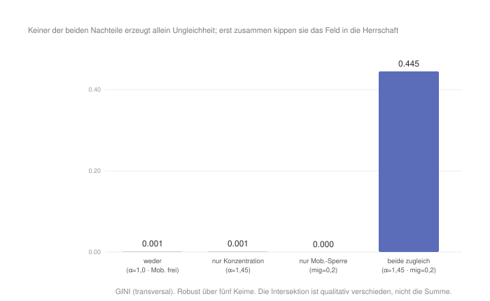
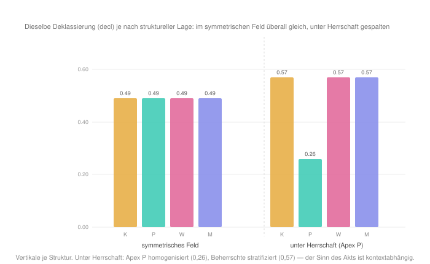

#+AUTHOR: Christian Papilloud
#+LANGUAGE: de
#+OPTIONS: toc:nil num:nil H:4 ^:nil
#+STARTUP: showall
#+LATEX_CLASS: book
#+LATEX_CLASS_OPTIONS: [11pt,a4paper]
#+CITE_EXPORT: csl chicago-author-date-de.csl
#+BIBLIOGRAPHY: Bericht.bib

* Kapitel 9 — Intersektionalität
:PROPERTIES:
:STATUS: DRAFT
:END:
Im Vergleich zu den Theorierahmen von Charles Tilly und Pierre Bourdieu spricht die Intersektionalitätsforschung ebenfalls von Herrschaft und von Ungleichheit, aber sie tut es auf einer Art und Weise, die der TR erstaunlich nahe kommt. Diese Ähnlichkeit wollen wir in diesem Kapitel vertiefen, weshalb wir die wichtigsten Ansätze der Intersektionalitätsforschung im digitalen Zwilling der TR abbilden möchten.

Der Kerngedanke der Intersektionalitätsforschung zu sozialen Ungleichheiten besteht darin, dass die Kernachsen der Ungleichheit — Klasse, Geschlecht, „race“ bzw. "ethnicity" — nicht additiv verstanden werden, sondern sie konstituieren sich wechselseitig. Die soziale Situation einer afro-amerikanischen Arbeiterin ergibt sich nicht aus der Summe dreier Nachteile, sondern wird in der Wechselwirkung mit solchen sozialen benachteiligten Merkmalen konstituiert. Dieses Kapitel prüft diesen Ansatz im digitalen Zwilling mit Bezug auf drei bedeutsamen Werke der Intersektionalitätsforschung: Das Werk von Patricia Hill Collins, das die Relationalität ins Zentrum der Intersektionalität rückt; das Werk von Kimberlé Crenshaw, das die Ausgangslage der Intersektionalitätsforschung bestimmt hat; das Werk von Joya Misra, das erlaubt, die Kategorien der Intersektionalitätsforschung zu schärfen.

** 9.1 Ontologische Korrespondenz und Residuum
Die Intersektionalität kennt keine vier Relationsstrukturen. Etwa die Grundmerkmale Klasse, Geschlecht, „race“ bzw. "ethnicity" sind Achsen der sozialen Ungleichheit, die einen sozialen Raum durchkreuzen. Deshalb bildet der digitalen Zwilling den Ansatz der Intersektionalitätsforschung nicht auf der Ebene der Relationsstrukturen, sondern auf der Ebene der dreifachen sozialen Ungleichheiten bzw. der transversalen, horizontalen und vertikalen sozialen Ungleichheiten: Die soziale Situation von einem Akteur hängt immer von seiner Zirkulation innerhalb und zwischen Akteurkategorien (vertikale sozialen Ungleichheiten), Sequenzen von Relationsstrukturen (horizontale sozialen Ungleichheiten) und Relationsstrukturen (vertikale sozialen Ungleichheiten). Diese drei Ebenen sind kreuzende Achsen, entlang derer Nachteile akkumuliert werden können, wie dies die Intersektionalitätsforschung voraussetzt. Das Residuum entspricht hier keine defizitäre Abbildung vom Ansatz der Intersektionalitätsforschung, sondern es ist mit der Entwicklung vom Ansatz der Intersektionalitätsforschung im Laufe der Zeit verbunden. Wenn die Intersektionalitätsforschung in ihren Anfängen die Kategorien Klasse, Geschlecht, „race“ als grundlegend, als gegeben, und als Kategorien mit eigener Geschichte versteht, entwickelt sich diese Betrachtung immer mehr relational. Bei Collins sieht man eine solche Wende am deutlichsten, die davon ausgeht, dass diese Kategorien ihre Bedeutung erst relational gewinnen. Eine solche Annahme kommt dem Rahmen der TR nah.

** 9.2 Theoretischer Kern
Die erste Grundorientierung für die Operationalisierung der Intersektionalitätsforschung im digitalen Zwilling der TR liefert die Ausgangslage dieser Forschung, wie sie Crenshaw definiert. Die Erfahrung der sozialen Ungleichheiten wird an der Kreuzung mehrerer benachteiligten Merkmalen gemacht, davon die Zusammenstellung eine je eigene verschärfte benachteiligte Lage für die Akteure bildet [cite:@crenshaw1991mapping]. Die sozialen Ungleichheiten werden somit von den Akteuren unterschiedlich erfahren und erlebt, weil sie je nach der sozialen Situation der Akteure unterschiedlich zusammengestellt werden.

Der zweite Grundorientierung entspricht der Intersektionalitätsforschung in der Auffassung von Collins. Die benachteiligten kategoriellen Merkmale, die zu sozialen Ungleichheiten führen, werden relational herausgebildet bzw. sind nicht gegeben. Collins Auffassung „verschiebt den Fokus weg von den essentiellen Qualitäten, die nur scheinbar im Zentrum der Kategorien liegen, hin zu den relationalen Prozessen, die sie verbinden“. Klasse, Geschlecht, „race“ werden „durch relationale Prozesse konstituiert und aufrechterhalten“ und gewinnen so ihren Sinn und ihre soziale Bedeutung [cite:@collins2019intersectionality]. Dieses Argument von Collins entspricht Wort für Wort dem Argument der TR, wenn sie den Essentialismus der sozialen Kategorien kritisiert und sagt, dass solche Kategorien relational produziert werden.

Die dritte Grundorientierung betrifft das, was Collins sagt, wenn sie von den Modi des relationalen Denkens spricht. Die Relationalität erfolgt unterschiedlich. Sie kann durch Addition, durch Artikulation und durch Ko-Konstitution erfolgen [cite:@collins2019intersectionality]. Die Relationalität nach der Addition der Merkmale wie etwa in der Auffassung von Crenshaw kann als heuristisches Werkzeug verwendet werden, weil sie das zeigt, was in einer bestimmten Konstellation von benachteiligten Merkmalen fehlt bzw. berücksichtigt werden muss, um die sozialen Ungleichheiten vollständig zu verstehen und abbilden zu können. Aber diese Relationalität nach Addition erlaubt nicht, es zu verstehen, wie die Wechselwirkungen zwischen unterschiedlichen sozialen Systeme die sozialen Ungleichheiten hervorbringen. Deshalb muss die Intersektionalitätsforschung den Übergang vom Additiven zur wechselseitigen Konstitution von sozialen Ungleichheiten leisten, und somit kann sie beschreiben, wie die kritische Analyse „sich wechselseitig konstituierender Herrschaftssysteme“ von Klasse, Geschlecht, „race“ und Sexualität die sozialen Ungleichheiten produziert, denen etwa die afro-amerikanischen Frauen in den Vereinigten Staaten ausgesetzt sind [cite:@collins2015dilemmas].

Der vierte Orientierung berücksichtigt die Arbeit von Joya Misra, wenn sie sagt, dass die intersektionalen Kategorien zugleich strukturell und relational konzipiert werden müssen. Diese Kategorien sind keine Behälter von benachteiligten Merkmalen, sondern es sind Verhältnisse [cite:@misra2018categories], die sich aufeinander wechselseitig beziehen und somit dazu beitragen, die Struktur von Gesellschaft mit zu konstruieren.

** 9.3 Operationalisierung
Da wir zwei bedeutsame Ansätze in der Intersektionalitätsforschung haben, die jeweils nach einem kategoriellen und nach einem relationalen Ansatz argumentieren, erstellen wir im digitalen Zwilling zwei entsprechenden Reglerprofile. Das erste Profil prüft die Überadditivität von Kategorien bzw. von kategoriellen Merkmalen im Sinne Crenshaws. Es kombiniert zwei morphologische Nachteile — eine unterkritische Konzentration der Akteure in Relationsstrukturen (alpha 1,45, unterhalb der Bifurkation) und eine entsprechende gesperrte Mobilität dieser Akteure (mig 0,2) —, die allein betrachtet zu schwach wären, um die sozialen Ungleichheit zu erzeugen. Das zweite Profil prüft den Ko-Konstitution-Ansatz von Collins. Es bildet eine Herrschaft ab (alpha 1,8), und es setzt eine entsprechende  Deklassierung von Akteuren (decl 0,95), um zu messen, ob diese Deklassierung von der Entstehung dieser Herrschaft abhängt. Die Profile liegen als =profil_Intersekt_suradditivitaet.csv= und =profil_Intersekt_koconstitution.csv= bei.

** 9.4 Vorregistrierte Hypothesen
Wir formulieren eine erste Hypothese /H1/ zur Überadditivität. Wenn wir Crenshaw folgen, dann sollten wir davon ausgehen, dass zwei Nachteile, die an sich keine große Folgen für die sozialen Ungleichheiten haben, mehr Ungleichheit produzieren, wenn sie in Interaktion treten, als wenn sie bloß zusammen genommen werden. Diese Interaktion von Nachteilen ist die Intersektion als qualitativer Indikator der sozialen Situation von Akteuren. Eine Hypothese /H2/ formulieren wir, um die Besonderheit der Kategorien zu berücksichtigen, die als intersektionale Achsen im digitalen Zwilling abgebildet werden. Mit H2 setzen wir voraus, dass die Überadditivität nicht achsenspezifisch ist bzw. dass sie für jede Art von Achsen gelten würde. Eine Hypothese /H3/ betrifft Collins' Ko-Konstitution These. Dieselbe Bildung von vertikalen Ungleichheiten sollte je nach struktureller Lage verschiedene spezifische bzw. entgegengesetzte Wirkungen zeitigen. Schließlich bezieht sich eine Hypothese /H4/ auf das Additive als ein Modus der Relationalität von Nachteilen. Ein rein additiver Nachteil reicht nicht aus, um die soziale Ungleichheit zu produzieren bzw. zu stärken, weil Nachteile relational bzw. intersektional ko-konstituiert werden und soziale Ungleichheiten entsprechend hervorbringen.

** 9.5 Lauf und Ergebnisse
Im digitalen Zwilling wird H1 vollkommen bestätigt (Abbildung [[fig:intersekt-suradditivitaet]]). Die unterkritische Konzentration der Akteure in Relationsstrukturen allein erzeugt nichts (GINI 0,001). Die gesperrte Mobilität der Akteure allein erzeugt nichts (GINI 0,000). Doch zusammen genommen kippen sie den relationalen Raum in die Herrschaft (GINI 0,445). Dieses Ergebnis bleibt über fünf Keime sehr robust. Die Intersektion von Nachteilen bringt einen qualitativen Unterschied, der im digitalen Zwilling als eine Schwelle abgebildet wird, die keiner der beiden Nachteile allein überschreitet, und die dann überschreitet wird, wenn beide Nachteile gemeinsam genommen werden. Dieses Ergebnis bestätigt den Ansatz von Crenshaw: Die Intersektion von Nachteilen und nicht ihre Addition produziert einen Übermaß an sozialen Ungleichheiten.

#+NAME: fig:intersekt-suradditivitaet
#+CAPTION: Überadditivität an der Schwelle: Konzentration und Mobilitätssperre erzeugen allein nichts; gemeinsam produzieren sie eine Herrschaft (GINI 0,445).

Dagegen wird H2 im digitalen Zwilling revidiert. Die Überadditivität von Nachteilen ist achsenspezifisch. Ersetzt man die Mobilitätssperre durch die Deklassierung, so verschwindet der Effekt. Dies bedeutet, dass in dieser Konfiguration die Deklassierung allein nahezu wirkungslos ist, und sie staffelt sich nicht mit der Konzentration der Akteure in den Relationsstrukturen (der Interaktionswert ist um null, sogar leicht negativ). Dies bedeutet, dass Nicht jeder Nachteil mit anderen Nachteile interagiert, sondern intersektional werden das, was die TR die morphologischen Determinanten nennt, die Zirkulation und die Mobilität der Akteure bestimmen und die Verbreitung und Satellisierung der Relationsstrukturen mittelbar beeinflussen.

H3 wird ebenso klar bestätigt (Abbildung [[fig:intersekt-koconstitution]]). Im symmetrischen Zustand des digitalen Zwillings trifft die Deklassierung der Akteure alle Relationsstrukturen im vergleichbaren Maßen (die vertikale Ungleichheit ist überall im relationalen Raum 0,49). Unter der Herrschaft von einer Relationsstruktur wird diese Wirkung dennoch gespaltet. Im Apex bzw. in der herrschenden Relationsstruktur sinkt die Deklassierung auf 0,26 (die Relationsstruktur wird homogener bzw. die Stratifikation wird vereinfacht), in den beherrschten Relationsstrukturen steigt sie auf 0,57 (sie werden stärker stratifiziert). Dieses Ergebnis zeigt, dass dieselbe Deklassierung je nach Lage von einer Relationsstruktur eine unterschiedliche Bedeutung für die soziale Ungleichheit in einer Relationsstruktur hat. Dies bestätigt Collins' Relationalitätsansatz: Die Wirkung von einem intersektionalen Nachteil hängt von dem relationalen Kontext ab. Er nimmt seine Bedeutung von einem anderen Nachteil, der sich an der Intersektion mit diesem Nachteil befindet.

#+NAME: fig:intersekt-koconstitution
#+CAPTION: Ko-Konstitution: Dieselbe Deklassierung trifft im symmetrischen digitalen Zwilling alle Relationsstrukturen gleichermaßen; unter Herrschaft hat die selbe Deklassirung eine unterscheidliche Wirkung auf die Relationsstrukturen je nach der spezifischen Lage, in der sich diese Relationsstruktur befindet (Apex 0,26 / Beherrschte 0,57).

H4 als Kehrseite von H2 wird ebenfalls bestätigt. Die Deklassierung allein erzeugt fast keine soziale Ungleichheit. Dies ist der Befund, dass ein Nachteil allein nicht zwangsläufig weitere Nachteile zu sich zieht, sondern Nachteile sind in einer Relation der Ko-Konstitution und produzieren so die sozialen Ungleichheiten.

** 9.6 Robustheit
Die Befunde sind stabil über verschiedene Läufe mit unterschiedlichen Konfigurationen des digitalen Zwillings. Die Überadditivität bleibt über fünf Keime identisch (GINI 0,445). Sie ist eine strukturelle Tatsache und kein Artefakt, das von der Ausgangslage des digitalen Twins erzeugt werden würde. Die Achsenspezifität wurde durch den Vergleich mehrerer zweiter Achsen (Deklassierung vs. Mobilitätssperre) kontrolliert und bestätigt. Die Ko-Konstitution ist über die Keime invariant, und die gemessenen Spaltung der Wirkung von Nachteilen (0,31) in der Lage Apex vs. beherrschter Relationsstrukturen geht in Unterstützung von diesem Ergebnis. Ein Vorbehalt bleibt: Der Simulator kennt die Geschichte der Kategorien der Intersektionalität nicht (Geschlecht, „race“). Er kann diese Geschichte nicht abbilden, weshalb das, was der digitale Zwilling abbildet, ist die Form der Komposition und der Ko-Konstitution ohne deren konkreten sozialen Gehalt.

** 9.7 Lesart. Zwei Auffassung der sozialen Ungleichheit vom Standpunkt der Intersektionalität
Der digitale Zwilling reproduziert beide Auffassung der Intersektionalität, und er kann sie zwei Determinantentypen der TR zuordnen. Die Überadditivität Crenshaws gilt für die morphologischen Determinanten der Relationsstrukturen. Zwei Nachteile, die eine Zirkulation bestimmen, überschreiten gemeinsam eine Schwelle, die keiner allein erreicht. Die Ko-Konstitution Collins' gilt für die strukturellen Determinanten der Relationsstrukturen. Der Sinn von einem kompositionellen Nachteil (etwa der Deklassierung) hängt von der strukturellen Lage einer Relationsstruktur ab. Die beiden Auffassungen der Intersektionalität sind deshalb keine entgegengesetzte Formen der Intersektionalität, sondern sie greifen zwei Klassen von sozialen Determinanten auf und befinden sich deshalb zwei verbundenen Aspekten der selben relationalen Ontologie. Die Auffassung von Crenshaw ist mit dem Ansatz der Komposition von Kategorien zur Produktion von sozialen Ungleichheiten. Diejenige von Collins spricht von der Ko-Konstition solcher Kategorien zur Produktion von sozialen Ungleichheiten.

Damit lässt sich auch Collins' eigene Modi — Addition, Artikulation, Ko-Konstitution — am digitalen Zwilling wiederfinden. Die reine Addition von Kategorien führt zu keinem Schneeballeffekt -- die Deklassierung allein bleibt folgenlos. Die Artikulation erscheint als die kontextuelle Kopplung zwischen Kategorien und Kontext -- dieselbe Nachteile haben andere Wirkungen je nach dem Kontext, in dem sie wirken. Die Ko-Konstitution bezeichnet die überadditive Schwelle, an der zwei Nachteile in Intersektion einen qualitativ neuen Nachteil hervorbringen.

Aber Der eigentliche Befund von dieser Prüfung der Intersektionalitätsforschung im digitalen Zwilling ist die Konvergenz der beiden Ansätzen von Crenshaw und Collings mit der Auffassung der sozialen Ungleichheit in der TR. Die TR dimensioniert die soziale Ungleichheit durch die Wirkung dreier Ebenen aufeinander — der Ungleichheit innerhalb der Sequenzen (der vertikalen Ungleichheit), zwischen den Sequenzen (der horizontalen Ungleichheit) und zwischen den Relationsstrukturen (der transversalen Ungleichheit) —, die sich im Wandel des relationalen Raumes wechselseitig konstituieren. Eben dies tut die Intersektionalität nach Collins: Sie dimensioniert die Ungleichheit durch die wechselseitige Konstitution ihrer Kategorien. Die Ko-Konstitution der drei Ebenen der TR und die Ko-Konstitution der Kategorien der Intersektionalität stimmen formal vollständig überein.

** 9.8 Entwicklungslinien
Die Intersektionalität erweist sich damit als der Theorierahmen, der an dem Theorierahmen der TR ausdrücklich nah steht. Beide Theorierahmen konditionieren das Aufschichten von benachteiligten sozialen Merkmalen an ihrer relationalen Ko-Konstitution. Das Residuum — Kategorien der sozialen Ungleichheiten sind in der Intersektionalitätsforschung grundlegend historisch gegebene Kategorien — bleibt bestehen, und unterscheidet die Intersektionalitätsforschung von der TR, wie die TR im digitalen Zwilling modelliert wird. Der digitale Zwilling prüft die Form und nicht den Inhalt von Kategorien ab. Doch Collins' Relationalität verkleinert diesen Unterschied zwischen der Intersektionalität und der TR, bis er fast verschwindet, weil sie die Relationalität von Kategorien der sozialen Ungleichheiten nicht nur formal, sondern auch historisch denkt. Soziale Ungleichheiten werden im Laufe der Geschichte von Gesellschaften unterschiedlich in Inhalt und Form, und deshalb wirkt ihre Intersektionalität unterschiedlich in Zeit und Raum und produziert entsprechend unterschiedliche sozialen Ungleichheiten je nach Kontext.

Mit diesem Kapitel beenden wir die Untersuchung der Theorierahmen, die bedeutsame Impulse für die Entwicklung einer relationalen Soziologie gegeben haben, darauf sie maßgeblich gewirkt haben bzw. immer noch wirken. Im nächsten Kapitel nähern wir uns der zeitgenössischen Diskussion im Bereich der relationalen Soziologie, die seit dem Manifesto for a relational Sociology von Mustafa Emirbayer lanciert wurde und von unterschiedlichen Relationisten aufgenommen und weiter entwickelt wurde. Im kommenden Kapitel wollen wir uns einige der bedeutsamen Vorschlägen widmen, die im zeitgenössischen Kontext der relationalen Soziologie angeboten wurden, und wir nehmen wir sie im digitalen Zwilling auf, um sie näher zu untersuchen.

** Literatur
#+print_bibliography:
