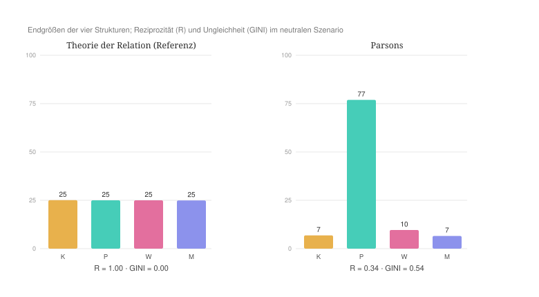
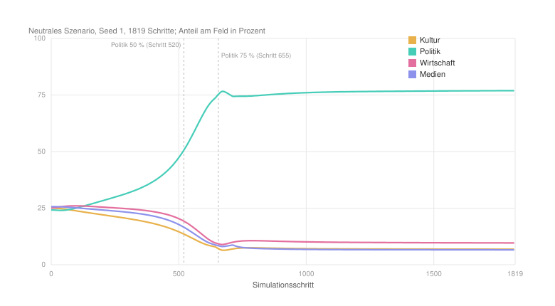
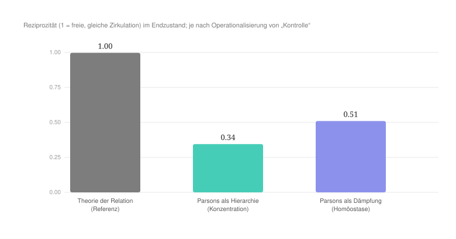

#+AUTHOR: Christian Papilloud
#+LANGUAGE: de
#+OPTIONS: toc:nil num:nil H:4 ^:nil
#+STARTUP: showall
#+LATEX_CLASS: book
#+LATEX_CLASS_OPTIONS: [11pt,a4paper]
#+CITE_EXPORT: csl chicago-author-date-de-ibid.csl
#+BIBLIOGRAPHY: Bericht.bib

* Kapitel 2 — Talcott Parsons’ AGIL-Muster und Systemtheorie
:PROPERTIES:
:STATUS: DRAFT
:END:

Parsons’ Theorierahmen ist der erste Fall in diesem Theorierahmenvergleich und vielleicht der lehrreichste, weil er dem digitalen Zwilling architektonisch am nächsten steht. Kein anderer klassischer Rahmen hat die soziologische Auffassung der Vermittlung so weit ausgearbeitet wie Parsons mit seinen generalisierten Tauschmedien und seinen doppelten Interchanges, die sich gegenseitig bedingen, wie Parsons sagt, wenn er vom doppelten Interchanges behauptet, das er „necessitates the development of generalized symbolic media, of which we have treated money, power, and influence as cases“ [cite:@parsons1969politics 397]. Wir betrachten Parsons’ Theorie als einen wertvollen Schritt auf dem Weg zu einer relationalen Soziologie — ein Anschluss, den die relationale Soziologie selbst vollzogen hat, sei es in der relationalen Umarbeitung des AGIL-Schemas [cite:@donati2011relational], sei es in der Fortschreibung seiner Medientheorie über Luhmann und Habermas hinaus [cite:@chernilo2002media]. Gerade weil Parsons’ Theorierahmen dem digitalen Zwilling so nahe steht, wird die Differenz, die der Lauf freilegt, aussagekräftig. Wir folgen dafür dem in Kapitel 1 festgelegten Gabarit (in sieben Schritte), und wir stellen unsere Ergebnisse entsprechend dessen sieben Etappen.

** 2.1 Ontologische Korrespondenz und Residuum

Die vier funktionalen Imperative Parsons’ (AGIL) bilden sich auf die vier Relationsstrukturen des digitalen Zwillings wie folgt ab: Die Kultur (A) entspricht dem Imperativ /L/ (latency / pattern-maintenance, dem kulturellen bzw. Wertsystem); die Politik (B) entspricht /G/ (goal-attainment, der polity); die Wirtschaft (C) entspricht /A/ (adaptation, der economy); die Medien (D) entsprechen /I/ (integration, der societal community). Aus dieser Abbildung ergeben sich bereits zwei Beobachtungen.

Die erste Beobachtung ist eine starke Nähe auf der Vermittlungsachse. Die generalisierten symbolischen Tauschmedien — Geld, Macht, Einfluss und Wertbindungen — entsprechen beinahe Wort für Wort den Vermittlungsinstanzen des digitalen Zwillings, und die doppelten Interchanges entsprechen der Zirkulation zwischen den Relationsstrukturen. Parsons ist damit der am stärksten „medialisierte“ klassische Rahmen und strukturell der nächste Verwandte der Architektur des digitalen Zwillings.

Die zweite Beobachtung ist ein Residuum, also ein Rest, der sich nicht widerspruchsfrei im digitalen Zwilling abbilden lässt und der selbst ein Ergebnis darstellt. Die Zuordnung der Medien zur /societal community/ ist unvollkommen. In der TR ist die Struktur Medien die Kraft der Anziehung, der Rekrutierung und der Zirkulation (die Sequenz D) [cite:@papilloud2022skizze 69], während bei Parsons die /societal community/ eine normative Solidarität bezeichnet, die vom kulturellen Wertsystem als oberster, steuernder Instanz her geordnet wird: „Loyalty to the societal community must occupy a high position in any stable hierarchy of loyalties [...] However it does not occupy the highest place in the hierarchy. We have stressed the importance of cultural legitimation of a society’s normative order because it occupies a superordinate position“ [cite:@parsons1971system 13]. Bei Parsons finden wir deshalb kein genaues Äquivalent zu „Medien als Zirkulationskraft“. Seine integrative Funktion ist normativ und einer obersten Instanz untergeordnet.

Ein zweites Residuum betrifft die Ebene der Akteure. Die Akteurskategorien und die Mobilität der Akteure, die der digitale Zwilling kennt, haben bei Parsons nur einen schwachen Widerpart, denn er denkt in systemischen Funktionen und institutionalisierten Rollen und nicht in der Zirkulation von Akteuren: „it is the participation of an actor in a patterned interactive relationship which is for many purposes the most significant unit of the social system [...] there is the positional aspect — that of where the actor in question is ‚located‘ in the social system relative to other actors. This is what we will call his status“ [cite:@parsons1951social 25].

** 2.2 Theoretischer Kern

Die Operationalisierung stützt sich auf vier Grundorientierungen.

Die erste Orientierung ist die Lehre von den vier funktionalen Imperativen. Jedes Handlungssystem muss vier Probleme lösen: Mustererhaltung, Integration, Zielerreichung und Anpassung; dabei spezialisiert sich das kulturelle System auf die Mustererhaltung und das Sozialsystem auf die Integration: „cultural systems are specialized around the function of pattern-maintenance, social systems around the integration of acting units“ [cite:@parsons1966societies 7]. Diese Auffassung begründet die Abbildung auf vier Strukturen.

Die zweite Orientierung ist die Theorie der generalisierten symbolischen Tauschmedien. Parsons entwirft eine ganze Familie solcher Medien, die er ausdrücklich dem Geld parallel setzt: die Macht als „generalized medium of interchange“ [cite:@parsons1969politics 2]; den Einfluss als „a generalized symbolic medium of societal interchange, in the same general class as money and power“ [cite:@parsons1971system 13], den er parallel zu Geld und Macht konzipiert, wie ihre Nebeneinanderstellung zeigt: „power is a generalized medium of activating obligations to comply with collectively binding decisions [...]; influence is a generalized medium of persuasion“ [cite:@parsons1969politics 312]; und schließlich die Wertbindungen, die wie das Geld einer Inflation und Deflation unterliegen: „commitments as a generalized medium must be treated as flexible“, und diese Flexibilität wird „complicated by the familiar problem of deflation-inflation“ [cite:@parsons1969politics 462]. Diese vier Medien — Geld, Macht, Einfluss und Wertbindungen — regeln den Austausch zwischen den Einheiten des Systems, und ihre aufbauende Wirkung hängt an ihrer Verankerung in einer höheren Instanz: „anchorage in a higher-order subsystem of action is the basic condition of the upgrading effects of a generalized medium“ [cite:@parsons1971system 26]. Diese Orientierung begründet eine dichte, geregelte Vermittlung zwischen den Relationsstrukturen, und es ist gerade an sie, wie das Kapitel zu Niklas Luhmanns Systemtheorie noch zeigen wird, dass Luhmann anknüpft, um Parsons’ Hierarchie zu hinterfragen.

Die dritte Orientierung ist die kybernetische Kontrollhierarchie. Systeme, die hoch an Information und niedrig an Energie sind, regulieren nach Parsons solche, die höher an Energie und niedriger an Information sind — „systems high in information but low in energy regulate other systems higher in energy but lower in information“. Dazu kommt die Feststellung Parsons hinzu, dass um die großen Quellen sozialen Wandels zu erfassen, wir auf die kybernetisch höherrangigen Strukturen — das kulturelle System — blicken müssen: „we must focus on the cybernetically higher-order structures — the cultural system among the environments of the society — in order to examine the major sources of large-scale change“ [cite:@parsons1966societies 9f.]. An der Spitze dieser Hierarchie steht das, was wir im Folgenden den /Apex/ nennen: jene Struktur, die alle anderen steuert, ohne selbst gesteuert zu werden. Bei Parsons ist der Apex das kulturelle Wertsystem (die Kultur). Aus dieser Orientierung folgt eine gerichtete Asymmetrie, in der der Wert regiert und die Wirtschaft konditioniert wird.

Die vierte Orientierung ist die Lehre von der Ordnung durch normative Integration und Gleichgewicht. Sie ist bei Parsons grundlegend und reicht bis zu seinem ersten Werk zurück. Schon dort löst er das Hobbessche „problem of order“ [cite:@parsons1937structure 89] nicht über Zwang oder Nutzenkalkül, sondern über die „integration of individuals with reference to a common value system“, die sich in der Legitimität institutioneller Normen und in gemeinsamen Letztzwecken zeigt [cite:@parsons1937structure 768]. Integration heißt entsprechend die Internalisierung gemeinsamer Werte in komplementäre Rollen: „the integration of ego into a role complementary to that of alter(s) in such a way that the common values are internalized in ego’s personality“ [cite:@parsons1951social 211, 213]. Das System tendiert zu einem „equilibrium of interaction“, das die Abweichung stört und das die Kontrollmechanismen wiederherstellen [cite:@parsons1951social 205]. Die Selbstgenügsamkeit besteht in der „capacity to control interchanges“ [cite:@parsons1971system 7]. Die Ordnung entsteht hier also durch Wertkonsens und Grenzkontrolle und nicht durch freie Zirkulation — eine Annahme, an der sich, wie das folgende Kapitel zeigen wird, Luhmanns Weg von Parsons trennt.

** 2.3 Operationalisierung

Aus diesen vier Orientierungen ergibt sich das folgende Reglerprofil, das wir in diesem Kapitel im Unterschied zu den anderen Kapiteln zum Simulationsmodus des digitalen Zwillings im Detail zeigen, damit die Methodik deutlich gezeigt wird, nach der wir in allen Kapitel zum Simulationsmodus gearbeitet haben.

Die linke Wertspalte gibt jeweils die Vorgabe der TR an. Die rechte Wertspalte gibt den für Parsons gesetzten Wert an. Jede Zeile ist durch eine der Orientierungen (eins bis vier bzw. in der Tabelle unten 01 bis 04) und eine entsprechende Belegstelle gerechtfertigt. Die Regler des digitalen Zwillings werden mit ihrem inhaltlichen Namen (Alias) bezeichnet, gefolgt von der Kennung im Code in Klammern. Die tragende strukturelle Prämisse ist nicht ein einzelner Regler, sondern die Kopplung der Strukturen: An die Stelle der C4-Symmetrie der TR tritt ein gerichtetes kybernetisches Kontrollgefälle Kultur → Medien → Politik → Wirtschaft (von der Information zur Energie) mit der Kultur als regierendem Apex. Diese gerichtete Kopplung ist die strukturelle Signatur von Parsons’ Theorierahmen.

#+NAME: tab:parsons-regler
#+CAPTION: *Tabelle 1.* Reglerprofil Parsons’ im digitalen Zwilling der TR.
| Regler (Code) | TR | Parsons | Begründung |
|--------+----+---------+------------|
| Gewicht der Zahl (anchor) | 0,5 | 0,2 | Kontrolle durch Information, nicht durch Energie oder Masse; der Apex ist „low in energy, high in information“ [cite:O3; @parsons1966societies 9] |
| Erschöpfung der Dominanten (cap) | 0,7 | 0,3 | homöostatische Ordnung; der Apex erschöpft sich nicht, die Kontrolle stellt das Gleichgewicht wieder her [cite:O4; @parsons1951social 205] |
| Vorteil der Dynamischen (dynam) | 0,5 | 0,2 | Primat der Stabilität vor dem Vorteil mobiler Strukturen [O4] |
| Konzentration zum Pol (alpha) | 1,4 | 1,8 | der kybernetische Apex konzentriert die Kontrolle [cite:O3; @parsons1966societies 9f.] |
| Laufbahn-Flexibilität (plast) | 0,4 | 0,25 | institutionalisierte, durch Sozialisation internalisierte Rollen [cite:O4; @parsons1951social 211, 213] |
| Durchlässigkeit zwischen Strukturen (over) | 1,0 | 1,7 | intensiver, aber geregelter Austausch der generalisierten Medien [cite:O2; @parsons1971system 7, 13, 26] |
| Akteurszirkulation (rate) | 2,2 | 1,8 | Zirkulation vor allem der Medien und normativ geregelte Rollenmobilität, nicht roher Durchsatz [O2/O4] |
| Interne Umverteilung (back) | 1,0 | 1,2 | die Integration bindet und verteilt intern über Wertkonsens [cite:O4; @parsons1951social 211] |
| Resozialisierungskosten (decl) | 0,5 | 0,65 | Sozialisation als Kostenpunkt der Wertinternalisierung [cite:O4; @parsons1951social 211] |
| Migration (mig) | 0,7 | 0,5 | geregelte Mobilität |
| Spiegelung (rho), Idealgröße (peak) | 1,0 / 0,5 | unverändert | bei Parsons nicht zentral; auf der Vorgabe der TR belassen |

Die Ketten kodieren das Kontrollgefälle als Orientierung der Strukturen aufeinander: chaine_A = D,B,C; chaine_D = A,B,C; chaine_B = D,A,C; chaine_C = B,A,D. Das vollständige Profil befindet sich im Github-Ordner zum digitalen Zwilling der TR.

** 2.4 Hypothesen

Vor dem Lauf wurden fünf Hypothesen formuliert, die wir dann nach jedem Lauf kontrollieren. /H1./ Das System erreicht ein stabiles Gleichgewicht mit niedriger innerer Spannung. Wir nennen dies ein /gelenktes Gleichgewicht/: Ein solches Gleichgewicht geht nicht aus freier, symmetrischer Zirkulation hervor, sondern es wird von einer steuernden Instanz — dem Regenten bzw. der Kultur — aufrechterhalten. /H2./ Die Reziprozität ist asymmetrisch, weil die Kultur regiert. Zudem ist die Reziprozität global nur mäßig bzw. nicht maximiert wie im symmetrischen Zustand der TR. Die Ordnung beruht dann auf Kontrolle und nicht auf freier Reziprozität. /H3./ Die Kultur ist /Regent/ der übrigen Strukturen, das heißt, sie steuert deren innere Dynamik, ohne selbst die größte Struktur zu sein. Dies kommt daher, dass das Gewicht der Zahl (anchor) niedrig gesetzt ist, sodass die Größe nicht über die Steuerung entscheidet. Dies wäre die kybernetische Signatur: Steuerung ohne Masse. /H4./ Es entsteht keine Satellisierung durch einen wechselseitigen Kurzschluss zweier Pole, sondern ein Regime der Governance unter dem Apex. /H5./ Die Architektur des Interchange (eine hohe Durchlässigkeit zwischen Relationsstrukturen) zieht das System zur Zirkulation. Die kybernetische Hierarchie (der Regent, ein niedriges Gewicht der Zahl, die asymmetrischen Ketten) zieht es zur gelenkten Asymmetrie. Welche der beiden Tendenzen überwiegt, ist selbst ein Ergebnis.

** 2.5 Lauf und Ergebnisse

Wie in Kapitel 1 dargelegt, ist ein Lauf die schrittweise bzw. deterministische Entfaltung des Zustands aus einer nahezu symmetrischen Ausgangslage des digitalen Zwillings. Alle hier berichteten Läufe werden /headless/ reproduziert, das heißt rein rechnerisch und als getreue Nachbildung der Simulationsschleife. Sie laufen im gemeinsamen neutralen Szenario (einer symmetrischen Demographie von 25/25/25/25, die über den ganzen Lauf konstant gehalten wird) mit Keim 1 und über rund 1819 Schritte. Das neutrale Szenario isoliert die Logik des Profils. Das realistische Szenario vermengt sie mit einer aufgezwungenen Asymmetrie (siehe 3.6). Die Referenz der TR (ihre Vorgaben samt der C4-Ketten) bleibt erwartungsgemäß im vollkommenen symmetrischen Fixpunkt, während sich das Parsons-Profil davon entfernt. Die Tabelle unten zeigt, wie weit sich Parsons’ Theorierahmen vom Rahmen der TR entfernt.

#+NAME: tab:parsons-kennzahlen
#+CAPTION: *Tabelle 2.* Kennzahlen des Laufs im Vergleich zur Referenz der TR.
| Kennzahl | Referenz (TR) | Parsons |
|-------+-------------+---------|
| Ungleichheit (GINI) | 0,002 | 0,535 |
| Reziprozität (1 = freie, gleiche Zirkulation) | 0,997 | 0,345 |
| innere Spannung (meanResid) | 0,000 | 0,156 |
| Größe Kultur | 25,1 % | 6,9 % |
| Größe Politik | 24,9 % | 76,9 % |
| Größe Wirtschaft | 24,9 % | 9,6 % |
| Größe Medien | 25,1 % | 6,6 % |
| Regentschaft | alle autonom | Kultur → Politik, Politik → Politik, Wirtschaft → autonom, Medien → Politik |
| Satellisierung (satS) | 0 / 0 / 0 / 0 | Kultur 1 · Politik 0 · Wirtschaft 1 · Medien 1 |
| Erschöpfung des Dominanten (Fatigue) | ~0 | Politik 0,778 (nahe dem Bruch) |
| eigene Reziprozität je Struktur | ~1 | Kultur 0,154 · Politik 0,951 · Wirtschaft 0,152 · Medien 0,411 |
| Beitrag zur Ungleichheit | ~0 | Politik +0,26 · die übrigen je −0,09 |

#+NAME: fig:parsons-endzustand
#+CAPTION: *Abbildung 1.* Endzustand im neutralen Szenario: Während die Referenz der TR symmetrisch und maximal reziprok bleibt (R ≈ 1), konzentriert das Parsons-Profil das Feld auf einen einzigen Pol (die Politik) und lässt die Reziprozität einbrechen.

Der Verlauf ist monoton (Abbildung [[fig:parsons-trajektorie]]). Aus der nahezu symmetrischen Ausgangslage bei Schritt 0 wächst die Politik rasch an. Sie überschreitet die Hälfte des Feldes nach etwa 520 von insgesamt rund 1819 Schritten und drei Viertel nach etwa 655 Schritten. Um diesen Punkt kippt die Regentschaft von Kultur, Wirtschaft und Medien auf die Politik. Danach stabilisiert sich ein satellisierter Zustand bei einer Politik-Größe von etwa 77 %, einer Reziprozität von etwa 0,34 und einer Ungleichheit von etwa 0,53. Das zentrale Ergebnis lautet: Der angezielte kulturelle Apex (die Kultur) wird selbst satellisiert, und der tatsächlich hervortretende Regent ist die Macht (die Politik).

#+NAME: fig:parsons-trajektorie
#+CAPTION: *Abbildung 2.* Verlauf der vier Strukturgrößen über die 1819 Schritte des Laufs. Die Politik (türkis) steigt monoton auf etwa 77 %, während Kultur, Wirtschaft und Medien zu satellisierten Relationsstrukturen zusammenschrumpfen. Die gestrichelten Linien markieren die Schritte, an denen die Politik die Hälfte und drei Viertel des Feldes überschreitet.

** 2.6 Robustheit

Das Ergebnis ist bemerkenswert robust. Es ist invariant gegenüber dem Keim: Fünf verschiedene Keime liefern identisch eine Politik bei 77 %, eine Reziprozität von 0,35 und die Satellisierung von Kultur, Wirtschaft und Medien. Es ist ferner invariant gegenüber der Kettenkodierung bzw. der Veränderung vom Schmetterlingspfad in den Relationsstrukturen: Ob kybernetische Kaskade, ein Muster mit der Kultur als universellem Apex (alle Relationsstrukturen zuerst auf die Kultur orientiert) oder die symmetrische C4-Kopplung — stets entsteht ein Pol bei etwa 77 %, drei Satelliten und eine Reziprozität um 0,35. Die Satellisierung ist also kein Artefakt: Die Variation einzelner Regler verschiebt zwar die Konzentration (alpha) bzw. die Identität der herrschenden Relationsstruktur. Für eine Konzentration bis 1,4 regiert die Wirtschaft mit etwa 73 %; für eine Konzentration bei 1,8 herrscht die Politik. Niemals jedoch ändert sich die Struktur des Ergebnisses. Stets steht ein Pol bei etwa 73–78 %. Drei Relationsstrukturen werden satellisiert, und die Reziprozität liegt um 0,33 bzw. 0,35. Ein höheres Gewicht der Zahl (anchor: 0,2 → 0,8) senkt die Dominanz nur mild (von 77 % auf 65 %) und stellt die Reziprozität nicht wieder her. Eine stärkere Erschöpfung (cap: 0,3 → 0,7) spannt den herrschenden Akteuren in Relationsstrukturen stärker an (Fatigue 0,78 → 0,86), ohne die Zirkulation zu verbessern. Die Durchlässigkeit der Relationsstrukturen (over), die Akteurszirkulation (rate) und der Vorteil, den die dynamischen Akteure im Sinne einer aufsteigenden Mobilität erhalten können (dynam), sind nahezu wirkungslos.

Um zu prüfen, ob sich das Ergebnis unter einer anderen Lesart von Parsons’ „Kontrolle“ verändern oder aufheben lässt, wurde eine alternative Operationalisierung untersucht. Liest man die Kontrolle nicht als Konzentration, sondern als homöostatische /Dämpfung/ (eine niedrige Konzentration, ein hohes Gewicht der Zahl, eine mäßige Erschöpfung), so verschwindet die Satellisierung, und die Reziprozität erholt sich teilweise — auf etwa 0,51 bei einer Konzentration von 1,0, einem Gewicht der Zahl bei 0,6 und einer Erschöpfung von 0,6, bei einer Ungleichheit von 0,22. Sie erreicht jedoch nie das Niveau der TR im perfekten symmetrischen Zustand (etwa 1,0). Mit der Konzentration verschwindet zugleich die Wertehierarchie: Es bleibt eine gedämpfte Quasi-Symmetrie ohne Governance. Schließlich rechtfertigt das realistische Szenario die Wahl des symmetrischen Zustand als Prüfstand für den Vergleich zwischen der TR und Parsons’ Theorierahmen. Wenn die Demographie differenziert wird, entsteht im digitalen Zwilling eine Asymmetrie (die Wirtschaft kommt auf etwa 60 %, bei einer Reziprozität von 0,30; die Wirtschaft satellisiert die Kultur, die Politik und die Medien). Dies bedeutet, dass die aufgezwungene Asymmetrie das Profil mit dem Szenario verwechselt, als ob die TR wie Parsons Theorie funktionieren würde. Unter dieser Bedingung könnte man nicht mehr davon ausgehen, dass beide Theorierahmen unterschiedlich sind, was dafür spricht, dass allein das neutrale Szenario in der Lage ist, die Episteme Parsons’ Theorierahmens zu isolieren.

** 2.7 Lesart. Nähe, Differenz und verborgene Prämisse

Auf der dreistufigen Skala der sozialen Ungleichheiten — der vertikalen, horizontalen und transversalen sozialen Ungleichheiten — herrscht bei Parsons die transversalen Ungleichheit, die sich mit voller Kaskade in die unteren Ebenen des Theoriekonstruktes verbreitet. Dies entspricht einem sehr starken Apex (0,54), der sich nach unten fortpflanzt. Der dominante Pol wird homogenisiert, die beherrschten Relationsstrukturen werden somit stratifiziert, der Statusabstand zwischen Akteuren wird immer größer, je tiefer es in die kleineren relationalen Strutkuren des Theorierahmens gegangen wird.

Die freigelegte verborgene Prämisse lautet deshalb wie folgt: Was Parsons „Integration durch eine kybernetische Hierarchie der Wertkontrolle“ nennt, kann relational als Satellisierung verstanden werden im Kontrast zur systemischen Reziprozität der TR. Diese Verengung ist in der Parsons-Rezeption seit langem bemerkt worden: Dass gemeinsame Werte und die daraus folgenden Normen das Relationale erschöpfen sollen, „ignores the interdependence of which much social organization is composed“, und verdeckt „social relations not based on common values, but on exchange, competition, and conflict“ [cite:@coleman1990commentary 50]. Die Ordnung-durch-Kontrolle erscheint im digitalen Zwilling nicht als mildes integriertes Gleichgewicht, sondern als Herrschaft eines Pols über drei Relationsstrukturen, die zu den jeweiligen Satelliten dieses Pols mit den Folgen werden, dass die Reziprozität im ganzen System einbricht (0,35 gegenüber etwa 1,0 in der TR) und die Position von herrschenden Akteuren in den Relationsstrukturen gefährdet (Fatigue 0,78, nahe dem Bruch). Gouldner hat diesen Zusammenhang als Regel formuliert: „the less reciprocal the functional interchange between structures, the less likely is either structure, or the patterned relation between them, to persist [...] unless compensatory mechanisms are present“ [cite:@gouldner1959reciprocity 249]. Verbunden mit unseren Hypothesen, bedeutet dieses Ergebnis Folgendes. H2 ist bestätigt, denn die Ordnung beruht auf Domination und nicht auf Reziprozität. H1 kann nur teilweise bestätigt werden. Es entsteht kein heiteres Gleichgewicht, sondern eine gespannte Domination. H3 kann nicht bestätigt werden, weil die Kultur nicht herrscht, sondern sie wird satellisiert. H4 trifft eine andere Prämisse als vermutet. Es entsteht keine Satellisierung durch einen wechselseitigen Neutralisierung von zwei Relationsstrukturen, sondern es gibt eine generelle Satellisierung dreier Relationsstrukturen durch eine Relationsstruktur. H5 entscheidet sich überwältigend zugunsten der Hierarchie, denn der mediale Interchange wirkt der Konzentration und der entstandenen Satellisierung kaum entgegen.

# @SEITE: gouldner1959reciprocity — „equilibrium and interdependence may vary independently“, Abschnitt „Interdependence as Problematic“ (ca. S. 253–255)
Daraus ergibt sich die interne Spannung in Parsons’ Theorierahmen, die mit Parsons’ Begriff der Kontrolle eng verbunden ist, der zwei Seiten hat (Abbildung [[fig:parsons-reziprozitaet]]). Als asymmetrische bzw. hierarchische Ordnung — „die Werte regieren“ — erzeugt die Kontrolle eine Satellisierung. Als homöostatische Dämpfung — ausgleichend — erzeugt sie eine quasi-symmetrische Statik ohne Governance. Beides zugleich, eine regierende Wertehierarchie und eine wechselseitige bzw. gegenseitige Integration, kann relational nicht unterstützt werden. Schon Gouldner hat darauf bestanden, dass „equilibrium and interdependence may vary independently“ [cite:@gouldner1959reciprocity 254]. Ein Gleichgewicht ist eben kein Beleg für wechselseitige Angewiesenheit. Die Hierarchie schlägt die Reziprozität in Satellisierung um. Die reine Stabilisierung verändert die Hierarchie zur symmetrischen Statik, die ihrerseits dem Zustand der TR jedoch ohne Wertordnung ähnelt.

#+NAME: fig:parsons-reziprozitaet
#+CAPTION: *Abbildung 3.* Die Reziprozität im Endzustand hängt davon ab, wie Parsons’ „Kontrolle“ operationalisiert wird. Als Hierarchie gelesen, bricht sie ein; als Dämpfung gelesen, erholt sie sich teilweise, erreicht aber nie das Niveau der TR.

Zusätzlich dazu tritt eine bemerkenswerte Wendung ein: Der Apex, den Parsons zum Regenten bestimmt, kann die regierende Position relational nicht halten. Die Macht bzw. die Politik regiert und, bei niedrigerer Konzentration, die Wirtschaft. Aber die Kultur regiert nie. Der digitale Zwilling hebt damit unabhängig jene klassische konflikttheoretische Kritik einen Punkt hervor, der dem Funktionalismus häufig vorgehalten wurde: Sein Wertkonsens verdecke eine Herrschaft durch Macht und vernachlässige gerade die Reziprozität. Etwa Gouldner rechnete ausdrücklich mit „power-constrained services, with little or no reciprocity“ und rügte „the neglect of the problem of asymmetrical patterns of functional reciprocity“ [cite:@gouldner1959reciprocity 250-251]. Dass dies zu den stehenden Einwänden gegen Parsons gehört — „his neglect of power [...], his over-emphasis on norms“ —, hat Holmwood in seiner Bilanz der Parsons-Kritik festgehalten [cite:@holmwood1983action 332]. Dass die Macht hervortritt, ist zudem eine Pointe, die Parsons’ eigenem Denken entspricht. Er selbst hat die Macht als generalisierte Ressource des Systems formuliert: „Power is a generalized facility or resource in the society“, die produziert und verteilt werden muss und kollektive wie distributive Funktionen hat [cite:@parsons1969politics 200]. Treibt man Parsons’ Architektur relational an, so regiert am Ende eben dieses Medium.

Bei aller Differenz kann auch die Nähe Parsons’ Theorierahmen an der TR thematisiert werden. Parsons ist der klassische Rahmen, der der medialisierten Architektur des digitalen Zwilling am nächsten steht. Seine generalisierten Medien entsprechen den Vermittlungsinstanzen der TR. Außerdem teilt Parsons mit der TR die Absage an die direkte Konvertibilität der sozialen Ressourcen [cite:@papilloud2022skizze]. Die Unterscheidung zwischen Parsons’ Theorierahmen und der TR liegt deshalb nicht in der Vermittlung selbst, sondern in deren Unterordnung unter eine Kontrollhierarchie, welche die Zirkulationslogik der TR in Satellisierung verwandelt bzw. mit der Satellisierung gleich macht.

** 2.8 Entwicklungslinien

Parsons’ Theorie der generalisierten Medien bleibt eine Ressource für die relationale Soziologie, sofern man sie vom hierarchischen Apex löst. Der digitale Zwilling lokalisiert präzise, was zu lösen ist: Wenn die medialisierten Interchange (die Vermittlungsinstanzen in der TR) beibehalten werden, und wenn die wertkonzentrierende Governance aufgegeben wird — die Konzentration (alpha) samt der gerichteten Steuerung —, dann wandert das System vom satellisierten Zustand zur reziproken Zirkulation der TR. Parsons’ Medien des Austauschs und die symmetrische Zirkulation der TR ergäben somit zusammen eine zugleich medialisierte und reziproke Ordnung. Genau hierin liegt der Beitrag vom Parsons’ Theorierahmen zu einer relationalen Soziologie. Sie stellt die vollständigste klassische Theorie der Vermittlung bereit, und der Kontrast zeigt, an welcher einzigen Stelle — der Hierarchie des Apex — sie zu öffnen ist, damit aus Steuerung und Satellisierung Zirkulation wird.

** Literatur
#+print_bibliography:
