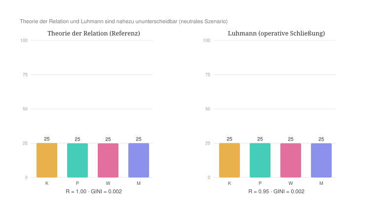
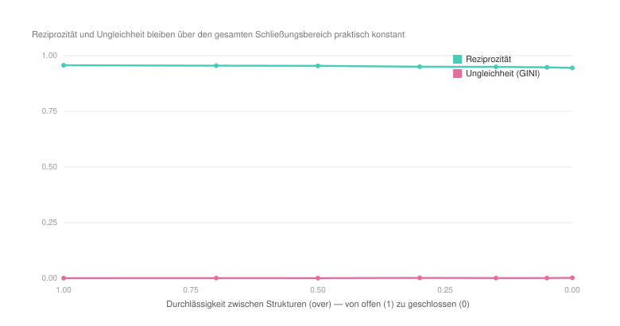
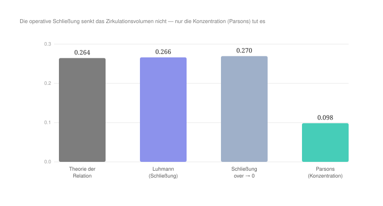

#+AUTHOR: Christian Papilloud
#+LANGUAGE: de
#+OPTIONS: toc:nil num:nil H:4 ^:nil
#+STARTUP: showall
#+LATEX_CLASS: book
#+LATEX_CLASS_OPTIONS: [11pt,a4paper]
#+CITE_EXPORT: csl chicago-author-date-de-ibid.csl
#+BIBLIOGRAPHY: Bericht.bib

* Kapitel 3 — Die Systemtheorie Niklas Luhmanns
:PROPERTIES:
:STATUS: DRAFT
:END:

Luhmann gehört derselben systemtheoretischen Familie wie Parsons an. Doch kehrt Luhmann Parsons' entscheidende Annahme um. Wo Parsons eine kybernetische Kontrollhierarchie mit einem regierenden Wert-Apex setzt, setzt Luhmann eine Gesellschaft ohne Spitze und ohne Zentrum, die aus operativ geschlossenen, autopoietischen Funktionssystemen besteht. Luhmann formuliert es selbst so: Ein Steuerungszentrum „würde die Ausdifferenzierung aller umweltwirksamen Funktionssysteme blockieren. Die funktional differenzierte Gesellschaft operiert ohne Spitze und ohne Zentrum“ [cite:@luhmann1997gesellschaft 803]. Wir behandeln seine Theorie als eigenständige und kohärente Alternative zur TR und führen den Vergleich mit der TR durch. Der vorliegende Fall ist methodisch besonders lehrreich, weil hier nicht eine interne Spannung des Rahmens, sondern die Grenze des relationalen Instruments selbst sichtbar wird. Wir folgen der Systematisierung, die wir im Kapitel 1 festgelegten haben, und wir analysieren Luhmanns Theoriekern nach den dort sieben beschriebenen Stufen.

** 3.1 Ontologische Korrespondenz und Residuum

Luhmanns Gesellschaft kennt zahlreiche Funktionssysteme — Wirtschaft, Politik, Recht, Wissenschaft, Kunst, Religion, Erziehung, Massenmedien und weitere —, die nicht untereinander hierarchisiert werden: „das Gesamtsystem verzichtet auf jede Vorgabe einer Ordnung (zum Beispiel: Rangordnung) der Beziehung zwischen den Funktionssystemen“ [cite:@luhmann1997gesellschaft 613]. Um die Vergleichbarkeit mit den anderen Kapiteln in diesem Band zu gewährleisten, ordnen wir die vier Strukturen des digitalen Zwillings vier prominenten Funktionssystemen zu: die Wirtschaft (C) dem Wirtschaftssystem (Medium Geld); die Politik (B) dem politischen System (Medium Macht); die Kultur (A) der Wissenschaft (Medium Wahrheit); die Medien (D) dem System der Massenmedien (Medium Information). Diese Zuordnung ist eine unter mehreren, die möglich sein würden, und gerade das ist bezeichnend: Da bei Luhmann kein festes kybernetisches Rangverhältnis besteht — „Keine Rangordnung heißt auch: keine Stratifikation“ [cite:@luhmann1997gesellschaft 747] —, können die „Plätze“ untereinander ausgetauscht werden. Schon hier wird es klar, dass es sich bei Luhmann nicht wie bei Parsons verhält, für den der Rang jeder Struktur feststeht.

Aus dieser Ausgangslage ergeben sich drei Residuen, die selbst Ergebnisse sind.

Erstens überschreitet Luhmanns polykontexturale Gesellschaft die vier Relationsstrukturen der TR. Luhmanns soziale Systeme auf vier zu reduzieren, legt ihnen eine Geschlossenheit auf, die Luhmann bestreiten würde, denn für ihn ist die moderne Gesellschaft „ein polykontexturales System, das eine Mehrheit von Beschreibungen ihrer Komplexität zuläßt“ [cite:@luhmann1997gesellschaft 36].

Zweitens hat die Akteursebene in der TR fast keinen Widerpart bei Luhmann. Die Einheit des Sozialen in der Theorie sozialer Systeme ist nicht die Handlung und nicht die Person, sondern die Kommunikation: „Kommunikation ist die elementare Einheit der Selbstkonstitution, Handlung ist die elementare Einheit der Selbstbeobachtung und Selbstbeschreibung sozialer Systeme“ [cite:@luhmann1984soziale 241]. Personen gehören zur Umwelt bzw. zum Außen der sozialen Systeme — wobei Luhmann betont, dass darin keine Abwertung liegt: „So enthält denn auch die Aussage, Personen gehörten zur Umwelt sozialer Systeme, keine Gewichtung der Bedeutung von Personen für sich selbst oder für anderes. Nur die Überschätzung, die im Subjektbegriff lag, nämlich die These der Subjektität des Bewußtseins, wird revidiert“ [cite:@luhmann1984soziale 244].

Drittens und vielleicht hier entscheidender: Die Medien des digitalen Zwillings vermitteln die Zirkulation zwischen den Relationsstrukturen, während Luhmanns Medien Codes innerhalb geschlossener Systeme angelegt sind und operieren. Sie sind „Spezialmedien der Einschränkung von Kontingenz“, deren Differenzierung „zugleich die Systemdifferenzierung vorantreibt“ [cite:@luhmann1997gesellschaft 21]. Die operative Schließung minimiert gerade jene zwischenstrukturelle Zirkulation, die der digitale Zwilling zu seinem Kerngegenstand macht, denn zwischen den Systemen stehen „für die Kopplung keine Operationen zur Verfügung“ [cite:@luhmann1997gesellschaft 788]. Es gibt „kein Kopplungssystem, das einen eigenen Operationstypus und damit eine eigene Autopoiesis realisieren könnte“ [cite:@luhmann1997gesellschaft 788]. Dieses dritte Residuum wird sich im Lauf von unserem Vergleich als derjenige erweisen, mit dem unser bedeutsamer Befund verbunden ist.

** 3.2 Theoretischer Kern

Die Operationalisierung stützt sich auf die vier folgenden Grundorientierungen.

Die erste Orientierung bezieht sich auf die operative Schließung und auf die Autopoiesis. Die Funktionssysteme reproduzieren ihre Elemente — Kommunikationen — ausschließlich aus ihren eigenen Elementen: „Auf der Grundlage ihres Funktionsprimats erreichen die Funktionssysteme eine operative Schließung und bilden damit autopoietische Systeme im autopoietischen System der Gesellschaft“ [cite:@luhmann1997gesellschaft 748]. Die Systemtheorie ist dementsprechend eine „Theorie selbstreferentieller Systeme“ [cite:@luhmann1984soziale 31]. Daraus folgt eine sehr geringe Durchlässigkeit zwischen den Strukturen.

Die zweite Orientierung betrifft die Kommunikation als elementare Einheit der sozialen Systeme. Das Soziale besteht nicht aus Handlungen oder Personen: „Soziale Systeme werden demnach nicht aus Handlungen aufgebaut [...]; sie werden in Handlungen zerlegt“, und der elementare das Soziale konstituierende Prozeß ist ein Kommunikationsprozeß [cite:@luhmann1984soziale 193]. Die Menschen lassen sich nicht den Teilsystemen zuordnen. Die Gesellschaft kommt für das Funktionssystem nur noch als Umwelt bzw. Außen in Betracht [cite:@luhmann1997gesellschaft 744 f.]. Daraus folgt eine geringe Akteurszirkulation bzw. die Akteursebene ist hier ein Residuum.

Die dritte Orientierung ist mit der funktionalen Differenzierung ohne Spitze und ohne Zentrum verbunden. In der modernen Gesellschaft gibt es „weder eine Reduktion auf eine Spitze, noch eine Reduktion auf ein Zentrum der Gesellschaft“ [cite:@luhmann1997gesellschaft 743]. Die Funktionssysteme sind „in ihrer Ungleichheit gleich“, womit auf alle gesamtgesellschaftlichen Vorgaben verzichtet wird, die ihre möglichen Relationen fördern würden [cite:@luhmann1997gesellschaft 613]. Daraus folgt, dass wir bei Luhmann keinen Apex und keine Konzentration erkennen können, sondern lediglich nur symmetrische und autonome Kopplungen. Dort liegt die Umkehrung von Parsons bzw. die wichtige epistemologische Unterscheidung zu seinem Theorierahmen.

Die vierte Orientierung berücksichtigt die Lehre von den symbolisch generalisierten Kommunikationsmedien als internen Codes. Jedes Funktionssystem verfügt über sein eigenes Medium — etwa „Macht als symbolisch generalisiertes Medium der Kommunikation“ [cite:@luhmann1975macht 5] — und über einen eigenen binären Code, der die operative Geschlossenheit von einem Funktionssystem absichert. Für das Rechtssystem gilt etwa: „Über Codierung ist die operative Geschlossenheit des Systems gesichert“, und nur was sich am Code Recht/Unrecht ausweist, wird ihm zugerechnet [cite:@luhmann1995recht 103, 105]. Das Medium macht die unwahrscheinliche Kommunikation innerhalb des Systems wahrscheinlich. Das Medium ist über die Differenz von medialem Substrat und Form bestimmt [cite:@luhmann1997gesellschaft 190]. Diese Medien und Codes integrieren bzw. operieren nicht über eine Hierarchie. Geschlossene Systeme verbinden sich nur über strukturelle Kopplung und Resonanz, und die Resonanz auf die Umwelt wird „durch eine Mehrzahl von funktionsspezifischen Codes gesteuert“, also nicht etwa durch einen gesellschaftseinheitlichen Code [cite:@luhmann1986oekologische 89]. Die Instanzen bzw. Vermittlungsinstanzen in der Sprache der TR sind dann vorhanden, aber sie vermitteln keine Zirkulation zwischen den Systemen bzw. in der Sprache der TR den Relationsstrukturen.

Quer zu diesen vier Orientierungen steht Luhmanns Antwort auf die Frage der sozialen Ordnung, die sich, wie er ausdrücklich festhält, vom Parsons' Vorschlage deutlich abgrenzt [cite:@luhmann1984soziale 149]. Nicht der Wertkonsens stiftet die Ordnung, sondern die doppelte Kontingenz selbst. An die Stelle des Wertkonsenses tritt „die leere, geschlossene, unbestimmbare Selbstreferenz“, die geradezu Zufälle ansaugt und so erst die soziale Ordnung ermöglicht [cite:@luhmann1984soziale 151]. Wo Parsons die Ordnung auf ein gemeinsames Wertsystem gründet (Kapitel 2), gründet sie Luhmann auf die Geschlossenheit der Selbstreferenz. Hiermit stellen wir Luhmanns schärfsten Ausdruck der ontologischen Differenz der Theorie sozialer Systeme fest, die dieses Kapitel herausarbeitet.

** 3.3 Operationalisierung

Aus diesen Orientierungen ergibt sich das folgende Reglerprofil, den wir dann in den digitalen Zwilling der TR aufnehmen. Die linke Wertspalte gibt die Vorgabe der TR an; die rechte Wertspalte gibt den für Luhmann gesetzten Wert. Jede Zeile entspricht einer Grundorientierung (O1–O4), und sie wird mit einer Textstelle aus dem Werk Luhmanns verbunden bzw. typisiert. Die tragende strukturelle Prämisse ist hier diejenige der Abwesenheit von struktureller Dimensionalität: Während Parsons ein gerichtetes Kontrollgefälle auferlegt, ist Luhmanns Theoriesignatur das Fehlen jeder Hierarchie. Die Ketten bleiben deshalb symmetrisch (ohne gerichtetes Gefälle). Luhmanns Theorie wird von der Schließung getragen, nicht von einer Kontrollrichtung.

| Regler (Code) | TR | Luhmann | Begründung |
|--------+----+---------+------------|
| Durchlässigkeit zwischen Strukturen (over) | 1,0 | 0,3 | operative Schließung; kein Transfer von Operationen, nur strukturelle Kopplung [cite:O1; @luhmann1997gesellschaft 748] — /tragender Regler/ |
| Akteurszirkulation (rate) | 2,2 | 0,9 | die Einheit ist die Kommunikation, nicht der Akteur; Personen sind Umwelt [cite:O2; @luhmann1984soziale 193] |
| Konzentration zum Pol (alpha) | 1,4 | 1,0 | keine Spitze, kein Zentrum, keine Konzentration [cite:O3; @luhmann1997gesellschaft 743] |
| Erschöpfung der Dominanten (cap) | 0,7 | 0,5 | selbstreproduktive Autopoiesis, kein Herrschender, der sich erschöpfte; es sind „autopoietische Systeme, die alle Elemente, die sie für die Fortsetzung ihrer Autopoiesis benötigen, selbst produzieren“ [cite:O1; @luhmann1997gesellschaft 67]                   |
| Gewicht der Zahl (anchor) | 0,5 | 0,5 | Koexistenz von Gleichen, keine Logik der Masse; „Keine Rangordnung heißt auch: keine Stratifikation“ [cite:O3; @luhmann1997gesellschaft 747]      |
| Vorteil der Dynamischen (dynam) | 0,5 | 0,5 | jedes System entwickelt sich selbstständig, da „die Gesellschaft die Beziehungen zwischen ihren Teilsystemen nicht mehr regulieren kann, sondern sie der Evolution, also der Geschichte überlassen muß“ [cite:O3; @luhmann1997gesellschaft 613]      |
| back, plast, mig, decl, rho, peak | Vorgaben | unverändert | Akteursebene = Residuum; Personen gehören zur Umwelt sozialer Systeme [cite:O2; @luhmann1984soziale 244]; auf der Vorgabe belassen |

Die Ketten sind symmetrisch (keine =Ketten_=-Zeile; es gilt die C4-Symmetrie der TR).

** 3.4 Hypothesen

Vor dem Lauf wurden fünf Hypothesen formuliert. /H1./ Keine Struktur dominiert; die Größen bleiben annähernd gleich, die Ungleichheit (Gini) bleibt niedrig. /H2./ Es gibt keine Satellisierung. /H3./ Jede Struktur bleibt autonom (Regent ihrer selbst) — „weder Spitze noch Zentrum“ wird damit abgebildet. /H4./ Trotz niedriger Ungleichheit und fehlender Satellisierung ist die Reziprozität niedrig, weil die operative Schließung die zwischenstrukturelle Zirkulation verhindert, auf die die Reziprozität angewiesen ist. Luhmanns Theorie erzeugte dann ein Feld von isolierten Gleichen. /H5./ Der tragende Regler ist die Durchlässigkeit der Systeme bzw. der Relationsstrukturen (over). Wird sie erhöht, sollte sich das System dem reziproken Zustand der TR annähern.

** 3.5 Lauf und Ergebnisse

Alle Läufe sind wie bei Parsons headless reproduziert, deterministisch, im gemeinsamen neutralen Szenario, mit dem Keim 1 als Ausgangssituation und über rund 1819 Schritte. Das Ergebnis ist deutlich, und es widerlegt einen Teil der Hypothesen, die wir formuliert haben, was selbst der Befund ist.

| Kennzahl | Referenz (TR) | Luhmann |
|-------+-------------+---------|
| Ungleichheit (GINI) | 0,002 | 0,002 |
| Reziprozität (1 = freie, gleiche Zirkulation) | 0,997 | 0,952 |
| Zwischenzirkulation (crossOff) | 0,266 | 0,267 |
| Größen Kultur / Politik / Wirtschaft / Medien | je ~25 % | je ~25 % |
| Regentschaft | alle autonom | alle autonom |
| Satellisierung (satS) | 0 / 0 / 0 / 0 | 0 / 0 / 0 / 0 |

H1, H2 und H3 sind bestätigt: Luhmanns Theorie der sozialen Systeme entwickelt im digitalen Zwilling keine Dominanz und keine Satellisierung. Jede Struktur entwickelt sich selbstständig, wie dies die Theorie sozialer Systeme vorsieht. H4 und H5 können jedoch nicht bestätigt werden. Die Reziprozität bricht nicht ein, sondern bleibt hoch (0,952), und das Volumen der Zwischenzirkulation bleibt unverändert. Mit anderen Worten: Luhmanns operationalisiertes Profil erzeugt einen Zustand, der von der symmetrischen, reziproken Referenz der TR kaum zu unterscheiden ist. Dies bedeutet, dass sich die Theorie sozialer Systeme deutlich näher an der TR entwickelt, als Parsons Theorie es tat.

#+NAME: fig:luhmann-endzustand
#+CAPTION: Endzustand im neutralen Szenario. Anders als Parsons (vgl. Kapitel 2) erzeugt Luhmanns Profil ein nahezu identisches Bild zur Referenz der TR: gleiche Größen, hohe Reziprozität, keine Satellisierung.

** 3.6 Robustheit

Der Befund ist hier ebenfalls über mehrere Keime sehr robust. Variiert man die Durchlässigkeit der Systeme bzw. der Relationsstrukturen (over) von 1 auf 0, so bleiben Reziprozität und Ungleichheit quasi konstant. Selbst eine extreme Schließung (over 0, Akteurszirkulation 0,1) senkt die Reziprozität nur von 0,997 auf etwa 0,90, ohne das Regime bzw. die selbstständige Entwicklung der Systeme zu verändern. Die Akteurszirkulation (rate) hat von 2,2 bis 0,1 keine Wirkung auf diese Entwicklung. Der Befund ist invariant gegenüber dem Keim. Vor allem ist er invariant gegenüber der Kettenkodierung: Eine ganze Batterie von Kopplungen der vier Sequenzen in den Relationsstrukturen — symmetrisch Reihung, fester Zyklus, gepaarte Sequenzen, beliebige Permutation, forcierte Ausrichtung — erzeugt gar keine Satellisierung. Die stärkste Abweichung (die forcierte Ausrichtung aller Ketten) treibt die Ungleichheit nur auf 0,17 und die Reziprozität auf 0,70. Wir sind weit von dem Einbruch entfernt, die wir bei Parsons festgestellt haben (0,54 bzw. 0,34). Um das System überhaupt zum Kippen zu bringen, braucht es die Konzentrationsregler (hohe Konzentration, niedrige Erschöpfung, niedriges Gewicht der Zahl), also eine Nachahmung von Parsons Theorierahmen, davon man hier am besten die Unterscheidung zu Luhmanns Theorierahmen sieht.

#+NAME: fig:luhmann-schliessung
#+CAPTION: Operative Schließung (Durchlässigkeit over von 1 auf 0): Reziprozität und Ungleichheit bleiben über den gesamten Bereich konstant. Die Schließung bewirkt keinen Regimewechsel.

Aufschlußreich ist hier die Kontrollmessung zum Volumen der Zirkulation zwischen Relationsstrukturen (crossOff). Diese Größe bewegt sich zwar, aber sie bewegt sich nur unter Konzentration, nie unter Schließung. Unter dem Parsons-Profil fällt sie auf 0,105, während sie mit Luhmann und selbst unter extremer Schließung bei ~0,266 bleibt, also auf der Höhe der Referenz. Der digitale Zwilling der TR senkt das Zirkulationsvolumen, wenn ein Pol die anderen satellisiert. Aber er senkt es nicht, wenn die Systeme geschlossen werden. Genau hier liegt die Grenze des Instruments.

#+NAME: fig:luhmann-crossoff
#+CAPTION: Volumen der zwischenstrukturellen Zirkulation. Die operative Schließung senkt dieses Volumen nicht; nur die Konzentration (Parsons-Profil) tut es. Der digitale Zwilling kann Schließung nicht als verringerte Zirkulation abbilden.

** 3.7 Lesart: Inkommensurabilität, Konvergenz und die verborgene Reziprozität

Auf der dreistufigen Skala der sozialen Ungleichheiten kaskadiert Luhmann nicht. Keine Ebene hebt sich vom symmetrischen Etalon des digitalen Zwillings ab. Es ist ein weiteres Zeichen dafür, dass seine codierte Inklusion/Exklusion in einer Vertikalen sitzt, die das transversal gebaute Modell der TR nicht darstellt (das Residuum). Die Lesart entfaltet sich entsprechend in drei Schritten.

Der erste Schritt betrifft die Inkommensurabilität. Die freigelegte verborgene Prämisse ist hier keine interne Spannung, die im Theorierahmen Luhmanns stecken würde, sondern eine Grenze des relationalen Instruments selbst. Der digitale Zwilling kann die operative Schließung nicht abbilden. Seine Ontologie setzt die Relation und die Zirkulation als grundlegendes Fundament der TR. Luhmanns autopoietische Schließung ist aber gerade die Verneinung dieses Primats. Bei ihm ist das geschlossene selbstreferentielle System grundlegend, und die "Relation" (als strukturelle Kopplung) ist sekundär in der Theoriearchitektur Luhmanns und nur mittelbar erkennbar. Im digitalen Zwilling gibt es deshalb keinen Regler für die Aussage „die Operationen von X sind für Y kategorial unzugänglich“. Daraus ergibt sich die Folge, dass all das, was der digitale Zwilling von Luhmann abbilden kann — die Absage an die Hierarchie, die Selbstständigkeit und die Gleichheit der Funktionssysteme, die Differenzierung —, fällt mit der symmetrischen Reziprozität der TR zusammen. Das Einzige, was Luhmanns Theorierahmen von der TR trennt — die Schließung —, liegt außerhalb der relationalen Ontologie. Die Differenz zwischen Luhmann und der TR ist also nicht intern und graduell wie bei Parsons, sondern ontologisch und kategorial. Sie ergibt sich aus einer anderen Grundlage beider Theorierahmen (dem geschlossenen System vs. der Relation). Im Register des „schlechten Sitzes als Ergebnis“ ist gerade die Unfähigkeit vom digitalen Zwilling, die ontologische Position der Theorie Luhmanns zu reproduzieren, der Befund. Der digitale Zwilling lokalisiert den Punkt, an dem Luhmanns Ontologie von der TR abzweigt, der mit der operativen Schließung gegeben ist. Damit berührt dieser Befund ein methodologisches Grundproblem des Theorienvergleichs. Nach der skeptischen Position, wie sie Klüver beschreibt, sind Theorien, die sich an verschiedenen Paradigmen orientieren, „nicht vergleichbar, da es keinen Vergleichsrahmen geben kann“ [cite:@kluever1991formale 209 f.]. Die Schwierigkeit ist bei Luhmann besonders ausgeprägt, weil seine Theorie aus einem eigenen Paradigmenwechsel hervorgeht — von offenen zu selbstreferentiellen, autopoietischen Systemen — und wie die konkurrierenden Entwürfe beansprucht, „Grundlegung der Soziologie“ zu sein [cite:@berndsen1991handlung 14]. Der digitale Zwilling entkräftet diesen Einwand nicht, aber er präzisiert ihn: Er zeigt, an welcher Stelle genau die Vergleichbarkeit endet.

Zweitens hat dieser Befund eine bemerkenswerte Tragweite für die Debatte zwischen Luhmann und Habermas, die im Anschluss an dem Positivismusstreit entstanden ist. Fasst man das Soziale mit der Relation und der Reziprozität auf — wie die TR und wie in ihrem Rahmen die kommunikative Reziprozität der Handlung von Habermas — oder mit der Schließung und der Selbstverstärkung des Systems — Luhmann —, dann gelangt man zu derselben relationalen Konfiguration. Wir sehen stets selbstständige, gleiche, differenzierte Systeme, die keine Ungleichheit produzieren, und die keine Reziprozität zerbrechen. Die Konvergenz betrifft die Konsequenzen für Ungleichheit und Reziprozität, nicht die Ausgangslage. Oder anders gesagt: Der digitale Zwilling macht formal sichtbar, warum die Debatte zwischen Luhmann und Habermas [cite:@luhmann1971theorie] so unauflöslich gewesen ist und bleibt. Beide Positionen unterscheiden sich nicht in ihren strukturellen Folgen, sondern allein in dem, was sie als Ausgangslage definieren (Reziprozität oder Schließung). Fritscher hat bereits 1989 festgestellt, dass „die Kontroverse [...] immer noch in den durch die Abgrenzungsformeln ‚Verständigung‘ und ‚Autopoiese‘ vorgegebenen Konturen“ verbleibt [cite:@fritscher1989differenzierung 3]. Genau diese beiden Formeln macht der digitale Zwilling als die einzige verbleibende Differenz sichtbar. Dass gerade diese Kontroverse das Programm eines systematischen Theorienvergleichs angestoßen hat, hält Klüver fest, wenn er dessen Auslöser in den „Grundlagenkontroversen“ der Soziologie sieht — „Positivismusstreit, Habermas vs. Luhmann“ [cite:@kluever1991formale 209].

Drittens baut Luhmann eine Theorie ohne legitimierende Reziprozität zwischen den Systemen auf. Aber die Form von einer Art Reziprozität setzt sich überall innerhalb der Systeme durch, weil Systeme selbst-referentielle Systeme sind, was einer Subvertierung von einer normativen Reziprozität durch die Autopoiesis ähnelt. Der digitale Zwilling gibt ihr eine messbare Spur: Unter der Schließung bleibt die eigene Reziprozität in jedem System bzw. in jeder Relationsstruktur hoch.

| eigene Reziprozität je Struktur | Kultur | Politik | Wirtschaft | Medien |
|---+---+---+---+---|
| Luhmann (operative Schließung) | 0,962 | 0,937 | 0,961 | 0,957 |
| TR (Referenz) | 0,999 | 1,000 | 0,999 | 1,000 |

Die Schließung zerstört die Art der Reziprozität nicht, sondern sie verlagert sie innerhalb der Systeme. Jedes geschlossene System bleibt in hohem Maße selbst-reziprok. Deshalb bleibt die globale Reziprozität Luhmanns Theorierahmens im digitalen Zwilling hoch, weil jedes geschlossene System in sich kohärent ist. Das ist die formale Gestalt der Autopoiesis: Die Elemente erzeugen wechselseitig die Operationen, die die Elemente erzeugen. Innerhalb von jedem System finden wir immer eine zirkuläre, selbstreferentielle, sich gegenseitig konstituierende Schleife. Luhmann reinstalliert mithin die Form der Reziprozität als Selbstbegründung jedes Systems, während er ihr einen normativen Status abspricht. Seine Schließung ist eine Art der Reziprozität, die ihren Namen nicht nennt. Diese Figur ist in der Luhmann-Rezeption als Kern der systemischen Einheitsbildung bestimmt worden. Eine soziale Einheit besteht „durch die zirkuläre Beziehung der systembildenden Elemente aufeinander, die sie eben als zusammenhängende Elemente — und damit als differente Einheit (re)produziert“ [cite:@martens1995selbigkeit 301]. Auch Miller benennt „das in aller Selbstreferenz enthaltene Problem der Zirkularität“ [cite:@miller1987selbstreferenz 199], das Luhmann intern zu lösen sucht. Was dort als Problem der Zirkularität erscheint, misst der digitale Zwilling als die hohe Eigenreziprozität geschlossener Systeme.

** 3.8 Fazit. Entwicklungslinien

Für die relationale Soziologie markiert Luhmann die Grenze des relationalen Programms. Er zeigt, wie eine Soziologie aussieht, die die Schließung statt die Relation als Grundlage der Theorie auswählt. Die TR und Luhmann erweisen sich dabei als duale Theorierahmen. Sie unterscheiden sich nicht in der Oberflächenkonfiguration (selbstständige, differenzierte, nicht hierarchische Systeme), sondern in der umgekehrter ontologischer Grundlage (die Relation als Konstituens gegenüber dem geschlossenen System). Der digitale Zwilling lokalisiert diese grundsätzlichen Unterscheidung sehr genau. Er kann wiedergeben, ob die Relation konstitutiv ist -- in diesem Fall erkennt er den Rahmen der TR --, oder ob es sich um die Kopplung zwischen vorgängig geschlossenen Systemen -- in diesem Fall erkennt er die Theorie sozialer Systeme. Die verborgene Art der Reziprozität als Selbstreferentialität der Systeme und deren Autopoiesis eröffnet die Systemtheorie Luhmanns auf die Kommunikation mit relationalen Theorierahmen. Da Luhmanns Schließung selbst die Form einer Reziprozität trägt, ist seine Theorie der relationalen Theorierahmen nicht vollkommen fremd. Eine relationale Soziologie, die Luhmann ernst nimmt, müßte dann zeigen, daß die operative Schließung eine Modalität der Relation ist bzw. die Relation ist, die ein System mit sich selbst entwickelt, um sich von seiner Umwelt zu unterscheiden.

** Literatur
#+print_bibliography:
