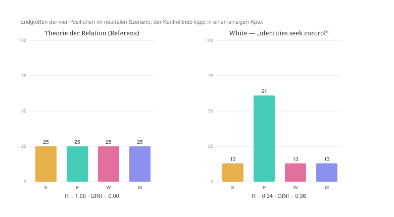
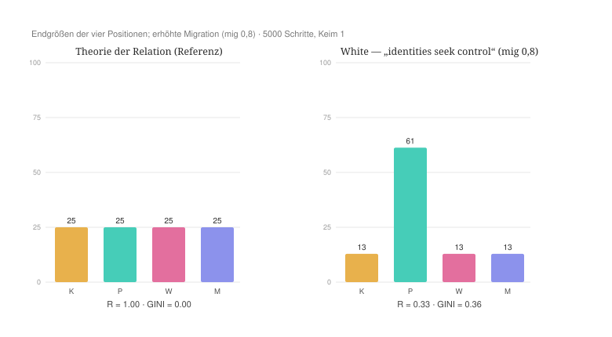
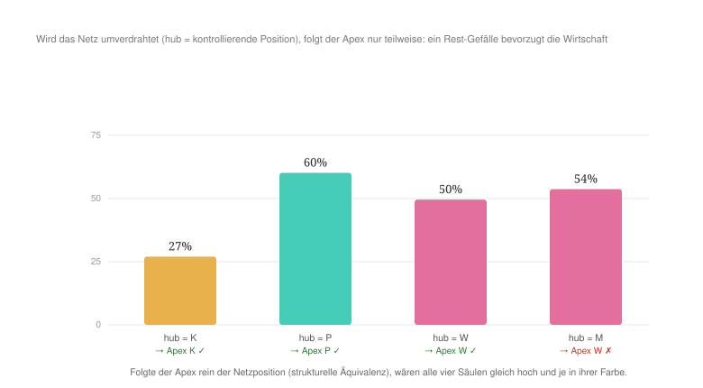

#+AUTHOR: Christian Papilloud
#+LANGUAGE: de
#+OPTIONS: toc:nil num:nil H:4 ^:nil
#+STARTUP: showall
#+LATEX_CLASS: book
#+LATEX_CLASS_OPTIONS: [11pt,a4paper]
#+CITE_EXPORT: csl chicago-author-date-de-ibid.csl
#+BIBLIOGRAPHY: Bericht.bib

* Kapitel 5 — Netzwerkanalyse: Harrison White
:PROPERTIES:
:STATUS: DRAFT
:END:
Mit Harrison White begegnet die TR einen Rahmen, der ihr verwandt ist. Anders als Parsons, Luhmann und Habermas ist Whites netzwerktheoretische Soziologie grundlegend relational. Schmitt und Fuhse ordnen sie einer relationalen Soziologie zu, die sich im Anschluss an Mützel und Fuhse unter anderem dadurch bestimmt, dass „im Gegensatz zu allen Formen der Handlungstheorie [...] nicht der individuelle Akteur zum Ausgangspunkt der Theoriebildung gemacht [wird], sondern die Netzwerke, aus denen sich seine Identität erst ergibt“, und dass „gegenüber Systemtheorien [...] die mittlere Ebene des Sozialen in den Mittelpunkt gestellt“ wird [cite:@schmittfuhse2015white 168]. Sie kennt keine vorgegebenen Funktionssphären, keine substantiellen Akteure, keine Spitzeninstanz, sondern Identitäten, Bindungen und Positionen, die sich wechselseitig ko-konstituieren.

Die Bindung tritt dabei zu den Identitäten nicht hinzu, sondern geht aus ihnen hervor: „Identities build and articulate ties to other identities in network-domains, netdoms for short“ [cite:@white2008identity 2]. Die Welt entsteht White zufolge daraus, dass Identitäten innerhalb ihrer Beziehungen zu anderen Identitäten nach Kontrolle streben. Für Identität und Position fassen Schmitt und Fuhse denselben Zusammenhang so, dass Identitäten „als Konstrukte immer in einem spezifischen Kontext mit erzeugt und wesentlich in Relation (und Differenz) zu einander bestimmt“ werden [cite:@schmittfuhse2015white 169]. „Sie werden zu Positionsbestimmungen in einem relational definierten sozialen Raum. Identitäten sind zugleich Ausgangspunkt sozialer Musterbildung und selbst Resultat sozialer Muster“ [cite:@schmittfuhse2015white 169]. Auf dem Papier steht Whites Netzwerktheorie der TR deshalb näher als jeder der bisher behandelten Theorierahmen. Der Kontrast verschiebt sich entsprechend von der relationalen Ontologie zu dem, was diese relationale Ontologie ausmacht bzw. ihre treibende Kraft darstellt. Bei Whites Netzwerktheorie ist es nicht die Reziprozität wie in der TR, sondern die Kontrolle: „Before anything else, control is about finding footings among other identities“ [cite:@white2008identity 1]. Sein Begriff der Positionen versteht White nicht in einem Einschreibungsverhältnis mit Vermittlungsinstanzen der Gesellschaft, sondern als reine relationale Positionen, die strukturell äquivalent sind. Rollen und Positionen werden aus Blöcken abgeleitet und nicht umgekehrt. Operational bestimmen White, Boorman und Breiger einen Block als „a set of persons structurally equivalent with respect to other such sets“, und zwar über mehrere Beziehungstypen hinweg [cite:@whiteboorman1976social 772]. Dies bildet die Ausgangslage von unserer Behandlung Whites Netzwerktheorie mit dem digitalen Zwilling der TR, die wir nach den gleichen sieben Stufen entwickeln, wie wir es mit Parsons, Luhmann und Habermas gemacht haben.

** 5.1 Ontologische Korrespondenz und Residuum

Im digitalen Zwilling der TR entspricht Whites netzwerkartige Auffassung von Positionen den vier Relationsstrukturen die zu vier Netzwerkpositionen werden, die allein strukturell durch ihr Beziehungsmuster — ihre strukturelle Äquivalenz, die im digitalen Zwilling die Sequenzen von Relationsstrukturen darstellen — definiert sind. Die Akteure in den Akteurkategorien der TR entsprechen Whites Auffassung von Identitäten, die nach einem „footing“ bzw. nach Kontrolle suchen. Genauer ist bei White Ein solches footing „a position that entails a stance, which brings orientation in relation to other identities“ [cite:@white2008identity 1]. Es muss reflexiv sein, weil es zugleich den Blickwinkel liefert, der die Interaktion mit anderen Identitäten anleitet [cite:@white2008identity 2]. Die Ketten der Relationsstrukturen im digitalen Zwilling entsprechen den Bindungen und, enger gefasst, den Vakanzketten der Mobilität in Whites Theorierahmen. Aus dieser Überführung von Whites Theorierahmen in den digitalen Zwilling der TR ergibt sich ein doppeltes Residuum.

Erstens entleert White die Positionen von jedem Inhalt, weshalb in seinem Theorierahmen eine Position ein reines Beziehungsmuster darstellt. Da diese Positionen nicht von einem Inhalt bestimmt werden, werden zwei Identitäten, die mit zwei strukturell äquivalenten Positionen verbunden sind, austauschbar. Die Relationsstrukturen im digitalen Zwilling, damit Whites Positionen in Verbindung gesetzt werden, enthalten im Unterschied zu Whites Auffassung von Positionen Vermittlungsinstanzen, die nach der TR nicht gegenseitig ausgetauscht werden können. Genau diese Unterscheidung — Position ohne Inhalt vs. Relationsstruktur mit Vermittlungsinstanzen — ist die Kontrastachse zwischen Whites Netzwerktheorie und der TR. Wie wir es sehen werden, kann der digitale Zwilling einen solchen Kontrast markieren.

Zweitens ist Whites Kernansatz mit dem Begriff der Kontrolle und nicht mit einem Begriff der Reziprozität verbunden. An der Seite des digitalen Zwillings kann deshalb erwartet werden, dass die Reziprozitätsmetrik Whites Kontrolldynamik tendenziell als Asymmetrie abbilden wird.

Schließlich und drittens haben die /switchings/ zwischen Netzwerk-Domänen, die für White wichtig sind, weil dort entsteht die Bedeutung für die Akteure, keine saubere Entsprechung im digitalen Zwilling und bleiben deshalb ausdrücklich als Residuum vermerkt.

** 5.2 Theoretischer Kern

Die Überführung Whites Theorierahmen in den digitalen Zwilling stützt sich auf vier Grundorientierungen, die wie folgt beschrieben werden können.

Die erste Orientierung ist der Kontrolltrieb. Nach White ist die Identität kein Substrat, sondern das Ergebnis von Kontrollanstrengungen im unruhigen Kontext: „Identities spring up out of efforts at control in turbulent context“ [cite:@white2008identity 1]. Identitäten suchen einen Halt bzw. ein /footing/ im Universum der Kontingenz. Entscheidend ist Whites Einschränkung, dass dieser Kontrollbegriff mit Herrschaft über andere nichts zu tun haben muss: „These control efforts need not have anything to do with domination over other identities“ [cite:@white2008identity 1]. White schließt die Herrschaft damit nicht aus. Er löst nur die begriffliche Kopplung zwischen Kontrolle und Herrschaft. Kontrolle heißt zunächst Selbstverortung und nicht Unterwerfung. Ob aus der Selbstverortung Unterwerfung wird, bleibt bei White offen, und genau diese offene Stelle werden wir im digitalen Zwilling auf die Probe stellen.

Die zweite Orientierung ist die Bestimmung der Positionen durch strukturelle Äquivalenz. Einen Halt zu gewinnen, heißt bei White strukturelle Äquivalenz zu erzeugen: „to gain footings means to fashion structural equivalence“ [cite:@white2008identity 7]. Positionen und Rollen sind nicht inhaltlich aufgrund von besonderen immanenten Merkmalen bestimmt, sondern rein relational definiert. Es sind Blöcke gleicher Beziehungsmuster, wie dies die Methode des Blockmodelling formuliert: Soziale Struktur wird aus mehreren Netzwerken als ein System von Rollen und Positionen rekonstruiert, die durch ihre Äquivalenzklassen bestimmt sind [cite:@whiteboorman1976social 730]. Dies ist das, was wir oben beschrieben haben, wenn wir gesagt haben, dass nach White Positionen Stellungen im Beziehungsgeflecht signalisieren.

Die dritte Orientierung bezieht sich auf die Kristallisation der Kontrolle in drei Disziplinen. Nach White werden die Kontrollanstrengungen zu drei Typen sozialer Formation verfestigt: „I introduce three different species of disciplines — Interfaces, Arenas and Councils“ [cite:@white2008identity 9], die er im dritten Kapitel seines Buches /Identity and Control/ ausführlich beschreibt [cite:@white2008identity 63ff.]. Das Interface konstruiert eine Ordnung in Bezug auf die Qualität und Produktion (etwa der Markt in der Wirtschaft). Das Council baut diese Ordnung über Vermittlung und Einbettung auf (wie ein Gremium von einer Behörde oder einer Firma). Die Arena entwickelt eine Ordnung über Auswahl und Prestige (etwa die Wahl von Mitgliedern in einem Verein). Interessant für unsere Diskussion ist die Art und Weise, wie White diese drei Disziplinen der Kontrolle ausdrücklich neben Parsons’ analytischem Funktionsschema bzw. sie demselben analytischen Ort zuschreibt, den Parsons mit seinem AGIL-Muster zu besetzen versucht [cite:@white2008identity 112ff.]. Die drei Disziplinen sind drei Arten und Weisen, wie aus der Suche nach der Kontrolle die Ordnung entsteht.

Die vierte Orientierung ist die Mobilität als Zirkulation durch Positionen. Whites frühes Modell der Vakanzketten versteht die Mobilität nicht im Sinne der Mobilität von Personen, sondern im Sinne der Mobilität von Leerstellen bzw. von Vakanzen bzw. von Positionen, die leer sind. Eine Vakanz wandert durch eine Kette von Positionen, während sich die Personen gegen diese Vakanz bewegen [cite:@white1970chains]. Märkte schließlich begreift White als Rollenstrukturen, die aus aufeinander bezogenen Netzwerken hervorgehen [cite:@white2002markets]. In beiden Fällen ist die Position der Knoten der Zirkulation, und genau hier berührt Whites Theorierahmen die TR am unmittelbarsten.

Quer zu diesen vier Orientierungen geht schließlich Whites These über die Entstehung von Ungleichheiten. Ungleichheiten ergeben sich für White nicht aus einem verborgenen Plan und sie können nicht als Ziel der gesellschaftlichen Entwicklung konzipiert werden. Ungleichheiten bilden ein unbeabsichtigtes Nebenprodukt der Suche nach der Kontrolle, des „getting action“. Geplante Ungleichheiten, wenn sie existieren, erreichen nie das Ausmaß jener, die sich als unbeabsichtigte Nebenprodukte der Suche nach der Kontrolle ergeben. Solche unvorhersehbare Ungleichheiten sind am bedeutsamsten gerade an den Bruchstellen zwischen sozialen Formationen [cite:@white2008identity 184]. Die Herrschaft entspringt mithin der relationalen Dynamik selbst. In seinem Aufsatz auf Französisch zur Herrschaft aus 1995 fasst White sie als „Grammatik der Domination“ zusammen, die aus den netzwerkartigen Passagen und aus den Umschaltungen hervorgeht und sich in ihnen niederschlägt [cite:@white1995domination 705]. Dass die Kontrolle mit Herrschaft nichts zu tun haben muss und die Herrschaft gleichwohl regelmäßig als ihr Nebenprodukt entsteht, ist kein Widerspruch, sondern Whites genaue Pointe und der Punkt, an dem ihn der digitale Zwilling am schärfsten prüfen kann.

** 5.3 Operationalisierung

Die vier Orientierungen können als Reglerprofil formalisiert werden, das dann in den digitalen Zwilling überführt wird. Tabelle [[tab:white-regler]] hält fest, welche Regler dabei von den Vorgaben der TR abweichen und welche Orientierung die Abweichung trägt. Alle nicht genannten Regler bleiben auf der Vorgabe der TR.

#+NAME: tab:white-regler
#+CAPTION: *Tabelle 1.* Reglerprofil Whites im digitalen Zwilling der TR.
| Regler (Code) | TR | White | Begründung |
|--------+-----+-------+------------|
| Konzentration zum Pol (alpha) | 1,4 | 1,6 | der Kontrolltrieb: Identitäten entspringen Kontrollanstrengungen im unruhigen Kontext (O1) [cite:@white2008identity 1] — /tragender Regler/ |
| Akteurszirkulation (rate) | 2,2 | 1,8 | Mobilität als Zirkulation durch Positionen, gebunden an Vakanzketten statt freier Bewegung (O4) [cite:@white1970chains] |
| Durchlässigkeit zwischen Strukturen (over) | 1,0 | 1,0 | keine Schließung zwischen Netzwerk-Domänen; auf der Vorgabe der TR belassen (O2) [cite:@white2008identity 7] |
| gesetzte Ketten | — | keine | strukturelle Äquivalenz: symmetrische, gehaltlose Ketten, keine Position mit inhaltlichem Vorrang (O2) [cite:@white2008identity 6f.] |
| back, plast, decl, mig, rho, peak, cap, anchor, dynam | Vorgaben | unverändert | in Whites Rahmen nicht einschlägig; auf der Vorgabe belassen |

Der Kontrolltrieb (O1) erhöht die Konzentration zum dominanten Pol (alpha) auf 1,6. Jede Identität sucht ihren Halt, jeder Akteur sucht nach der Kontrolle. Die strukturelle Äquivalenz (O2) wird durch symmetrische, gehaltlose Ketten abgebildet. Damit sagt der digitale Zwilling in der Sprache von White, dass die Positionen untereinander austauschbar sind. Keine Position trägt folglich einen inhaltlichen Vorrang. Die Zirkulation durch Bindungen und Vakanzketten (O4) setzt die Zirkulation der Akteure (rate) auf 1,8 bei mittlerer Durchlässigkeit zwischen Strukturen (over) von 1,0. Die drei Disziplinen (O3) liefern drei Varianten desselben Profils, die als eigene Dateien im Repository liegen: das /Council/ (die Vermittlung) senkt alpha auf 1,2; die /Arena/ (Auswahl, winner-take-all) hebt es auf 1,8; das /Interface/ (Stratifikation nach Qualität) prüft den Bereich um die Schwelle mit einer kaskadierenden Kettenführung, in der jede Position der jeweils nächsten zufließt (A → B → C → D → A). Neben der Kaskade des Interface haben wir eine zweite Lesart geprüft, in der jede Position nur der unmittelbar höheren zufließt. Wir berichten in Abschnitt 5.6, was sich zwischen beiden Lesarten unterscheidet und was nicht. Der gemeinsame Vergleichspunkt bleibt das neutrale, symmetrische Szenario der TR, der den Zustand der perfekten Relation wiedergibt.

Wie wir es in unseren anderen Kapiteln gesehen haben, ist der digitale Zwilling ein dynamisches Modell, weshalb er Zeit braucht, bis zuverlässige Ergebnisse vom Theorierahmenvergleich erhalten werden können. Deshalb muss der Laufhorizont bzw. müssen die Anzahl der Schritte berücksichtigt werden, die den Lauf bestimmen. Nach 1819 Schritten ist Whites Apex erst auf 58 % gewachsen und wächst danach auf 62 %. Bei Tilly ist derselbe Unterschied noch schärfer, wie wir im folgenden Kapitel sehen werden. Nach 1819 Schritten sieht sein Profil quasi-symmetrisch aus und ließe sich als Widerlegung seiner eigenen These lesen, während sich nach rund 5000 Schritten ein deutlicher Apex ausgebildet hat. Endzustands- und Sweep-Kennzahlen lesen wir deshalb durchgehend am eingeschwungenen Zustand nach 5000 Schritten ab. Die zweite Angabe ist der /Keim/ des Zufallsgenerators. Ein Teil der Konfigurationen des digitalen Zwillings ist bistabil, d. h. es gibt genau zwei Endzustände und der Keim wählt nur, in welchen der beiden der Lauf fällt. Wir prüfen deshalb jeden Apex-Befund über acht Keime und geben an, in wie vielen von ihnen er auftritt. Bei White spielt auch noch die Migration der Akteure (mig) eine Rolle, weshalb wir sie einmal auf der Vorgabe der TR also auf 0,7 und einmal höher bei 0,8 setzen. Damit wollen wir prüfen, ob unsere Ergebnisse unter veränderbarer Migration der Akteure halten bzw. belastbar sind.

** 5.4 Hypothesen

Drei Hypothesen werden getestet. /H1/ besagt, dass die Kontrolle eine Asymmetrie produziert. Da Whites Ansatzkern die Kontrolle und nicht die Reziprozität ist, sollte das Profil in der Ausgangslage den symmetrischen Zustand des digitalen Zwillings nicht von selbst halten, sondern in einen einzigen /Apex/ kippen lassen. Dies bedeutet, dass eine Identität die Kontrolle über die anderen übernimmt. Nach /H2/ bleibt die Symmetrie nur durch Vermittlung vorhanden. Allein die Council-Disziplin als Vermittlung sollte die Symmetrie im digitalen Zwilling rehabilitieren. Arena und Interface sollten die Entwicklung der Herrschaft begünstigen. H3 legt nah, dass der Apex austauschbar ist. Wenn die strukturelle Äquivalenz gilt, dann darf die Identität des Apex keine Rolle spielen. Welche Position herrscht, müsste allein von der netzwerkartige Konstitution der Position abhängen und bei Veränderung dieser Beziehungsgeflecht des Netzes mit wandern. So bleiben die Positionen gehaltlos und austauschbar.

** 5.5 Lauf und Ergebnisse

Der Lauf im digitalen Zwilling bestätigt H1 unmittelbar, und zwar in beiden Konfigurationen mit Migration der Akteure bei 0,7 oder 0,8. Nach 5000 Schritte und mit einem Keim kippt das Grundprofil „identities seek control“ aus der Symmetrie in einen einzigen Apex. Bei mig 0,7 wächst eine Relationsstruktur auf 62 %, bei mig 0,8 auf 61 %. Die drei anderen Relationsstrukturen werden gestört bzw. schrumpfen auf je etwa 13 % (vgl. Abbildungen [[fig:white-kontrolle-apex]] und [[fig:white-kontrolle-apex-mig08]]). Die soziale Ungleichheit wird bedeutsamer (0,37 bzw. 0,36) und die systemische Reziprozität bricht ein (0,32 bzw. 0,33). Die Kontrolle erzeugt tatsächlich die Herrschaft, was die These Whites bestätigt, dass die soziale Ungleichheit als unbeabsichtigtes Nebenprodukt der Kontrollsuche entsteht. Der digitale Zwilling reproduziert damit Whites Argument: Die Suche nach Kontrolle ist nicht mit der Absicht gekoppelt, eine Herrschaft in der Gesellschaft zu produzieren. Nichtsdestotrotz gelangt die Suche nach der Kontrolle zwangsläufig zur Herrschaft.

#+NAME: fig:white-kontrolle-apex
#+CAPTION: *Abbildung 1.* Das Profil „identities seek control“ mit der Migration auf der Vorgabe der TR (mig 0,7) hält die Symmetrie nicht, sondern kippt in einen einzigen Apex. Die Herrschaft entsteht als Nebenprodukt der Kontrollsuche, nicht als deren Zweck.

#+NAME: fig:white-kontrolle-apex-mig08
#+CAPTION: *Abbildung 2.* Dasselbe Profil bei erhöhter Migration (mig 0,8). Der Apex fällt um knapp einen Prozentpunkt niedriger aus, der Befund bleibt unverändert.

Tabelle [[tab:white-ergebnisse]] stellt die Kennzahlen beider Konfigurationen der Referenz der TR gegenüber und führt den Zwischenstand nach 1819 Schritten mit, damit sichtbar bleibt, wie weit der Lauf zu diesem Zeitpunkt vom Endzustand entfernt ist.

#+NAME: tab:white-ergebnisse
#+CAPTION: *Tabelle 2.* Kennzahlen des Grundprofils in beiden Konfigurationen, Keim 1. Die Spalte „1819“ gibt den Zwischenstand, die Spalte „5000“ den eingeschwungenen Zustand wieder.
| Kennzahl | Referenz (TR) | White mig 0,7 (1819) | White mig 0,7 (5000) | White mig 0,8 (1819) | White mig 0,8 (5000) |
|-------+-------+-------+-------+-------+-------|
| Ungleichheit (GINI) | 0,001 | 0,329 | 0,372 | 0,195 | 0,364 |
| Reziprozität (1 = freie, gleiche Zirkulation) | 0,997 | 0,365 | 0,321 | 0,691 | 0,330 |
| Größe Kultur | 24,9 % | 14,1 % | 12,6 % | 18,5 % | 12,9 % |
| Größe Politik | 25,1 % | 57,9 % | 62,2 % | 44,5 % | 61,3 % |
| Größe Wirtschaft | 25,0 % | 14,0 % | 12,6 % | 18,5 % | 12,9 % |
| Größe Medien | 25,0 % | 14,0 % | 12,6 % | 18,5 % | 12,9 % |
| Zwischenzirkulation (crossOff) | 0,264 | 0,170 | 0,161 | 0,289 | 0,187 |

Die Spalte zum Zwischenstand ist dabei mehr als eine Fußnote zur Rechenpraxis. Bei mig 0,8 liegt der GINI nach 1819 Schritten bei 0,195 und die Reziprozität noch bei 0,691. Zu diesem Zeitpunkt ist der relationale Raum des digitalen Zwillings halb gekippt. Wer den Lauf dort abbrechen würde, würde Whites Kontrolldynamik als eine milde Tendenz zur Ungleichheit beschreiben statt als den Umschlag in die Herrschaft, der sie ist.

H2 wird ebenfalls und zwar unabhängig von der Migration bestätigt. Wenn im Sinne der Council-Disziplin der Kontrolldruck gesenkt wird (alpha 1,2), dann kehrt die reziproke Symmetrie zurück. Dies ergibt sich in beiden Konfigurationen mit denselben Werten (Reziprozität 0,98, Ungleichheit 0,001, alle vier Strukturen bei je 25 %). Die Arena-Disziplin (alpha 1,8) führt dagegen wie das Grundprofil in den Apex (62 % bei mig 0,7, 62 % bei mig 0,8, GINI 0,37). Oder anders gesagt: Nur die Vermittlung unterstützt die Symmetrie.

H3 kann nicht bestätigt werden, was der eigentliche Ertrag dieses Kapitels darstellt. Verändert man das Netzwerk so, dass jeweils eine andere Position die kontrollierende Stellung bezieht, dann sieht man, dass der Apex nur teilweise dieser neuen Konfiguration der Positionen folgt (Abbildung [[fig:white-rewire]]). Wir verdrahten das Netz dafür in vier Läufen um. In jedem Lauf wird genau eine Position zum /hub/ erklärt, indem die Ketten aller übrigen Positionen zuerst auf sie gerichtet werden, während die Kette des /hub/ selbst die übrigen Positionen in unveränderter Reihenfolge durchläuft. Alle vier Läufe sind bis auf die Wahl des /hub/ identisch. Auch die Regler Whites (rate 1,8, alpha 1,6) bleiben unverändert. Gelesen wird wieder der eingeschwungene Zustand nach 5000 Schritten. Folgte der Apex allein der Netzposition, wie die strukturelle Äquivalenz es verlangt, so müssten alle vier Läufe dieselbe Größe für den jeweiligen /hub/ ergeben. Macht man etwa die Kultur zur Kontrollposition, so wird sie überhaupt nicht zum Apex. In sechs von acht Keimen entsteht gar keine Herrschaft, sondern nur ein leicht unebenes Feld, in dem die Kultur mit 27 % kaum hervorsticht. In den übrigen zwei Keimen wird die Politik zum Apex (61 %).

Wird die Politik zur Kontrollposition, dann herrscht sie deutlich und über alle acht Keime identisch (60 %). Steigt die Wirtschaft zur Kontrollposition, so führt sie in vier von acht Keimen mit 50 %, in den anderen vier setzt sich wiederum die Politik durch (62 %). Und werden die Medien zur Kontrollposition, so werden sie in keinem einzigen Keim zum Apex. In vier Fällen herrscht die Wirtschaft, in den vier anderen Fällen herrscht die Politik. Der Apex folgt der Netzposition also weder verlässlich noch gleich stark. Eine Position führt gar nicht, eine führt sicher, eine führt nur in der Hälfte der Fälle, und eine wird nie zum Apex — obwohl alle vier auf dieselbe Weise zur Kontrollposition gemacht wurden. Die Positionen sind also nicht ohne weiteres austauschbar bzw. ein inhaltlicher Rest haftet an den Positionen, die im digitalen Zwilling die Relationsstrukturen darstellen, der White netzwerkartigen Theorierahmen nicht vollständig reproduziert.

Im Rahmen der TR kann deshalb Whites Vorschlag der reinen strukturellen Äquivalenz nicht unterstützt werden. Tatsächlich setzt die TR voraus, dass Relationsstrukturen aufgrund der Umstrukturierung der Ketten im digitalen Zwilling bzw. auf der Grundlage der Veränderung ihrer Dynamik verbreitet oder geschrumpft werden. Dies hat Folgen für die Bedeutung der Akteurpositionen sowie für die Kraft der Vermittlungsinstanzen in Relationsstrukturen, die bei einer Verbreitung die Dynamik einer Relationsstruktur stärken und bei einer Schrumpfung immer weniger in der Lage sind, eine solche Stärkung der Relationsstruktur zu unterstützen. Es gibt deshalb in der TR keine reine strukturelle Äquivalenz der Positionen, sondern eine solche Äquivalenz dem Status einer Relationsstruktur entspricht, die von einer anderen Relationsstruktur vollständig satellisiert werden würde bzw. zu einem Satellit der satellisierenden Relationsstruktur werden würde. In der TR kann eine solche vollständige Satellisierung geschehen, selbst wenn diese Art von Satellisierung nicht auf Dauer gehalten werden kann, ohne die satellisierende Relationsstruktur zu schwächen. Whites reine strukturelle Äquivalenz ist dann im Vergleich zur TR als ein ihrer Grenzfälle zu deuten.

#+NAME: fig:white-rewire
#+CAPTION: *Abbildung 3.* Bei Veränderung der netzwerkartigen Struktur von Positionen kann Whites strukturelle Äquivalenz nicht vollständig reproduziert werden.

** 5.6 Robustheit

Der Apex-Befund bleibt in den Läufen mit Zufallskeimen stabil. Über acht Keime hinweg liefert das Grundprofil unverändert dieselbe Endkonfiguration, und zwar in beiden Konfigurationen der Migration: bei mig 0,7 in allen acht Keimen einen Politik-Apex von 62,2 % (GINI 0,372), bei mig 0,8 in allen acht Keimen einen von 61,3 % (GINI 0,364). Die Streuung zwischen den Keimen liegt in beiden Fällen unterhalb von 0,001 im GINI. Das Ergebnis ist also kein Artefakt, dass der digitale Zwilling aus sich selbst heraus produzieren würde. Das gilt allerdings nur für das Grundprofil: Drei der vier umverdrahteten Konfigurationen aus H3 sind bistabil, und dort wählt der Keim, welcher der beiden möglichen Endzustände eintritt. Für die Deutung von H3 ist dies wichtig. Die drei Disziplinen der Kontrolle ergeben keine feinere Abstufung, sondern fallen je nach Kontrolldruck entweder in die Symmetrie (Council) oder in den Apex (Arena, Interface oberhalb der Schwelle). Für die Disziplin der Kontrolle Interface haben wir den Kontrolldruck in Schritten von 0,01 gesteigert, damit die Schwelle bzw. den Kipppunkt ermittelt werden kann. Wir haben feststellen können, dass die Schwelle zwischen alpha 1,50 und 1,53 liegt. Sie ist kein Übergang, sondern ein Sprung. Unterhalb der Schwelle misst der digitale Zwilling eine Ungleichheit von 0,00 bei einer Reziprozität von 1,00. Oberhalb der Schwelle misst der digitale Zwilling eine Ungleichheit von 0,37 bei einer Reziprozität von 0,32. Dazwischen liegt nichts. Bei alpha 1,52 entscheidet der Keim, auf welche Seite der Lauf fällt (in einem von acht Keimen die Symmetrie, in sieben der Apex). Ab 1,53 kippen alle acht Keime. Aber es gibt weder einen Keim noch einen Reglerwert, bei dem eine mittlere Ungleichheit stehen bliebe. Die Kaskade des Interface verschiebt dann diese Schwelle bzw. sie hebt sie nicht auf. Eine mittlere, stratifizierte Ordnung, wie sie das Interface als Steuerungsmechanismus durch Qualitätskontrolle nahelegt, bildet der digitale Zwilling nicht ab. Auch hier kennt das Modell nur die reziproke Symmetrie und den einzelnen Apex.

Wirkungslos bleibt die Kaskade darum aber nicht. Interface und Arena liegen im GINI praktisch gleichauf (0,373 gegen 0,374). Unterhalb des Apex verhalten sie sich jedoch verschieden. Die Arena lässt die drei unterlegenen Positionen bzw. die drei satellisierten Relationsstrukturen gleich groß (je 12,5 %). Die Kaskade des Interface spreizt sie auf 14,3 %, 12,7 % und 12,0 %. Zugleich fällt die systemische Reziprozität tiefer (0,298 gegen 0,319) und die Zwischenzirkulation deutlicher (0,149 gegen 0,161). Die Kaskade erzeugt also sehr wohl eine Abstufung, aber diese Abstufung taucht nur unter den beherrschten Relationsstrukturen und in einer Größenordnung, die den Abstand zum Apex nicht verändert. Die Qualitätsordnung des Interface schlägt sich im digitalen Zwilling nicht als eine dritte Ordnungsform neben Symmetrie und Apex nieder, sondern als eine feine Differenzierung innerhalb der Herrschaft, die diese zugleich weniger reziprok und weniger durchlässig macht. Wer allein auf den GINI sähe, würde diesen Unterschied übersehen. Dieses Beispiel zeigt, warum wir die Kennzahlen des digitalen Zwillings durchgehend relational und nicht einzeln gelesen werden müssen.

** 5.7 Lesart. Nähe, Differenz und verborgene Prämisse

Auf der dreistufigen Skala der sozialen Ungleichheiten entspricht Whites Auffassung von Ungleichheit den transversalen Ungleichheiten mit voller Kaskade (Apex 0,37 bei mig 0,7, 0,36 bei mig 0,8, mit Stratifizierung der beherrschten Relationsstrukturen), die jedoch flach bleibt. Unter der Bedingung der sozialen Mobilität ist die transversale Ungleichheit reversibel, was bedeutet, dass die Kaskade der sozialen Ungleichheiten nicht dauerhaft nach unten reicht und die horizontalen sowie vertikalen Ungleichheiten verstärkt. Es gibt eine Erschöpfung der Verbreitung von sozialen Ungleichheiten, weil die strukturelle Äquivalenz der Positionen greift.

Zusammengefasst zeigen diese Ergebnisse, dass Whites Theorierahmen in der Form einer netzwerkartigen relationalen Soziologie mit der TR gut verwandt ist. Beide Theorierahmen machen die Relation, nicht die Substanz, zur Grundlage der soziologischen Erklärung. Beide unterstützen die Entstehung von einem Apex, ohne dass dieser Apex die Herrschaft von stets derselben Relationsstruktur darstellt. Beide Theorierahmen fassen die soziale Mobilität vom Standpunkt der Zirkulation von Akteuren durch Positionen auf. Bei White bewegen sich dabei nicht die Personen durch die Stellen, sondern die Vakanzen durch das System: „Mobility takes place as if a vacancy jumped from job to job“ [cite:@white1970chains 14]. Schmitt und Fuhse ziehen daraus den Schluss, dass Mobilität bei White „nicht nur eine individuelle Eigenschaft von Personen, sondern vor allem eine Eigenschaft des Systems“ sei [cite:@schmittfuhse2015white 14]. In dieser Hinsicht spiegeln Whites Vakanzketten die Ketten des digitalen Zwillings strukturell wider. Im Regime der Council-Disziplin, der die Kontrolle über Vermittlung ausübt, führen beide Theorierahmen zum selben Ergebnis der Rückkehr der Positionen bzw. Relationsstrukturen zur reziproken Symmetrie und der Verflachung von Herrschaftsstrukturen.

Es gibt jedoch wichtige Unterscheidungen zwischen Whites Theorierahmen und der TR, die damit verbunden sind, dass die Suche nach einer Reziprozität, damit die TR argumentiert, zur Suche nach der Kontrolle bei White wird. Unterschiedlich als in der TR führt diese Suche nach der Kontrolle unmittelbar zur Asymmetrie zwischen Positionen und erzeugt somit eine Herrschaft. Damit lässt sich genauer sagen, was der digitale Zwilling an Whites Theorierahmen freilegt. White selbst hält offen, dass die Kontrollsuche in die Herrschaft umschlagen kann, ohne es zu müssen. Der digitale Zwilling zeigt, dass sie es unter den Bedingungen seines eigenen Profils nicht nur kann, sondern regelmäßig tut: Die Asymmetrie ist dort keine Möglichkeit neben anderen, sondern der Normalfall. Seine Soziologie ist relational, aber sie ruht auf der Asymmetrie. Im Rahmen seiner Theorie versteht White die Herrschaft nicht als das, was durch eine äußere Instanz oder durch einen verborgenen Plan produziert werden würde, sondern als Wirkung der relationalen Dynamik selbst bzw. als unbeabsichtigtes Nebenprodukt des Spiels um /footing/ und Position. Für die Ungleichheiten sagt er das ausdrücklich: „planned inequalities never are as large as inequalities that emerge as unplanned by-products“ [cite:@white2008identity 184]. In seinem Aufsatz auf Französisch von 1995 gilt dasselbe für die Herrschaft, denn die Strategie eines Akteurs wirke nur innerhalb von Zwängen, die aus der Verflechtung der Netzwerkpositionen in „structures de domination qui elles-mêmes émergent toujours de passages“ entstehen [cite:@white1995domination 714]. Der digitale Zwilling der TR zeigt diesen Mechanismus formal: Aus dem gleichmäßig verteilten Kontrolltrieb ohne jede Herrschaftsabsicht werden drei Relationsstrukturen von einer vierten Relationsstruktur satellisiert. Bemerkenswert ist dabei, dass White damit einen ähnlichen Endzustand wie Parsons erreicht, selbst wenn White einen ganz anderen Weg geht. Die Produktion von Herrschaft erfolgt nicht über eine kybernetische Werthierarchie, sondern über die wechselseitige Kontrollsuche gleichgestellter Identitäten.

Schließlich und wie oben erwähnt, unterscheiden sich die TR und Whites Theorierahmen in der Auffassung von Positionen bzw. Relationsstrukturen. Nach White sind Positionen durch strukturelle Äquivalenz rein relational bestimmt und daher austauschbar [cite:@white2008identity 6f.; @whiteboorman1976social 730]. Schmitt und Fuhse heben die Umstellung hervor, die darin liegt: Strukturell äquivalent sind Akteure nicht durch dichte Vernetzung untereinander, sondern „durch die Ähnlichkeit ihres Beziehungsprofils“ — Sekretärinnen stehen in derselben Position zu ihren Vorgesetzten, auch wenn sie miteinander gar nicht verbunden sind [cite:@schmittfuhse2015white 35]. Der digitale Zwilling kann diese Gehaltlosigkeit nicht restlos einlösen. Wie die Abbildung [[fig:white-rewire]] zeigt, ist eine strukturelle Äquivalenz der Relationsstrukturen in der TR nur als Grenzfall der Satellisierung denkbar, weil Positionen sowohl von Akteuren als auch von Vermittlungsinstanzen nicht austauschbar sind, sondern im Laufe der Verbreitung und Schrumpfung von Relationsstrukturen immer wieder neu definiert werden. Eine vollständige Entleerung des Gehaltes von Positionen in der TR würde bedeuten, dass eine oder mehrere Relationsstrukturen vollständig als Satelliten und daher als Sequenzen einer einzigen Relationsstrukturen funktionieren würden, was nicht undenkbar ist, jedoch ein Grenzfall der Entwicklung von Relationsstrukturen darstellt. Insofern überschreitet Whites strukturelle Äquivalenz die relationale Ontologie des digitalen Zwillings, wie oben Luhmanns operative Schließung und Habermas’ System/Lebenswelt-Dualität sie ebenfalls überschreiten. Whites Geste in dieser Hinsicht ist besonders deshalb, weil er die radikale Voraussetzung formuliert, dass eine Position nichts anders als ihr relationales Muster sei. Dass diese Voraussetzung radikal ist, hat die Rezeption gesehen. Schmitt und Fuhse halten fest, dass Individuen bei White zwar zunächst als um Kontrolle ringende Identitäten auftauchen, „dann aber nur noch als Anknüpfungspunkte sozialer Prozesse und Strukturen konstruiert“ werden; Emirbayer und Goodwin hätten ihm vorgehalten, er erkläre nie, weshalb Identitäten überhaupt um Kontrolle ringen, und Christian Smith habe seine Theorie deshalb antihumanistisch genannt [cite:@schmittfuhse2015white 166]. Der digitale Zwilling der TR trifft an dieser Stelle nicht auf eine Ungenauigkeit Whites, sondern auf eine Entscheidung, die er bewusst getroffen hat.

** 5.8 Entwicklungslinien

Mit White lernen wir, dass /relational/ und /reziprok/ nicht dasselbe sein müssen. Eine durch und durch relationale Soziologie wie die Netzwerktheorie von Harrison White kann gleichwohl auf der Grundlage von einer asymmetrischen Prämisse argumentieren, die zur Herrschaft führt. Die TR, die Reziprozität und Relation miteinander verbindet, erscheint deshalb nicht als die einzige mögliche Antwort der Soziologie auf das Problem der Auffassung von Relation und der Erklärung von gesellschaftlichen Phänomenen durch Relation, sondern sie stellt eine dieser Antworten dar, die die Suche nach der Kontrolle durch das Primat der Reziprozität bändigt. So kann die TR die Folgen aus der Netzwerktheorie Whites beibehalten, selbst wenn diese Folge nicht mehr im Zentrum der soziologischen Erklärung rückt, sondern eher einen Grenzfall darstellt. Unter der Voraussetzung, dass Relationsstrukturen vollständig satellisiert werden können, dann kann eine vollständige Entleerung von satellisierten Relationsstrukturen erfolgen. Die TR lässt einen solchen Fall explizit zu, wenn sie etwa vom möglichen Aufbau Meta-Relationsstrukturen aus der Satellisierung, die durch die strukturelle Homogeneisierung von Vermittlungsinstanzen quer durch die Relationsstrukturen getragen werden. Gleichzeitig gibt jedoch die TR zu, dass eine solche Meta-Relationsstruktur mit der allgemeinen Schwächung von satellisierten Relationsstrukturen einhergeht, die auf Dauer die satellisierende Relationsstruktur selbst schwächt. Deshalb kann eine Meta-Relationsstruktur als Sonderfall einer vollständige Satellisierung erfolgen, wo Positionen strukturell äquivalent werden würden und deshalb auch ausgetauscht werden könnten. Aber ein solcher Zustand kann nicht lange aufrecht erhalten werden.

Damit bereiten wir den Übergang zum folgenden Kapiteln vor, indem wir uns mit Charles Tillys Auffassung von dauerhaften sozialen Ungleichheiten auseinandersetzen. An White persönlich und theoretisch nahe, hat Tilly seine Theorie der dauerhaften Ungleichheiten im Rahmen der Entwicklung einer relationalen Soziologie entwickelt, die sich von Whites Netzwerktheorie unterscheidet. Wo White die Ungleichheit als emergentes Nebenprodukt der Suche nach der Kontrolle versteht, sucht Tilly die Mechanismen — Ausbeutung, Gelegenheitshortung, Nachahmung, Anpassung —, die die sozialen Ungleichheiten dauerhaft etablieren. Mit diesem Vergleich wollen wir wissen, ob die Herrschaft, die White eher als emergentes Produkt der Suche nach der Kontrolle versteht, auch ähnlich bei Tilly in seiner Auffassung der dauerhaften sozialen Ungleichheiten vorkommt, oder ob sie eher als kategorial verankerter Mechanismus der Gesellschaft zu denken ist.

** Literatur
#+print_bibliography:
