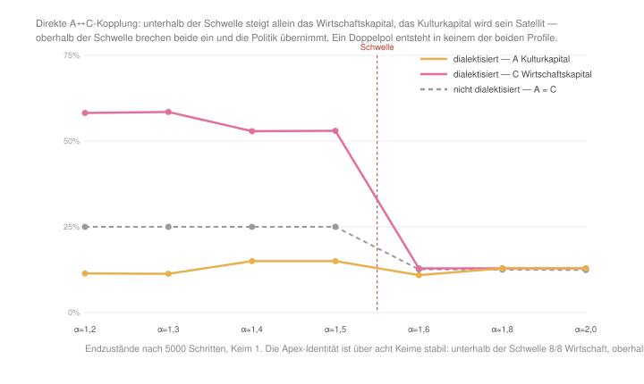
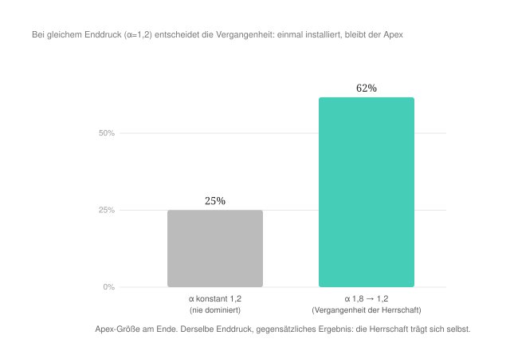
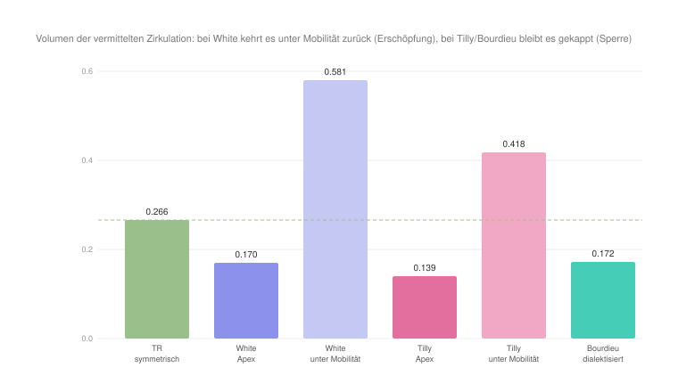

#+AUTHOR: Christian Papilloud
#+LANGUAGE: de
#+OPTIONS: toc:nil num:nil H:4 ^:nil
#+STARTUP: showall
#+LATEX_CLASS: book
#+LATEX_CLASS_OPTIONS: [11pt,a4paper]
#+CITE_EXPORT: csl chicago-author-date-de-ibid.csl
#+BIBLIOGRAPHY: Bericht.bib

* Kapitel 7 — Die Praxeosoziologie Pierre Bourdieus
:PROPERTIES:
:STATUS: DRAFT
:END:
Mit Pierre Bourdieu schließen wir unseren Vergleich der TR mit Theorierahmen ab, die fester im Kontext der relationalen Soziologie positioniert sind. Bei Bourdieu finden wir das, was White und Tilly in ihrer Auffassung der relationalen Soziologie je für sich entwickelt haben, d. h. eine relationale Produktion von Herrschaft und ihre dauerhafte Verankerung in der Gesellschaft. Dies taucht bei Bourdieu in der Form vom Machtverhältnis als der bedeutsamen Art der Relation in der Gesellschaft, die die soziale Praxis strukturiert. Die Gleichsetzung ist bei ihm ausdrücklich: Eine allgemeine ökonomische Praxiswissenschaft habe die Gesetze zu bestimmen, nach denen „die verschiedenen Arten von Kapital (oder, was auf dasselbe herauskommt, die verschiedenen Arten von Macht) gegenseitig ineinander transformiert werden“ [cite:@bourdieu1983formen 184]. Dieses Machtverhältnis entwickelt Bourdieu mit seinem Begriffswerzeug bzw. mit seiner Theorie der Kapitalarten, der sozialen Felder, des Habitus, und er macht deutlich, dass Herrschaft auf dieses Machtverhältnis generiert wird und in der Form der symbolischen Gewalt konkretisiert wird (vgl. Abschnitt 7.2).

Bourdieus entscheidender Schritt gegenüber der TR besteht in der Dialektisierung vom kulturellen Kapital (symbolisiert durch die Relationsstruktur A im digitalen Zwilling) und vom ökonomischen Kapital (symbolisiert durch die Relationsstruktur C im digitalen Zwilling). Die TR hält Kultur (A) und Wirtschaft (C) für relational entfernt, und als Relationsstrukturen sind sie in einer Relation nur durch die Vermittlung von den anderen Relationsstrukturen, die im digitalen Zwilling mit den Begriffen der Politik (B) und der Medien (D) vereinfacht bezeichnet werden. Bourdieu behandelt die Kultur als Ressource der Akteure bzw. als Kapital, das wie andere Arten von Kapital unter bestimmten Voraussetzungen ins ökonomische Kapital konvertiert werden kann. Diese Konvertierbarkeit ist bei ihm keine Eigenschaft neben anderen, sondern der Hebel der Reproduktion: „Die Tatsache der gegenseitigen Konvertierbarkeit der verschiedenen Kapitalarten ist der Ausgangspunkt für Strategien“, die das Kapital und die Position im sozialen Raum mit möglichst geringen Umwandlungskosten zu erhalten beabsichtigen [cite:@bourdieu1983formen 197]. Damit kurzschließt Bourdieu die Vermittlung von Ressource von Tätigkeitsbereichen in andere Tätigkeitsbereiche, die die TR für notwendig hält. Deshalb testen wir in diesem Kapitel, wie die These der Konvertierbarkeit von Kapitalarten im digitalen Zwilling der TR simuliert werden kann und zu welchen Feststellung sie führt.

** 7.1 Ontologische Korrespondenz und Residuum

Die vier Realtionsstrukturen der TR können als Ressourcen von Akteuren verstanden werden, und somit können sie wie die vier Kapitalarten von Bourdieu verstanden werden, die bei Bourdieu ähnlich wie in der TR den Polen des sozialen Raums bilden. A würde dann mit dem kulturellen Kapital, C mit dem ökonomischen, B mit dem symbolischen und D dem sozialen Kapital übereinstimmen. Die Akteure werden von ihrem Habitus als strukturierender und strukturierter bzw. von den inkorporierten Dispositionen geformte Struktur getrieben. Die Felder und Subfelder sind innerhalb der unterschiedlichen Relationsstrukturen verteilt, und sie werden durch die Verteilung der Kapitalarten definiert und ausdifferenziert, die die Vermittlungsinstanzen in diesen Relationsstrukturen und deren Sequenzen leisten.

Das Residuum ist hier präzise lokalisierbar. Die TR vermittelt A↔C über D und B. Bourdieu kurzschließt diese Vermittlung durch die unsichtbare Hand der Konvertibilität der Kapitalarten. Was im digitalen Zwilling als Eingriff erscheinen soll — A und C unmittelbar zu koppeln —, ist genau Bourdieus ontologische Voraussetzung. Ein zweites Residuum betrifft die symbolische Gewalt. Die Verkennung der Kriterien, die dazu beigetragen haben, die Macht zu beziehen und die Herrschaft auszuüben, bleiben von der Gesellschaft außerhalb der Elite unbekannt bzw. verkannt, weshalb die Herrschaft legitim wird und sich in Akten der symbolischen Gewalt ungestört manifestieren kann. Eine solche Erklärung hat im zirkulatorischen Modell der TR keine Entsprechung und bleibt vermerkt.

** 7.2 Theoretischer Kern

Die erste Orientierung zur Operationalisierung Bourdieus These der sozialen Ungleichheiten im digitalen Zwilling betrifft die Konvertibilität der Kapitalarten. Bourdieu fasst die Kapitalarten als ineinander überführbar. Sie können „gegenseitig ineinander transformiert werden“, wobei das ökonomische Kapital „unmittelbar und direkt in Geld konvertierbar“ und in der Form vom Eigentumsrecht institutionalisiert wird, das kulturelle Kapital unter bestimmten Bedingungen ins ökonomische Kapital konvertierbar und in der Form von Bildungstiteln institutionalisiert wird [cite:@bourdieu1983formen 184]. Das inkorporierte kulturelle Kapital ist dabei „das legitime Mittel der Vermögensübertragung schlechthin“ [cite:@bourdieu1979capital 3]. Konvertibilität und Institutionalisierung gehören zusammen. Der Markt und der Titel machen aus der Kultur eine direkt ökonomisch verwertbare Größe.

Die zweite Orientierung betrifft das Feld als relationaler Raum. Nach Bourdieu ist die soziale Welt ein Raum von Positionen, die durch ihre wechselseitigen Abstände und durch die Verteilung der Kapitalarten definiert sind. Insofern die zur Konstruktion dieses Raums herangezogenen Eigenschaften wirksam sind, lässt er sich als Kräftefeld beschreiben, das heißt als ein Ensemble objektiver Kräfteverhältnisse, die sich allen in das Feld Eintretenden als Zwang auferlegen und die weder auf die Absichten der Einzelakteure noch auf deren direkte Interaktionen zurückführbar sind [cite:@bourdieu1985raum]. Der soziale Raum ist deshalb relational definiert, was Bourdieu an der TR nähert.

Die dritte Orientierung bezieht sich auf das Habitus bzw. auf das einverleibte Prinzip der Produktion der Praxis, das die objektiven Strukturen in Dispositionen übersetzt und so die soziale Ordnung reproduziert [cite:@bourdieu1972esquisse].

Die vierte Orientierung bezieht sich auf die Herrschaft durch institutionalisierte Vermittlung. In den /Modes de domination/ unterscheidet Bourdieu die Abhängigkeit von der Herrschaft, weil „les relations de domination sont médiatisées par des mécanismes objectifs et institutionnalisés“ — durch Markt, Schule, Titel —, und genau diese vermittelte, „médiate et durable“ Aneignung die Herrschaft in den modernen Gesellschaft kennzeichnet [cite:@bourdieu1976modes 122]. Schließlich sichern die Verkennung und die Konkretisierung der Herrschaft in der symbolischen Gewalt die Legitimität der Herrschaft ab. Bourdieu bestimmt die symbolische Macht als „ce pouvoir invisible“, das sich nur mit der Komplizität derjenigen ausüben lasse, die nicht wissen wollen, dass sie es erleiden oder selbst ausüben [cite:@bourdieu1977pouvoir 405]. Sie wird insbesondere durch die Instanzen der sekundären Sozialisation und dabei insbesondere die Instanzen des Ausbildungssystem wie etwa die Schule verbreitet. Bourdieu und Passeron halten fest, die Schule könne besser als je zuvor zur Reproduktion der bestehenden Ordnung beitragen, „puisqu'elle réussit mieux que jamais à dissimuler la fonction dont elle s'acquitte“ [cite:@bourdieu1970reproduction 206]. Somit trägt die Herrschaft über die Selektions- und Sanktionsoperationen von Vermittlungsinstanzen der Felder zur Reproduktion der bestehenden Ordnung bei.

** 7.3 Operationalisierung

Tabelle [[tab:bourdieu-regler]] hält fest, welche Regler in den beiden Profilen von den Vorgaben der TR abweichen und welche Orientierung die Abweichung trägt. Alle nicht genannten Regler bleiben auf der Vorgabe der TR. Wie in den vorherigen Kapiteln lesen wir die Endzustände am eingeschwungenen Zustand nach 5000 Schritten ab und prüfen jeden Apex-Befund über acht Keime.

#+NAME: tab:bourdieu-regler
#+CAPTION: *Tabelle 1.* Die beiden Reglerprofile Bourdieus im digitalen Zwilling der TR.
| Regler (Code) | TR | dialektisiert | nicht-dialektisiert | Begründung |
|--------+-----+-------+-------+------------|
| gesetzte Ketten | — | A → C,B,D und C → A,B,D | keine | die Konvertibilität der Kapitalarten: A und C stehen einander wechselseitig voran, die Vermittlung über B und D wird übersprungen — /tragender Regler des dialektisierten Profils/ |
| Durchlässigkeit (over) | 1,0 | 1,8 | 0,6 | im dialektisierten Profil geöffnet, damit die direkte Konvertibilität überhaupt fließen kann; im nicht-dialektisierten geschlossen, weil dort die mediatisierte Distanz zwischen den Relationsstrukturen gilt |
| Konzentration zum Pol (alpha) | 1,4 | 1,6 | 1,6 | über der Schwelle, da erst dann die Dynamik der Herrschaft einsetzt; unverändert von Whites und Tillys Profilen übernommen, damit der Vergleich nicht an der Konzentration hängt |
| Akteurszirkulation (rate) | 2,2 | 1,8 | 1,8 | ebenfalls wie bei White und Tilly gesetzt, damit alle drei Profile denselben Mobilitätsboden haben |
| back, plast, decl, mig, rho, peak, cap, anchor, dynam | Vorgaben | unverändert | unverändert | in Bourdieus Rahmen nicht einschlägig; auf der Vorgabe belassen |

Im digitalen Zwilling bilden wir zwei Fälle ab, die auf ein dialektisiertes und ein nicht dialektisiertes Bourdieu-Profil basieren. Das dialektisierte Bourdieu-Profil setzt wie im Theorierahmen Bourdieus die unmittelbare Beziehung zwischen A und C. Im Schmetterlingspfad bzw. in der Kette der Relationsstruktur A steht die Sequenz C voran, und umgekehrt steht in der Kette der Relationsstruktur C die Sequenz A voran. Damit wird die Vermittlung über D und B im digitalen Zwilling nicht stattfinden und die Durchlässigkeit (over) zwischen A und C höher sein. Das nicht-dialektisierte Bourdieu-Profil verändert die Grundlagen des digitalen Zwilling nicht. Es gilt die mediatisierte Distanz zwischen Relationsstrukturen. In beiden Fällen wird die Konzentration (alpha) der Akteure in den Relationsstrukturen über die Schwelle gehoben, da erst dann die Dynamik der Herrschaft einsetzt.

** 7.4 Hypothesen

Vor dem Lauf des digitalen Zwillings formulieren wir folgende Hypothesen. /H1/ testet die Ko-Reproduktion vom kulturellen und ökonomischen Kapital bei Bourdieu bzw. deren gegenseitigen unterstützende Wirkung. Mit der Dialektisierung von A und C sollten das kulturelle und das ökonomische Kapital die Reproduktion vom relationalen Rahmen oder, in den Begriffen von Bourdieu, vom sozialen Raum erzeugen. /H2/ erlaubt, das Residuum zu prüfen, das der Theorie Bourdieus eigen ist und vom digitalen Zwilling nicht abgebildet werden kann. Da der digitale Zwilling nach dem Prinzip vom /winner-take-all/ funktioniert, sollte ein stabiler Doppelapex mit Herrschaft von A und C unmöglich sein, weil sie die relationale Ontologie der TR überschreiten würde. Die Hypothese /H3/ besagt, dass die Konvertibilität den Erhalt des kulturellen Kapitals gewährleisten sollte, oder anders gesagt: Die ökonomische Herrschaft unterstützt die Herrschaft vom kulturellen Kapital unter der Bedingung ihrer gegenseitigen unmittelbaren Konvertibilität. Mit der Hypothese /H4/ zur Hysterese wird schließlich behauptet, dass die etablierte Herrschaft reproduziert wird und somit nicht nachlässt, wenn sie einmal errichtet wurde.

** 7.5 Lauf und Ergebnisse

Der Lauf im digitalen Zwilling entscheidet H1 und H2 gegeneinander (Abbildung [[fig:bourdieu-koreproduktion]]). H2 wird bestätigt: Ein stabiler Doppelapex des kulturellen und des ökonomischen Kapitals entsteht in keiner der beiden Konfigurationen und bei keinem Konzentrationsdruck. H1 wird dagegen nicht bloß unbestätigt, sondern in die Gegenrichtung entschieden — und zwar gerade in dem Szenario, das Bourdieus Prämisse am genauesten abbildet.

Ohne Dialektisierung verhalten sich das kulturelle und das ökonomische Kapital unterhalb der Schwelle gleich. Beide bleiben bei etwa 25 %, der relationale Raum ist symmetrisch und keine Relationsstruktur herrscht. Mit der Dialektisierung trennen sie sich sofort. Das ökonomische Kapital steigt auf 53 bis 58 %, das kulturelle Kapital fällt auf 11 bis 15 % und wird sein Satellit. Die direkte Konvertibilität erzeugt also keine Ko-Reproduktion, sondern eine Subordination, und sie arbeitet einseitig zugunsten des ökonomischen Kapitals. Über acht Keime hinweg ist dieser Befund unverändert: Bei alpha 1,4 stellt in allen acht Läufen die Wirtschaft den Apex.

Oberhalb der Schwelle greift das /winner-take-all/ Prinzip der TR, und beide Relationsstrukturen brechen gemeinsam auf etwa 13 % ein. Der Apex fällt dann jedoch weder an das kulturelle noch an das ökonomische Kapital, sondern an die Politik (B) in beiden Profilen und in allen acht Keimen mit 61 bis 63 %. Das kulturelle und das ökonomische Kapital steigen im digitalen Zwilling also nie gemeinsam, weil sie damit die relationale Ontologie der TR überschreiten würden. Sobald der Konzentrationsdruck hoch genug ist, steigt sogar keines von beiden. Dieser Befund ist der bemerkenswerteste in diesem Kapitel, und wir kommen im Abschnitt 7.7 auf ihn zurück.

#+NAME: fig:bourdieu-koreproduktion
#+CAPTION: *Abbildung 1.* Auch bei direkter A↔C-Kopplung steigen das kulturelle und das ökonomische Kapital nie gemeinsam zum Doppelapex.

Unsere Hypothese H3 wird bestätigt, aber in einer Art und Weise, die wir vor dem Lauf nicht erwartet hatten. Sie lässt sich an der inneren Reziprozität der Relationsstrukturen ablesen, also daran, ob eine Relationsstruktur als kohärentes Gebilde erhalten bleibt oder in sich zerfällt.

Zunächst ist es die Konvertibilität selbst, die die Herrschaft des ökonomischen Kapitals überhaupt erst herstellt. Unterhalb der Schwelle und ohne Dialektisierung bleibt der relationale Raum im digitalen Zwilling symmetrisch. Alle vier Relationsstrukturen halten eine innere Reziprozität von 1,00 und keine herrscht. Mit der Dialektisierung entsteht der Wirtschafts-Apex und mit ihm eine Rangordnung der Kohärenzen. Die Wirtschaft hält bei 0,92, die Kultur fällt auf 0,43, Politik und Medien liegen bei 0,45 und 0,73. Das kulturelle Kapital verliert also die Hälfte seiner inneren Kohärenz, bleibt aber ein zusammenhängendes Gebilde. Es besteht als untergeordnetes und gerade dadurch verwertbares Kapital weiter. Die Kultur ist hier das legitime Mittel der Vermögensübertragung, von dem Bourdieu spricht [cite:@bourdieu1979capital 3].

Oberhalb der Schwelle kippt dieses Verhältnis. Sobald die Politik den Apex übernimmt, zerfällt das kulturelle Kapital. Seine innere Reziprozität sinkt auf 0,23, und diejenige der Wirtschaft sinkt auf 0,32, während die Politik bei 0,94 bleibt. Die Konvertibilität hilft dort nicht mehr. Ohne sie liegt die Kultur mit 0,28 sogar geringfügig höher. Das ist der Kern des Befundes: Die Konvertibilität der Kapitalarten erhält das kulturelle Kapital nur so lange, wie das ökonomische Kapital herrscht und wie das kulturelle Kapital dem ökonomischen Kapital untergeordnet verbleibt. Verlagert sich die Herrschaft auf die Politik, dann verliert das kulturelle Kapital seine eigene Kohärenz, ohne dass die Konvertibilität etwas daran ändert.

Dies entspricht Bourdieus Bild der Produktion und Reproduktion von sozialen Ungleichheiten genauer, als unsere Hypothese es vorgesehen hatte. Das kulturelle Kapital ist nicht ein zweiter Pol neben dem ökonomischen, sondern die Konvertibilitätsform, durch die das ökonomische Kapital die Herrschaft etabliert und reproduziert. Es bleibt erhalten, weil es gebraucht wird, und es zerfällt, sobald eine andere Relationsstruktur die Legitimation übernimmt.

H4 wird ebenfalls und deutlich bestätigt (Abbildung [[fig:bourdieu-hysterese]]). Wenn die Konzentration der Akteure in den Relationsstrukturen zunächst hoch und dann niedriger gesetzt wird (1,8 → 1,2), dann bleibt das ökonomische Kapital als Apex bestehen (61 %), während dieselbe niedrige Konzentration der Akteure in Relationsstrukturen ohne vergangene etablierte Herrschaft den digitalen Zwilling zur Symmetrie bringt (Apex 25 %). Oder anders gesagt: Wenn die Herrschaft etabliert ist, dann reproduziert sie sich selbst, und sie widersteht die Schrumpfung der Bedingungen, darunter sie entwickelt wurde. Diese Hysterese bildet der digitale Zwilling ab, die zur strukturellen Reproduktion des sozialen Raum führt.

#+NAME: fig:bourdieu-hysterese
#+CAPTION: *Abbildung 2.* Hysterese: Die Herrschaft ist ein Geschichtsprodukt. Einmal installiert, wird sie reproduziert.

** 7.6 Robustheit

Die Befunde sind über die Keime stabil. Zwei Punkte müssen jedoch festgehalten werden, von denen sich der erste im Lauf der Prüfung als Befund und nicht als Vorbehalt erwiesen hat.

Erstens hatten wir den Politik-Apex zunächst für ein Artefakt gehalten bzw. für einen Bias in der Initialisierung des digitalen Zwillings. Das dialektisierte Profil hatten wir sogar gebildet, um diesen Bias auszuschalten. Die Messungen widerlegen jedoch diese Vermutung. Der Politik-Apex tritt oberhalb der Schwelle in beiden Profilen auf. Die Dialektisierung beseitigt ihn also nicht, und er bleibt über acht Keime hinweg unverändert. Vor allem aber gewinnt unterhalb der Schwelle im dialektisierten Profil in allen acht Keimen die Wirtschaft. Gäbe es einen strukturellen Vorzug der Relationsstruktur /Politik/, dann könnte die Wirtschaft nie gewinnen. Welche Relationsstruktur den Apex bildet, hängt demnach nicht an einer Voreinstellung des digitalen Zwillings, sondern am Konzentrationsdruck. Der Politik-Apex ist folglich kein Vorbehalt gegen den Befund, sondern der Befund selbst, und wir behandeln ihn im Abschnitt 7.7 als solchen.

Zweitens ist die Hysterese ein Produkt aus dem selbstverstärkenden relationalen Raum der TR (die Großen wachsen). Dies bedeutet, dass die Reproduktion, davon Bourdieu spricht, als Pfadabhängigkeit im digitalen Zwilling abgebildet wird. Die Reproduktion ist dann nicht das bloße Ergebnis aus der Verstärkung von Relationsstrukturen.

** 7.7 Lesart. Die gekaperte Vermittlung

Der Befund, dass oberhalb der Schwelle nicht das ökonomische, sondern das politische Feld den Apex bildet, ist die Stelle, an der der digitale Zwilling etwas sichtbar macht, was Bourdieus Theorierahmen voraussetzt, ohne es auszusprechen.

Bourdieu beschreibt die Konvertibilität der Kapitalarten als eine Operation zwischen den Kapitalarten selbst. Sie stellt eine Art unsichtbarer Hand des sozialen Raums dar. Im digitalen Zwilling zeigt sich, dass diese Operation nicht von allein durchgeführt werden kann. Solange der Konzentrationsdruck niedrig bleibt, gelingt die direkte Umwandlung von kulturellem ins ökonomische Kapital und die Wirtschaft wird zum Apex. Sobald der Druck steigt und die Herrschaft sich verfestigt, bricht die Wirtschaft gemeinsam mit der Kultur ein, und den Apex übernimmt die Politik.

Das lässt sich in Bourdieus eigenen Begriffen lesen, und es macht in seinem Rahmen Sinn. Eine Konvertierung von Kapital ist keine bloße Umrechnung, sondern ein Akt, der als legitim gelten muss, damit er wirkt. Ein Bildungstitel zählt nicht deshalb als Vermögen, weil jemand ihn dafür hält, sondern weil eine Instanz ihn beglaubigt und damit Rechte verbindet, die dann für den Akteur gelten, der diesen Titel erworben hat. Genau diese Beglaubigung leistet in Bourdieus Theorie das politische Feld mit seinen Vermittlungsinstanzen und seinen Konsekrationsoperationen. Bourdieu hat diesen Gedanken in seiner Analyse des bürokratischen Feldes ausgeführt. Er fragt dort, wer die Gültigkeit einer Bescheinigung bescheinigt, und zeigt, dass die Antwort in einen unendlichen Regress führt. Wer beglaubigt denjenigen, der die Lizenz zum Beglaubigen erteilt hat? Irgendwo muss man anhalten, und dem letzten oder ersten Glied dieser langen Kette offizieller Konsekrationsakte gibt Bourdieu den Namen Staat. Dieser garantiere, „agissant à la façon d'une banque de capital symbolique, [...] tous les actes d'autorité“ [cite:@bourdieu1993esprit 57]. Es bestätigt die Herrschaft der herrschenden Klassen, indem es die Umwandlungen anerkennt, die sie vornehmen. Die Politik steht bei der Konvertibilität also ständig im Hintergrund als deren stillschweigend vorausgesetzte Legitimationsinstanz. Der digitale Zwilling holt diese Voraussetzung aus dem Hintergrund und bringt sie in den Vordergrund. Wenn die Konvertibilität stark beansprucht wird, dann wird nicht die Kapitalart mächtig, die konvertiert wird, sondern die Instanz, die die Konvertierung beglaubigt. David Swartz hat diese Figur in Bourdieus späterem Werk als eigene Kapitalart herausgearbeitet. Das staatliche Kapital sei eine Art /Meta-Kapital/, denn „it exercises power over other forms of capital and particularly over their exchange rate“ [cite:@swartz1997culture 139]. Damit ist genau die Größe benannt, die der digitale Zwilling in diesem Kapitel bewegt: Die Umtauschrate zwischen den Kapitalarten ist das, was das dialektisierte Profil setzt, und die Instanz, die über sie verfügt, ist das, was oberhalb der Schwelle den Apex bildet. Damit ist auch gesagt, warum wir den Politik-Apex nicht als Störung behandeln. Er ist die Konsequenz aus Bourdieus eigener Voraussetzung, die unter den Bedingungen der TR abgebildet wird.

Auf der dreistufigen Skala der sozialen Ungleichheiten ist Bourdieus soziale Ungleichheit eine transversale soziale Ungleichheit mit voller Kaskade bzw. mit entsprechender Wirkung auf der drei Ebenen des digitalen Zwillings (Relationsstrukturen, Sequenzen und Sequenzfragmente, Akteurkategorien). Durch die Hysterese wird diese soziale Ungleichheit auf allen drei Ebenen so verriegelt, dass sie nicht mehr gelöst werden kann.

Hier lässt sich die Frage nach der Vermittlung, die wir im Tillys Kapitel zu den dauerhaften sozialen Ungleichheiten behandelt haben, zum Ende entwickelt. Wenn wir das Volumen der vermittelten Zirkulation fokussieren (crossOff), dann merken wir, dass im symmetrischen Zustand des digitalen Zwillings die Vermittlung vollständig wirksam ist (0,264). Unter Herrschaft sinkt sie sowohl bei Tilly, also auch bei Bourdieu, selbst wenn sie nicht in der selben Art und Weise sinkt. Bei Tilly fällt sie tief (0,126) und bleibt selbst unter wieder Belebung der Mobilität von Akteuren geschrumpft (0,417). Bei Bourdieu bleibt sie höher (0,160), und gerade dieses Ergebnis ist interessant. Denn es sagt, wie in den jeweiligen Theorierahmen die Vermittlung zerfällt. Bei Tilly wird die Vermittlung abgeschlossen, weil die Gelegenheitshortung die kategoriale Grenze verriegelt und die betreffenden Ressourcen unter das Monopol der begünstigten Kategorie stellt. Die Zirkulation fällt entsprechend am tiefsten, weil es buchstäblich um die Sperrung des Zugangs über diese Grenze geht. Bei Bourdieu sieht man, dass die Vermittlung nicht ständig abgeschlossen wird, sondern sie wird geschwächt. Die Zirkulation zirkuliert weiter, weshalb wir ein höheres crossOff haben, was voraussetzt, dass die Zirkulation in eine private Media — die direkte A↔C-Konvertibilität — umgeleitet wird, die die öffentliche Vermittlung kurzschließt.

Oder anders gesagt: Im Theorierahmen von Bourdieu verriegeln die Herrschenden nicht das Tor zum Rest der Gesellschaft, sondern sie verschaffen sich einen eigenen Raum, und sie machen es mit der Unterstützung der Vermittlungsinstanzen. In Bourdieus Theorie konvertieren die Vermittlungsinstanzen und beispielhaft die Instanzen des Ausbildungssystems das vererbte kulturelle Kapital in legitimen Vorteilen (etwa in Rechten), und diese Konversion reproduziert die Klassenherrschaft [cite:@bourdieu1983formen; @bourdieu1976modes 122]. Die Sperre ist somit legitimiert: Die symbolische Gewalt, die Dialektik der Anerkennung/Verkennung machen den Raum der Herrschenden für den Rest der Gesellschaft unsichtbar und unbewusst [cite:@bourdieu1977pouvoir 405; @bourdieu1970reproduction 206]. Im Unterschied von Tilly braucht dann Bourdieu die Verkennung als nicht materielles bzw. als symbolisches Schliessungsmechanismus, damit der private Raum der Elite als ein Raum unter anderen erscheint.

#+NAME: fig:mediation-kappung
#+CAPTION: *Abbildung 3.* Vermittlung unter Herrschaft (crossOff): Bei White kehrt die Zirkulation unter Mobilität zurück (Erschöpfung), bei Tilly bleibt sie am tiefsten gekappt (Schließung), bei Bourdieu ist sie höher, weil sie umgeleitet statt versperrt wird.

Tilly wie Bourdieu sprechen also von dauerhaften sozialen Ungleichheiten. Aber hier auch verändert sich die Bedeutung von /dauerhaft/ je nachdem, was der Theorierahmen beider Autoren voraussetzt. Bei Tilly wird die Dauer in der Kategorie verankert. Bourdieu verortet sie in den gesellschaftlichen Institutionen und im Habitus. Nichtsdestotrotz können beide Autoren festhalten, dass einmal etabliert die Herrschaft nicht mehr abgeschafft werden kann, weil sie sich von den Bedingungen löst, die zu ihrer Entstehung geführt haben. Für Bourdieu ist diese Stärke der Reproduktionsthese allerdings von Anfang an umstritten gewesen. Swartz fasst die Einwände dahin zusammen, dass der starke Reproduktionsakzent besonders in /La reproduction/ Situationen der Krise und der Veränderung „does not sufficiently anticipate“ [cite:@swartz1997culture 212], und er führt die Schwierigkeit auf die zentrale Rolle des Habitus zurück, der die Handlung auf die Interessen der in ihm einverleibten Kapitalarten zurückführe und deshalb Neuerung schwer erklärbar mache.

** 7.8 Entwicklungslinien

Einmal in den digitalen Zwilling der TR überführt, zeigt sich Bourdieus Theorierahmen an der Schnittstelle zwischen Whites und Tillys Theorierahmen. Er vereint die relationale Produktion der Herrschaft (White) und ihre Dauerhaftigkeit (Tilly), und er fügt das hinzu, was wir bei White und Tilly nicht finden. Es ist die Theorie der Konvertibilität der Kapitalarten, die die Vermittlung schwächt, und eine Theorie der Verkennung, die eine solche schwache Vermittlung und somit sowohl die Konvertibilität der Kapitalarten als auch die Reproduktion der Herrschaft privilegierter Klassen legitimiert. Der digitale Zwilling verdeutlicht Bourdieus Ansatz, selbst wenn er auch seine Grenzen zeigt: Die Reproduktion der Kapitalarten, der (Klassen)Habitus und der Vermittlungsinstanzen ist im /winner-take-all/ Zustand bzw. im Laufe der Satellisierung kein stabiler Zustand. Die magische Operation der Invisibilisierung des speziellen Raumes der Herrschenden unterstützt Bourdieus Reproduktionsansatz insofern, als sie die Dauerhaftigkeit des herrschenden Apex postuliert, die mit der Annahme verbunden ist, dass einmal etabliert die Herrschaft der herrschenden Klassen nie gestört wird.

Im Theorierahmen der TR wird eine solche starke Annahme nicht unterstützt, sondern relativiert. Zwar kann man mit Bourdieu von der Konvertibilität der Kapitalarten sprechen, aber man muss diese Konvertibilität nicht als eine notwendige, sondern als eine mögliche Kurzschließung der Vermittlungsoperationen von Vermittlungsinstanzen in Sequenzen von Relationsstrukturen und in diesen Relationsstrukturen auffassen. Dies ändert die Begründung der Dauerhaftigkeit von sozialen Ungleichheiten insofern, als diese sozialen Ungleichheiten nicht mit dem erreichten stabilen Zustand der sozialen Herrschaft von herrschenden Klassen verharren, sondern sich dynamisch im Laufe der wechselseitigen Satellisierung von Relationsstrukturen erneut konstituieren und ebenfalls erneut verbreitet werden. Diese Ko-Konstitution von sozialen Ungleichheiten in einem relationalen Raum mit wechselnden Apex ähnelt der Auffassung von sozialen Ungleichheiten, die wir im Kontext der Intersektionalitätsforschung finden, zu der wir jetzt kommen.

** Literatur
#+print_bibliography:
