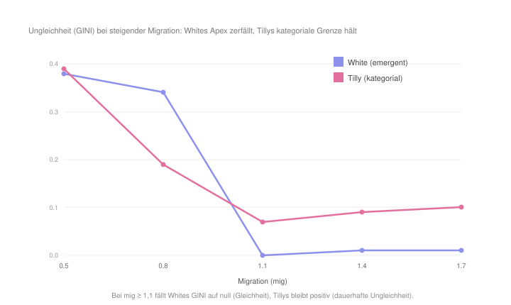
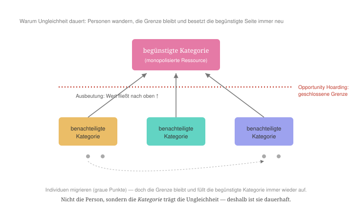

#+AUTHOR: Christian Papilloud
#+LANGUAGE: de
#+OPTIONS: toc:nil num:nil H:4 ^:nil
#+STARTUP: showall
#+LATEX_CLASS: book
#+LATEX_CLASS_OPTIONS: [11pt,a4paper]
#+CITE_EXPORT: csl chicago-author-date-de.csl
#+BIBLIOGRAPHY: Bericht.bib

* Kapitel 7 — Relationale Ungleichheit: Charles Tilly
:PROPERTIES:
:STATUS: DRAFT
:END:
Charles Tilly stand Harrison White persönlich wie theoretisch nahe, und seine Theorie der dauerhaften Ungleichheit ist in einem kritischen Gespräch mit White entstanden. Beide teilen die relationale Ausgangslage in Bezug auf die Frage der sozialen Ungleichheiten: Ungleichheit ist nicht in den Personen, sondern in den Beziehungen zu suchen. Doch wo White die Ungleichheit als emergentes Nebenprodukt der Kontrollsuche auf gehaltlosen bzw. leeren Positionen versteht, sucht Tilly die Mechanismen, die Ungleichheit dauerhaft machen. Anschließend verankert Tilly die sozialen Ungleichheiten nicht in gehaltlosen Positionen, sondern in gehaltvollen, gepaarten und ungleichen Kategorien. In diesem Kapitel wird Tillys Verständnis von sozialen Ungleichheiten im digitalen Zwilling der TR übernommen. Seine Mechanismen werden geprüft und mit Whites Auffassung der sozialen Ungleichheiten verglichen. Dabei verlaufen wir nach den sieben Schritten, wie wir bis jetzt am Beispiel der anderen Theorierahmen verlaufen sind.

** 7.1 Ontologische Korrespondenz und Residuum
Die vier Relationsstrukturen des digitalen Zwillings entsprechen bei Tilly vier gepaarten, ungleichen Kategorien wie etwa der Linie zwischen einer Elite und ihren Außenseitern. Anders als Whites Begriff der Positionen, haben diese Kategorien bei Tilly einen Gehalt. Sie können nicht ausgetauscht werden. Die Akteure der TR entsprechen Tillys Mitgliedern von Netzwerken, die nach Kategorien sortiert sind. Die Ketten bzw. die immanente Strukturierung der Relationsstrukturen im digitalen Zwilling entsprechen den organisatorischen Grenzen, an denen bei Tilly innere und äußere Kategorien aufeinander abgebildet werden. Das Residuum aus der Ungleichheitstheorie Tillys, das der digitale Zwilling nicht abbilden kann, bezieht sich auf den Ursprung der äußeren Kategorien. Diese Kategorien werden aus der Gesellschaft importiert und sind dem digitalen Zwilling exogen. Deshalb kann der digitale Zwilling eine Kategorie verorten, aber er kann nicht erklären, woher sie kommt bzw. wieso sie sich dort befindet, wo sie sich befindet. Zum anderen aber — und dies ist der entscheidende Befund aus dem digitalen Zwilling — wird jenes Rest-Gefälle, das im Kapitel zu White die strukturelle Äquivalenz der Positionen irritierte, zur Ressource: Dass die Strukturen des digitalen Zwillings gehaltvoll sind und entsprechend nicht restlos ausgewechselt werden können, ist genau das, was Tilly behauptet. Der Gehalt, der bei White als Grenzfall erschien, ist bei Tilly der eigentliche Gegenstand.

** 7.2 Theoretischer Kern

Die erste Orientierung betrifft Tillys relationale, anti-essentialistische Grundannahme. Tilly lehnt es ab, Ungleichheit aus den Eigenschaften der Personen wie etwa aus ihrem Talent, ihrem Fleiß, ihren Einstellungen abzleiten. Solche Erklärungen kreisen um „self-propelling essences (individuals, groups, or societies)“ und um den methodologischen Individualismus, dem er die relationale Sicht entgegensetzt [cite:@tilly1998durable 17]. Selbst persönliche Überzeugungen, wie man sie etwa im Rassismus, im Sexismus, in der Fremdenfeindlichkeit finden kann, zwar verstärken die Ungleichheiten, aber sie produzieren sie nicht. Die Wurzel der sozialen Ungleichheiten liegt in den gesellschaftlichen Mechanismen, nicht in den Köpfen von Menschen [cite:@tilly1998durable 15]. Ungleichheit ist demzufolge ein Verhältnis zwischen Kategorien, kein Aggregat individueller Unterschiede [cite:@tilly2000relational 782].

Die zweite Orientierung bezieht sich auf zwei etablierten Mechanismen. Der erste Mechanismus ist die Ausbeutung. Sie wirkt, „when powerful, connected people command resources from which they draw significantly increased returns by coordinating the effort of outsiders whom they exclude from the full value added by that effort“ [cite:@tilly1998durable 10]. Der zweite Mechanismus ist das Hortung von Gelegenheiten (opportunity hoarding), der wirkt, „when members of a categorically bounded network acquire access to a resource that is valuable, renewable, subject to monopoly“ [cite:@tilly1998durable 10]. Die Ausbeutung führt zur Entwertung der Außenseiter. Die Gelegenheitshortung schließt ihnen den Zugang zu Netzwerken. Beide zusammen etablieren die kategoriale Ungleichheit.

Die dritte Orientierung berücksichtigt zwei verallgemeinernden Mechanismen. Der erste Mechanismus ist die Nachahmung (emulation) bzw. „the copying of established organizational models and/or the transplanting of existing social relations from one setting to another“ (ebd.). Der zweite Mechanismus ist die Anpassung (adaptation) als „the elaboration of daily routines“ um bestehende Kategorien (ebd.). Tilly fasst das Ineinandergreifen der vier Mechanismen wie folgt zusammen: Die Ausbeutung und das Gelegenheitshortung begünstigen „the installation of categorical inequality, while emulation and adaptation generalize its influence“ [cite:@tilly1998durable 13].

Die vierte Orientierung betrifft das Geheimnis der Dauerhaftigkeit, damit Tilly die Abbildung der inneren auf die äußeren Kategorien meint. Die sozialen Ungleichheiten werden zu dauerhaften Ungleichheiten, wenn eine äußere Kategorie (eine breite gesellschaftliche Grenze wie Geschlecht oder Herkunft) auf eine innere Kategorie bzw. eine Kategorie innerhalb von Organisationen der Gesellschaft (Leitung/Belegschaft, Offizier/Mannschaft) abgebildet wird [cite:@tilly1998durable 75]. Die reine äußere Ungleichheit bleibt instabil und ruft Widerstand hervor. Die Verschränkung mit inneren Grenzen verankert sie: „These inequalities rest on interior paired categories“ [cite:@tilly1998durable 80]. Genau diese Verschränkung und nicht die bloße Existenz von einer Kategorie macht die Ungleichheit dauerhaft, und genau dies prüfen wir im digitalen Zwilling.

** 7.3 Operationalisierung
Die vier Orientierungen überführen wir in den digitalen Zwilling wie folgt. Die Kategorien der Ausbeutung und der Gelegenheitshortung erhöhen die Konzentration zum herrschenden Pol (alpha) auf 1,6. Über die Ketten der Relationsstrukturen werden soziale Ungleichheiten etabliert, daraus eine kategoriale Grenze zwischen den Außenseiter und Elite entsteht, die zum Vorteil der Elite kommt. Die Hortung als Monopol senkt die Durchlässigkeit zwischen Relationsstrukturen (over) auf 0,6 und schließt somit den Zugang zur Elite. Die Nachahmung und die Anpassung verankern die kategorialen Ungleichheiten auf zwei Wegen. Erstens legt das Profil alle vier Ketten fest. Im digitalen Zwilling ist damit die Plastizität der Ketten außer Kraft gesetzt, denn der Simulator überspringt die Neuorientierung der inneren Ordnung für jede Struktur, deren Kette ein Profil vorgibt. Die kategoriale Grenze ist also nicht bloß schwer verformbar, sondern der inneren Reorganisation überhaupt entzogen — eine stärkere Starrheit, als ein niedrig gesetzter Regler sie ergäbe; der im Profil mitgeführte Wert (plast=0,2) bleibt aus eben diesem Grund ohne Wirkung. Zweitens hält ein geringer Verfall (decl=0,25) die einmal bezogenen Positionen. So bildet der digitale Zwilling eine Situation ab, in der selbst die Routinen die kategoriale Grenze nicht erodieren lassen. Mit dieser Operationalisierung erhalten wir das Gegenstück zu Whites Theorierahmen. Bei White hatten wir im digitalen Zwilling dieselbe Konzentration als bei Tilly, aber wir hatten keine kategoriale Grenze, eine offene Durchlässigkeit zwischen Relationsstrukturen und keine Verankerung von kategorialen Ungleichheiten, wie es bei Tilly mit den Kategorien der Ausbeutung und der Gelegenheitshortung geschieht. Oder anders gesagt: Die Überführung Whites Theorierahmen in den digitalen Zwilling ergibt einen Apex, der unabhängig von der Etablierung kategorialer Ungleichheiten ausgebildet wird.

** 7.4 Vorregistrierte Hypothesen
wir formulieren eine erste Hypothese /H1, die/ besagt, dass wie bei White Tillys Theorierahmen der dauerhaften sozialen Ungleichheiten zu einer Herrschaft münden sollte bzw.  denselben Apex erzeugen sollte, wie dies bei White mit seinem Kontrolle-Ansatz geschieht. Eine zweite Hypothese /H2 zur sozialen Mobilität kann ebenfalls formuliert werden, danach bei Tilly die dauerhaften sozialen Ungleichheiten die soziale Mobilität verhindern./ Mit dieser Hypothese wollen wir wissen, ob sich Tilly von White unterscheidet. In unserer Untersuchung Whites Theorierahmen haben wir festgestellt, dass der emergente Apex, den die Theorie erzeugt, unter steigender Migration zerfallen soll. Tillys kategorial etablierter Apex hingegen sollte /bestehen bleiben/ und an die kategoriellen Ungleichheiten /gebunden/ bleiben. /Mit einer letzten Hypothese H3 wollen wir ebenfalls das Argument von Tilly zu gehaltvollen Positionen testen, die ihn von White unterscheiden, der einen Begriff der Position vorschlagt, der leer von jeglichen Inhalt ist./ Das Residuum Whites bzw. die strukturelle Äquivalenz der Positionen sollte hier in der Form der gepaarten, ungleichen Kategorie Tillys auftauchen und vom digitalen Zwilling abgebildet werden können.

** 7.5 Lauf und Ergebnisse
Der Lauf des digitalen Zwillings bestätigt unsere Hypothese H1. Tillys Profil erzeugt wie Whites Kontrolle einen einzigen Apex, d. h. dass Tillys Auffassung der dauerhaften Ungleichheiten tatsächlich zur Herrschaft führt, wie bei White die Suche nach Kontrolle in einer Herrschaft gipfelt, die nicht geplant oder gewollt wurde. Die zweite Hypothese H2 wird ebenfalls bestätigt (vgl. Abbildung [[fig:tilly-durabilitaet]]). Mit White haben wir gesehen, dass wenn wir im digitalen Zwilling die Migration steigen lässt, dann /zerfällt/ Whites Apex. Bei mig ≥ 1,1 sinkt die Ungleichheit auf null, die Struktur wird wieder symmetrisch, und welche Struktur eben noch dominierte, wechselt sogar zufällig. Tillys Apex hingegen /hält/. Die Ungleichheit bleibt positiv (GINI um 0,09 statt 0,00) und bleibt an der ungleichen Kategorie gebunden. Die Mobilität, die Whites emergente Ungleichheit schrumpfen lässt, hat nur einen sehr kleinen Einfluss auf Tillys kategoriale Ungleichheit, die nur leicht schrumpft. Mit der Bestätigung von H2 bestätigen wir ebenfalls unsere Hypothese H3. Weil Tillys gehaltvolle Positionen voraussetzt, und weil solche Positionen nicht austauschbar sind bze. von bestimmten Akteuren bezogen werden, hält die kategorielle Ungleichheit in der Gesellschaft und durch die Etablierung von einer solchen Ungleichheit hält sie lange.

#+NAME: fig:tilly-durabilitaet
#+CAPTION: Unter steigender Mobilität fällt Whites GINI auf null (die Ungleichheit verschwindet), während Tillys positiv bleibt: Die kategoriale Grenze hält, wenn sie bei White zerfällt.

** 7.6 Robustheit
Unser Befund bleibt über Läufe mit Zufallskeimen stabil. Etwa bei starker Mobilität (mig 1,4) über fünf zufällige Keime hinweg zerfällt Whites Apex (GINI ≈ 0,01), wenn Tillys Apex hält (GINI ≈ 0,09). Jedoch müssen zwei Einschränkungen benannt werden, die im Lauf der Testen aufgetaucht sind. Wie wir es oben erwähnt haben, mindert eine wachsende Mobilität auch Tillys sozialer Ungleichheiten (der GINI fällt von 0,39 auf 0,09). Oder anders gesagt: wenn wir von dauerhaften sozialen Ungleichheiten sprechen, setzt dies nicht voraus, dass sich diese Ungleichheiten nicht verändern. Zweitens führen nicht alle strukturelle Kategorien zum Apex, sondern nur die strukturell bedeutsamsten Kategorien wie etwa Geschlechtermerkmale, Alters- oder auch noch Ethniemerkmale. Strukturell schwache Kategorien tun es nicht, oder wie es Tilly selbst sagt: Eine soziale Ungleichheit wird erst dann dauerhaft, wenn die äußere Kategorie strukturell schwer genug wiegt und mit einer tragenden Grenze innerhalb von einer Organisation zusammenfällt [cite:@tilly1998durable 79 f.].

** 7.7 Lesart. Der aufrechterhaltene kategoriale Mechanismus
Der Kern Tillys Auffassung von dauerhaften Ungleichheiten lässt sich an einem einzigen Bild zusammenfassen (vgl. Abbildung [[fig:tilly-mechanismus]]). Nehmen wir zwei Kategorien vor. Eine Kategorie bezeichnet die Elite, und die andere Kategorie bezeichnet ihre Außenseiter. Beide Kategorien sind durch eine Grenze voneinander getrennt. An dieser Grenze laufen stets zwei Operationen ab. Die erste Operation ist die /Ausbeutung/: Die Außenseiter leisten eine Arbeit, deren Mehrwert zur Elite geht bzw. deren Mehrwert sie nicht beziehen. Die zweite Operation ist die /Gelegenheitshortung/: Die Elite hält die wertvolle Ressource unter Verschluss, als Monopol, und versperrt den Außenseitern den Zugang zu dieser Ressource. Diese beiden Operationen geschehen nicht ein einziges Mal, sondern sie werden immer wieder produziert, was dazu führt, dass die sozialen Ungleichheiten aufrecht erhalten werden.

Die Dauerhaftigkeit von sozialen Ungleichheiten wird sogar dadurch verstärkt, dass beide Operationen die Grenze zwischen Kategorien und nicht die Akteure betreffen. Somit übersteht die soziale Ungleichheit den Wechsel der Akteure im Laufe der Zeit. Einzelne Akteure können aufsteigen, abwandern, ersetzt werden, aber die Grenze bleibt und trennt die Akteure weiter ungleichmäßig. Diesen Mechanismus hebt der digitale Zwilling hervor. Im Tillys Reglerprofil füttern die Außenseiter über die kategoriale Grenze die Elite ständig, weshalb der Apex hält, wenn die Akteure abwandern. Die Nachahmung verbreitet diese Grenze auf weitere Kontexte bzw. Tätigkeitsbereichen in den Sequenzen und in den Relationsstrukturen. Die Anpassung verfestigt sie in den alltäglichen Routinen. Beide tragen somit dazu bei, den aufgerichteten Mechanismus der dauerhaften sozialen Ungleichheiten weiter zu entwickeln. Am dauerhaftesten wird die Ungleichheit, wenn die innere Grenze (etwa die Grenze zwischen Leitung und Belegschaft in einer Firma) mit einer äußeren Kategorie (etwa die Kategorie Geschlecht oder die Kategorie Herkunft) zusammenfällt, weil sie dann zugleich strukturell verankert wird und wie ein Naturgesetz wirkt bzw. als natürlich und selbstverständlich wahrgenommen wird [cite:@tilly1998durable 75, 80].

#+NAME: fig:tilly-mechanismus
#+CAPTION: Die Ausbeutung lässt den Wert nach oben fließen, die Gelegenheitshortung schließt die Grenze. Die Personen wandern, aber die Grenze bleibt.

Eine Erörterung, die die dreistufigen bzw. transversalen, horizontalen und vertikalen Ungleichheiten betrifft, schärft die Lesart von H1. Misst man die transversale Ungleichheit (zwischen den Relationsstrukturen), die horizontale Ungleichheit (zwischen den Sequenzen) und die vertikale Ungleichheit (zwischen den Akteurkategorien) getrennt voneinander, dann wird ersichtlich, dass Tillys Apex nicht auf dieselbe Ebene der Ungleichheiten wie Whites Apex liegt. Whites Kontrolle erzeugt einen Apex mit einer starken transversalen Ungleichheit. Im digitalen Zwilling herrscht eine Relationsstruktur über die anderen (GINI 0,36). Tillys Apex dagegen lässt die Relationsstrukturen nahezu gleich (die transversale Ungleichheit liegt bei 0,03). Aber er erzeugt eine hohe horizontale Ungleichheit (0,15), die sich gleichmäßig in allen Strukturen durchsetzt. Selbst unter der Bedingung der Mobilität der Akteure bleibt sie erhalten. Dies bedeutet, dass im Kontrast zu White Tillys Herrschaftsauffassung ist mit einer Auffassung von horizontalen Ungleichheiten bzw. Ungleichheiten zwischen Sequenzen von Relationsstrukturen verbunden. Dies widerlegt H1 nicht, sondern ergibt eine verfeinerte Deutung von dieser Hypothese: Tilly und White teilen zwar den Ansatz einer relationalen Erzeugung von sozialen Ungleichheiten, aber sie sehen der Auslöser von sozialen Ungleichheiten an unterschiedlichen Stellen. Bei White entstehen sozialen Ungleichheiten auf der Ebene der Konkurrenz zwischen Positionen bzw. in den Begriffen der TR auf der Ebene von Relationsstrukturen. Bei Tilly entwickeln sie sich ab der Ebene der unterschiedlichen Tätigkeitsbereichen in Verbindung mit den Institutionen und Organisation in diesen Bereichen, die diese Ungleichheiten verfestigen und dauerhaft etablieren können.

Wie der digitale Zwilling nahelegt, stellt die Mobilität der Akteure die Bedingung dar, die die beiden Lesarten trennt. Unter der Bedingung der sozialen Mobilität von Akteuren besteht die im Sinne von einem relationalen Ansatz gedeutete soziale Ungleichheit nur dann, wenn sie an einer bedeutsamen strukturellen Kategorie gebunden und in den unterschiedlichen Tätigkeitsbereichen von einer Gesellschaft durch die Vermittlungsinstanzen von diesen Bereichen verbreitet werden kann.

Ein letzter Blick auf die Vermittlung schärft schließlich den Unterschied zwischen beiden Theorierahmen. Misst man das Volumen der vermittelten Zirkulation zwischen den Relationsstrukturen im digitalen Zwilling (crossOff), dann sieht man, dass sie überall von der Herrschaft verkleinert wird. Dies geschieht am tiefsten bei Tilly (0,139 gegenüber Whites 0,170 und der TR 0,266), und es ist kein Zufall. Tillys Mechanismus der Etablierung von dauerhaften Ungleichheiten ist ein Schließungsmechanismus, der zwischen der Elite und dem Rest der Gesellschaft operiert und zum Schutz der Elite funktioniert. Die Gelegenheitshortung verriegelt die Grenze zwischen Elite und Gesellschaft und stellt die sozialen Ressourcen unter dem Monopol der Elite. Entsprechend zerfällt die Zirkulation am tiefsten bei Tilly (0,418), wenn bei White dagegen die Vermittlungsinstanzen korrigieren ihre formalen Operationen innerhalb der Relationsstrukturen und lösen somit langsam die Sperre (crossOff steigt auf 0,581). So zeigt sich an der Operation der Vermittlung durch Vermittlungsinstanzen von Relationsstruktur das, was die Mobilität nahelegte: Tillys Elite sperrt sich aus dem Rest der Gesellschaft und schließt den Zugang zu ihr selbst vollständig mit der Beihilfe von Institutionen und Organisationen der Gesellschaft. Damit kann diese Barriere die Wanderung von Akteuren dauerhaft überstehen.

** 7.8 Entwicklungslinien
In Bezug auf die TR ist der Beitrag Tillys zu dauerhaften sozialen Ungleichheiten wichtig, weil er die Rolle der Zeitdimension unterschtreicht. Die TR, die Reziprozität und Zirkulation miteinander verbindet, kennt mit dem idealen und nie realisierbaren symmetrischen Zustand von Relationsstrukturen, die perfekt harmonieren würden, und der Realität des Apex-Regimes zwei Zustände. Mit Tilly verstehen wir, dass zwischen beiden Zuständen die Frage der Aufrechterhaltung gestellt wird. Wann hält eine Asymmetrie und wann schrumpft sie, sind Fragen, die, wie der digitale Rahmen der TR Nahlegt, sich nicht nur an der Mobilität der Akteure entscheidet, sondern auch und vielleicht insbesondere an der Art der Vermittlung, die Instanzen der Gesellschaft entwickeln, um sich mit Akteuren in den unterschiedlichen Verhältnissen einzuschreiben, die den Puls der Dynamik von Relationsstrukturen ergeben. Oder anders gesagt: Die TR untersucht, wie Mechanismen der sozialen Ungleichheiten ab dieser Operationen der doppelten Einschreibung von Akteuren und Vermittlungsinstanzen in Relationsstrukturen entstehen, die solche Ungleichheiten auf Dauer anzulegen versuchen, und wie eine Schwächung von solchen Mechanismen die Entstehung von anderen Mechanismen mit der Produktion von entsprechenden spezifischen sozialen Ungleichheiten vorbereiten.

Eine Theorie der sozialen Ungleichheiten, die in mancher Hinsichten an Tilly nah ist, ergibt sich aus dem Theorierahmen von Pierre Bourdieu. In diesem Theorierahmen findet man das Phänomen der Entstehung von einer Herrschaft wieder, die sozialen Ungleichheiten etabliert, verfestigt und verbreitet. Diese These entwickelt Bourdieu in Verbindung mit den zentralen Begriffen seiner Theorie, d. h. mit den Begriffen des Kapitals, des Feldes und des Habitus als strukturierender Struktur von inkorporierten Dispositionen, die aus der primären und sekundären Sozialisation gewonnen werden. Nicht zufällig werden beide Autoren in der jüngeren relationalen Soziologie häufig zusammen erwähnt: Als große Denker der sozialen Ungleichheit verorten beide Autoren deren Entstehungsort weder in den Personen noch im Zufall, sondern in den sozialen Verhältnissen.

** Literatur
#+print_bibliography:
