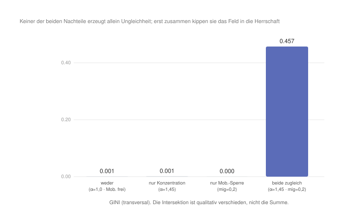
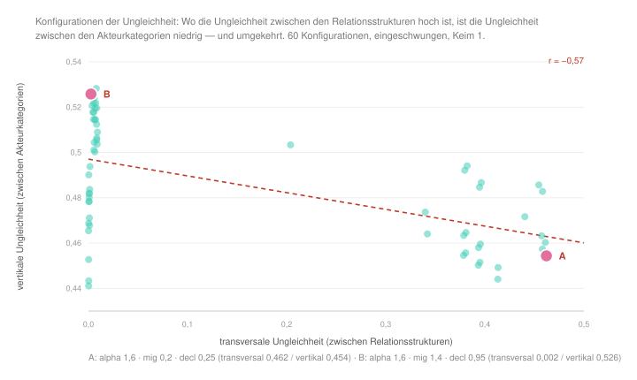

#+AUTHOR: Christian Papilloud
#+LANGUAGE: de
#+OPTIONS: toc:nil num:nil H:4 ^:nil
#+STARTUP: showall
#+LATEX_CLASS: book
#+LATEX_CLASS_OPTIONS: [11pt,a4paper]
#+CITE_EXPORT: csl chicago-author-date-de-ibid.csl
#+BIBLIOGRAPHY: Bericht.bib

* Kapitel 8 — Intersektionalität
:PROPERTIES:
:STATUS: DRAFT
:END:
Im Vergleich zu den Theorierahmen von Charles Tilly und Pierre Bourdieu spricht die Intersektionalitätsforschung ebenfalls von Herrschaft und von Ungleichheit. Patricia Collins bestimmt die Intersektionalität ausdrücklich als ein Wissensprojekt, dessen Daseinsgrund in seiner Aufmerksamkeit für „power relations and social inequalities“ liege [cite:@collins2015dilemmas 1]. Aber sie tut es auf einer Art und Weise, die der TR erstaunlich nahe kommt. Diese Ähnlichkeit wollen wir in diesem Kapitel vertiefen, weshalb wir die wichtigsten Ansätze der Intersektionalitätsforschung im digitalen Zwilling der TR abbilden möchten.

Der Kerngedanke der Intersektionalitätsforschung zu sozialen Ungleichheiten besteht darin, dass die Kernachsen der Ungleichheit — Klasse, Geschlecht, „race“ bzw. /ethnicity/ — nicht additiv verstanden werden, sondern sie konstituieren sich wechselseitig. In Collins’ kanonischer Fassung wirken Rasse, Klasse, Geschlecht, Sexualität, Ethnizität, Nation, Befähigung und Alter „not as unitary, mutually exclusive entities, but rather as reciprocally constructing phenomena“ [cite:@collins2015dilemmas 1]. Die soziale Situation einer afro-amerikanischen Arbeiterin ergibt sich nicht aus der Summe dreier Nachteile, sondern wird in der Wechselwirkung mit solchen sozialen benachteiligten Merkmalen konstituiert. Dieses Kapitel prüft diesen Ansatz im digitalen Zwilling mit Bezug auf zwei bedeutsamen Ansätze der Intersektionalitätsforschung: Der Ansatz von Patricia Collins, das die Relationalität ins Zentrum der Intersektionalität rückt, und der Ansatz von Kimberlé Crenshaw, das die Ausgangslage der Intersektionalitätsforschung bestimmt hat.

** 8.1 Ontologische Korrespondenz und Residuum

Die Intersektionalität kennt keine vier Relationsstrukturen. Etwa die Grundmerkmale Klasse, Geschlecht, „race“ bzw. /ethnicity/ sind Achsen der sozialen Ungleichheit, die einen sozialen Raum durchkreuzen. Joya Misra hält fest, dass die intersektionale Theorie das strukturelle Verständnis von Ungleichheit gerade dadurch schärft, dass sie Geschlecht, „race“, Klasse und weitere Merkmale „as structures reflecting power and inequality“ auffasst [cite:@misra2018categories 112]. Deshalb bildet der digitalen Zwilling den Ansatz der Intersektionalitätsforschung nicht auf der Ebene der Relationsstrukturen, sondern auf der Ebene der dreifachen sozialen Ungleichheiten bzw. der transversalen, horizontalen und vertikalen sozialen Ungleichheiten. Die soziale Situation von einem Akteur hängt immer von seiner Zirkulation innerhalb und zwischen Akteurkategorien (vertikale sozialen Ungleichheiten), Sequenzen von Relationsstrukturen (horizontale sozialen Ungleichheiten) und Relationsstrukturen (vertikale sozialen Ungleichheiten). Diese drei Ebenen sind kreuzende Achsen, entlang derer Nachteile akkumuliert werden können, wie dies die Intersektionalitätsforschung voraussetzt.

Das Residuum entspricht hier keine defizitäre Abbildung vom Ansatz der Intersektionalitätsforschung, sondern es ist mit der Entwicklung von einem solchen Ansatz im Laufe der Zeit verbunden. Wenn die Intersektionalitätsforschung in ihren Anfängen die Kategorien Klasse, Geschlecht, „race“ als grundlegende Kategorien mit eigener Geschichte versteht, entwickelt sich diese Betrachtung immer mehr relational. Bei Collins sieht man eine solche Wende am deutlichsten, die davon ausgeht, dass diese Kategorien ihre Bedeutung erst relational gewinnen. Sie würden „constituted and maintained through relational processes“, und ihren Sinn erhielten sie durch die Beschaffenheit dieser Beziehungen [cite:@collins2019intersectionality 45]. Eine solche Annahme kommt dem Rahmen der TR nah.

** 8.2 Theoretischer Kern

Die erste Grundorientierung für die Operationalisierung der Intersektionalitätsforschung im digitalen Zwilling der TR liefert die Ausgangslage dieser Forschung, wie sie Crenshaw definiert. Die Erfahrung der sozialen Ungleichheiten wird an der Kreuzung mehrerer benachteiligten Merkmalen erlebt, davon die Zusammenstellung eine je eigene verschärfte benachteiligte Lage für die Akteure bildet [cite:@crenshaw1991mapping]. Crenshaw hat später gemeinsam mit Sumi Cho und Leslie McCall beschrieben, worin die Ausgangsbeobachtung bestand: In den untersuchten Rechtsfällen scheiterten schwarze Klägerinnen daran, „a compound claim of discrimination“ überhaupt vorzubringen, denn sie waren vom Arbeitsmarkt ausgeschlossen worden „both as women who are Black and as Blacks who are women“ [cite:@cho2013toward 789]. Keine der beiden Einzelachsen des Antidiskriminierungsrechts konnte diese Lage fassen. Die sozialen Ungleichheiten werden somit von den Akteuren unterschiedlich erfahren und erlebt, weil sie je nach der sozialen Situation der Akteure unterschiedlich zusammengestellt werden.

Der zweite Grundorientierung entspricht der Intersektionalitätsforschung in der Auffassung von Collins. Die benachteiligten kategorialen Merkmale, die zu sozialen Ungleichheiten führen, werden relational herausgebildet bzw. sind nicht gegeben. Collins Auffassung „verschiebt den Fokus weg von den essentiellen Qualitäten, die nur scheinbar im Zentrum der Kategorien liegen, hin zu den relationalen Prozessen, die sie verbinden“ [cite:@collins2019intersectionality 45]. Klasse, Geschlecht, „race“ werden „durch relationale Prozesse konstituiert und aufrechterhalten“ und gewinnen so ihren Sinn und ihre soziale Bedeutung [cite:@collins2019intersectionality 45]. Dieses Argument von Collins entspricht Wort für Wort dem Argument der TR, wenn sie den Essentialismus der sozialen Kategorien kritisiert und sagt, dass solche Kategorien relational produziert werden.

Die dritte Grundorientierung betrifft das, was Collins sagt, wenn sie von den Modi des relationalen Denkens spricht. Die Relationalität erfolgt unterschiedlich. Sie kann durch Addition, durch Artikulation und durch Ko-Konstitution erfolgen [cite:@collins2019intersectionality]. Die Relationalität nach der Addition der Merkmale wie etwa in der Auffassung von Crenshaw kann als heuristisches Werkzeug verwendet werden, weil sie das zeigt, was in einer bestimmten Konstellation von benachteiligten Merkmalen fehlt bzw. berücksichtigt werden muss, um die sozialen Ungleichheiten vollständig zu verstehen und abbilden zu können. Aber diese Relationalität nach Addition erlaubt nicht, es zu verstehen, wie die Wechselwirkungen zwischen unterschiedlichen sozialen Systeme die sozialen Ungleichheiten hervorbringen. Deshalb muss die Intersektionalitätsforschung den Übergang vom Additiven zur wechselseitigen Konstitution von sozialen Ungleichheiten leisten. So kann sie beschreiben, wie die kritische Analyse „sich wechselseitig konstituierender Herrschaftssysteme“ von Klasse, Geschlecht, „race“ und Sexualität die sozialen Ungleichheiten produziert, denen etwa die afro-amerikanischen Frauen in den Vereinigten Staaten ausgesetzt sind [cite:@collins2015dilemmas].

Der vierte Orientierung berücksichtigt die Aussage von Joya Misra, wenn sie sagt, dass die intersektionalen Kategorien zugleich strukturell und relational konzipiert werden müssen. Diese Kategorien sind keine Behälter von benachteiligten Merkmalen, sondern es sind Verhältnisse [cite:@misra2018categories], die sich aufeinander wechselseitig beziehen und somit dazu beitragen, die Struktur von Gesellschaft mit zu konstruieren.

** 8.3 Operationalisierung

Die Tabelle [[tab:intersekt-regler]] hält fest, welche Regler in den beiden Profilen von den Vorgaben der TR abweichen und welche Orientierung die Abweichung trägt. Alle nicht genannten Regler bleiben auf der Vorgabe der TR. Wie in den vorangehenden Kapiteln lesen wir die Endzustände am eingeschwungenen Zustand nach 5000 Schritten ab, und wir prüfen jeden Befund über acht Keime.

#+NAME: tab:intersekt-regler
#+CAPTION: *Tabelle 1.* Die beiden Reglerprofile der Intersektionalitätsforschung im digitalen Zwilling der TR.
| Regler (Code) | TR | Überadditivität | Ko-Konstitution | Begründung |
|--------+-----+-------+-------+------------|
| Konzentration zum Pol (alpha) | 1,4 | 1,45 | 1,8 | im ersten Profil /unterhalb/ der Bifurkationsschwelle gesetzt, damit dieser Nachteil allein wirkungslos bleibt; im zweiten oberhalb, damit eine Herrschaft entsteht, in deren Kontext die Wirkung der Deklassierung gemessen werden kann |
| Migration der Akteure (mig) | 0,7 | 0,2 | unverändert | die gesperrte Mobilität als zweiter morphologischer Nachteil, allein ebenfalls wirkungslos — /tragender Regler des Überadditivitätsprofils/ |
| Verfall der Ankömmlinge (decl) | 0,5 | unverändert | 0,95 | die Deklassierung als kompositioneller Nachteil auf der Ebene der Akteurkategorien — /tragender Regler des Ko-Konstitutionsprofils/ |
| back, plast, over, rate, rho, peak, cap, anchor, dynam | Vorgaben | unverändert | unverändert | in diesem Rahmen nicht einschlägig; auf der Vorgabe belassen |

Da wir zwei Ansätze der Intersektionalitätsforschung berücksichtigen, die jeweils nach einem kategorialen und nach einem relationalen Ansatz argumentieren, erstellen wir im digitalen Zwilling zwei entsprechenden Reglerprofile. Das erste Profil prüft die Überadditivität von Kategorien bzw. von kategorialen Merkmalen im Sinne Crenshaws. Es kombiniert zwei morphologische Nachteile — eine unterkritische Konzentration der Akteure in Relationsstrukturen (alpha 1,45, unterhalb der Bifurkation) und eine entsprechende gesperrte Mobilität dieser Akteure (mig 0,2) —, die allein betrachtet zu schwach wären, um die sozialen Ungleichheiten zu erzeugen. Das zweite Profil prüft den Ko-Konstitution-Ansatz von Collins. Es bildet eine Herrschaft ab (alpha 1,8), und es setzt eine entsprechende Deklassierung von Akteuren (decl 0,95), um zu messen, ob diese Deklassierung von der Entstehung dieser Herrschaft abhängt.

** 8.4 Hypothesen

Wir formulieren eine erste Hypothese /H1/ zur Überadditivität. Wenn wir Crenshaw folgen, dann sollten wir davon ausgehen, dass zwei Nachteile, die an sich keine große Folgen für die sozialen Ungleichheiten haben, mehr Ungleichheit produzieren, wenn sie in Interaktion treten, als wenn sie bloß zusammen bzw. additiv eingesetzt werden. Diese Interaktion von Nachteilen ist die Intersektion als qualitativer Indikator der sozialen Situation von Akteuren. Eine Hypothese /H2/ formulieren wir, um die Besonderheit der Kategorien zu berücksichtigen, die als intersektionale Achsen im digitalen Zwilling abgebildet werden. Mit H2 setzen wir voraus, dass die Überadditivität nicht achsenspezifisch ist bzw. dass sie für jede Art von Achsen gelten würde. Eine Hypothese /H3/ betrifft Collins’ Ko-Konstitution-These. Dieselbe Bildung von vertikalen Ungleichheiten sollte je nach struktureller Lage verschiedene spezifische bzw. entgegengesetzte Wirkungen zeitigen. Eine Hypothese /H4/ bezieht sich auf das Additive als ein Modus der Relationalität von Nachteilen. Ein rein additiver Nachteil reicht nicht aus, um die soziale Ungleichheit zu produzieren bzw. zu stärken, weil Nachteile relational bzw. intersektional ko-konstituiert werden und soziale Ungleichheiten entsprechend hervorbringen.

Schließlich formulieren wir eine Hypothese /H5/, die nicht eine einzelne Konfiguration betrifft, sondern den Raum der Konfigurationen. Mit dieser Hypothese greifen wir den Ansatz von Leslie McCall auf, der sich von den beiden Ansätzen Crenshaws und Collins unterscheidet. McCall hat in ihren Untersuchungen zur Lohnungleichheit in US-amerikanischen Regionalökonomien vier verschiedene Konfigurationen der Ungleichheit gefunden und daraus geschlossen, dass keine einzelne dieser Konfigurationen die Gesamtstruktur der Lohnungleichheit beschreiben könne, weil sich diese Konfigurationen mehrfach kreuzen und einander widerstreiten [cite:@mccall2005complexity]. Übertragen auf die TR bedeutet es, dass die drei Ebenen der Ungleichheit über den Konfigurationsraum bzw. den relationalen Raum des digitalen Zwilling nicht gleichmäßig entwickelt werden sollten. Es sollte Konfigurationen geben, in denen die eine Ebene steigt, während eine andere fällt. Wäre es anders bzw. würden alle drei Ebenen immer zusammen in die gleiche Richtung entwickelt werden, dann wäre die dreistufige Skala der TR mit vertikaler, horizontaler und transversaler Ungleichheiten überflüssig bzw. würden diese drei Ebenen der sozialen Ungleichheiten keinen Erkenntnisgewinn bringen.

** 8.5 Lauf und Ergebnisse

Im digitalen Zwilling wird H1 vollkommen bestätigt (Abbildung [[fig:intersekt-suradditivitaet]]). Die unterkritische Konzentration der Akteure in Relationsstrukturen allein erzeugt nichts (GINI 0,001). Die gesperrte Mobilität der Akteure allein erzeugt nichts (GINI 0,000). Doch zusammen kippen sie den relationalen Raum in die Herrschaft (GINI 0,457). Dieses Ergebnis bleibt über acht Keime unverändert. Die Intersektion von Nachteilen bringt einen qualitativen Unterschied, der im digitalen Zwilling als eine Schwelle abgebildet wird, die keiner der beiden Nachteile allein überschreitet. Diese Schwelle wird überschritten, wenn beide Nachteile gemeinsam fungieren. Dieses Ergebnis bestätigt den Ansatz von Crenshaw: Die Intersektion von Nachteilen und nicht ihre Addition produziert einen Übermaß an sozialen Ungleichheiten.

#+NAME: fig:intersekt-suradditivitaet
#+CAPTION: *Abbildung 1.* Überadditivität an der Schwelle: Konzentration und Mobilitätssperre erzeugen allein nichts; ihre Intersektion produziert eine Herrschaft (GINI 0,457).

Dagegen wird H2 im digitalen Zwilling revidiert. Die Überadditivität von Nachteilen ist achsenspezifisch. Ersetzt man die Mobilitätssperre durch die Deklassierung, so verschwindet der Effekt. Dies bedeutet, dass in dieser Konfiguration die Deklassierung allein nahezu wirkungslos ist, und sie staffelt sich nicht mit der Konzentration der Akteure in den Relationsstrukturen (der Interaktionswert ist um null, sogar leicht negativ). Dies bedeutet, dass Nicht jeder Nachteil mit anderen Nachteilen interagiert, sondern intersektional werden das, was die TR die morphologischen Determinanten nennt, die Zirkulation und die Mobilität der Akteure bestimmen und die Verbreitung und Satellisierung der Relationsstrukturen mittelbar beeinflussen.

H3 wird klar bestätigt (Abbildung [[fig:intersekt-koconstitution]]). Im symmetrischen Zustand des digitalen Zwillings trifft die Deklassierung der Akteure alle Relationsstrukturen im vergleichbaren Maßen (die vertikale Ungleichheit ist überall im relationalen Raum um 0,48 %). Unter der Herrschaft von einer Relationsstruktur wird diese Wirkung dennoch gespaltet. Im Apex bzw. in der herrschenden Relationsstruktur sinkt die Deklassierung auf 0,24 (die Relationsstruktur wird homogener bzw. die Stratifikation wird vereinfacht), in den beherrschten Relationsstrukturen steigt sie auf 0,54 (sie werden stärker stratifiziert). Diese Zahlen stammen aus dem Überadditivitätsprofil. Im eigens für H3 gebauten Ko-Konstitutionsprofil fällt die Deklassierung mit 0,24 gegenüber 0,58 sogar noch etwas deutlicher aus. Der Befund gilt also in beiden Konfigurationen. Dieses Ergebnis zeigt, dass dieselbe Deklassierung je nach Lage von einer Relationsstruktur eine unterschiedliche Bedeutung für die soziale Ungleichheit in einer Relationsstruktur hat. Dies bestätigt Collins’ Relationalitätsansatz: Die Wirkung von einem intersektionalen Nachteil hängt von dem relationalen Kontext ab. Er nimmt seine Bedeutung von einem anderen Nachteil, der sich an der Intersektion mit diesem Nachteil befindet.

#+NAME: fig:intersekt-koconstitution
#+CAPTION: *Abbildung 2.* Ko-Konstitution: Dieselbe Deklassierung trifft im symmetrischen digitalen Zwilling alle Relationsstrukturen gleichermaßen; unter Herrschaft hat dieselbe Deklassierung eine unterschiedliche Wirkung auf die Relationsstrukturen je nach der spezifischen Lage, in der sich diese Relationsstruktur befindet (Apex 0,24 / beherrschte Relationsstrukturen 0,54).
[[file:figures/intersekt_koconstitution.svg]]

H5 wird bestätigt, und der Befund erweist sich bedeutsamer als erwartet (Abbildung [[fig:intersekt-konfigurationen]]). Wir haben den Konfigurationsraum in 60 Läufen getestet, und dabei haben wir die Konzentration (alpha), die Mobilität (mig) und die Deklassierung (decl) systematisch verändert und für jede Konfiguration das Ergebnis von allen drei Ungleichheitsebenen abgebildet. Die transversale und die horizontale Ungleichheit laufen dabei weitgehend zusammen (r = +0,78). Die transversale und die /vertikale/ Ungleichheit laufen dagegen gegeneinander (r = −0,57), und zwar nicht wegen eines einzelnen Reglers. Hält man die Deklassierung jeweils konstant, bleibt die negative Korrelation bei −0,69, −0,65 und −0,41.

Der Kontrast, den McCall zwischen Detroit und Dallas beschreibt, lässt sich im digitalen Zwilling unmittelbar nachbauen. Bei einer Konzentration von 1,6 mit gesperrter Mobilität und schwacher Deklassierung misst der Zwilling eine transversale Ungleichheit von 0,462 bei einer vertikalen von 0,454. Bei derselben Konzentration, aber hoher Mobilität und starker Deklassierung, fällt die transversale Ungleichheit auf 0,002 und die vertikale steigt auf 0,526. Oder anders gesagt: Das Ungleichheitsmuster ist umgekehrt. Einmal sitzt die Ungleichheit zwischen den Relationsstrukturen, und die Akteurhierarchie bleibt vergleichsweise flach. Einmal gibt es zwischen den Relationsstrukturen gar keine Ungleichheit mehr, aber die Hierarchie zwischen den Akteurkategorien ist am stärksten ausgebildet.

Eine Einschränkung zu diesem Befund muss jedoch erwähnt werden. Die vertikale Ungleichheit variiert über den gesamten relationalen Raum nur zwischen 0,441 und 0,528. Die negative Korrelation ist systematisch und über die Kontrollen hinweg stabil, aber sie ist in der absoluten Größe bescheiden. Der Zwilling zeigt also, dass die Ebenen einander widerstreiten, aber er zeigt nicht, wie stark sie widerstreiten.

#+NAME: fig:intersekt-konfigurationen
#+CAPTION: *Abbildung 3.* Konfigurationen der Ungleichheit über 60 Läufe (alpha × mig × decl, eingeschwungen, Keim 1). Wo die Ungleichheit zwischen den Relationsstrukturen hoch ist, ist die Ungleichheit zwischen den Akteurkategorien niedrig, und umgekehrt (r = −0,57). A und B markieren die beiden Konfigurationen, in denen das Muster vollständig umgedreht ist.

H4 als Kehrseite von H2 wird ebenfalls bestätigt. Die Deklassierung allein erzeugt fast keine soziale Ungleichheit. Ein Nachteil allein zieht nicht zwangsläufig weitere Nachteile zu sich, sondern Nachteile sind in einer Relation der Ko-Konstitution und produzieren so die sozialen Ungleichheiten.

** 8.6 Robustheit

Die Befunde sind stabil über verschiedene Läufe mit unterschiedlichen Konfigurationen des digitalen Zwillings. Die Überadditivität bleibt über acht Keime identisch (GINI 0,457). Sie ist eine strukturelle Tatsache und kein Artefakt, das von der Ausgangslage des digitalen Zwillings erzeugt würde. Die Achsenspezifität wurde durch den Vergleich mehrerer zweiter Achsen (Deklassierung vs. Mobilitätssperre) kontrolliert und bestätigt. Die Ko-Konstitution ist über die Keime invariant, und die gemessene Spaltung der Wirkung von Nachteilen zwischen dem Apex und den beherrschten Relationsstrukturen (0,30 im Überadditivitätsprofil, 0,34 im Ko-Konstitutionsprofil) geht in Unterstützung von diesem Ergebnis.

Der Befund zu H5 stützt sich auf die Streuung über 60 Konfigurationen, und die negative Korrelation zwischen der transversalen und der vertikalen Ungleichheit hält in allen drei Kontrollkonfigurationen, in denen die Deklassierung festgehalten wird. Ein Vorbehalt bleibt jedoch wichtig: Der digitale Zwilling kennt die Geschichte der Kategorien der Intersektionalität nicht (Geschlecht, „race“). Er kann diese Geschichte nicht abbilden, sondern nur die Form der Komposition und der Ko-Konstitution ohne deren konkreten sozialen Gehalt.

** 8.7 Lesart. Die unterschiedlichen Auffassungen der sozialen Ungleichheit vom Standpunkt der Intersektionalität

Der digitale Zwilling reproduziert die Auffassungen der Intersektionalität bei Crenshaw und Collins, und er kann sie zwei Determinantentypen der TR zuordnen. Die Überadditivität Crenshaws gilt für die morphologischen Determinanten der Relationsstrukturen. Zwei intersektionale Nachteile, die eine Zirkulation bestimmen, überschreiten gemeinsam eine Schwelle, die keiner allein erreicht. Die Ko-Konstitution Collins’ gilt für die strukturellen Determinanten der Relationsstrukturen. Der Sinn von einem kompositionellen Nachteil (etwa der Deklassierung) hängt von der strukturellen Lage einer Relationsstruktur ab. Die beiden Auffassungen der Intersektionalität stehen deshalb nicht im gegenseitigen Widerspruch, sondern sie greifen zwei Klassen von sozialen Determinanten auf und betreffen deshalb zwei verbundenen Aspekten der selben relationalen Ontologie. Die Auffassung von Crenshaw ist mit dem Ansatz der Komposition von Kategorien zur Produktion von sozialen Ungleichheiten verbunden. Diejenige von Collins bezieht sich auf die Ko-Konstition solcher Kategorien zur Produktion von sozialen Ungleichheiten. Dass wir hier zwei Auffassungen und nicht zwei Personen gegenüberstellen, sei ausdrücklich gesagt, denn Crenshaw hat die Entwicklung zum relationalen Ansatz selbst mit geprägt. Gemeinsam mit Sumi Cho und Leslie McCall bestimmt sie die Intersektionalität als eine analytische Haltung, die Kategorien nicht als voneinander abgegrenzt begreift, sondern als „always permeated by other categories, fluid and changing, always in the process of creating and being created by dynamics of power“ [cite:@cho2013toward 795].

Bevor wir diese Zuordnung ausbauen, müssen wir eine Einschränkung der Analyse mit dem digitalen Zwilling signalisieren. Mit Crenshaw und Collins haben wir zwei Positionen im Rahmen der Intersektionalitätsforschung geprüft, die für die Intersektionalitätsforschung zwar bedeutsam sind, die aber weiter Ansätze kennt. Deshalb haben wir die einschlägige Systematisierung von Leslie McCall mit berücksichtigt, weil sie ihren Ansatz unmittelbar im Verhältnis zu der Bedeutung von Kategorien der Ungleichheit für die Intersektionalitätsforschung profiliert. In diesem Zusammenhang spricht McCall von „anticategorical, intracategorical und intercategorical complexity“ [cite:@mccall2005complexity] bzw. von drei möglichen Arten und Weisen, mit Kategorien der Ungleichheit in der Intersektionalitätsforschung umzugehen. Der anticategoriale Ansatz dekonstruiert die Kategorien. Der intracategoriale Ansatz hält sie fest, um die Binnenvielfalt einer bestimmten Situation sichtbar zu machen. Der intercategoriale Ansatz nimmt die bestehenden Kategorien vorläufig in Kauf, um die Ungleichheitsverhältnisse zwischen ihnen zum Gegenstand der Untersuchung zu machen.

Wenn wir diese Ansätze von McCall aufnehmen, um die Art der Untersuchung zu bezeichnen, die wir mit dem digitalen Zwilling durchgeführt haben, dann sehen wir, dass unsere Prüfung eindeutig nach dem intercategorialen Ansatz geleistet wurde. Das ist zugleich der Grund, weshalb wir für McCall kein eigenes Reglerprofil gebaut haben. Ihre Trias ist eine Ordnung von Methoden und keine Behauptung darüber, wie Ungleichheit entsteht. Ein Regler für „intercategorical complexity“ wäre so sinnvoll wie ein Regler für „qualitative Methode“ gewesen. Was sich prüfen lässt, ist nicht ihre Typologie, sondern ihr empirischer Befund, und den haben wir mit H5 nicht als Profil, sondern als Test der drei Ebenen der Ungleichheiten in der Entwicklung des relationalen Raums im digitalen Zwilling geprüft. Der digitale Zwilling setzt Kategorien bzw. Sequenzen und Relationsstrukturen voraus, die er nicht in Frage stellt, und er misst, was zwischen diesen Kategorien geschieht. Jasbir Puar hat vorgeschlagen, die Intersektionalität als intellektuelle Kategorie und als Werkzeug politischer Intervention durch den Begriff der Assemblage zu ergänzen. Sie will die Intersektionalität dabei ausdrücklich nicht ersetzen: Auch wenn beide analytischen Zugänge nicht vereinbar seien, stünden sie „nicht in einem Gegensatz, sondern eher in Spannung zueinander“ [cite:@puar2011cyborg 253]. In dieser Spannung liegt der Einwand, der uns betrifft, denn er ist nicht methodischer, sondern ontologischer Art. Puar hält fest, dass es ihr bei den Grenzen der intersektionalen Theorie „nicht nur um epistemologische Inkongruenz, sondern insbesondere um ontologische Irreduzibilität“ gehe [cite:@puar2011cyborg 267f.]. Die Frage ist also nicht, wie man zwischen Kategorien misst, sondern ob die Kategorie überhaupt der richtige Ausgangspunkt ist.

Bemerkenswert ist dabei, gegen wen sich dieser Einwand nicht richtet. Unter der Überschrift „Intersektionalität als Assemblage lesen“ nimmt Puar Crenshaws eigenes Bild der Verkehrskreuzung auf und liest es gegen dessen spätere Verwendung. Der Unfall an der Kreuzung situiere die Intersektionalität als ein Ereignis. Identifizierung sei ein Prozess und Identität „eine Begegnung, ein Ereignis, ein Unfall“ [cite:@puar2011cyborg 264]. Die Intersektionalität sei deshalb „ein viel durchlässigeres Paradigma, als es aufgrund der wissenschaftlichen Standardisierung erscheint“ [cite:@puar2011cyborg 265]. Puars Kritik trifft demnach nicht Crenshaws Ausgangsintuition, sondern deren Erstarrung im Wissenschaftsbetrieb, was die Wende, die wir in diesem Kapitel von Crenshaw zu Collins nachzeichnen, von einer dritten Seite bestätigt.

Für den ontologischen Einwand selbst bietet der digitale Zwilling gleichwohl keinen Ansatzpunkt, weil er Kategorien voraussetzen muss, um überhaupt rechnen zu können. Das ist die Grenze unseres Instruments. Aber diese Grenze fällt umso weniger ins Gewicht, als Puar selbst keine Entscheidung zwischen beiden Ansätze von Crenshaw und Collins verlangt. Ihr Aufsatz endet mit der Frage, warum man Cyborg und Göttin voneinander trennen solle, wenn es doch Cyborg-Göttinnen gebe: „Hier ist eine intersektionale Assemblage im Entstehen, die ich tatsächlich schätzen würde“ [cite:@puar2011cyborg 270].

Im Rahmen der Intersektionalitätsforschung, die sich mit Kategorien auseinandersetzt, deckt die Achse Crenshaw–Collins mehr ab, als es zunächst scheint, und der digitale Zwilling greift dabei in eine offene Kontroverse ein. Ange-Marie Hancock unterscheidet drei Forschungsparadigmen: Das /unitary/ Paradigma, das eine einzige Ungleichheitsdimension bevorzugt, das /multiple/ Paradigma, das mehrere Dimensionen nebeneinander stellt, und das /intersectional/ Paradigma, in dem die Dimensionen einander verändert werden [cite:@hancock2007multiplication]. Unsere Hypothesen H1 und H4 prüfen genau den Übergang vom zweiten zum dritten Paradigma, und der digitale Zwilling entscheidet ihn empirisch: Zwei Nachteile, die einzeln nichts bewirken, kippen zusammen genommen den relationalen Raum.

Die Kontroverse betrifft die Reichweite dieses Übergangs, und hier liefert unser Befund zu H2 ein Argument. Sylvia Walby, Jo Armstrong und Sofia Strid haben gegen die starke These der wechselseitigen Konstitution eingewandt, es sei genauer von einer wechselseitigen /Formung/ zu sprechen. Die Autoren geben zu, dass Systeme sozialer Beziehungen an ihrem Kreuzungspunkt etwas anders als die Summe von diesen Beziehungen werden, „but do not become something totally different“ [cite:@walby2012intersectionality 235]. Ungleichheitssysteme blieben also unterscheidbar, statt in einer neuen Einheit aufzugehen. Der digitale Zwilling stützt in diesem Streit nicht die eine Seite gegen die andere, sondern er zeigt, dass beide Seiten für unterschiedliche Achsen recht haben. Wo zwei morphologische Nachteile zusammentreffen, entsteht durch ihre Intersektion tatsächlich etwas qualitativ Neues, das keiner von beiden enthält. Wo dagegen ein morphologischer und ein kompositioneller Nachteil zusammentreffen, bleibt der Interaktionswert bei null. Die beiden Systeme verändern einander nicht, sie bleiben nebeneinander bestehen. Ob eine Intersektion konstituiert oder nur formt, ist demnach keine ontologische Frage, sondern es ist eine Frage der Determinantenklasse, in der die beteiligten Nachteile liegen.

Damit lassen sich auch Collins’ eigene Modi — Addition, Artikulation, Ko-Konstitution — am digitalen Zwilling wiederfinden. Die reine Addition von Kategorien führt zu keinem Schneeballeffekt — die Deklassierung allein bleibt folgenlos. Die Artikulation erscheint als die kontextuelle Kopplung zwischen Kategorien und Kontext — dieselbe Nachteile haben andere Wirkungen je nach dem Kontext, in dem sie wirken. Die Ko-Konstitution bezeichnet die überadditive Schwelle, an der zwei Nachteile in Intersektion einen qualitativ neuen Nachteil hervorbringen.

Aber der bedeutsamere Befund von dieser Prüfung der Intersektionalitätsforschung im digitalen Zwilling ist die Konvergenz der beiden Ansätzen von Crenshaw und Collins mit der Auffassung der sozialen Ungleichheit in der TR. Die TR dimensioniert die sozialen Ungleichheiten durch die Wirkung dreier Ebenen aufeinander — der Ungleichheit innerhalb der Sequenzen (der vertikalen Ungleichheit), zwischen den Sequenzen (der horizontalen Ungleichheit) und zwischen den Relationsstrukturen (der transversalen Ungleichheit) —, die sich im Wandel des relationalen Raumes wechselseitig konstituieren. Eben dies tut die Intersektionalität nach Collins: Sie dimensioniert die Ungleichheit durch die wechselseitige Konstitution ihrer Kategorien. Die Ko-Konstitution der drei Ebenen der TR und die Ko-Konstitution der Kategorien der Intersektionalität stimmen formal überein, und dieser Ansatz ist auch von Crenshaw, wie oben erwähnt, mit geprägt worden.

** 8.8 Entwicklungslinien

Die Intersektionalität erweist sich damit als der Theorierahmen, der an dem Theorierahmen der TR ausdrücklich nah steht. Beide Theorierahmen konditionieren das Aufschichten von benachteiligten sozialen Merkmalen an ihrer relationalen Ko-Konstitution. Das Residuum — Kategorien der sozialen Ungleichheiten sind in der Intersektionalitätsforschung grundlegend historisch gegebene Kategorien — bleibt bestehen, und unterscheidet die Intersektionalitätsforschung von der TR, wie die TR im digitalen Zwilling modelliert wird. Der digitale Zwilling prüft die Form und nicht den Inhalt von Kategorien ab. Doch Collins’ Relationalität verkleinert diesen Unterschied zwischen der Intersektionalität und der TR, der jedoch nicht verschwindet, weil Collins die Relationalität von Kategorien der sozialen Ungleichheiten nicht nur formal, sondern auch historisch denkt. Soziale Ungleichheiten werden im Laufe der Geschichte von Gesellschaften unterschiedlich in Inhalt und Form, und deshalb wirkt ihre Intersektionalität unterschiedlich in Zeit und Raum und produziert entsprechend unterschiedliche sozialen Ungleichheiten je nach dem Kontext.

Diese Nähe zwischen der Intersektionalitätsforschung und der TR sollte allerdings nicht darüber hinwegtäuschen, dass die Intersektionalitätsforschung selbst umstritten ist, und zwar in Punkten, die unsere Prüfung berühren. Jennifer Nash hat vier ungelöste Fragen der Intersektionalitätsforschung benannt. Eine intersektionale Methodologie fehlt. Schwarze Frauen werden als exemplarische intersektionale Subjekte betrachtet. Die Definition der Intersektionalität bleibt unbestimmt, und damit stellen sich Fragen nach der empirischen Geltung der Untersuchungen im Rahmen der Intersektionalitätsforschung [cite:@nash2008rethinking]. Zwei davon treffen die Untersuchung in diesem Kapitel unmittelbar. Die vage Definition der Intersektionalitätsforschung ist der Grund, weshalb wir in diesem Kapitel überhaupt zwei Auffassungen der Intersektionalitätsforschung unterschieden haben, statt eine einzige zu operationalisieren. Die Frage nach der Methodologie ist genau die Lücke, in die unser Vorgehen stößt: Der digitale Zwilling liefert keine intersektionale Methodologie im Sinne Nashs, aber er liefert ein Prüfverfahren für einzelne intersektionale Behauptungen. Nash hält ausdrücklich fest, dass ihre Einwände die Intersektionalität nicht abbauen sollen, sondern zu einer genaueren Theoretisierung von Identität und Herrschaft auffordern. In diesem Sinn verstehen wir auch unsere Untersuchung.

Mit diesem Kapitel beenden wir die Untersuchung der Theorierahmen, die bedeutsame Impulse für die Entwicklung einer relationalen Soziologie gegeben haben, darauf sie maßgeblich gewirkt haben bzw. immer noch wirken. Im nächsten Kapitel nähern wir uns der zeitgenössischen Diskussion im Bereich der relationalen Soziologie, die seit dem /Manifesto for a Relational Sociology/ von Mustafa Emirbayer lanciert wurde und von unterschiedlichen Relationisten aufgenommen und weiter entwickelt wurde. Im kommenden Kapitel wollen wir uns einige der bedeutsamen Vorschlägen widmen, die im zeitgenössischen Kontext der relationalen Soziologie angeboten wurden, und wir nehmen sie im digitalen Zwilling auf, um sie näher zu untersuchen.

** Literatur
#+print_bibliography:
