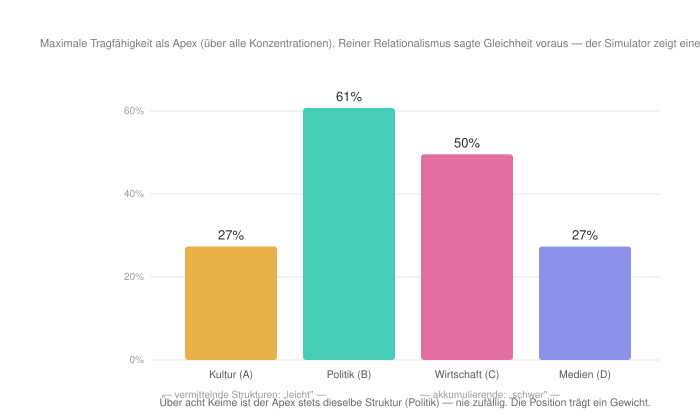
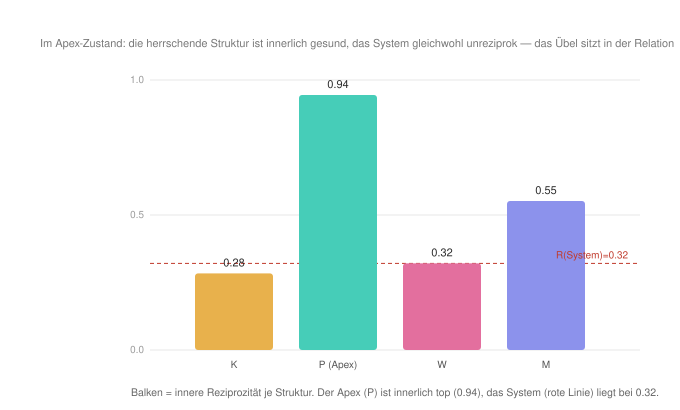
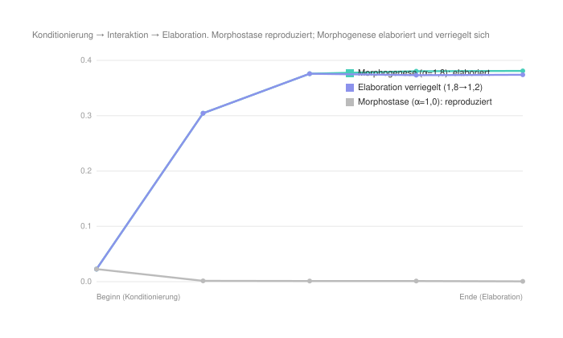
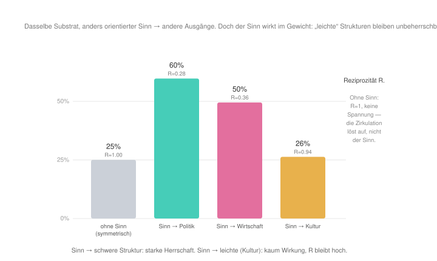

#+AUTHOR: Christian Papilloud
#+LANGUAGE: de
#+OPTIONS: toc:nil num:nil H:4 ^:nil
#+STARTUP: showall
#+LATEX_CLASS: book
#+LATEX_CLASS_OPTIONS: [11pt,a4paper]
#+CITE_EXPORT: csl chicago-author-date-de-ibid.csl
#+BIBLIOGRAPHY: Bericht.bib

* Kapitel 9 — Gegenwärtige relationale Soziologien
:PROPERTIES:
:STATUS: DRAFT
:END:
Die bisherigen Kapitel haben große Theorierahmen vom Theorierahmen der TR kontrastiert. Diese Rahmen, die zwar wichtige Impulse für die Entwicklung einer relationalen Soziologie gebracht haben, gehen in ihren Annahmen und Zielen in eine eigene Richtung, in die die TR nicht geht. Das sind Grenzen, die im digitalen Zwilling sichtbar gemacht worden sind und eine Diskussion zwischen der TR und diesen Theorierahmen ermöglicht haben. In dieser Diskussion ist es möglich gewesen, es zu zeigen, wie die TR in ihren Annahmen, in ihrer Konstruktion, ihrer Auffassung von Gesellschaft und deren Folgen auf der Ebene der Erklärung, die die TR von sozialen Phänomen vorschlägt, ihre Postion im Rahmen von mehr oder weniger stark relationalen Ansätzen in der Soziologie bezieht.

Mit diesem Kapitel wechseln wir zum Vergleich zwischen der TR und den gegenwärtigen relationalen Soziologien, im Austausch mit denen die TR ihren Ansatz mehrheitlich entwickelt hat und eine Verwandtschaft aufweist. Der Kontrast zwischen TR und diesen relationalen Soziologien wird die Nähe und die Unterscheidungen zwischen den entsprechenden relationalen Ansätzen fokussieren. Es geht dabei darum, was jeder Verwandte von der TR einfängt, was ihm fehlt, was er ihr voraus hat. Die sieben Schritte, nach der wir bis jetzt vorgegangen sind, werden diesen Kontrast strukturieren. Die Frage nach dem Residuum verschiebt sich jedoch. In diesem Kapitel geht es nicht darum, die verborgenen Prämisse, die den digitalen Zwilling der TR überschreitet, zu verdeutlichen, sondern es geht um die Frage, wie weit jede verwandte relationale Soziologie die Vorschläge der TR teilt und wo sie eigene Akzente setzt.

Dieser Kontrast betrifft nicht jeden möglichen relationalen Ansatz, der in der zeitgenössischen Theorieproduktion im Bereich der Soziologie formuliert wurde. Hier bleiben wir unserer /Skizze/ treu: Wir bilden die gegenwärtigen Haupttendenzen der relationalen Soziologie ab, davon sich die TR gleichzeitig inspiriert und differenziert. Es handelt sich zum einen um die Nachfolge Whites (Netzwerke aus Dyaden), zum zweiten um den deweyschen Pragmatismus (Relation als Transaktion zwischen Ego und Alter) und schließlich um Pierpaulo Donatis ontologische Auffassung der Relation (die Relation als unabhängige Realität) in seiner Kopplung mit Margaret Archer morphogenetischem Ansatz [cite:@papilloud2022skizze 1ff.]. Diese drei Ankerpunkte der zeitgenössischen relationalen Soziologien bilden die Ausgangslage der heutigen Diskussion ab, die wir wie folgt modellieren. Wir fangen zuerst mit dem Impuls Emirbayers Transaktionalismus an. Dann machen wir mit dem Emergenz-Ansatz von Donati und Archer weiter. Wir berücksichtigen anschließend die Sinn-und-Netzwerk-Perspektive von Jan Fuhse und Ann Mische, und wir verlängern unseren Vergleich mit einem gestrafften Überblick über die Arbeiten von François Dépelteau, die zur Vernetzung der zeitgenössischen Relationisten maßgeblich beigetragen hat.

** 9.1 Mustafa Emirbayer: Der Transaktionalismus

/Nähe und Differenz./ Emirbayer stellt die Soziologie vor ein „grundlegendes Dilemma“: besteht die soziale Welt „primär aus Substanzen oder aus Prozessen“ [cite:@emirbayer1997manifesto 281]? Er entscheidet für die Relation. Die Entitäten haben keine vorgängige Essenz, sondern sie sind ihre Transaktionen. Dieser Vorschlag bildet fast wörtlich ab, was die TR als das Primat der Zirkulation definiert. Die Unterscheidung zwischen dem Transaktionalismus von Emirbayer und der TR liegt im Aufbau. Emirbayer argumentiert in der Nachfolge seiner Kritik an White rein prozessual und netzwerkartig. In seiner Auffassung der relationalen Soziologie spielen Strukturen und Vermittlungsordnungen keine bedeutsame Rolle. Relation ist im Sinne Emirbayers eine reine Relation, die im digitalen Zwilling der TR die symmetrische Ausgangslage des relationalen Raumes mit diesem wichtigen Kontrast entsprechend würde, dass bie Emirbayer ein solchen Raum nicht von Relationsstrukturen und mit ihren Vermittlungsinstanzen dimensioniert werden würde.

/Theoretischer Kern./ Emirbayer /Manifesto/ bezieht sich auf den Transaktionalismus von John Dewey und Aurthur Bentley, die drei Arten und Weisen unterscheiden, Prozesse zu fassen: 1) die Selbst-Aktion, nach der Dinge aus eigener Kraft handeln; 2) die Inter-Aktion, nach der vorgegebene Entitäten sich aufeinander beziehen; 3) die Trans-Aktion, in der die Polen von einer Relation innerhalb und durch ihre Relation bestimmt werden [cite:@emirbayer1997manifesto 287]. Die zwei ersten Arten und Weisen, Prozesse aufzugreifen, beschreiben zwei Arten vom Substantialismus. Beide gehen davon aus, dass Substanzen verschiedener Art — Dinge, Wesen, Essenzen — die Grundeinheiten jeder Untersuchung bilden, und dass die Analyse bei diesen selbstgenügsamen Entitäten zu beginnen habe, die „preformed“ auftreten, um erst danach die dynamischen Ströme zu betrachten, in die sie sich verwickeln [cite:@emirbayer1997manifesto 282]. Der relationale Standpunkt kehrt diesen Gedanken um, und er denkt die soziale Wirklichkeit in „dynamischen, kontinuierlichen und prozessualen“ Begriffen [cite:@emirbayer1997manifesto 281, 289]. Handlungen und Personen sind „von der Transaktion untrennbar“, in der sie stehen [cite:@emirbayer1997manifesto 294]. Deshalb trägt keine Struktur eine Entität, sondern diese Entität ist nur das, was sie als Relation unterstützt.

/Operationalisierung und Lauf./ Daraus folgt ein präziser, am digitalen Zwilling prüfbarer Anspruch. Wären die Positionen reine Relation ohne Substanz, wie Emirbayer mit seinem Anti-Substantialismus voraussetzt, so dürfte keine Reihenordnung der Strukturen geben. Oder anders gesagt: Unter der Voraussetzung von rein symmetrischen Schmetterlingspfaden bzw. Ketten in den Relationsstrukturen — eine Einstellung im digitalen Zwilling, der Emirbayer am besten darstellt — müsste die Apex-Relationsstruktur keimabhängig und damit zufällig sein bzw. jede Relationsstruktur könnte gleich gut zum Apex werden bzw. über die anderen Relationsstrukturen herrschen. Unser Lauf im digitalen Zwilling zeigt jedoch, dass diese Hypothesen nicht bestätigt werden, und zwar in zwei Schritten.

Erstens ist der Apex bei der Konzentration, die dem Anti-Substantialismus Emirbayers entspricht (alpha 1,8), über acht Keime hinweg stets dieselbe Relationsstruktur — die Politik bei 63 %, bei einem Gini von 0,381 und einer Streuung zwischen den Keimen unterhalb von 0,001. Der Keim entscheidet also nichts. Verdrahtet man darüber hinaus das Netz so um, dass je eine andere Relationsstruktur zum Zentrum der Ketten wird, dann ändert auch das nichts: In allen vier Läufen bildet die Politik den Apex, mit 61 bis 62 %. Bei Emirbayers eigener Einstellung scheitert die Vertauschbarkeit der Relationsstrukturen also nicht bloß teilweise, sondern vollständig — es gibt keine Konfiguration, in der eine andere Relationsstruktur die Herrschaft übernähme.

Zweitens wird bei gesenkter Konzentration sichtbar, dass die Relationsstrukturen nicht nur nicht vertauscht werden können, sondern in einer Reihenfolge stehen. Senkt man die Konzentration auf 1,4, dann trägt jede Relationsstruktur den Apex unterschiedlich gut: die Politik bis 60 %, die Wirtschaft bis 49 %, Kultur und Medien dagegen erreichen nur je 27 % und bleiben mit einem Gini von 0,034 bzw. 0,036 unterhalb der Schwelle, ab der wir überhaupt von Herrschaft sprechen (Abbildung [[fig:emirbayer-substanz]]). Wenn man die Relationsstrukturen so manipuliert, dass je eine „leichte“ Relationsstruktur (etwa die Kultur, oder die Medien) herrschen soll, so wird diese Relationsstruktur nicht zum Apex. Dies bedeutet grundsätzlich, dass die Relationsstrukturen nicht austauschbar sind bzw. dass sie eine bestimmte Vermittlungsstruktur und daher eine bestimmte Zirkulation abbilden.

#+NAME: fig:emirbayer-substanz
#+CAPTION: *Abbildung 1.* Über alle Konzentrationen hinweg trägt jede Relationsstruktur den Apex unterschiedlich gut (Politik 61 %, Wirtschaft 50 %, Kultur und Medien je 27 %). Die Relationsstrukturen können nicht vertauscht werden.

/Lesart/. Unser Befund widerlegt Emirbayer nicht, sondern er verfeinert seinen Vorschlag. Emirbayers reiner Anti-Substantialismus erweist sich als Asymptote. Selbst das relationalste System enthält eine residuale Substanz, die jedoch keine Essenz ist, sondern selbst relational begründet werden kann. Dies zeigt unser Versuch, die Relationsstrukturen so zu manipulieren, dass eine „leichte“ Relationsstrukturen zum Apex wird. Dies funktioniert nicht, weil leichte Relationsstrukturen relationieren vergleichsweise unterschiedlich, und sie relationieren unterschiedlich, weil sie eine bestimmte Art der Vermittlung und der Zirkulation aufweisen. Dies gilt für alle Relationsstrukturen im digitalen Zwilling, was zur Interpretation führt, dass dieses Residuum als Substanz nichts anders als ein sedimentiertes Relationsverhältnis darstellt.

Deshalb ist Emirbayers Argument begründet, wenn er sagt, dass eine relationale Soziologie grundsätzlich anti-essentialistisch argumentiert, was nicht bedeutet, dass Relationen nicht sedimentieren und somit zu einem Residuum werden, die das Argument von einer reinen Relation nicht unterstützen. Die TR spricht deshalb von Relationsstrukturen mit unterschiedlichen Vermittlungsstrukturen und Zirkulationen, weil sie diesen Residuum-Ansatz aufnimmt. Relationsstrukturen ergeben sie nicht aus dem Nichts, sondern sind Geschichtsprodukte der Arbeit an relationalen Ereignissen, die schon deshalb nicht zu einer perfekten Relation führt, sondern zu verschiedenen Sedimenten von Relationen, die die TR als Sequenzen und Relationsstrukturen abbildet.

** 9.2 Pierpaolo Donati und Margaret Archer: Relation als Emergenz

/Nähe und Differenz./ Wo Emirbayer die Substanz in den Prozess auflöst, gehen Donati und Archer den umgekehrten Weg. Sie erheben die Relation zu einer emergenten Wirklichkeit. Bei Donati ist die Relation die Beziehung als ein realer Dritter, der ein relationales Gut erzeugt, das weder den Einzelindividuen noch ihrer Summe gehört. Bei Archer entfaltet sich das Soziale in morphogenetischen Zyklen durch die Zeit auf der Grundlage von einem kritischen Realismus mit emergenter Ontologie. Die Nähe zur TR liegt in der Emergenz. Die Relation bringt mehr als eine Verbindung zwischen Akteuren hervor. Im digitalen Zwilling ist dieses /mehr/ die systemische Reziprozität. Der Unterschied zur TR besteht in der Ontologie. Donati und Archer verleihen diesem /mehr/ den Status einer realen Entität bzw. einer stratifizierten Wirklichkeit, während der digitale Zwilling die systemische Reziprozität abbildet, ohne sie zu verdinglichen.

/Theoretischer Kern./ Für Donati ist das relationale Gut „unteilbar in dem Sinne, dass der Versuch, es zu teilen, eben die soziale Beziehung zerstört, die es erzeugt“ [cite:@donati2011relational 298f.]. Die soziale Ordnung ist daher „eine relationale Entität sui generis, weil sie eine besondere emergente Entität ist“ [cite:@donati2011relational 307]. Eine solche emergente relationale Ontologie ergibt sich nicht auf der Grundlage von Einzelindividuen, seien sie entweder getrennt voneinander oder als Gruppe aufgefasst werden [cite:@donati2011relational 298f.; @donati2015manifesto]. Zum Ansatz Donatis liefert Archer die Zeitform. Archers morphogenetischer Ansatz ruht auf dem analytischen Dualismus von Struktur und Handlung. Sie stützt ihn auf zwei Sätze: dass die Struktur den Handlungen, die zu ihrer Reproduktion oder Transformation führen, notwendig vorausgeht, und dass „structural elaboration necessarily post-dates the action sequences which gave rise to it“ [cite:@archer1995realist 15]. Daraus entfaltet sie einen Zyklus aus „structural conditioning → social interaction → structural elaboration“ [cite:@archer1995realist 16], der die soziale Ordnung entweder reproduziert (Morphostase) oder verwandelt (Morphogenese). Donati wie Archer verstehen das relationale Subjekt als der Träger von dieser emergenten Ordnung [cite:@donatiarcher2015subject].

/Operationalisierung und Lauf./ In einem ersten Lauf prüfen wir im digitalen Zwilling die Auffassung Donatis. Er behauptet, dass das relationale Gut emergent und auf die Teilen bzw. die Akteure, die es verbindet, nicht reduzierbar sei. Das Reglerprofil dafür folgt unmittelbar aus seinen Annahmen: Damit ein relationales Gut überhaupt entstehen kann, muss die Zirkulation der Akteure gebunden und die Konzentration hoch genug sein, dass sich eine Relationsstruktur als eigenes Gebilde ausbildet. Im digitalen Zwilling entspricht dies einer Akteurszirkulation von 1,8 bei einer Konzentration von 1,6. Dass diese beiden Werte zufällig mit denen zusammenfallen, die wir in Kapitel 5 aus Whites Kontrolltrieb abgeleitet hatten, ist ein Nebenergebnis, das wir festhalten, weil es selbst aufschlussreich ist. Zwei theoretisch weit auseinanderliegende Annahmen — Whites Suche nach Kontrolle und Donatis Emergenz eines relationalen Gutes — führen im digitalen Zwilling zu derselben Reglerstellung. Der Unterschied zwischen beiden liegt demnach nicht in der Dynamik, die sie erzeugen, sondern allein in der Deutung dessen, was dabei entsteht. Genau diesen Unterschied prüfen die folgenden Läufe.

Der digitale Zwilling bestätigt diese Auffassung (Abbildung [[fig:donati-emergenz]]). Im Apex-Zustand ist die herrschende Struktur (hier die Politik) innerlich vollkommen stabil. Ihre innere Reziprozität liegt bei 0,94. Sie ist so hoch wie im symmetrischen Zustand der TR. Jedoch bleibt die Reziprozität im relationalen Raum schwach (R = 0,32). Oder anders gesagt: Die Reziprozität der jeweiligen Relationsstrukturen lässt sich nicht aufsummieren, als ob diese Summe das Grad der Reziprozität im ganzen relationalen Raum ergeben würde. Das emergente relationale Gut im relationalen Raum, genau wie es Donati formuliert, ist dann tatsächlich etwas anders als die Summe der Teile von der Reziprozität in den jeweiligen Relationsstrukturen.

In einem zweiten Lauf bilden wir im digitalen Zwilling den Ansatz Archers, wie sie ihren Ansatz mit dem Emergentismus von Donati verbindet. Nach Archer wird das Soziale in Zyklen entwickelt. Auch dies wird im digitalen Zwilling bestätigt (Abbildung [[fig:archer-morphogenese]]). Bei niedriger Konzentration der Akteure in den Relationsstrukturen bleibt der Gini-Index stets bei null. Im Rahmen der Theorie Archers entspricht dieser Situation einer reinen Morphostase bzw. einer reinen Reproduktion der sozialen Ordnung. Bei hoher Konzentration der Akteure in Relationsstrukturen gehen wir durch alle Momente des morphogenetischen Zyklus von der Stufe der Konditionierung (Gini 0 → 0,08), zur Stufe der Elaboration (Gini 0,08 → 0,32), zur Stabilisierung (Gini 0,37). Zudem hat die Stufe der Elaboration eine entscheidende Bedeutung für den morphogenetischen Zyklus, weil sie gewährleistet, dass die soziale Ungleichheit nicht mehr sinken kann. Senkt man die Konzentration der Akteure in Relationsstrukturen nach der Stufe der Elaboration wieder, bleibt der Gini-Index bei 0,36. Die elaborierte Relationsstruktur konditioniert somit den nächsten morphogenetischen Zyklus, wie dies der Zyklus voraussetzt, um als Zyklus weiter bestehen zu bleiben.

#+NAME: fig:donati-emergenz
#+CAPTION: *Abbildung 2.* Emergenz: Im Apex-Zustand ist die entsprechende Relationsstruktur (P) innerlich maximal reziprok (0,94), doch im relationalen Raum bleibt die Reziprozität schwach (R = 0,32).

#+NAME: fig:archer-morphogenese
#+CAPTION: *Abbildung 3.* Die Morphostase reproduziert die soziale Ordnung (Gini bleibt null). Der morphogenetische Zyklus wird in der Elaboration der Relationsstruktur verriegelt und bedingt somit die Entwicklung von weiteren morphogenetischen Zyklen.

/Lesart/. Der digitale Zwilling bildet die Ansätze von Donati und Archer vollständig im Rahmen der TR. Die systemische Reziprozität der TR ist Donatis emergentes relationales Gut. Sie ist ein Produkt der Dynamik von Relationsstrukturen, dass sie nicht auf die Elemente dieser Relationsstrukturen reduziert werden lässt, und dass sie nicht als Summe der Reziprozität in den jeweiligen Relationsstrukturen ergibt. Der deterministische Lauf des digitalen Zwillings gibt Archers morphogenetischer Zyklus wieder. Er bildet die Konditionierung, die Interaktion, die Elaboration von Relationsstrukturen ab. Er zeigt die Morphostase und die Morphogenese als die beiden möglichen Folgen aus dem morphogenetischen Zyklen, und er hebt die Elaboration als Momentum der Pfadabhängigkeit im morphogenetischen Zyklen, dass die Brücke zwischen den Zyklen gewährleistet.

Das Residuum bzw. die eigene Geste der relationalen Soziologie von Donati und Archer betrifft deshalb die relationale Ontologie. Donati und Archer verdinglichen das Emergente bzw. die Relation zu einer realen stratifizierten Entität. In der TR dagegen erscheint das Emergente bzw. die Reziprozität als Eigenschaft der Zirkulation und nicht als ein Ding. Eben darin liegt die Symmetrie mit dem, was wir bei Emirbayer gesehen haben. Emirbayer löst die Substanz in den Prozess auf. Donati und Archer erheben die Relation zur emergenten Substanz. Die TR kennt das emergente relationale Gut (ähnlich wie bei Donati und Archer), gründet es aber in der Zirkulation (ähnlich wie bei Emirbayer), ohne es zu einer Entität zu verdinglichen. Mit Jan Fuhse und Ann Mische wird eine dritte Dimension eingebracht: den /Sinn/, der in den Netzwerken zirkuliert.

** 9.3 Jan Fuhse und Ann Mische: Sinn und Netzwerk

/Nähe und Differenz./ Fuhse und Mische stehen in der Nachfolge von Harrison White. Wie White entwickeln sie eine netzwerkartige relationale Soziologie, in der sie den Sinn fokussieren, um zu verstehen, wie Sinn in Netzwerken zirkuliert. Nach Fuhse und Mische ist eine Netzwerkverbindung nicht bloß vorhanden oder nicht vorhanden, sondern sie trägt eine Bedeutung, d. h. sie enthält Erwartungen, Identitäten, Geschichten. Insbesondere bei Fuhse dient diese Grundlage der Verbindung mit der Systemtheorie Niklas Luhmanns. Mit dem Sinn als Grundbegriff der Soziologie kann es möglich sein, Whites Netzwerke mit Luhmanns Kommunikation zu koppeln. Im Vergleich zu dem, was wir in den vorherigen Kapitel zu Luhmann und White gesehen haben, entspricht der Versuch Fuhses dem, was die Ergebnisse des Vergleichs mit dem digitalen Zwilling in Bezug auf Luhmann und White geliefert haben: Die Netzwerkverbindungen sind nicht leer, weil die Positionen in Netzwerken nicht strukturell äquivalent sind bzw. weil diese Positionen nicht vollständig leer sind. Sie enthalten immer einen Sinn bzw. einen Sinnfragment. Bei dem Versuch der Koppelung zwischen Whites Netzwerktheorie und Luhmanns Systemtheorie geht Fuhse jedoch weiter. Nach Fuhse soll der Sinn Luhmanns Ansatz so vervollständigen, dass die Kontingenz aufgelöst wird.

/Theoretischer Kern./ Fuhse setzt bei Luhmanns Feststellung an, die er gemeinsam mit White, Thiemann und Buchholz wie folgt formuliert: „meaning is the basic concept of sociology“ [cite:@whitefuhse2007networks 543]. Daraus entwickelt er eine Netzwerktheorie, in der die netzwerkartigen Verbindungen Bedeutungsstrukturen sind. Erwartungen gehen aus der Kommunikation hervor, und sie stabilisieren diese netzwerkartigen Verbindungen [cite:@fuhse2009meaning 51]. Die ausdrückliche White-Luhmann-Verbindung soll die Netzwerkstruktur (White) mit der Sinnverarbeitung (Luhmann) zusammenstellen. Beide sind, so Fuhse, von einer grundlegenden Unsicherheit geprägt, die vom Sinn reduziert wird. Mische ergänzt diesen Ansatz mit Blick auf die kulturelle und kommunikative Dimension. Die relationale Soziologie verbindet Netzwerke mit Kultur, Öffentlichkeit und Handlungsfähigkeit, und so wird das Soziale „intrinsisch relational“, weil es durch Sinn und Kommunikation gestaltet wird [cite:@mische2011relational 80].

/Operationalisierung und Lauf./ Im digitalen Zwilling überprüfen wir die zentrale These Fuhses, nach der Netzwerke „configurations of social relationships interwoven with meaning“ sind [cite:@fuhse2009meaning 51] — kurz: dass die Bänder Sinn tragen —, in Bezug auf die Ergebnisse von unserem Vergleich zwischen Whites Netzwerktheorie und dem Theorierahmen der TR. Die Frage, die wir in diesem Zusammenhang formulieren, ist die Folgende: Wenn wir die interne Dynamik der vier Relationsstrukturen — die Schmetterlingspfaden der Relationsstrukturen, die im digitalen Zwilling als die Ketten von Sequenzen der Relationsstrukturen abgebildet werden, daraus jede Relationsstruktur als diese spezifische Relationsstruktur Sinn macht — so konfigurieren, dass jede Relationsstruktur nach der Dynamik einer bestimmten Relationsstruktur entwickelt werden, dann sollte diese Dynamik zur Herrschaft dieser bestimmten Relationsstruktur im relationalen Raum des digitalen Zwillings führen.

Wie unsere Abbildung zeigt (vgl. Abbildung [[fig:fuhse-sinn]]), kann diese Frage für die Politik und die Wirtschaft positiv beantwortet werden. Orientiert man den Sinn (die Ketten) auf die Politik, so herrscht die Politik (60 %). Orientiert man den Sinn auf die Wirtschaft, so herrscht die Wirtschaft (50 %). Aber wenn man dasselbe mit der sozio-kulutrellen Relationsstruktur bzw. der Kultur macht, dann stellt man fest, dass diese Relationsstruktur nicht zum Apex wird (26 %). Die Reziprozität bleibt dort bei 0,94, also nahezu unberührt. Wie im Fall von White zeigt der digitale Zwilling, dass die Positionen nicht leer sind bzw. in den Termini von Fuhse dass die netzwerkartigen Verbindungen Sinn enthalten und daher tatsächlich nicht leer sind. Dies gilt jedoch in Bezug auf das Gewicht der Relationsstrukturen. Der Sinn kann eine „schwere“ Relationsstruktur (Politik, Wirtschaft) zur Herrschaft verstärken, aber eine „leichte“ Relationsstruktur wie in unserem Lauf die Kultur kann er nicht zum Apex entwickeln. Wie im Fall des Transaktionalismus von Emirbayer bleibt ein residuale Substanz vorhanden, was bedeutet, dass die Relationsstrukturen nicht austauschbar sind bzw. nicht denselben Sinn aufweisen können, sondern jede Relationsstruktur hat ihre eigene Sinnesstruktur, die mit ihrer spezifischen Dynamik und Vermittlungsstruktur verbunden ist.

In Bezug auf Fuhses Koppelung mit Luhmanns Systemtheorie bildet der symmetrische Zustand bzw. die Ausgangslage im digitalen Zwilling, die gleichzeitig die Annahme Luhmanns von selbstreferentiellen Systemen widerspiegelt, den Zustand ab, in dem die Reziprozität bei 1,00 und die Spannung in Relationsstrukturen bei null sind. Legt man Sinn auf eine schwere Struktur, so sinkt die Reziprozität (auf 0,33) und die Spannung steigt (meanResid 0 → 0,144). Dies bedeutet, dass der Sinn die Kontingenz nicht auflöst. Die Kontingenz wird nur dann aufgelöst, wenn es angenommen wird, dass sich die Systeme im perfekten symmetrischen Zustand befinden bzw. dass wir eine perfekte Relation haben würden, die jedoch keinen Sinn tragen würde.

#+NAME: fig:fuhse-sinn
#+CAPTION: *Abbildung 4.* Die Bänder tragen Sinn (Politik 60 %, Wirtschaft 50 %, Kultur 26 %), aber der Sinn wirkt nach dem Gewicht von Relationsstrukturen und nicht im symmetrischen Zustand der perfekten Relation.

/Lesart/. Im digitalen Zwilling konnte gezeigt werden, dass Fuhse und Mische gegen den reinen Strukturalismus einen innovativen Vorschlag formuliert haben, der darin besteht, Whites Residuum produktiv für die Entwicklung der relationalen Soziologie aufzugreifen und es als der Sinn von netzwerkartigen Verbindungen zu definieren. Der digitale Zwilling zeigt auch, dass Fuhses Sinn differenziert aufgegriffen werden soll. Der Sinn ist nicht souverän, sondern er setzt sich mehr oder weniger gut durch in Bezug auf die Bedeutung der Relationsstruktur selbst. Im digitalen Zwilling verstärkt der Sinn die Relationsstrukturen, die ein schweres Gewicht im relationalen Raum haben. Dagegen verpufft er an den Relationsstrukturen mit leichtem Gewicht.

Schließlich zeigt ebenfalls der digitale Zwilling, dass der Sinn Luhmanns Kontingenz nicht auflöst. Im vollkommen reziproken und symmetrischen Zustand ist der relationalen Raum im digitalen Zwilling sinnlos. Erst wenn der Sinn auf eine Relationsstruktur gelegt wird, wird der relationale Raum dimensioniert und unterschiedlich sinnvoll, aber nicht deshalb hört die Kontingenz auf, im relationalen Raum zu wirken, weil Sinn weiter gebildet wird. Im Rahmen Luhmanns Systemtheorie entspricht dieser Situation der operativen Schließung von Systemen, die so die Weiterführung der Kommunikation gewährleisten. Im Rahmen der TR gewährleistet dies die Zirkulation innerhalb und zwischen Relationsstrukturen. Die Zirkulation subvertiert somit den Sinn als Auflösung der Kontingenz und gewährleistet somit die Prämisse Fuhses, nach der netzwerkartige Verbindungen Sinn enthalten und auf weitere Verbindungen übertragen. Dies entspricht dem, was wir im Vergleich der TR mit dem Theorierahmen von Donati und Archer gesehen haben: Die Zirkulation subvertiert die Verdinglichung und somit die Essentialisierung von Relation bzw. im Fall von Fuhse und Misch vom Sinn.

Wir schließen unsere Beschreibung der zeitgenössischen relationalen Soziologien mit einem letzten Wort zur radikalen prozessartigen relationalen Soziologie von François Dépelteau ab. In der Nachfolge vom Emirbayers Transaktionalismus, anhand von Norbert Elias und mit Bezug auf Bruno Latours und Michel Callons Akteur-Netzwerk-Theorie schlägt Dépelteau eine relationale Soziologie vor, die nach einer flachen relationalen Ontologie entwickelt werden sollte.

** 9.4 François Dépelteaus radikale relationale Soziologie

In dem Fall von François Dépelteau haben wir weniger mit einem Theorierahmen als mit einem relationalen Ansatz zu tun, der in Anbindung an existierenden Rahmen der zeitgenössischen relationalen Soziologie entwickelt wurde. Deshalb können wir unseren Vergleich mit dem Rahmen der TR etwas vereinfacht vornehmen, indem wir mit einem gezielten Test prüfen können, in Bezug auf welche Dimension der Vergleiche, die schon erfolgt sind — etwa in Bezug auf die Ungleichheitsebenen, auf die Vermittlung, auf die residuale Substanz, auf Prozess, Emergenz, Sinn usw. —, Dépelteaus Ansatz einen eigenen Mechanismus einbringt.

Der radikale Prozessualismus von François Dépelteau bezieht sich auf Emirbayers Manifesto und wird insbesondere in dem von ihm herausgegebenen /Palgrave Handbook of Relational Sociology/ dargestellt [cite:@depelteau2018handbook], und in seinem posthum veröffentlichten Text /Relational Sociology ... with Love/ radikalisiert. Aus dem Transaktionalismus Emirbayers macht Dépelteau eine radikal prozessuale relationale Soziologie, und er formuliert seine Position wie folgt: „I reject any type or form of substantialism and reification of social processes and fields“, was zur „total and definitive abandonment of social determinism and co-determinism“ führen müsse [cite:@depelteau2025love 12]. Unter Ko-Determinismus versteht er dabei ausdrücklich jene Ansätze — die Herausgeber nennen Anthony Giddens und Archer —, die die Entwicklung des Sozialen nicht aus Transaktionen erklären, sondern aus dem Zusammenspiel von Struktur und Handlung. Was ihn nach der Einschätzung von Mariana Leoni Birriel und Marcia Grisotti von den übrigen relationalen Soziologen unterscheidet, ist dabei die polemische Betonung einer „flat ontology“ — eines Begriffs, den er von Latour übernimmt [cite:@leonigrisotti2025life]. Dépelteau bezieht somit in der Nachfolge von Emirbayer den mikro-prozessualen Pol, und er formuliert die Frage, ob die relationale Soziologie eine Berücksichtigung von Makro-Strukturen braucht, oder ob sie ohne Makro-Strukturen auskommt.

Im digitalen Zwilling prüfen wir entsprechend diese Frage, die wir bezogen auf Dépelteaus Ansatz wie folgt umformulieren: Kann sich die flache Ontologie in der Auffassung Dépelteaus durchsetzen bzw. kann die Makro-Ebene als reine Verdichtung der Mikro-Ebene verstanden werden?

Wenn wir im digitalen Zwilling die flache Ontologie reproduzieren, dann befinden wir uns in der Lage von einem rein symmetrischen „flachen“ Mikro-Anfang bzw. in der Ausgangslage vom relationalen Raum der TR, die eine perfekte Relation abbildet. Wie wir es im Laufe unserer Vergleiche gesehen haben, wird durch die Läufe diese Ausgangslage dimensioniert. Ein Apex wird über zahlreiche Keime hinweg herausgebildet, die durch Zirkulationen wechselt. Die Ordnung des relationalen Raumes, die aus seiner Dimensionierung gewonnen wird, lässt sich nicht aus den Mikro-Transaktionen wegrechnen bzw. bildet eine Makro-Ordnung, die sich aus dieser Mikro-Transaktionen nicht ergibt, sondern ein /mehr/ als diese Mikro-Transaktionen darstellt.

Zweitens zeitigt dieselbe Mikro-Operation — wie etwa eine erhöhte Mobilität der Akteure in den Relationsstrukturen — entgegengesetzte Makro-Wirkungen je nach Makro-Lage. Im symmetrischen Zustand des digitalen Zwillings bewirkt eine erhöhte Mobilität der Akteure nichts (Gini 0,005). Bezogen auf einem emergenten White-Apex löst sie den Apex auf (Gini schrumpft von 0,37 auf 0,004). Bezogen auf einem kategorialen Tilly-Apex gewährleistet die Mobilität der Akteure den Apex selbst (Gini bei 0,09). Was die Mobilität tut, entscheidet sich auf der Makro-Ebene, was die flache Ontologie, für die die Makro-Ebene nur eine verdichtete Mikro-Ebene ist, nicht fassen kann.

Dieser Test zeigt einerseits, dass Dépelteau grundsätzlich mit dem Grundsatz der relationalen Soziologien übereinstimmt, wenn er davon ausgeht, dass alle soziale Phänomene prozessual und relational sind. Im digitalen Zwilling bedeutet dies, dass ein Apex aus Zirkulationen herausgebildet wird. Was Dépelteau mit seinem radikalen Prozessualismus jedoch nicht problematisiert, ist die eigene Logik von makrosoziologischen Phänomene und derer Rückwirkungen auf die Mikro-Phänomene, wie im Fall von einem Apex, der schrumpft und zur Entstehung von einem anderen Apex führt.

In seinem späten Text nähert sich Dépelteau schließlich Donatis relationalem Gut und zwar ausdrücklich. Er schlägt dort eine prozessual-relationale Soziologie vor, welche „love as a key form of social relation based on caring for others“ anerkennt und fördert — und beruft sich für diese Bestimmung auf Donati [cite:@depelteau2025love 14]. Bemerkenswert ist die Spannung, in der diese Annäherung steht. Zwei Seiten früher weist Dépelteau die Kritik Donatis und Archers zurück, die ihn einen „‚jihadist‘ of relational sociology“ genannt hätten [cite:@depelteau2025love 12]. Er lehnt also die emergentistische Ontologie weiterhin ab und übernimmt gleichwohl deren zentralen Gehalt an der Stelle, an der er seiner Soziologie einen normativen Grund gibt. Die perfekte Relation wird damit auch bei ihm zur essentialisierten Wirklichkeit, selbt wenn er jede Reifikation des Sozialen zurückweist.

** 9.5 Synthese

Aus dem Kontrast, den wir zwischen den Haupttendenzen der zeitgenössischen relationalen Soziologien und dem Theorierahmen der TR durchgeführt haben, ziehen wir die folgende Lehre. Einerseits hat dieser Kontrast diese Tendenzen um drei Polen deutlich identifizieren können. Es gibt zu einem der prozessuale Pol mit Emirbayer und den relationalen Ansatz vom ersten Dépelteau, der den Transaktionalismus von Emirbayer radikalisiert, aber zum vergleichbaren Ergebnis wie Emirbayer kommt: Die Relation ist der Träger von einem Antisubstantialismus. Andererseits unterscheidet sich von diesem ersten Pol ein emergentistischer Pol, der von Donati und Archer beispielhaft vertreten wird. Dort wird die Relation zur emergenten Wirklichkeit entwickelt, und an dieser Position nähert sich der späte Dépelteau. Schließlich kann man einen dritten Pol um Fuhse und Mische erkennen, wo Relation immer Sinn enthält, was bei Fuhse zum Versuch führt, seine netzwerkartige Auffassung der relationalen Soziologie in der Tradition Whites mit der Systemtheorie Niklas Luhmanns zu verbinden. Welche Position die TR zu diesen Tendenzen bezieht, haben wir mit dem digitalen Zwilling genauer zu erhörten, und das Ergebnis lässt sich wie folgt zusammenfassen: Die TR unterläuft die Ontologie der Relation in den unterschiedlichen Tendenzen der zeitgenössischen relationalen Soziologien durch die Zirkulation. Damit zieht die TR die Bilanz zur Entwicklung der zeitgenössischen relationalen Soziologien.

Die relationale Soziologie hat sich von White bis zur Gegenwart immer wieder vor dieselbe Wahl gestellt gesehen. Entweder hat sie die Relation in den Prozess aufgelöst, oder sie hat die Relation zur Wirklichkeit aufgestuft, sie als Netzwerk, als Feld, als Sinn, als Drittes, als Norm gefasst. Der digitale Zwilling der TR zeigt im Vergleich zu den bestehenden Theorierahmen der relationalen Soziologien, dass die TR diese Bestimmungen der Relation nicht als unterschiedlichen Alternativen versteht, sondern als Attribute der Relation, die die Relation nicht essentialisieren oder verdinglichen, wenn diese Attribute in ihrer Zirkulation von Arten zu anderen Arten der Relation verstanden werden. Darin liegt der eigene Beitrag der TR. Es geht nicht darum, eine weitere Definition der Relation anzubieten, sondern es geht um den Ansatz, dass die Relation zirkuliert und aus dieser Zirkulation Substanz, Gut, Sinn, Macht, das Dritte und die Norm so viele unterschiedliche Wirkungen von dieser Relation sind, die im digitalen Zwilling in ihrer Entstehung und in ihren Folgen geprüft werden können. Selbst das Residuum, das der TR gegenüber den reinsten Relationalismen von Emirbayer oder von Dépelteau eigen ist, bleibt relational als sedimentierte Zirkulationen in Positionen.

Bis jetzt haben wir zwei Fragen beantwortet. Die erste Frage bezog sich auf die interne Kohärenz des Theorierahmens der TR. Mit dem digitalen Zwilling haben wir diese Frage positiv beantworten können. Die TR stellt eine Reihe von Begriffen dar, die miteinander in einem Rahmen verbunden sind, den man modellieren kann. Dieses Modell kann man nicht nur verwenden, um die TR zu prüfen, sondern man kann es auch als Werkzeug für die epistemologische Analyse von anderen Theorierahmen verwenden, die dann mit der TR auf der Ebene von ihren Annahmen und deren Folgen verglichen werden können. Ein solcher Vergleich haben wir vorgeschlagen, der uns erlaubt hat, die Kohärenz der TR in Bezug auf diese Rahmen zu testen, und darüber hinaus die spezifischen bzw. eigenen Stellungsnahmen der TR zu präzisieren, die ihre Position als selbständiger Theorierahmen im Kontexte der relationalen Soziologien markieren. Die nächste Frage, die sich stellt, bringt uns zu einer anderen Verwendung des digitalen Zwillings der TR. Diese Frage bezieht sich auf das, was uns eine Theorie zeigt, die wir ansonsten d. h. mit anderen Theorien nicht sehen würden. Mit dieser Frage bringen wir den digitalen Zwilling von der epistemologischen Analyse zur Verwendung als methodologisches Werkzeug für die empirische Forschung. Aber bevor wir diesem Punkt nachgehen, blicken wir auf die Grenzen des Simulationsmodus des digitalen Zwillings der TR zurück.

** Literatur
#+print_bibliography:
