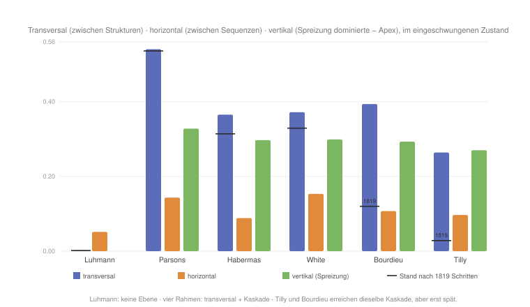

#+AUTHOR: Christian Papilloud
#+LANGUAGE: de
#+OPTIONS: toc:nil num:nil H:4 ^:nil
#+STARTUP: showall
#+LATEX_CLASS: book
#+LATEX_CLASS_OPTIONS: [11pt,a4paper]
#+CITE_EXPORT: csl chicago-author-date-de.csl
#+BIBLIOGRAPHY: Bericht.bib

* Kapitel 11 — Synthese: Kontrastachsen und das Gespräch mit der TR
:PROPERTIES:
:STATUS: DRAFT
:END:

# Synoptische Matrix (Rahmen x Reglerdimension); die tragenden Kontrastachsen: direkte Konvertibilität vs. Vermittlung; Schließung vs. Zirkulation; Position ohne Gehalt vs. Struktur mit Instanzen; primäre ko-konstituierte Kategorien vs. relational erzeugte Kategorien; Vermittlung und Reflexivität als Ort der Nähe.

** 11.1 Eine tragende Kontrastachse: die Vermittlung unter Herrschaft
:PROPERTIES:
:STATUS: DRAFT
:END:
Quer durch die Kontrastkapitel zieht sich eine Achse, die das Gespräch mit der TR besonders scharf führt: das Schicksal der /Vermittlung/. Für die TR ist die Beziehung wesentlich /vermittelt/ — Kultur erreicht die Wirtschaft nur über die Medien und die Politik, und der vollkommene Zustand ist die symmetrische, vermittelte Reziprozität; eigens den Vermittlungsinstanzen, die diese Vermittlung formalisieren und kanalisieren, ist ein ganzes Kapitel der Theorie gewidmet [cite:@papilloud2022skizze 186 ff.]. Mit dem Volumen der vermittelten Zirkulation (crossOff) lässt sich diese Vermittlung messen, und es zeigt sich, dass die Herrschaft in jedem der Rahmen die Vermittlung /kappt/ — aber auf je eigene Weise, und mit je eigener Dauer.

Bei White ist die Kappung /bedingt/: Der Apex entsteht als Nebenprodukt der Kontrollsuche und drückt die Vermittlung herab (crossOff von 0,266 auf 0,170), doch unter steigender Mobilität flutet sie zurück (0,581) und die Herrschaft erschöpft sich. Bei Tilly ist die Kappung eine /Schließung/: Die Gelegenheitshortung verriegelt die Grenze, die Vermittlung fällt am tiefsten (0,139) und /bleibt/ unter Mobilität gekappt (0,418) — die Sperre überdauert die Wanderung der Personen, weil die Ungleichheit in der Kategorie sitzt [cite:@tilly1998durable 9 f.]. Bei Bourdieu schließlich ist die Kappung eine /Kaperung/: Die Zirkulation hört nicht auf (crossOff bleibt mit 0,172 höher), sie wird in einen privaten, institutionell verwalteten Kanal umgeleitet — die direkte Konvertibilität von kulturellem und ökonomischem Kapital, die die offene Vermittlung kurzschließt und durch die Verkennung als gemeinsame Straße erscheint [cite:@bourdieu1976modes 122; @bourdieu1977pouvoir 405].

Daraus ergibt sich ein Spektrum, dessen Maß die /Ablösung der Herrschaft von ihren Entstehungsbedingungen/ ist. Whites Herrschaft erschöpft sich, weil ihr kein Mechanismus zugrunde liegt, der sie nachfüllte. Tilly und Bourdieu lösen sie von ihren Bedingungen ab — Tilly durch die /Schließung/ der Kategorie, Bourdieu durch die /gekaperte, legitimierte Vermittlung/ —, und nur Bourdieu braucht dafür die Verkennung, während Tilly die materielle Schließung genügt. Für die TR ist dies der genaue Ort des Gesprächs: Da sie die Reziprozität mit der /Vermittlung/ identifiziert, erscheint jede dieser Herrschaftsformen als ein bestimmter Weg, die Vermittlung zu unterbrechen oder zu privatisieren — und ihre eigene Pointe, das Primat der vermittelten Reziprozität, als die Bedingung, unter der Herrschaft sich gerade /nicht/ verfestigt.

** 11.2 Eine zweite Kontrastachse: die Kaskade der Ungleichheit
:PROPERTIES:
:STATUS: DRAFT
:END:
Die TR unterscheidet drei Ebenen der sozialen Ungleichheit, die als /Kaskade/ entlang der morphologischen und strukturellen Determinanten zusammenhängen [cite:@papilloud2022skizze 166 ff.]: die /vertikale/ Ungleichheit innerhalb einer Sequenz (zwischen den Akteurkategorien — Etablierte, Aspiranten, Konservative, Enttäuschte), die /horizontale/ zwischen den Sequenzen einer Struktur, und die /transversale/ zwischen den Relationsstrukturen. Der Simulator misst alle drei: der Gini zwischen den Strukturen erfasst die transversale, der binnenstrukturelle Gini (über die Sequenzen) die horizontale, und ein Status-Gini über die Akteurkategorien die vertikale Ebene. Führt man dieses dreistufige Maß durch alle sechs Rahmen, so wird sichtbar, /wo/ jeder seine Ungleichheit ansiedelt — und wie weit sie die Kaskade hinabreicht (Abbildung).

#+NAME: fig:kaskade-typologie
#+CAPTION: Die Kaskade der Ungleichheit über drei Ebenen, im eingeschwungenen Zustand; die schwarze Marke zeigt, wo die transversale Ebene nach 1819 Schritten stand. Luhmann: keine Ebene. Die übrigen fünf: transversale Herrschaft mit voller Kaskade — Parsons sofort, Bourdieu und Tilly erst spät.

Zwei Regime treten hervor — und zwischen ihnen eine Zeitachse. /Luhmann/ kaskadiert nicht: Keine Ebene hebt sich vom symmetrischen Etalon ab. Das ist stimmig — seine Ungleichheit (Inklusion/Exklusion) sitzt in einer /codierten/ Vertikalen, die der auf der Transversalen gebaute Simulator nicht darstellt; es ist das bereits vermerkte Residuum.

/Parsons, Habermas, White, Bourdieu und Tilly/ zeigen dagegen alle die /volle transversale Kaskade/. Eine starke Herrschaft zwischen den Strukturen (transversal 0,26–0,54) steigt in die horizontale Ebene hinab (die Sequenzen der beherrschten Strukturen verlieren ihr Gleichgewicht) und von dort in die vertikale — und zwar /asymmetrisch/: Der Apex /homogenisiert sich/ (die vertikale Ungleichheit fällt auf etwa 0,24, beim Sieger werden alle zu Etablierten), während die beherrschten Strukturen sich /stratifizieren/ (die vertikale Ungleichheit steigt auf etwa 0,54, die Etablierten fliehen, die Enttäuschten häufen sich an). Die Herrschaft /schließt/ also den Statusabstand beim Dominanten und /öffnet/ ihn bei den Beherrschten — genau die Kaskade entlang der Determinanten.

/Tilly/ steht dabei nicht außerhalb dieser Reihe, sondern an ihrem Ende. Auf dem Horizont, den die Trajektorien zeigen (1819 Schritte), ist seine transversale Ungleichheit nahezu null (0,028; die Strukturen bleiben bei 24/23/26/26 %), während seine horizontale bereits hoch ist (0,144) und /alle/ Strukturen gleichermaßen binnenstratifiziert sind. Wer hier abliest, sieht eine rein /horizontale/, /unterstrukturelle/ Ungleichheit zwischen kategorial gebundenen Sequenzen — und das ist von vollkommener Treue zu Tillys Theorie, dessen gepaarte Kategorien intra-organisational und nicht inter-strukturell sind. Lässt man den Lauf jedoch bis zum eingeschwungenen Zustand laufen, so kippt auch Tillys Feld in einen einzigen Apex (transversal 0,264), und die Kaskade greift wie bei den übrigen vier. Die kategoriale Schließung führt also zu derselben Herrschaft wie die Konzentration — nur auf einem sehr viel längeren Weg.

Damit tritt neben den /Ort/ der Kaskade ihr /Tempo/. Parsons steht von Beginn an oben (transversal 0,536 nach 1819 Schritten, 0,540 im eingeschwungenen Zustand); bei White und Habermas reift die Herrschaft noch etwas nach (0,329 → 0,372 bzw. 0,314 → 0,365); Bourdieu und Tilly aber legen den größten Teil ihres Weges erst nach dem Horizont der Trajektorien zurück (0,120 → 0,394 und 0,028 → 0,264). Die schwarzen Marken in der Abbildung zeigen diesen Abstand. Das ist keine Feinheit der Messung, sondern ein Befund über die Rahmen selbst: Die Konzentration erzeugt Herrschaft rasch, die Schließung erzeugt sie langsam. Tillys /durable inequality/ ist gerade darum eine Theorie der /Dauer/, dass ihr Mechanismus Zeit braucht — und Bourdieus Ko-Reproduktion scheitert nicht an der Gleichzeitigkeit von kulturellem und ökonomischem Kapital, sondern an deren Dauer (vgl. Abschnitt 8.5). Was sich als Unterschied der /Art/ lesen ließe, ist zu einem guten Teil ein Unterschied der /Geschwindigkeit/. Wie wir zu dieser Unterscheidung gekommen sind und was sie über die Grenzen des digitalen Zwillings sagt, führt Kapitel 12 aus (siehe dort besonders 12.4).

Damit ergibt sich eine zweite Kontrastachse neben der Vermittlung: die /Tiefe, der Ort und das Tempo/ der Kaskade. Sie ordnet die sechs Rahmen — von Luhmanns Verweigerung über die späten Kaskaden Tillys und Bourdieus bis zur sofortigen Kaskade Parsons' — und bereitet zugleich die Intersektionalität vor, die nichts anderes ist als die Kaskade /mehrerer, sich verstärkender Determinanten/ zugleich — die wechselseitige Konstitution der Achsen, die Collins als das relationale Herz der Intersektionalität benennt [cite:@collins2019intersectionality; @collins2015dilemmas].

** 11.3 Bilanz I: Was die großen Rahmen beigetragen haben (a)
Die in den vorangegangenen Kapiteln geprüften Rahmen — von Parsons bis zur Intersektionalität — verstanden sich zumeist /nicht/ als relationale Soziologie. Und doch hat jeder von ihnen ein Stück desselben wissenschaftlichen Programms verwirklicht, das die relationale Soziologie später aufgenommen hat: die Verdrängung der /Substanz/ durch die /Relation/, in aufeinanderfolgenden Gestalten.

Parsons denkt die Gesellschaft als ein System von /Austauschen/ zwischen Teilsystemen, vermittelt durch generalisierte Medien und durch die Interpenetration der Subsysteme — die Gesellschaft ist nicht eine Summe von Substanzen, sondern ein Geflecht von Interdependenzen [cite:@parsons1966societies 7; @parsons1951social 211]. Luhmann radikalisiert diesen Schritt: Nicht Personen, sondern /Kommunikationen/ sind die elementare Operation des Sozialen; das Soziale besteht aus Relationen, nicht aus Trägern [cite:@luhmann1984soziale 31]. Habermas verlagert den Grund in die /Intersubjektivität/: Das Soziale entsteht im kommunikativen Handeln zwischen Subjekten, deren Verständigung der Koordination vorausgeht [cite:@habermas1981tkh2 274]. White gibt der Relation ihre /Form/: das Netzwerk, in dem Identität und Kontrolle nicht vorgegeben sind, sondern aus den Relationen hervorgehen [cite:@white1995domination 705; @whiteboorman1976social 730].

Mit Tilly und Bourdieu wird das Programm auf die /Ungleichheit/ angewandt. Tilly lokalisiert die dauerhafte Ungleichheit nicht in Attributen, sondern in /relationalen/ Mechanismen zwischen gepaarten Kategorien — die Ungleichheit sitzt in der Beziehung, nicht im Einzelnen [cite:@tilly1998durable 17; @tilly2000relational 782]. Bourdieu fasst den /Raum/ als Feld relationaler Positionen und die Position als relational definiert, mit einer institutionell verbürgten Konvertibilität der Kapitalien [cite:@bourdieu1979capital 3; @bourdieu1976modes 122]. Die Intersektionalität schließlich, in Collins' Lesart, macht die /Ko-Konstitution/ der Ungleichheitskategorien zum Kern und stellt die Relationalität an die Spitze ihrer Leitthemen [cite:@collins2019intersectionality; @collins2015dilemmas].

So unterschiedlich diese Rahmen sind, zeichnet sich ein gemeinsames /Programm/ ab: der Vorrang der Relation vor der Substanz, in der Folge ihrer Gestalten — Austausch (Parsons), Kommunikation (Luhmann), Verständigung (Habermas), Netzwerk (White), kategorialer Mechanismus (Tilly), Feld (Bourdieu), Ko-Konstitution (Collins). Eben dieses Programm ist das Erbe, das die relationale Soziologie antritt; und die TR liest ihre Vorläufer ausdrücklich in dieser Linie, als aufeinanderfolgende Bestimmungen desselben relationalen Mediums [cite:@papilloud2022skizze 1 ff.].

** 11.4 Bilanz II: Was die relationale Soziologie übernahm und was sie ließ (b)
Die relationale Soziologie, die aus diesen Rahmen hervorging, verfuhr nach einem einzigen Kriterium: Sie übernahm, was die Relation /primär/ setzt, und ließ, was sie /unterordnet/. Die Skizze selbst sichtet die Tendenzen in dieser Absicht [cite:@papilloud2022skizze 1 ff.].

Übernommen wurde zuerst der /Vorrang der Relation/ als solcher. Emirbayers Manifest macht ihn explizit: Nicht die Substanz, sondern die Transaktion ist das Erste; der relationale Standpunkt kehrt das Verhältnis von Entität und Beziehung um [cite:@emirbayer1997manifesto 281, 287]. Von White übernahm die Linie Fuhse/Mische die /Form/ des Netzwerks, von Luhmann den /Sinn/ als Grundbegriff [cite:@fuhse2009meaning 51], von Donati die /Emergenz/ der Relation als sui generis Wirklichkeit [cite:@donati2011relational 298, 307], von Collins die /Ko-Konstitution/ der Kategorien.

Gelassen wurde, was die Relation einem Übergeordneten unterstellt. Luhmanns operative /Schließung/ und sein binärer Code — die Autopoiesis, die die Relation der Selbstreproduktion des Systems unterordnet — wurden /nicht/ übernommen: Fuhse nimmt Luhmanns Sinn, aber nicht die Schließung, weil diese das /System/ primär setzt, nicht die Relation [cite:@luhmann1995recht 103, 105]. Ebenso blieb Parsons' /funktionalistische/ Teleologie zurück, die das Geschehen den Funktionserfordernissen des Systems unterordnet [cite:@parsons1951social 211]. Und gelassen wurde vor allem die /Substanz/ — die Auffassung, die Entitäten gingen ihren Beziehungen voraus —, deren Verabschiedung Emirbayers Manifest geradezu zum Gründungsakt erhebt [cite:@emirbayer1997manifesto 281].

In einem Punkt entzweit sich die Familie über das, was zu lassen sei: Der radikale Transaktionalismus (Dépelteau, im Anschluss an Latour) lässt auch noch die emergente Makro-Struktur fahren und hält die soziale Welt flach [cite:@depelteau2025love 12], während Donati und Archer gerade die Emergenz festhalten [cite:@archer1995realist]. Eben diese Differenz haben die vorangegangenen Kapitel am Simulator vermessen: Die residuale Substanz und das emergente Gut zeigen, dass die flache Variante /zu viel/ lässt. Die TR zieht daraus ihre eigene Konsequenz — sie übernimmt den Vorrang der Relation und die Emergenz, lässt Substanz, Schließung und Funktion, und gründet das Ganze in der /Zirkulation/, die weder System noch Substanz, sondern die Bewegung der Vermittlung selbst ist.

** 11.5 Bilanz III: Wohin die gegenwärtige relationale Soziologie geht (c)
Die gegenwärtige relationale Soziologie, wie Kapitel 10.4 sie versammelt, zeichnet vier neue Richtungen und stellt mit ihnen ebenso viele neue Fragen. Die erste öffnet das Relationale zum /Mehr-als-Menschlichen/: zur Maschine (Gunkel/Coeckelbergh) und zum Lebendigen (Kunnemans biotische Perspektive) [cite:@gunkelcoeckelbergh2026standing; @kunneman2026biotic 233]. Die neue Frage lautet: Wie lässt sich das Nicht-Menschliche einbeziehen, /ohne/ es zu neutralisieren? Die zweite sucht das /messbare Dritte/: Wenn das Soziale im Dazwischen liegt (Brighenti/Sabetta, Silver), wie wird dieses Dazwischen /messbar/, statt nur postuliert zu werden [cite:@brighentisabetta2026reaction 165; @silver2026simmel 327]? Die dritte denkt die /Macht relational/, als Konfiguration von Bändern statt als Eigenschaft (Reed, Buchholz/Schmitz) [cite:@reed2026rector; @buchholzschmitz2026field]. Die vierte öffnet das Relationale zum /Normativen und Vitalen/: zur Richtung, die in der Relation selbst liegt — Kunnemans amor complexitatis, Dépelteaus „with Love“ [cite:@kunneman2026biotic 233; @depelteau2025love 12]. Quer dazu liegt die Intersektionalität als /Ko-Konstitution/ der Ungleichheitsachsen [cite:@collins2019intersectionality].

Diese Richtungen teilen eine einzige, tiefer liegende Frage: Wie lässt sich das Relationale /situieren/ und /messen/, ohne es zu /verdinglichen/ (Donatis Exzess) und ohne es /flach/ zu machen (Dépelteaus Exzess)? Eben das ist der Ort, an dem dieser Bericht ansetzt. Denn der Simulator der TR tut genau dies: Er /misst/ das Relationale — die transversale Ungleichheit am Gini, das Dazwischen am crossOff, das relationale Gut an der Reziprozität, die Kaskade über drei Ebenen — und er /situiert/ es — in vier Strukturen mit eigenem Gewicht, in einer Vermittlungsordnung, in der das Nicht-Menschliche seinen Platz hat. Damit schließt sich der Bogen der Kontrastkapitel: Von Parsons bis zur Intersektionalität wurde dasselbe Programm entfaltet, der Vorrang der Relation; die relationale Soziologie hat daraus übernommen, was die Relation primär setzt, und gelassen, was sie unterordnet; und ihre gegenwärtigen Fragen — das Nicht-Menschliche, das messbare Dritte, die relationale Macht, die Norm — laufen alle auf die eine Aufgabe hinaus, das Relationale messbar und situiert zu denken. Die TR beantwortet sie mit einem einzigen Begriff: der /Zirkulation/, die weder Substanz noch System ist, sondern die Bewegung, aus der Substanz, Gut, Sinn, Macht, das Dritte und die Norm als messbare Effekte hervorgehen. Bevor wir diesen Begriff beim Wort nehmen, legen wir in Kapitel 12 Rechenschaft über das Instrument ab, mit dem alle bisherigen Befunde gewonnen wurden — über das, was es zuverlässig zeigt, und über das, worin es in die Irre führt. Kapitel 13 führt den Begriff dann über den Kontrast hinaus und wendet ihn auf einen wirklichen Fall an.

** Literatur
#+print_bibliography:
