#+TITLE: Relationale Soziologie im Kontrast. Simulationsgestützte Untersuchung verborgener ontologischer Prämissen relationaler Ansätze mit der Theorie der Relation
#+AUTHOR: Christian Papilloud
#+LANGUAGE: de
#+OPTIONS: toc:t num:t H:5 ^:nil
#+STARTUP: showall
#+LATEX_CLASS: book
#+LATEX_CLASS_OPTIONS: [11pt,a4paper]
#+CITE_EXPORT: csl
#+BIBLIOGRAPHY: Bericht.bib

# ======================================================================
# Hinweis zur Arbeitsweise (nicht Teil des Fließtextes):
# - Org-mode, lange (nicht umbrochene) Zeilen pro Absatz.
# - Zitate via org-cite: [cite:@schlüssel] bzw. mit Seitenangabe [cite:@schlüssel p. 13].
# - Ebene 1 (*)   = Teil   -> exportiert als \part
# - Ebene 2 (**)  = Kapitel -> exportiert als \chapter
# - Ebene 3 (***) = Abschnitt
# - Status der Kapitel: TODO = ausstehend, WIP = in Bearbeitung, DONE = validiert.
# ======================================================================

* Vorwort
:PROPERTIES:
:STATUS: DRAFT
:END:

Dieser Bericht verlängert die Arbeiten, die zur Theorie der Relation als einem analytisch-interpretativen Rahmen im Zusammenhang von existierenden relationalen Ansätzen im Bereich der soziologischen Theorien geführt haben und sie im Rahmen von empirischen Untersuchungen verwendet haben. Er zieht die Folgen aus der Diskussion, die diese Arbeiten motiviert haben und insbesondere zwei Aspekten der Theorie der Relation betreffen. Zum einen haben sich Fragen nach der inneren Kohärenz des theoretischen Rahmens gestellt, die deshalb legitim sind, weil die Theorie der Relation eine Fülle von neuen Begriffen entwickelt, davon die Verbindung miteinander für diejenigen Soziologen nicht selbstverständlich sind, die einem solchen Theorierahmen nicht vertraut sind. In diesem Bericht haben wir versucht, diese innere Kohärenz zu prüfen, indem wir die Theorie der Relation in ein analytisches Modell umgewandelt haben, das diese Theorie simuliert und gegen die Annahmen und die Architektur der Theorie getestet werden kann. Zum zweiten und auf dieser Grundlage aufbauend haben wir versucht, dieses Modell bzw. den digitalen Zwillinge der Theorie der Relation zu verwenden, um die Theorie der Relation im Kontrast mit den Gründungsimpulsen der relationalen Soziologie ebenso wie mit ihren Kusinen in der gegenwärtigen Familie der relationalen Soziologien zu positionieren. Dies hat uns drittens zur folgenden Frage geführt: Was zeigt uns die Theorie der Relation, die wir ansonsten mit anderen Theorierahmen nicht sehen würden? Eine solche Frage zu beantworten, entfernt uns vom Vergleich zwischen Theorierahmen und deren Annahmen, und er führt zur Anwendung vom digitalen Zwillinge auf reale Daten bzw. zu einer Verwendung vom digitalen Zwillinge nicht nur als analytisches Werkzeug der epistemologischen Analyse, sondern auch als methodologisches Werkzeug in der Unterstützung der soziologischen Untersuchung. Um diesen Schritt zu machen, haben wir ein Beispiel aus der Forschung zur sozialen Mobilität der Mitglieder der Arbeiterklasse in Großbritannien vom 19. Jahrhundert bis zum zweiten Drittel des 20. Jahrhunderts genommen und es mit unserem digitalen Zwillinge behandelt. Dieser Bericht veröffentlicht unsere Ergebnisse in jedem Anwendungsfall, und es schlägt somit ein neues Werkzeug für die Methodenentwicklung im Rahmen von relationalen Ansätzen vor, die mit der Theorie der Relation arbeiten möchten.

* Teil 0 — Fragestellung, Referenz und Methodik

** Kapitel 1 — Einleitung. Fragestellung und Zielsetzung
:PROPERTIES:
:STATUS: WIP
:END:

Der Anstoß zu diesem Bericht entspringt dem Bedürfnis, eine erste Bilanz in Bezug auf die Theorie der Relation (dann als TR gekürzt) zu ziehen. Nachdem sie veröffentlicht [cite:@papilloud2022skizze] und in empirischen Arbeiten erprobt wurde, in denen sie als integrierender Rahmen für die Analyse von empirischen Daten diente, durfte der anfängliche Enthusiasmus im Lauf der Gespräche mit Kolleginnen und Kollegen nach und nach eingeschränkt werden. Als ein junges Angebot im nicht mehr so jungen Feld der relationalen Ansätzen in der Soziologie kommuniziert die TR mit Begriffen und Ansätzen, die nicht gewöhnlich sind und Fragen auftauchen lassen. Was meint die TR? Ist es überhaupt nötig, eine neue Theorie in einem Fach zu entwickeln, das nicht an theoretischen Rahmen mangelt? Selbst die Familie der gegenwärtigen relationalen Soziologien erscheint bei nüchterner Betrachtung als ein bescheidenes Bündel von Vorschlägen, das auf den Schultern großer Riesen der Vergangenheit sitzt — Simmels Wechselwirkung, Whites Netzwerken [cite:@white1995domination S. 705], Bourdieus relationalem Feld [cite:@bourdieu1979capital S. 3] —, von denen es bisweilen nicht unbedingt verständlich ist, wie es sich unterscheidet. Die relationale Soziologie in der Nachfolge Whites [cite:@fuhse2009meaning S. 51], der Transaktionalismus Emirbayers [cite:@emirbayer1997manifesto S. 281] und Dépelteaus [cite:@depelteau2018handbook], die emergentistische Perspektive Donatis [cite:@donati2011relational S. 298] — sie alle berufen sich auf die Relation, deren Bestimmung bei jedem anders ausfällt. Und die TR reiht sich dem ersten Anschein nach einfach in diese Reihe ein. Also was meint die TR bzw. wie hält das Gerüst zusammen, wie markiert es seine Differenz gegenüber den anderen großen bestehenden Rahmen, wie schreibt sie sich in die gegenwärtigen relationalen Soziologien ein — und vor allem, was zeigt sie uns, das wir ansonsten mit anderen Theorien nicht sehen würden? Diese vier Fragen geben dem vorliegenden Buch seinen grundlegenden Ausgangspunkt.

Diese Fragen lassen sich nicht schnell beantworten, und sie machen ein Problem bei der Formulierung der Antworten deutlich aus: Wie können diese Fragen beantwortet werden, ohne dass es deshalb noch tiefer in das begriffliche Jargon des eigenen theoretischen Apparats eingetaucht werden muss — und ohne ins andere Extrem zu verfallen, die Theorie so weit zu vereinfachen, dass man das Baby mit dem Badewasser auswirft? Die Frage nach der Form, in der sich der Dialog mit den anderen Theorierahmen knüpfen lässt, ist das Problem, vor dem jede Theorie steht, die von sich behauptet, sie würde ein neues Angebot liefern — so, wie die relationale Soziologie es seit Emirbayers Manifesto immer wieder getan hat [cite:@emirbayer1997manifesto S. 281], und so, wie die gegenwärtige Familie der relationalen Soziologien es in ihren Sammelbänden fortführt [cite:vgl. etwa @depelteau2018handbook].

Dieses Problem berührt die Theorie in ihrem Kern: Sie muss fähig sein, sich zu verwandeln, um über sich selbst zu sprechen. Wir haben stets gedacht, dass eine Theorie, die zu dieser Transformation — im wörtlichen Sinne eines Formwandels — nicht gelangt, weder ihre eigenen Grenzen ins Auge zu fassen noch sich mit anderen Rahmen und mit der Vielfalt der Tatsachen ins Gespräch zu bringen vermag, sondern in der bloßen Wiederholung ihrer selbst verharrt. Eben dies wollten wir der TR ersparen [cite:@papilloud2022skizze], und deshalb haben wir mit der nüchternsten aller Fragen angefangen, die man in Bezug auf die TR angehen könnte: Ob sie überhaupt in sich kohärent ist.

Um diese Kohärenz zu prüfen, brauchten wir ein Werkzeug, das uns erlauben würde, sie zu testen — und wir haben uns für ein in der soziologischen Theorie ungewöhnliches Vorgehen entschieden: Den theoretischen Rahmen selbst in ein Modell zu überführen, das die TR simulieren würde. Dies bedeutet nichts anders, als einen digitalen Zwilling der TR mit dem Vorteil aufzubauen, dass es dann unter verschiedenen Simulationsbedingungen auf all ihren Ebenen geprüft werden kann. Diese Prüfung sollte mit den elementarsten Mechanismen der TR anfangen — der doppelten Einschreibung von Akteuren und Vermittlungsinstanzen in das, was wir Relationsstrukturen oder Ordnungen der Relation nennen [cite:@papilloud2022skizze p. 8, 32]. Sie sollte dann bis hin zu den komplexeren Phänomenen des wechselseitigen Einflusses zwischen Sequenzen und Relationsstrukturen, der Macht und der Herrschaft, den daraus folgenden sozialen Ungleichheiten und den Veränderungen der sozialen Mobilität und der entsprechenden Zirkulationen von Akteuren weiter gehen, die diese Theorie zu problematisieren versucht (ebd. S. 166) und als Produkte der wechselseitigen Satellisierung von Relationsstrukturen versteht (ebd. S. 321 ff.). Es ist eine komplexe Aufgabe. Denn diese Übersetzung eines begrifflichen Rahmens in ein digitales Modell geht nicht ohne Kompromisse vonstatten, und sie liefert vor allem nicht von selbst eine Testplattform der Theorie. Deshalb haben wir uns diese Aufgabe mit der Unterstützung der künstlichen Intelligenz — genauer des Sprachmodells Opus 4.8 von Anthropic — neben anderen eigenen Skripten in der Python Programmiersprache vorgenommen. Dies hat uns geholfen haben, von der bloßen Intuition zu einem digitalen Zwilling der TR zu gelangen, den wir in diesem Band vorstellen und für unsere Untersuchungen verwenden (vgl. https://github.com/cp1972/TR-Twin zur Github-Seite vom digitalen Zwilling der TR).

Der digitale Zwilling ruht auf einem mathematischen Modell der Diffusion von Massen bzw. von Energien in Systemen, das den Zustand des globalen Rahmens bzw. der Theorie zu jedem Zeitpunkt durch die folgenden Größen beschreibt: Das relationale Gewicht jeder der vier Relationsstrukturen, die Größe der Sequenzen innerhalb jeder Struktur, die Komposition der vier Akteurkategorien in jeder Sequenz, die plastischen Ketten, die die Schmetterlingspfade innerhalb von Relationsstrukturen abbilden und ihre sequentielle Ordnung kodieren, das Regime jeder Struktur mit ihren Vermittlungsinstanzen und einen Ermüdungsspeicher zur Registrierung der Belastung von Relationsstrukturen und Sequenzen durch ihre Satellisierung von anderen Relationsstrukturen. Das Modell ist deterministisch -- ab einem Ereignis entwickelt sich den ganzen Rahmen der TR auf ihren unterschiedlichen Ebenen --  und von unterschiedlichen Bedingungen gesteuert, die der Theorie entsprechen. Es simuliert die Zirkulation von Akteuren in der TR, sodass das System in kleinen, durchgängig stetigen zeitlichen Schritten fortschreitet, damit keine Sprünge zurück entstehen. Die einzelnen Mechanismen haben wir mit Opus 4.8 so implementiert, dass sie der Theorie Zug um Zug folgen: Entlang jeder Kette transportiert eine Pumpe die Masse bzw. die Akteure zum herrschenden Terminal (Akteurkategorie bzw. Sequenz bzw. Relationsstruktur). Eine Rückkopplung verteilt einen Teil von diesen Akteuren zurück. Damit steigen und fallen in jeder Sequenz die Akteure zwischen den Kategorien je nach ihrem erfolgreichen Aufstieg bzw. nach ihrem Abstieg. Aufgestiegene Akteure können somit ihre Herkunftssequenz für eine andere Sequenz in derselben oder für die entsprechende Sequenz einer anderen Relationsstruktur verlassen. Akteure, die ausgeschlossen werden, gehen zu den entsprechenden Sequenzen einer anderen Relationsstrukturen, deren Durchlässigkeit ein eigener Parameter steuert -- deshalb erfolgt ein solcher Weg von Sequenzen zu Sequenzen oder Relationsstrukturen zu Relationsstrukturen nicht automatisch, sondern nach parametrierten Bedingungen. Aus diesen Kopplungen und deren Variationen entsteht die wechselseitige und entsprechend variierende Satellisierung der Relationsstrukturen.

Entscheidend ist dabei, dass die Reziprozität, die die TR als ein Produkt der Zirkulation der Akteure innerhalb und zwischen Relationsstrukturen ab den Einschreibung von Akteuren und Vermittlungsinstanzen in einer Relationsstruktur versteht, keine Stellgröße ist. Die Reziprozität im digitalen Zwilling ist ein der Theorie treues gemessenes Produkt der Zirkulation, und sie spiegelt wider, wenn man so will, die wechselhafte Legitimität dieser Zirkulation (S. 36 ff.). Sie wird als Kurve berechnet, die mit der guten Gesundheit von Vermittlungsinstanzen der Relationsstrukturen steigt und mit Ungleichheiten, Friktion, Abbruch der Zirkulationen, Sklerose der Sequenzen und Relationsstrukturen und einem ungelösten Rest an relationalen Problemen -- keine Relation kann zur perfekten Relation werden, sagt die TR -- fällt. Ebenso wird die Ungleichheit auf drei Ebenen als Gini-Index (Messung der ungleiche Verteilung der Akteure innerhalb von Sequenzen und Relationsstrukturen sowie auf der Ebene der vier Relationsstrukturen) gelesen. Zahlreiche Iterationen sind notwendig gewesen, um zu diesem digitalen Zwilling zu gelangen, der simuliert, wie die Theorie ihre Erklärungen erzeugt, und der zu prüfen erlaubt, ob diese Erklärungen standhalten, wenn man ihre Konsequenzen auf allen Ebenen der Theorie zieht — oder ob sich im Gegenteil Inkohärenzen zeigen und wie sie zu beheben wären.

Die Disziplin dabei ist streng: Eine Divergenz zwischen Simulator und Theorie informiert nur dann über die Theorie, wenn das Modell den Mechanismus der Theorie getreu kodiert. Andernfalls prüft man die eigene Kodierung, nicht die Theorie. Die folgende Beschreibung bleibt diesem Ansatz treu, damit ein an die Sozialwissenschften interessierter hypothetischer Mathematiker sie lesen, im Code nachschlagen und den Fehler suchen könnte. Auf der Grundlage dieses Prüfstandes — eines digitalen Zwillings der TR, der ihr Verhalten simuliert — konnten wir uns ihres Verhaltens in allen ihren Folgen bewusst werden. Die Tests, die wir damit gemacht haben, zeigen zweierlei. Zum einen belegen sie, dass die Erklärungen der Theorie kohärent standhalten, wenn man ihre Konsequenzen auf allen Ebenen der Theorie zieht. Zum anderen bringen sie Verhaltensweisen ans Licht, die dem bloßen Text zur TR nicht abzulesen sind: Eine Bifurkation — eine Verzweigung — zwischen einem reziproken Regime, in dem die Strukturen mehr oder weniger symmetrisch zirkulieren, und einem Apex-Regime, in dem eine Relationsstruktur den Vorrang über die anderen Relationsstrukturen (der „Apex“) nimmt und diese anderen Relationsstrukturen stärker satellisiert. Eine solche Satellisierung führt zu einer Kaskade der Ungleichheiten über drei Ebenen -- vertikalen, horizontalen und transversalen Ungleichheiten innerhalb und zwischen Relationsstrukturen, die im digitalen Zwilling zusammen in ihrer Wechselbeziehung betrachtet werden können -- und zu einer entsprechenden Variation der Reziprozität im ganzen Rahmen der Relationsstrukturen und innerhalb jeder Relationsstrukturen als emergentes Produkt dieser satellisierten Zirkulation.

War der Simulator erst einmal in der Lage, das relationale Muster der TR getreu abzubilden, so stellte sich von selbst eine zweite Frage — und mit ihr das zweite Vorhaben in diesem Bericht. Ließen sich mit demselben Werkzeug auch andere theoretische Rahmen simulieren, die sich von der TR unterscheiden aber gleichwohl auf einem relationalen Schema gegründet sind — von der Systemtheorie über die Netzwerkanalyse und die Feldsoziologie bis hin zu den gegenwärtigen relationalen Soziologien [cite:@emirbayer1997manifesto p. 281; @depelteau2018handbook]? Mit dieser Frage war die Idee verbunden, den Simulator als ein Werkzeug zur systematischen Theorienvergleich zu gebrauchen, statt es nur als ein gemeinsamer Prüfstand zu verwenden, auf dem sich Nähen und Differenzen beobachten lassen.

Ein solcher Vergleich verlangt jedoch wichtige Vorsichtsmaßnahmen, damit sie die Eigenart der verglichenen Rahmen nicht einebnet. Jeder Rahmen wird auf seine eigenen Begriffe und aus seinen eigenen Texten rekonstruiert und erhält eine eigene Konfiguration der Regler des Simulators — seine spezifischen Festlegungen über Zirkulation, Vermittlung, Reziprozität und Satellisierung —, die an dem geprüft wird, was seine Autoren tatsächlich geschrieben haben. Ein neutraler Bezugszustand (ein Etalon), in dem alle Strukturen symmetrisch und gleich sind, dient als Vergleichsgrund, von dem sich das besondere Regime jedes Rahmens abhebt. Wir zwingen also keinen Rahmen in die Form der TR, sondern lassen sein eigenes Regime sich entfalten, das über die TR hinausragen kann, und so können wir an ihm zugleich seine Nähe zur TR und seine Differenz lesen. Nur dort, wo das Modell den Mechanismus eines Rahmens getreu kodiert, sagt eine Abweichung etwas über diesen Rahmen aus — andernfalls über unsere Kodierung und ist deshalb für den intendierten Vergleich nicht relevant. Im Folgenden kommen wir zu den Schritten, die vorgenommen worden sind, um diesen Vergleich zwischen relationalen Theorierahmen und der TR zu machen. Wir fangen mit einer Erinnerung an die Grundbegriffen der TR an, die als Referenzrahmen für den intendierten Vergleich dient, und wie sie im digitalen Zwilling fungieren.

** Kapitel 2 — Die TR als Referenzrahmen
:PROPERTIES:
:STATUS: DRAFT
:END:

Dieses Kapitel legt die TR als jenen Referenzrahmen dar, gegen den die Theorierahmen kontrastiert werden. Es stützt sich auf [cite:@papilloud2022skizze] und auf die wissenschaftliche Dokumentation des Zwillings (https://github.com/cp1972/TR-Twin/blob/main/docs) und stellt nur das für das Verständnis des Vergleiches Notwendige vor — die Architektur, nicht die Methode, die das Kapitel 3 (s. unten) behandelt.

*** Vier Relationsstrukturen und ihre Sequenzen
Die TR konzeptualisiert vier /Relationsstrukturen/ — die sozio-kulturell orientiert Relationsstruktur oder kurzum "Kultur"" (A), die politisch orientierte bzw. kurz genannte "Politik" (B) Relationsstruktur, die sozio-ökonomisch bzw. verkürzt genannte "Wirtschaft" (C) Relationsstruktur und die Medien orientierte Relationsstruktur oder kurz "Medien"" (D) —, die nicht von Natur aus inhaltlich bestimmt sind, sondern sich aufgrund der grundlegenden Unterscheidung in ihrer Dynamik -- in ihrer Zirkulation sagt die TR -- gegenseitig voneinander abweichen [@papilloud2022skizze S. 8]. Jede Struktur besteht aus Sequenzen und Teilsequenzen, welche das darstellen, was in einer Relationsstruktur auf dem Spiel steht: die Relation selbst (A), ihre Repräsentation (B), ihre materielle Verwirklichung (C) und ihre Attraktivität bzw. Anziehungs- und Rekrutierungskraft (D). Da die Zirkulation in jeder Struktur in einer anderen Sequenz beginnt und endet, besitzt jede Struktur ihre eigene, spezifische /sequentielle Ordnung/ — ihre Kette, was die TR mit dem Begriff "Schmetterlingspfad" nennt.

*** Primat der Zirkulation und systemische Reziprozität
Die Relation zirkuliert: Akteure bewegen sich durch die Strukturen und treffen auf Vermittlungsinstanzen, die sich nicht bewegen, sondern wachsen, schrumpfen, aufgebaut oder abgebaut werden. Die Zirkulation hängt von der Reziprozität ab, um sich zu entwickeln und zu stabilisieren, und die Reziprozität setzt umgekehrt voraus, dass Akteure und Kollektive zirkulieren (S. 36 ff.). Diese Reziprozität ist systemisch und nicht normativ: Sie ist der Grad der Legitimität der Zirkulation und somit keine vorgegebene Norm. Der vollkommene Zustand ist mithin der symmetrisch-reziproke Zustand — die vier Strukturen sind formal dieselben, und sie sind symmetrisch; die Zirkulation ist vollständig wechselseitig (in der Sprache vom digitalen Zwilling sprechen wir von einer C4-Symmetrie).

*** Vermittlung
Jede Relationsstruktur ist durch die Anordnung ihrer Sequenzen im Schmetterlingspfad bzw. in der Sprache des Zwillings: durch ihre eigene Kette von Sequenzen grundsätzlich vermittelt. Etwa die Kultur einbezieht die Wirtschaft nur über zuerst die Medien und dann die Politik. Die Akteure und die Vermittlungsinstanzen schreiben sich in Wechselwirkungen in eine Sequenz ihrer Relationsstrukturen ein. Die Vermittlungsinstanzen -- Instanzen der Gesellschaft wir Institutionen und Organisationen -- stützen, sozialisieren und positiv wie negativ sanktionieren die Akteure, und sie tragen damit dazu bei, die Zirkulationen innerhalb und zwischen Relationsstrukturen umzulenken bzw. zu dimensionieren (ebd., S. 32).

*** Akteurkategorien, Mobilität und Schichtung
Innerhalb jeder Sequenz steigen und fallen die Akteure zwischen vier Akteurkategorien je nach ihrem Schicksal, das die Stärke der Sequenz und die Einflusskraft der Relationsstruktur beeinflussen, in denen sich diese Akteure befinden. Dies ist die vertikale Dimension der Ungleichheit, die die Theorie zu problematisieren sucht (S. 166 ff.). Eine horizontale Dimension der Ungleichheit ergibt sich aus der entsprechenden ungleichen Zirkulation der Akteure zwischen Sequenzen der selben Relationsstruktur. Eine transversale Dimension der Ungleichheit entsteht aus der ungleichen Zirkulation der Akteure zwischen Relationsstrukturen. Die sozialen Ungleichheiten verstehen sich dann aus der Perspektive der TR immer als die Zusammenstellung von diesen drei Dimensionen der vertikalen, horizontalen und transversalen Ungleichheiten.

*** Satellisierung
Schrumpft eine Relationsstruktur, so wird sie nicht bloß kleiner, sondern sie verliert an innerer Stärke in der Unterstützung der Zirkulation ihrer Akteure und in der Stärkung der Position ihrer Vermittlungsinstanzen  — ihre geschwächten Vermittlungsinstanzen können sie nicht mehr autonom tragen. Die TR spricht hier von Satellisierung der Relationsstrukturen -- eine geschwächte Relationsstruktur wird zum Satellit jener Relationsstruktur, die sie satellisiert (ebd., S. 321 ff.). Die Satellisierung ist das makrosoziologische Phänomen der Herrschaft im Sinne der Verwendung von einer relationalen Macht, das sich bis auf die Ebene der Sequenzen und Teilsequenzen ablesen lässt.

*** Der Referenzzustand
Der symmetrisch-reziproke, vermittelte Zustand ist der Bezugszustand im digitalen Zwilling, davon sich die anderen Theorierahmen Schritt für Schritt unterscheiden. Jeder Kontrast misst, wie weit die — ausgesprochenen oder verborgenen — Festlegungen eines Rahmens über Zirkulation, Vermittlung, Reziprozität und Satellisierung von diesem Zustand abweichen bzw. wie diese Theorierahmen die Zirkulation, die Vermittlung, die Reziprozität, die Satellisierung zum "scheitern" bringen, und wie dabei ihre eigene Eigenschaften sowie die Grundannahmen, die mit diesen Eigenschaften verbunden sind, widerspiegelt werden.

Im folgenden Kapitel erklären wir im Detail, wie dieser Vergleich im digitalen Zwilling tatsächlich erfolgt.

** Kapitel 3 — Methodik: der Simulator als abduktives Kontrastinstrument
:PROPERTIES:
:STATUS: DONE
:END:

*** Register: Abduktion, nicht Konfirmation
Der Simulator widerlegt keinen Theorierahmen empirisch. Er macht die innere relationale Logik sichtbar, auf die sich ein Rahmen verpflichtet, und er entfaltet deren Konsequenzen. Das Verfahren ist abduktiv und falsifizierbar, nicht konfirmatorisch: Es erzeugt prüfbare Lesarten der theoretischen Grundorientierungen eines Rahmens, und wenn die Primitiven eines Rahmens nicht widerspruchsfrei auf die Ontologie des digitalen Zwillings abgebildet werden können, gilt dies als ein Ergebnis im Sinne einer Feststellung der Inkompatibilität zwischen TR und dem besonderen Theorierahmen und nicht als ein Mangel vom untersuchten Theorierahmen.

*** Einheitliches Gabarit (Schritte 0–7)
Jeder Autor bzw. jede Strömung wird nach demselben Raster behandelt, damit die Ergebnisse vergleichbar bleiben und am Ende in einer synoptischen Matrix überführt werden können:

0. /Ontologische Korrespondenz und Residuum./ Wie bilden sich die Primitiven des Rahmens auf die vier Relationsstrukturen, die Sequenzen, die Vermittlungsinstanzen und die Akteurskategorien ab? Wo der Rahmen die Ontologie der TR überschreitet oder unterschreitet, wird das Residuum als theoretische Differenz protokolliert.
1. /Theoretischer Kern./ Zwei bis vier Grundorientierungen von jedem Theorierahmen werden aufgenommen, die durch genaue Belegstellen im Theoriewerk abgesichert werden.
2. /Operationalisierungstabelle./ Sie wird Regler für Regler hergestellt, und sie berücksichtigt die Ketten (Kopplungen) und die strukturelle Prämissen; jede Zeile der Operationalisierungstabelle wird durch eine Textstelle im Theoriewerk gerechtfertigt, samt Angabe; damit kann präzise gesagt werden, was beim Referenzwert der TR belassen wird und warum.
3. /Vorab registrierte Hypothesen./ Was der Simulator zeigen soll, wird vor dem Lauf des Vergleiches festgehalten (Falsifikationsdisziplin).
4. /Validierter Lauf./ Headless-Validierung des Profils, anschließend Lektüre der Ausgaben (Reziprozität, Gini, Satellisierung, Größen je Struktur, Instanzen, Übergänge).
5. /Lektüre./ Nähen zur TR, Differenzen, freigelegte verborgene Prämisse, interne Spannungen des Rahmens strukturieren den Vergleich.
6. /Robustheit./ Bei unsicheren Reglern werden Variationen vorgenommen, damit es geprüft wird, ob der Kontrast bestehen bleibt.
7. /Entwicklungslinien./ Aus den Vergleichen mit den Theorierahmen wird erklärt, ob und wie die TR sich im Kontext der vergleichenden Theorierahmen einreiht.

*** Zwei Artefakte
Damit alle Kontraste kommensurabel bleiben, werden zwei Bezugsgrößen ein für alle Mal fixiert. Erstens das Referenzprofil der TR: die dokumentierten Reglervorgaben samt der C4-symmetrischen Ketten (volle Vermittlung bzw. ungestörte relationale Dynamik der Relationsstrukturen, Primat der Zirkulation, systemische Reziprozität = simulierte perfekte Relation). Jeder Kontrast wird gegen dieses Profil gelesen. Zweitens ein gemeinsames Kontrastszenario, das für alle Theorierahmen konstant gehalten wird, sodass jeweils nur das Profil des Rahmens variiert; ohne diese Konstanz wären die Vergleiche nicht kommensurabel.

*** Der digitale Zwilling: Lauf, Keim, Regentschaft und Kennzahlen
Der digitale Zwillinge verwendet Begriffe, die in allen Kapiteln des ersten Teils wiederkehren. Diese Begriffe haben wir ausgewählt, damit die Ergebnisse ohne Rückgriff auf den Programmcode verständlich bleiben.

Der /Zustand/ des digitalen Zwillings besteht zu jedem Zeitpunkt aus der Größe jeder der vier Strukturen (ihr Anteil am gesamten Feld, in Prozent bzw. ihre sozio-demographische Größe), aus der inneren Zusammensetzung jeder Struktur (ihren Sequenzen) und aus der Stärke ihrer Vermittlungsinstanzen.

Ein /Lauf/ ist die schrittweise Entfaltung dieses Zustands in der Zeit: Ausgehend von einem nahezu symmetrischen Anfangszustand integriert der Simulator die relationale Dynamik in vielen kleinen Zeitschritten — in den Läufen dieses Berichts sind es rund 1819 Schritte — bis sich ein stabiler Zustand einstellt. Der Lauf ist deterministisch: Bei gleichem Ausgangspunkt liefert er stets exakt dasselbe Ergebnis.

Den Ausgangspunkt legt ein /Keim/ (engl. seed) fest: eine ganze Zahl, die den Zufallsgenerator initialisiert, der die winzige anfängliche Störung der ansonsten symmetrischen Startlage erzeugt. Derselbe Keim erzeugt denselben Lauf; verschiedene Keime erzeugen verschiedene Mikro-Anfangsbedingungen. Liefern viele Keime dasselbe Ergebnis, so ist dieses Ergebnis strukturell bedingt und kein Artefakt der zufälligen Startlage — das ist der Sinn der Keim-Variation in den Robustheitsprüfungen. Alle Läufe werden /headless/ durchgeführt, das heißt ohne grafische Oberfläche, rein rechnerisch und als getreue Nachbildung der Simulationsschleife der Anwendung; das sichert Simulators prüfbare und reproduzierbare Kennzahlen.

Ein Hinweis zur /Zeitachse/ müssen wir formulieren, um ein mögliches Missverständnis auszuräumen. Die Profile der Theorierahmen (die in * =.csv=-Dateien gespeichert werden und im digitalen Zwilling hochgeladen werden) tragen zwei Wertspalten, die mit „1900“ und „2000“ beschriftet sind. Die graphische Oberfläche zeigt eine entsprechende Zeitleiste unten im zentralen Feld. Es handelt sich nicht um Jahreszahlen, und keine der hier berichteten Simulationen bildet den historischen Zeitraum 1900–2000 ab. Diese beiden Zahlen bezeichnen lediglich Anfang und Ende der abstrakten Laufachse — die beiden Stützpunkte, zwischen denen die Reglerwerte linear interpoliert werden —, damit sich das Verhalten eines Rahmens beobachten lässt, wenn die Regler von einer Einstellung zu einer anderen verändert werden. Aussagekräftig sind allein die Reglerwerte an den beiden Stützpunkten, nicht deren Beschriftung; bleibt ein Regler über den Lauf konstant, so trägt er in beiden Spalten denselben Wert. Die Zeitleiste ist mithin eine Laufachse, keine Chronologie.

Vier Kennzahlen unterstützen die Lesart des Vergleichs. Erstens gibt es die bereits erwähnte Größe jeder Struktur. Zweitens gibt es das, was wir die /Regentschaft/ nennen (im Code: /ruler/): Jede Struktur steht in einem Regiment — entweder ist sie autonom und regiert sich selbst, oder sie wird von einer anderen Struktur satellisiert bzw. regiert, deren Regime die innere Dynamik der regierten Struktur bestimmt. „X regiert Y“ bedeutet also, dass die innere Dynamik der Relationsstruktur Y der von der Relationsstruktur X gesetzten Dynamik (schwächer bzw. stärker) folgt. Die Regentschaft drückt die Bedeutung von einer relationalen Ordnung bezogen auf ihre /Steuerungskraft/ aus, die nicht mit der Größe einer Relationsstruktur übereinstimmt: Eine Relationsstruktur kann regieren, ohne die größte Relationsstruktur zu sein, und eine große Relationsstruktur kann von einer kleineren Relationsstuktur regiert werden. Drittens kommt die /Satellisierung/ vor (die Variable satS im digitalen Zwilling, die einen Wert zwischen 0 und 1 erhält): Sie misst, wie stark eine Struktur zum Trabanten eines herrschenden Pols wird — sie schrumpft auf ihn zu, und ihre eigene Reziprozität bricht ein. Viertens übernehmen die /Reziprozität/ (eine Variable, die einen Höchstwert 1 für freie, gleiche Zirkulation erhält): Sie bricht mit zunehmender Ungleichheit, mit blockierter Zirkulation und mit ungeregelter Spannung ab. Ergänzend werden ebenfalls die Ungleichheit der Größen (Variable GINI), die ungeregelte innere Spannung von Relationsstrukturen (Variable meanResid) und die Erschöpfung einer überdehnten Relationsstruktur (Variable Fatigue) zusätzlich mit berücksichtigt.

Wir kommen jetzt zu dem konkreten Vergleich zwischen den Theorierahmen mit dem Rahmen der TR. Im Vergleich berücksichtigen wir zuerst größere Rahmen, die sich nicht unbedingt im Feld der relationalen Soziologie befinden, jedoch teilweise nach einem relationalen Ansatz oder einem sehr ähnlichen Ansatz argumentieren und der relationalen Soziologie Grundimpulse gegeben haben, oder die von relationalen Soziologie wieder aufgenommen und mit Ansätzen der relationalen Soziologie teilweise gekoppelt werden. Dabei fangen wir mit der Systemtheorie in den Fassungen von Talcott Parsons und Niklas Luhmann im Kontrast zur Theorie des kommunikativen Handelns von Jürgen Habermas. Wir machen dann weiter mit dem Gründer der relationalen Perspektiven im Rahmen der Netzwerktheorie Harrison White und seinem Mitstreiter Charles Tilly und seiner Auffassung von dauernden sozialen Ungleichheiten. Bezogen auf die Auffassung der Ungleichheit bei Tilly ziehen wir im Vergleich den relationalen Theorierahmen Pierre Bourdieus und die relationalle Auffassung von Ungleichheit in der Forschung zur Intersektionalität. Wir kommen schließlich zu den jüngsten Entwicklungen in der zeitgenössischen relationalen Soziologie angefangen mit Mustafa Emirbayer und Pier Paolo Donati sowie die Autoren, die neben dieser neuen Entwicklung relationale Ansätze entwickelt haben.

* Teil I — Kontraste der großen relationalen Theorierahmen

** Kapitel 4 — Talcott Parsons' AGIL-Muster und Systemtheorie
:PROPERTIES:
:STATUS: DRAFT
:END:

Parsons' Theorierahmen ist der erste Fall in diesem Theorierahmenvergleich und vielleicht der lehrreichste, weil er dem Zwilling architektonisch am nächsten steht. Kein anderer klassischer Rahmen hat die soziologische Auffassung der Vermittlung so weit ausgearbeitet wie Parsons mit seinen generalisierten Tauschmedien und seinen doppelten Interchanges. Wir behandeln seine Theorie als einen wertvollen Schritt auf dem Weg zu einer relationalen Soziologie und suchen das Gespräch mit ihr auf Augenhöhe. Gerade weil Parons' Theorierahmen dem digitalen Zwilling so nahe steht, wird die Differenz, die der Lauf freilegt, aussagekräftig. Wir folgen dafür dem in Kapitel 3 festgelegten Gabarit (Schritte 0–7), und wir stellen unsere Ergebnisse entsprechend dessen sieben Etappen.

*** Ontologische Korrespondenz und Residuum
Die vier funktionalen Imperative Parsons' (AGIL) bilden sich auf die vier Relationsstrukturen des digitalen Zwillings wie folgt ab: Die Kultur (A) entspricht dem Imperativ /L/ (latency / pattern-maintenance, dem kulturellen bzw. Wertsystem); die Politik (B) entspricht /G/ (goal-attainment, der polity); die Wirtschaft (C) entspricht /A/ (adaptation, der economy); die Medien (D) entsprechen /I/ (integration, der societal community). Aus dieser Abbildung ergeben sich bereits zwei Beobachtungen.

Die erste Beobachtung ist eine starke Nähe auf der Vermittlungsachse. Die generalisierten symbolischen Tauschmedien — Geld, Macht, Einfluss und Wertbindungen — entsprechen beinahe Wort für Wort den Vermittlungsinstanzen des digitalen Zwillings, und die doppelten Interchanges entsprechen der Zirkulation zwischen den Strukturen. Parsons ist damit der am stärksten „medialisierte“ klassische Rahmen und strukturell der nächste Verwandte der Architektur des digitalen Zwillings.

Die zweite Beobachtung ist ein /Residuum/, also ein Rest, der sich nicht widerspruchsfrei abbilden lässt und der selbst ein Ergebnis darstellt. Die Zuordnung der Medien zur societal community ist unvollkommen: In der TR ist die Struktur Medien die Kraft der Anziehung, der Rekrutierung und der Zirkulation (die Sequenz D), während bei Parsons die societal community normative Solidarität ist, die vom kulturellen Wertsystem als oberster, steuernder Instanz her geordnet wird. Parsons besitzt also kein genaues Äquivalent zu „Medien als Zirkulationskraft“; seine integrative Funktion ist normativ und einer obersten Instanz untergeordnet. Ein zweites Residuum betrifft die Ebene der Akteure: Die Akteurskategorien und die Mobilität der Akteure, die der digitale Zwilling kennt, haben bei Parsons nur einen schwachen Widerpart, denn er denkt in systemischen Funktionen und institutionalisierten Rollen und nicht in der Zirkulation von Akteuren.

*** Theoretischer Kern
Die Operationalisierung stützt sich auf vier Grundorientierungen, die jeweils durch genaue Texte von Parsons gesichert sind.

Die erste Orientierung ist die Lehre von den vier funktionalen Imperativen. Jedes Handlungssystem muss vier Probleme lösen: Mustererhaltung, Integration, Zielerreichung und Anpassung; dabei spezialisiert sich das kulturelle System auf die Mustererhaltung und das Sozialsystem auf die Integration [cite:@parsons1966societies S. 7]. Diese Auffassung begründet die Abbildung auf vier Strukturen.

Die zweite Orientierung ist die Theorie der generalisierten symbolischen Tauschmedien. Parsons entwirft eine ganze Familie solcher Medien, die er ausdrücklich dem Geld parallel setzt: die Macht als „generalized medium of interchange“ [cite:@parsons1969politics S. 2]; den Einfluss als „a generalized symbolic medium of societal interchange, in the same general class as money and power“ [cite:@parsons1971system S. 13], theoretisch parallel zu Geld und Macht konzipiert [cite:@parsons1969politics S. 312]; und schließlich die Wertbindungen, die wie das Geld einer Inflation und Deflation unterliegen [cite:@parsons1969politics S. 462]. Diese vier Medien — Geld, Macht, Einfluss und Wertbindungen — regeln den Austausch zwischen den Einheiten des Systems, und ihre aufbauende Wirkung hängt an ihrer Verankerung in einer höheren Instanz: „anchorage in a higher-order subsystem of action is the basic condition of the upgrading effects of a generalized medium“ [cite:@parsons1971system S. 26; @parsons1963influence S. 38]. Diese Orientierung begründet eine dichte, geregelte Vermittlung zwischen den Relationsstrukturen — und es ist gerade an sie, wie das Kapitel zu Niklas Luhmanns Systemtheorie noch zeigen wird, dass Luhmann anknüpft, um Parsons' Hierarchie zu hinterfragen.

Die dritte Orientierung ist die kybernetische Kontrollhierarchie. Systeme, die hoch an Information und niedrig an Energie sind, regulieren nach Parsons solche, die höher an Energie und niedriger an Information sind. Dazu kommt die Feststellung Parons hinzu, dass um die großen Quellen sozialen Wandels zu erfassen, wir auf die kybernetisch höherrangigen Strukturen — das kulturelle System — blicken müssen [cite:@parsons1966societies S. 9 f.]. An der Spitze dieser Hierarchie steht das, was wir im Folgenden den /Apex/ nennen: jene Struktur, die alle anderen steuert, ohne selbst gesteuert zu werden — bei Parsons das kulturelle Wertsystem (die Kultur). Aus dieser Orientierung folgt eine gerichtete Asymmetrie, in der der Wert regiert und die Wirtschaft konditioniert wird.

Die vierte Orientierung ist die Lehre von der Ordnung durch normative Integration und Gleichgewicht. Sie ist bei Parsons grundlegend und reicht bis zu seinem ersten Werk zurück: Schon dort löst er das Hobbessche „problem of order“ [cite:@parsons1937structure S. 89] nicht über Zwang oder Nutzenkalkül, sondern über die „integration of individuals with reference to a common value system“, die sich in der Legitimität institutioneller Normen und in gemeinsamen Letztzwecken zeigt [cite:@parsons1937structure S. 768]. Integration heißt entsprechend die Internalisierung gemeinsamer Werte in komplementäre Rollen [cite:@parsons1951social S. 211, 213]. Das System tendiert zu einem „equilibrium of interaction“, das die Abweichung stört und das die Kontrollmechanismen wiederherstellen [cite:@parsons1951social S. 205]. Die Selbstgenügsamkeit besteht in der „capacity to control interchanges“ [cite:@parsons1971system S. 7]. Die Ordnung entsteht hier also durch Wertkonsens und Grenzkontrolle und nicht durch freie Zirkulation — eine Annahme, an der sich, wie das folgende Kapitel zeigen wird, Luhmanns Weg von Parsons trennt.

*** Operationalisierung
Aus diesen vier Orientierungen ergibt sich das folgende Reglerprofil. Die linke Wertspalte gibt jeweils die Vorgabe der TR an, die rechte den für Parsons gesetzten Wert. Jede Zeile ist durch eine der Orientierungen (eins bis vier bzw. in der Tabelle unten 01 bis 04) und eine Belegstelle gerechtfertigt. Die Regler werden mit ihrem inhaltlichen Namen (Alias) bezeichnet, gefolgt von der Kennung im Code in Klammern. Die tragende strukturelle Prämisse ist nicht ein einzelner Regler, sondern die Kopplung der Strukturen: An die Stelle der C4-Symmetrie der TR tritt ein gerichtetes kybernetisches Kontrollgefälle Kultur → Medien → Politik → Wirtschaft (von der Information zur Energie) mit der Kultur als regierendem Apex. Diese gerichtete Kopplung ist die strukturelle Signatur des Rahmens.

| Regler (Code) | TR | Parsons | Begründung |
|--------+----+---------+------------|
| Gewicht der Zahl (anchor) | 0,5 | 0,2 | Kontrolle durch Information, nicht durch Energie oder Masse; der Apex ist „low in energy, high in information“ [O3; @parsons1966societies S. 9] |
| Erschöpfung der Dominanten (cap) | 0,7 | 0,3 | homöostatische Ordnung; der Apex erschöpft sich nicht, die Kontrolle stellt das Gleichgewicht wieder her [O4; @parsons1951social S. 205] |
| Vorteil der Dynamischen (dynam) | 0,5 | 0,2 | Primat der Stabilität vor dem Vorteil mobiler Strukturen [O4] |
| Konzentration zum Pol (alpha) | 1,4 | 1,8 | der kybernetische Apex konzentriert die Kontrolle [O3; @parsons1966societies S. 9 f.] |
| Laufbahn-Flexibilität (plast) | 0,4 | 0,25 | institutionalisierte, durch Sozialisation internalisierte Rollen [O4; @parsons1951social S. 211, 213] |
| Durchlässigkeit zwischen Strukturen (over) | 1,0 | 1,7 | intensiver, aber geregelter Austausch der generalisierten Medien [O2; @parsons1971system S. 7, 13, 26] |
| Akteurszirkulation (rate) | 2,2 | 1,8 | Zirkulation vor allem der Medien und normativ geregelte Rollenmobilität, nicht roher Durchsatz [O2/O4] |
| Interne Umverteilung (back) | 1,0 | 1,2 | die Integration bindet und verteilt intern über Wertkonsens [O4; @parsons1951social S. 211] |
| Resozialisierungskosten (decl) | 0,5 | 0,65 | Sozialisation als Kostenpunkt der Wertinternalisierung [O4; @parsons1951social S. 211] |
| Migration (mig) | 0,7 | 0,5 | geregelte Mobilität |
| Spiegelung (rho), Idealgröße (peak) | 1,0 / 0,5 | unverändert | bei Parsons nicht zentral; auf der Vorgabe der TR belassen |

Die Ketten kodieren das Kontrollgefälle als Orientierung der Strukturen aufeinander: chaine_A = D,B,C; chaine_D = A,B,C; chaine_B = D,A,C; chaine_C = B,A,D. Das vollständige Profil liegt als =profil_Parsons.csv= im Anhang bei.

*** Hypothesen
Vor dem Lauf wurden fünf Hypothesen festgehalten, um die spätere Lektüre der Falsifikationsdisziplin zu unterwerfen.

/H1./ Das System erreicht ein stabiles Gleichgewicht mit niedriger innerer Spannung. Wir nennen dies ein /gelenktes Gleichgewicht/: ein Gleichgewicht, das nicht aus freier, symmetrischer Zirkulation hervorgeht, sondern von einer steuernden Instanz — dem Regenten — aufrechterhalten wird. /H2./ Die Reziprozität ist asymmetrisch, weil die Kultur regiert, und global nur mäßig, nicht maximiert wie im symmetrischen Zustand der TR. Die Ordnung beruht dann auf Kontrolle und nicht auf freier Reziprozität. /H3./ Die Kultur ist /Regent/ der übrigen Strukturen, das heißt, sie steuert deren innere Dynamik, ohne selbst die größte Struktur zu sein; denn das Gewicht der Zahl (anchor) ist niedrig gesetzt, sodass die Größe nicht über die Steuerung entscheidet. Dies wäre die kybernetische Signatur: Steuerung ohne Masse. /H4./ Es entsteht keine Satellisierung durch einen wechselseitigen Kurzschluss zweier Pole, sondern ein Regime der Governance unter dem Apex. /H5./ Die Architektur des Interchange (eine hohe Durchlässigkeit zwischen Relationsstrukturen) zieht das System zur Zirkulation, die kybernetische Hierarchie (der Regent, ein niedriges Gewicht der Zahl, die asymmetrischen Ketten) zur gelenkten Asymmetrie. Welche der beiden Tendenzen überwiegt, ist selbst ein Ergebnis.

*** Lauf und Ergebnisse
Wie in Abschnitt 3.5 dargelegt, ist ein /Lauf/ die schrittweise, deterministische Entfaltung des Zustands aus einem nahezu symmetrischen Startpunkt. Alle hier berichteten Läufe sind headless reproduziert, das heißt rein rechnerisch und als getreue Nachbildung der Simulationsschleife. Sie laufen im gemeinsamen neutralen Szenario (einer symmetrischen Demographie von 25/25/25/25, die über den ganzen Lauf konstant gehalten wird), mit dem Keim 1 und über rund 1819 Schritte. Das neutrale Szenario isoliert die Logik des Profils. Das realistische Szenario vermengt sie mit einer aufgezwungenen Asymmetrie (siehe 4.6). Die Referenz der TR (ihre Vorgaben samt der C4-Ketten) bleibt erwartungsgemäß im vollkommenen symmetrischen Fixpunkt, während sich das Parsons-Profil scharf davon entfernt.

| Kennzahl | Referenz (TR) | Parsons |
|-------+-------------+---------|
| Ungleichheit (GINI) | 0,002 | 0,535 |
| Reziprozität (1 = freie, gleiche Zirkulation) | 0,997 | 0,345 |
| innere Spannung (meanResid) | 0,000 | 0,156 |
| Größe Kultur | 25,1 % | 6,9 % |
| Größe Politik | 24,9 % | 76,9 % |
| Größe Wirtschaft | 24,9 % | 9,6 % |
| Größe Medien | 25,1 % | 6,6 % |
| Regentschaft | alle autonom | Kultur → Politik, Politik → Politik, Wirtschaft → autonom, Medien → Politik |
| Satellisierung (satS) | 0 / 0 / 0 / 0 | Kultur 1 · Politik 0 · Wirtschaft 1 · Medien 1 |
| Erschöpfung des Dominanten (Fatigue) | ~0 | Politik 0,778 (nahe dem Bruch) |
| eigene Reziprozität je Struktur | ~1 | Kultur 0,154 · Politik 0,951 · Wirtschaft 0,152 · Medien 0,411 |
| Beitrag zur Ungleichheit | ~0 | Politik +0,26 · die übrigen je −0,09 |

#+CAPTION: Endzustand im neutralen Szenario: Während die Referenz der TR symmetrisch und maximal reziprok bleibt (R ≈ 1), konzentriert das Parsons-Profil das Feld auf einen einzigen Pol (die Politik) und lässt die Reziprozität einbrechen.
#+NAME: fig:parsons-endzustand
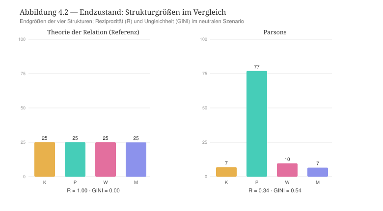

Der Verlauf ist monoton (Abbildung 4.1). Aus dem nahezu symmetrischen Ausgangszustand bei Schritt 0 wächst die Politik rasch an: Sie überschreitet die Hälfte des Feldes nach etwa 520 von insgesamt rund 1819 Schritten und drei Viertel nach etwa 655 Schritten. Um diesen Punkt kippt die Regentschaft von Kultur, Wirtschaft und Medien auf die Politik. Danach stabilisiert sich ein satellisierter Zustand bei einer Politik-Größe von etwa 77 %, einer Reziprozität von etwa 0,34 und einer Ungleichheit von etwa 0,53. Das zentrale Ergebnis lautet: Der angezielte kulturelle Apex (die Kultur) wird selbst satellisiert, und der tatsächlich hervortretende Regent ist die Macht (die Politik), niemals die Kultur.

#+CAPTION: Verlauf der vier Strukturgrößen über die rund 1819 Schritte des Laufs. Die Politik (türkis) steigt monoton auf etwa 77 %, während Kultur, Wirtschaft und Medien zu Trabanten zusammenschrumpfen. Die gestrichelten Linien markieren die Schritte, an denen die Politik die Hälfte und drei Viertel des Feldes überschreitet.
#+NAME: fig:parsons-trajektorie
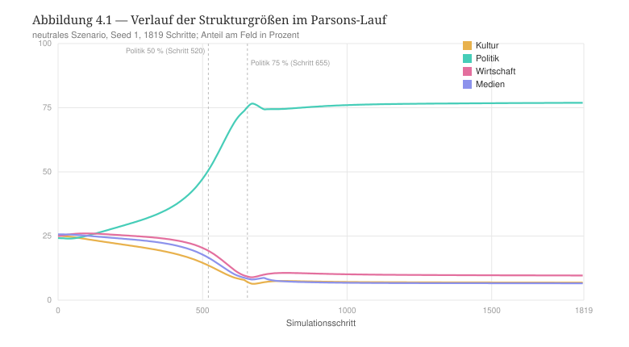

*** Robustheit
Das Ergebnis ist bemerkenswert robust. Es ist invariant gegenüber dem Keim: Fünf verschiedene Keime liefern identisch eine Politik bei 77 %, eine Reziprozität von 0,35 und die Satellisierung von Kultur, Wirtschaft und Medien. Es ist ferner invariant gegenüber der Kettenkodierung bzw. der Veränderung vom Schmetterlingspfad in den Relationsstrukturen: Ob kybernetische Kaskade, ein Muster mit der Kultur als universellem Apex (alle Relationsstrukturen zuerst auf die Kultur orientiert) oder die symmetrische C4-Kopplung — stets entsteht ein Pol bei etwa 77 %, drei Satelliten und eine Reziprozität um 0,35. Die Satellisierung ist also kein Artefakt der Kopplung, sondern eine Folge des Reglerprofils. Bei der Variation einzelner Regler verschiebt allein die Konzentration (alpha) die /Identität/ des Herrschenden — für eine Konzentration bis 1,4 regiert die Wirtschaft mit etwa 73 %, für 1,8 die Politik —, niemals jedoch die /Struktur/ des Ergebnisses. Stets steht ein Pol bei etwa 73–78 %, drei Strukturen sind satellisiert, und die Reziprozität liegt um 0,33 bzw. 0,35. Ein höheres Gewicht der Zahl (anchor: 0,2 → 0,8) senkt die Dominanz nur mild (von 77 % auf 65 %) und stellt die Reziprozität nicht wieder her. Eine stärkere Erschöpfung (cap: 0,3 → 0,7) spannt den Dominanten stärker an (Fatigue 0,78 → 0,86), ohne die Zirkulation zu verbessern. Die Durchlässigkeit der Relationsstrukturen (over), die Akteurszirkulation (rate) und der Vorteil der dynamischen Akteure (dynam) sind nahezu wirkungslos.

Um zu prüfen, ob sich das Ergebnis unter einer anderen Lesart von Parsons' „Kontrolle“ verändern oder aufheben lässt, wurde eine alternative Operationalisierung untersucht. Liest man die Kontrolle nicht als Konzentration, sondern als homöostatische /Dämpfung/ (eine niedrige Konzentration, ein hohes Gewicht der Zahl, eine mäßige Erschöpfung), so verschwindet die Satellisierung, und die Reziprozität erholt sich teilweise — auf etwa 0,51 bei einer Konzentration von 1,0, einem Gewicht der Zahl bei 0,6 und einer Erschöpfung von 0,6, bei einer Ungleichheit von 0,22. Sie erreicht jedoch nie das Niveau der TR im perfekten symmetrischen Zustand (etwa 1,0), und mit der Konzentration verschwindet zugleich die Wertehierarchie: Es bleibt eine gedämpfte Quasi-Symmetrie ohne Gouvernanz. Schließlich rechtfertigt das realistische Szenario die Wahl des symmetrischen Zustand als Prüfstand für den Vergleich zwischen der TR und Parsons' Theorierahmen. Wenn die Demographie differenziert wird, entsteht im digitalen Zwilling eine Asymmetrie (die Wirtschaft kommt auf etwa 60 %, bei einer Reziprozität von 0,30; die Wirtschaft satellisiert die Kultur, die Politik und die Medien). Dies bedeutet, dass die aufgezwungene Asymmetrie das Profil mit dem Szenario verwechselt, als ob die TR wie Parsons Theorie funktionieren würde. Unter dieser Bedingung könnte man nicht mehr davon ausgehen, dass beide Theorierahmen unterschiedlich sind, was dafür spricht, dass allein das neutrale Szenario in der Lage ist, die Episteme Parsons Theorierahmens zu isolieren.

*** Lektüre: Nähe, Differenz und verborgene Prämisse
Auf der dreistufigen Skala der sozialen Ungleichheiten -- der vertikalen, horizontalen und transversalen sozialen Ungleichheiten -- herrscht bei Parsons die transversalen Ungleichheit, die sich mit voller Kaskade in die unteren Ebenen des Theoriekonstruktes verbreitet. Dies entspricht einem sehr starken Apex (0,54), der sich nach unten fortpflanzt — der dominante Pol wird homogenisiert, die beherrschten Relationsstrukturen werden somit stratifiziert, der Statusabstand zwischen Akteuren wird immer größer, je tiefer es in die kleineren relationalen Strutkuren des Theorierahmens gegangen wird.

Die freigelegte verborgene Prämisse lautet deshalb wie folgt: Was Parsons „Integration durch eine kybernetische Hierarchie der Wertkontrolle“ nennt, kann relational als Satellisierung verstanden werden im Kontrast zur systemischen Reziprozität der TR. Die Ordnung-durch-Kontrolle erscheint im digitalen Zwilling nicht als mildes integriertes Gleichgewicht, sondern als Herrschaft eines Pols über drei Relationsstrukturen, die zu den jeweiligen Satelliten dieses Pols mit den Folgen werden, dass die Reziprozität im ganzen System einbricht (0,35 gegenüber etwa 1,0 in der TR) und die Position von herrschenden Akteuren in den Relationsstrukturen gefährdet (Fatigue 0,78, nahe dem Bruch). Verbunden mit unseren Hypothesen, bedeutet dieses Ergebnis Folgendes. H2 ist bestätigt, denn die Ordnung beruht auf Domination und nicht auf Reziprozität. H1 kann nur teilweise bestätigt werden. Es entsteht kein heiteres Gleichgewicht, sondern eine gespannte Domination. H3 kann nicht bestätigt werden, weil die Kultur nicht herrscht, sondern sie wird satellisiert. H4 trifft eine andere Prämisse als vermutet. Es entsteht keine Satellisierung durch einen wechselseitigen Neutralisierung von zwei Relationsstrukturen, sondern es gibt eine generelle Satellisierung dreier Relationsstrukturen durch eine Relationsstruktur. H5 entscheidet sich überwältigend zugunsten der Hierarchie, denn der mediale Interchange wirkt der Konzentration und der entstandenen Satellisierung kaum entgegen.

Daraus ergibt sich die interne Spannung in Parsons' Theorierahmen, die mit Parsons' Begriff der Kontrolle eng verbunden ist, der zwei Seiten hat (Abbildung 4.3). Als asymmetrische bzw. hierarchische Ordnung —  „die Werte regieren“ — erzeugt die Kontrolle eine Satellisierung. Als homöostatische Dämpfung — ausgleichend — erzeugt sie eine quasi-symmetrische Statik ohne Gouvernanz. Beides zugleich, eine regierende Wertehierarchie /und/ eine wechselseitige bzw. gegenseitige Integration, kann relational nicht unterstützt werden. Die Hierarchie schlägt die Reziprozität in Satellisierung um. Die reine Stabilisierung verändert die Hierarchie zur symmetrischen Statik, die ihrerseits dem Zustand der TR jedoch ohne Wertordnung ähnelt.

#+CAPTION: Die Reziprozität im Endzustand hängt davon ab, wie Parsons' „Kontrolle“ operationalisiert wird. Als Hierarchie gelesen, bricht sie ein; als Dämpfung gelesen, erholt sie sich teilweise, erreicht aber nie das Niveau der TR.
#+NAME: fig:parsons-reziprozitaet
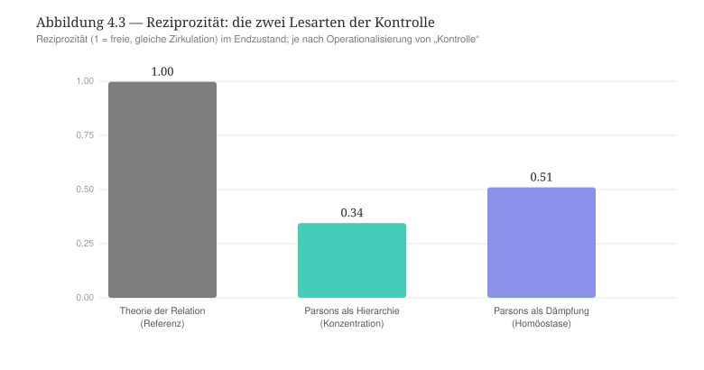

Zusätzlich dazu tritt eine bemerkenswerte Wendung ein: Der Apex, den Parsons zum Regenten bestimmt, kann die regierende Position relational nicht halten. Die Macht bzw. die Politik regiert und, bei niedrigerer Konzentration, die Wirtschaft, nie aber die Kultur. Der digitale Zwilling bringt damit unabhängig jene klassische konflikttheoretische Kritik hervor, die dem Funktionalismus vorhielt, sein Wertkonsens verdecke eine Herrschaft durch Macht und vernachlässige gerade die Reziprozität [cite:@gouldner1959reciprocity]. Dass die Macht hervortritt, ist zudem eine Pointe, die Parsons' eigenem Denken entspricht. Er selbst hat die Macht als generalisierte Ressource des Systems formuliert: „Power is a generalized facility or resource in the society“, die produziert und verteilt werden muss und kollektive wie distributive Funktionen hat [cite:@parsons1969politics S. 200]. Treibt man Parsons' Architektur relational an, so regiert am Ende eben dieses Medium.

Bei aller Differenz kann auch die Nähe Parsons' Theorierahmen an der TR thematisiert werden. Parsons ist der klassische Rahmen, der der medialisierten Architektur des digitalen Zwilling am nächsten steht. Seine generalisierten Medien entsprechen den Vermittlungsinstanzen der TR. Außerdem teilt Parsons mit der TR die Absage an die direkte Konvertibilität der sozialen Ressourcen [cite:@papilloud2022skizze]. Die Unterscheidung zwischen Parsons' Theorierahmen und der TR liegt deshalb nicht in der Vermittlung selbst, sondern in deren Unterordnung unter eine Kontrollhierarchie, welche die Zirkulationslogik der TR in Satellisierung verwandelt bzw. mit der Satellisierung gleich macht.

*** Entwicklungslinien
Parsons' Theorie der generalisierten Medien bleibt eine Ressource für die relationale Soziologie, sofern man sie vom hierarchischen Apex löst. Der digitale Zwilling lokalisiert präzise, was zu lösen ist: Wenn die medialisierten Interchange (die Vermittlungsinstanzen in der TR) beibehalten werden, und wenn die wertkonzentrierende Gouvernanz aufgegeben wird — die Konzentration (alpha) samt der gerichteten Steuerung —, dann wandert das System vom satellisierten Zustand zur reziproken Zirkulation der TR. Parsons' Medien des Austauschs und die symmetrische Zirkulation der TR ergäben somit zusammen eine zugleich medialisierte und reziproke Ordnung. Genau hierin liegt der Beitrag vom Parsons' Theorierahmen zu einer relationalen Soziologie. Sie stellt die vollständigste klassische Theorie der Vermittlung bereit, und der Kontrast zeigt, an welcher einzigen Stelle — der Hierarchie des Apex — sie zu öffnen ist, damit aus Steuerung und Satellisierung Zirkulation wird.

** Kapitel 5 — Die Systemtheorie Niklas Luhmanns
:PROPERTIES:
:STATUS: DRAFT
:END:

Luhmann gehört derselben systemtheoretischen Familie wie Parsons an. Doch kehrt Luhmann Parsons' entscheidende Annahme um. Wo Parsons eine kybernetische Kontrollhierarchie mit einem regierenden Wert-Apex setzt, setzt Luhmann eine Gesellschaft ohne Spitze und ohne Zentrum, die aus operativ geschlossenen, autopoietischen Funktionssystemen besteht. Wir behandeln seine Theorie als eigenständige und kohärente Alternative zur TR und führen den Vergleich mit der TR durch. Der vorliegende Fall ist methodisch besonders lehrreich, weil hier nicht eine interne Spannung des Rahmens, sondern die Grenze des relationalen Instruments selbst sichtbar wird. Wir folgen dem in Kapitel 3 festgelegten Gabarit.

*** Ontologische Korrespondenz und Residuum
Luhmanns Gesellschaft kennt zahlreiche Funktionssysteme — Wirtschaft, Politik, Recht, Wissenschaft, Kunst, Religion, Erziehung, Massenmedien und weitere —, die nicht untereinander hierarchisiert werden. Um die Vergleichbarkeit mit den anderen Kapiteln in diesem Bericht zu gewährleisten, ordnen wir die vier Strukturen des digitalen Zwillings vier prominenten Funktionssystemen zu: die Wirtschaft (C) dem Wirtschaftssystem (Medium Geld); die Politik (B) dem politischen System (Medium Macht); die Kultur (A) der Wissenschaft (Medium Wahrheit); die Medien (D) dem System der Massenmedien (Medium Information). Diese Zuordnung ist eine unter mehreren, die möglich sein würden — und gerade das ist bezeichnend: Da bei Luhmann kein festes kybernetisches Rangverhältnis besteht, können die „Plätze“ untereinander ausgetauscht werden. Schon hier wird es klar, dass es sich bei Luhmann nicht wie bei Parsons verhält, für den der Rang jeder Struktur feststeht.

Aus dieser Ausgangslage ergeben sich drei Residuen, die selbst Ergebnisse sind. Erstens überschreitet Luhmanns polykontexturale Gesellschaft die vier Relationsstrukturen der TR. Luhmanns soziale Systeme auf vier zu reduzieren, legt ihnen eine Geschlossenheit auf, die Luhmann bestreiten würde. Zweitens hat die Akteursebene in der TR fast keinen Widerpart bei Luhmann. Die Einheit des Sozialen in der Theorie sozialer Systeme ist nicht die Handlung und nicht die Person, sondern die Kommunikation. Personen gehören zur Umwelt bzw. zum Außen der sozialen Systeme. Drittens und vielleicht hier entscheidender: Die Medien des digitalen Zwillings vermitteln die Zirkulation zwischen den Strukturen, während Luhmanns Medien Codes innerhalb geschlossener Systeme angelegt sind und operieren. Die operative Schließung minimiert gerade jene zwischenstrukturelle Zirkulation, die der digitale Zwilling zu seinem Kerngegenstand macht. Dieses dritte Residuum wird sich im Lauf von unserem Vergleich als derjenige, mit dem unser entscheidender Befund verbunden ist.

*** Theoretischer Kern
Die Operationalisierung stützt sich auf vier folgenden Grundorientierungen, die wir wie bei Parsons durch genaue Textstellen illustrieren.

Die erste Orientierung bezieht sich auf die operative Schließung und auf die Autopoiesis. Die Funktionssysteme reproduzieren ihre Elemente — Kommunikationen — ausschließlich aus ihren eigenen Elementen: „Auf der Grundlage ihres Funktionsprimats erreichen die Funktionssysteme eine operative Schließung und bilden damit autopoietische Systeme im autopoietischen System der Gesellschaft“ [cite:@luhmann1997gesellschaft S. 748]. Die Systemtheorie ist dementsprechend eine „Theorie selbstreferentieller Systeme“ [cite:@luhmann1984soziale S. 31]. Daraus folgt eine sehr geringe Durchlässigkeit zwischen den Strukturen.

Die zweite Orientierung betrifft die Kommunikation als elementare Einheit der sozialen Systeme. Das Soziale besteht nicht aus Handlungen oder Personen: „Soziale Systeme werden demnach nicht aus Handlungen aufgebaut […]; sie werden in Handlungen zerlegt“, und der elementare, das Soziale konstituierende Prozeß ist ein Kommunikationsprozeß [cite:@luhmann1984soziale S. 193]. Die Menschen lassen sich nicht den Teilsystemen zuordnen. Die Gesellschaft kommt für das Funktionssystem nur noch als Umwelt bzw. Außen in Betracht [cite:@luhmann1997gesellschaft S. 744 f.]. Daraus folgt eine geringe Akteurszirkulation bzw. die Akteursebene ist hier ein Residuum.

Die dritte Orientierung ist mit der funktionalen Differenzierung ohne Spitze und ohne Zentrum verbunden. In der modernen Gesellschaft gibt es „weder eine Reduktion auf eine Spitze, noch eine Reduktion auf ein Zentrum der Gesellschaft“ [cite:@luhmann1997gesellschaft S. 743]. Die Funktionssysteme sind „in ihrer Ungleichheit gleich“, womit auf alle gesamtgesellschaftlichen Vorgaben verzichtet wird, die ihre möglichen Relationen fördern würden [cite:@luhmann1997gesellschaft S. 613]. Daraus folgt, dass wir bei Luhmann keinen Apex und keine Konzentration erkennen können, sondern lediglich nur symmetrische und autonome Kopplungen. Dort liegt die Umkehrung von Parsons bzw. die wichtige epistemologische Unterscheidung zu seinem Theorierahmen.

Die vierte Orientierung berücksichtigt die Lehre von den symbolisch generalisierten Kommunikationsmedien als internen Codes. Jedes Funktionssystem verfügt über sein eigenes Medium — etwa „Macht als symbolisch generalisiertes Medium der Kommunikation“ [cite:@luhmann1975macht S. 5] — und über einen eigenen binären Code, der die operative Geschlossenheit von einem Funktionssystem absichert. Für das Rechtssystem gilt etwa: „Über Codierung ist die operative Geschlossenheit des Systems gesichert“, und nur was sich am Code Recht/Unrecht ausweist, wird ihm zugerechnet [cite:@luhmann1995recht S. 103, 105]. Das Medium macht die unwahrscheinliche Kommunikation innerhalb des Systems wahrscheinlich. Das Medium ist über die Differenz von medialem Substrat und Form bestimmt [cite:@luhmann1997gesellschaft S. 190]. Diese Medien und Codes integrieren bzw. operieren nicht über eine Hierarchie. Geschlossene Systeme verbinden sich nur über strukturelle Kopplung und Resonanz, und die Resonanz auf die Umwelt wird „durch eine Mehrzahl von funktionsspezifischen Codes gesteuert“, also nicht etwa durch einen gesellschaftseinheitlichen Code [cite:@luhmann1986oekologische S. 89]. Die Instanzen bzw. Vermittlungsinstanzen in der Sprache der TR sind dann vorhanden, aber sie vermitteln keine Zirkulation zwischen den Systemen bzw. in der Sprache der TR den Relationsstrukturen.

Quer zu diesen vier Orientierungen steht Luhmanns Antwort auf die Frage der sozialen Ordnung — die sich, wie er ausdrücklich festhält, vom Parsons' Vorschlage deutlich abgrenzt [cite:@luhmann1984soziale S. 149]. Nicht der Wertkonsens stiftet die Ordnung, sondern die doppelte Kontingenz selbst. An die Stelle des Wertkonsenses tritt „die leere, geschlossene, unbestimmbare Selbstreferenz“, die geradezu Zufälle ansaugt und so erst Ordnung ermöglicht [cite:@luhmann1984soziale S. 151]. Wo Parsons die Ordnung auf ein gemeinsames Wertsystem gründet (Kapitel 4), gründet sie Luhmann auf die Geschlossenheit der Selbstreferenz. Hiermit stellen wir Luhmanns schärfsten Ausdruck der ontologischen Differenz der Theorie sozialer Systeme fest, die dieses Kapitel herausarbeitet.

*** Operationalisierung
Aus diesen Orientierungen ergibt sich das folgende Reglerprofil, den wir dann in den digitalen Zwilling der TR aufnehmen. Die linke Wertspalte gibt die Vorgabe der TR an, die rechte den für Luhmann gesetzten Wert. Jede Zeile entspricht einer Orientierung (O1–O4), und sie wird mit einer Textstelle aus dem Werk Luhmanns verbunden bzw. typisiert. Die tragende strukturelle Prämisse ist hier diejenige der Abwesenheit von struktureller Dimensionalität: Während Parsons ein gerichtetes Kontrollgefälle auferlegt, ist Luhmanns Theoriesignatur das Fehlen jeder Hierarchie. Die Ketten bleiben deshalb symmetrisch (ohne gerichtetes Gefälle). Die Signatur Luhmanns Theorie wird von der Schließung getragen, nicht von einer Kontrollrichtung.

| Regler (Code) | TR | Luhmann | Begründung |
|--------+----+---------+------------|
| Durchlässigkeit zwischen Strukturen (over) | 1,0 | 0,3 | operative Schließung; kein Transfer von Operationen, nur strukturelle Kopplung [O1; @luhmann1997gesellschaft S. 748] — /tragender Regler/ |
| Akteurszirkulation (rate) | 2,2 | 0,9 | die Einheit ist die Kommunikation, nicht der Akteur; Personen sind Umwelt [O2; @luhmann1984soziale S. 193] |
| Konzentration zum Pol (alpha) | 1,4 | 1,0 | keine Spitze, kein Zentrum, keine Konzentration [O3; @luhmann1997gesellschaft S. 743] |
| Erschöpfung der Dominanten (cap) | 0,7 | 0,5 | selbstreproduktive Autopoiesis, kein Herrschender, der sich erschöpfte (NN → Robustheit)       |
| Gewicht der Zahl (anchor) | 0,5 | 0,5 | Koexistenz von Gleichen, keine Logik der Masse (NN)       |
| Vorteil der Dynamischen (dynam) | 0,5 | 0,5 | jedes System entwickelt sich selbstständig (NN) |
| back, plast, mig, decl, rho, peak | Vorgaben | unverändert | Akteursebene = Residuum; auf der Vorgabe belassen |

Die Ketten sind symmetrisch (keine =chaine_=-Zeile; es gilt die C4-Symmetrie der TR). Das vollständige Profil liegt als =profil_Luhmann.csv= im Anhang bei.

*** Hypothesen
Vor dem Lauf wurden fünf Hypothesen festgehalten. /H1./ Keine Struktur dominiert; die Größen bleiben annähernd gleich, die Ungleichheit (GINI) bleibt niedrig. /H2./ Es gibt keine Satellisierung. /H3./ Jede Struktur bleibt autonom (Regent ihrer selbst) — „weder Spitze noch Zentrum“ wird realisiert. /H4./ Trotz niedriger Ungleichheit und fehlender Satellisierung ist die Reziprozität niedrig, weil die operative Schließung die zwischenstrukturelle Zirkulation verhindert, auf die die Reziprozität angewiesen ist. Luhmann erzeugte dann ein Feld von isolierten Gleichen. /H5./ Der tragende Regler ist die Durchlässigkeit der Systeme bzw. der Relationsstrukturen (over). Wird sie erhöht, sollte sich das System dem reziproken Zustand der TR annähern.

*** Lauf und Ergebnisse
Alle Läufe sind wie bei Parsons headless reproduziert, deterministisch, im gemeinsamen neutralen Szenario, mit dem Keim 1 und über rund 1819 Schritte (zu Lauf und Keim siehe Abschnitt 3.5). Das Ergebnis ist deutlich, und es widerlegt einen Teil der Hypothesen, die wir formuliert haben, was selbst der Befund ist.

| Kennzahl | Referenz (TR) | Luhmann |
|-------+-------------+---------|
| Ungleichheit (GINI) | 0,002 | 0,002 |
| Reziprozität (1 = freie, gleiche Zirkulation) | 0,997 | 0,952 |
| Zwischenzirkulation (crossOff) | 0,266 | 0,267 |
| Größen Kultur / Politik / Wirtschaft / Medien | je ~25 % | je ~25 % |
| Regentschaft | alle autonom | alle autonom |
| Satellisierung (satS) | 0 / 0 / 0 / 0 | 0 / 0 / 0 / 0 |

H1, H2 und H3 sind bestätigt: Luhmanns Theorie der sozialen Systeme entwickelt im digitalen Zwilling keine Dominanz und keine Satellisierung. Jede Struktur entwickelt sich selbstständig, wie dies die Theorie sozialer Systeme vorsieht. H4 und H5 können jedoch nicht bestätigt werden. Die Reziprozität bricht nicht ein, sondern bleibt hoch (0,952), und das Volumen der Zwischenzirkulation bleibt unverändert. Mit anderen Worten: Luhmanns operationalisiertes Profil erzeugt einen Zustand, der von der symmetrischen, reziproken Referenz der TR kaum zu unterscheiden ist. Dies bedeutet, dass sich die Theorie sozialer Systeme deutlich näher an der TR entwickelt, als Parsons Theorie es tat.

#+CAPTION: Endzustand im neutralen Szenario. Anders als Parsons (Abbildung 4.2) erzeugt Luhmanns Profil ein nahezu identisches Bild zur Referenz der TR: gleiche Größen, hohe Reziprozität, keine Satellisierung.
#+NAME: fig:luhmann-endzustand
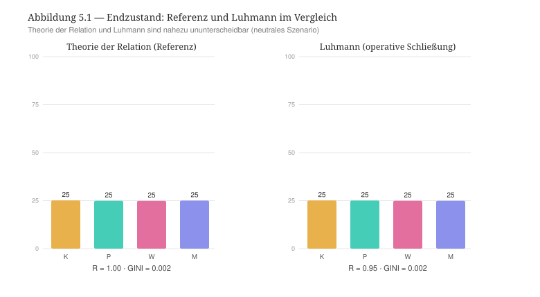

*** Robustheit
Der Befund ist hier ebenfalls sehr robust. Variiert man die Durchlässigkeit der Systeme bzw. der Relationsstrukturen (over) von 1 auf 0, so bleiben Reziprozität und Ungleichheit quasi konstant. Selbst eine extreme Schließung (over 0, Akteurszirkulation 0,1) senkt die Reziprozität nur von 0,997 auf etwa 0,90, ohne das Regime bzw. die selbstständige Entwicklung der Systeme zu verändern. Die Akteurszirkulation (rate) hat von 2,2 bis 0,1 keine Wirkung auf diese Entwicklung. Der Befund ist invariant gegenüber dem Keim. Vor allem ist er invariant gegenüber der Kettenkodierung: Eine ganze Batterie von Kopplungen der vier Sequenzen in den Relationsstrukturen — symmetrisch Reihung, fester Zyklus, gepaarte Sequenzen, beliebige Permutation, forcierte Ausrichtung — erzeugt gar keine Satellisierung. Die stärkste Abweichung (die forcierte Ausrichtung aller Ketten) treibt die Ungleichheit nur auf 0,17 und die Reziprozität auf 0,70. Wir sind weit von dem Einbruch entfernt, die wir bei Parsons festgestellt haben (0,54 bzw. 0,34). Um das System überhaupt zum Kippen zu bringen, braucht es die Konzentrationsregler (hohe Konzentration, niedrige Erschöpfung, niedriges Gewicht der Zahl), also eine Nachahmung von Parsons Theorierahmen, davon man hier am besten die Unterscheidung zu Luhmanns Theorierahmen sieht.

#+CAPTION: Operative Schließung (Durchlässigkeit over von 1 auf 0): Reziprozität und Ungleichheit bleiben über den gesamten Bereich konstant. Die Schließung bewirkt keinen Regimewechsel.
#+NAME: fig:luhmann-schliessung
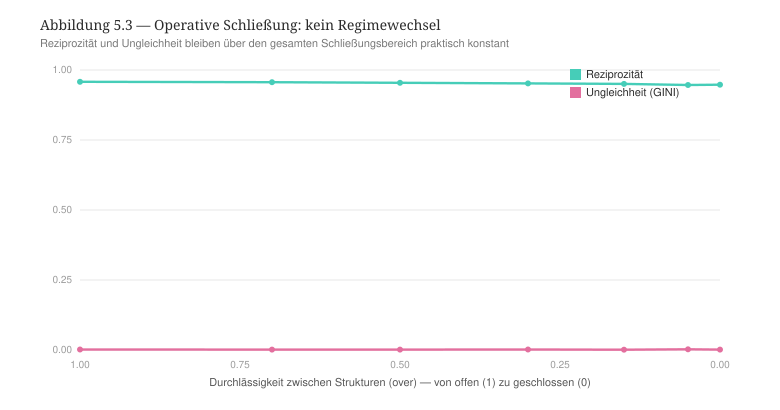

Aufschlußreich ist hier die Kontrollmessung zum Volumen der zwischenstrukturellen Zirkulation (crossOff). Diese Größe bewegt sich zwar, aber sie bewegt sich nur unter Konzentration, nie unter Schließung. Unter dem Parsons-Profil fällt sie auf 0,105, während sie mit Luhmann und selbst unter extremer Schließung bei ~0,266 bleibt, also auf der Höhe der Referenz. Der digitale Zwilling der TR senkt das Zirkulationsvolumen, wenn ein Pol die anderen satellisiert. Aber er senkt es nicht, wenn die Systeme sich schließen. Genau hier liegt die Grenze des Instruments.

#+CAPTION: Volumen der zwischenstrukturellen Zirkulation. Die operative Schließung senkt es nicht; nur die Konzentration (Parsons-Profil) tut es. Der digitale Zwilling kann Schließung nicht als verringerte Zirkulation abbilden.
#+NAME: fig:luhmann-crossoff
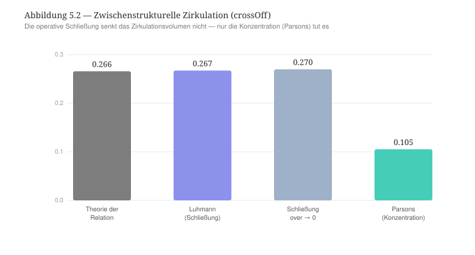

*** Lesart: Inkommensurabilität, Konvergenz und die verborgene Reziprozität
Auf der dreistufigen Skala der sozialen Ungleichheiten kaskadiert Luhmann nicht. Keine Ebene hebt sich vom symmetrischen Etalon ab. Es ist ein weiteres Zeichen, dass seine codierte Inklusion/Exklusion in einer Vertikalen sitzt, die das transversal gebaute Modell der TR nicht darstellt (das Residuum). Die Lesart entfaltet sich entsprechend in drei Schritten.

Erstens, die Inkommensurabilität. Die freigelegte verborgene Prämisse ist hier keine interne Spannung, die im Theorierahmen Luhmanns stecken würde, sondern eine Grenze des relationalen Instruments selbst: Der digitale Zwilling kann die operative Schließung nicht abbilden. Seine Ontologie setzt die Relation und die Zirkulation als grundlegendes Fundament der TR. Luhmanns autopoietische Schließung ist aber gerade die Verneinung dieses Primats. Bei ihm ist das geschlossene, selbstreferentielle System grundlegend, und die "Relation" (als strukturelle Kopplung) ist sekundär in der Theoriearchitektur Luhmanns und nur mittelbar erkennbar. Im digitalen Zwilling gibt es deshalb keinen Regler für die Aussage „die Operationen von X sind für Y kategorial unzugänglich“. Daraus ergibt sich die Folge, dass all das, was der digitale Zwilling von Luhmann abbilden kann — die Absage an die Hierarchie, die Selbstständigkeit und die Gleichheit der Funktionssysteme, die Differenzierung —, fällt mit der symmetrischen Reziprozität der TR zusammen. Das Einzige, was Luhmanns Theorierahmen von der TR trennt — die Schließung —, liegt außerhalb der relationalen Ontologie. Die Differenz zwischen Luhmann und der TR ist also nicht intern und graduell wie bei Parsons, sondern ontologisch und kategorial, und sie ergibt sich aus einer anderen Grundlage beider Theorierahmen (dem geschlossenen System statt der Relation). Im Register des „schlechten Sitzes als Ergebnis“ ist gerade die Unfähigkeit vom digitalen Zwilling, die ontologische Position der Theorie Luhmanns zu reproduzieren, der Befund. Der digitale Zwilling lokalisiert den Punkt, an dem Luhmanns Ontologie von der TR abzweigt, der mit der operativen Schließung gegeben ist.

Zweitens hat dieser Befund eine bemerkenswerte Tragweite für die Debatte zwischen Luhmann und Habermas, die im Anschluss an dem Positivismusstreit entstanden ist. Fasst man das Soziale mit der Relation und der Reziprozität auf — wie die TR und wie in ihrem Rahmen die kommunikative Reziprozität der Handlung von Habermas — oder mit der Schließung und der Selbstverstärkung des Systems — Luhmann —, dann gelangt man zu derselben relationalen Konfiguration. Wir sehen stets selbstständige, gleiche, differenzierte Systeme, die keine Ungleichheit produzieren, und die keine Reziprozität zerbrechen. Die Konvergenz betrifft die Konsequenzen für Ungleichheit und Reziprozität, nicht die Ausgangslage. Oder anders gesagt: Der digitale Zwilling macht formal sichtbar, warum die Debatte zwischen Luhmann und Habermas [cite:@luhmann1971theorie] so unauflöslich gewesen ist und bleibt. Beide Positionen unterscheiden sich nicht in ihren strukturellen Folgen, sondern allein in dem, was sie als Ausgangslage definieren (Reziprozität oder Schließung).
# [Habermas: präzise Seitenbelege ergänzen, sobald die Werke vorliegen — Lebenswelt/System, kommunikative Rationalität, Exkurs zu Luhmann in der Theorie des kommunikativen Handelns.]

Drittens baut Luhmann eine Theorie ohne legitimierende Reziprozität zwischen den Systemen auf. Aber die Form von einer Art Reziprozität setzt sich überall innerhalb der Systeme durch, weil Systeme selbst-referentielle Systeme sind, was einer Subvertierung von einer normativen Reziprozität durch die Autopoiesis ähnelt. Der digitale Zwilling gibt ihr eine messbare Spur: Unter der Schließung bleibt die eigene Reziprozität in jedem System bzw. in jeder Relationsstruktur hoch.

| eigene Reziprozität je Struktur | Kultur | Politik | Wirtschaft | Medien |
|---+---+---+---+---|
| Luhmann (operative Schließung) | 0,962 | 0,937 | 0,961 | 0,957 |
| TR (Referenz) | 0,999 | 1,000 | 0,999 | 1,000 |

Die Schließung zerstört die Art der Reziprozität nicht, sondern sie verlagert sie innerhalb der Systeme. Jedes geschlossene System bleibt in hohem Maße selbst-reziprok. Deshalb bleibt die globale Reziprozität Luhmanns Theorierahmens im digitalen Zwilling hoch, weil jedes geschlossene System in sich kohärent ist. Das ist die formale Gestalt der Autopoiesis: Die Elemente erzeugen wechselseitig die Operationen, die die Elemente erzeugen. Innerhalb von jedem System finden wir immer eine zirkuläre, selbstreferentielle, sich gegenseitig konstituierende Schleife. Luhmann reinstalliert mithin die Form der Reziprozität als Selbstbegründung jedes Systems, während er ihr einen normativen Status abspricht. Seine Schließung ist eine Art der Reziprozität, die ihren Namen nicht nennt.

*** Entwicklungslinien
Für die relationale Soziologie markiert Luhmann die Grenze des relationalen Programms. Er zeigt, wie eine Soziologie aussieht, die die Schließung statt die Relation als Grundlage der Theorie auswählt. Die TR und Luhmann erweisen sich dabei als duale Theorierahmen. Sie unterscheiden sich nicht in der Oberflächenkonfiguration (selbstständige, differenzierte, nicht hierarchische Systeme), sondern in der umgekehrter ontologischer Grundlage (die Relation als Konstituens gegenüber dem geschlossenen System). Der digitale Zwilling lokalisiert diese grundsätzlichen Unterscheidung sehr genau; er kann wiedergeben, ob die Relation konstitutiv ist -- in diesem Fall erkennt er den Rahmen der TR --, oder ob es sich um die Kopplung zwischen vorgängig geschlossenen Systemen -- in diesem Fall erkennt er die Theorie sozialer Systeme. Die verborgene Art der Reziprozität als Selbstreferentialität der Systeme und deren Autopoiesis eröffnet die Systemtheorie Luhmanns auf die Kommunikation mit relationalen Theorierahmen. Da Luhmanns Schließung selbst die Form einer Reziprozität trägt, ist seine Theorie der relationalen Theorierahmen nicht vollkommen frem. Eine relationale Soziologie, die Luhmann ernst nimmt, müßte dann zeigen, daß die operative Schließung eine Modalität der Relation ist bzw. die Relation ist, die ein System mit sich selbst entwickelt, um sich von seiner Umwelt zu unterscheiden.

** Kapitel 6 — Jürgen Habermas' kommunikatives Handeln
:PROPERTIES:
:STATUS: DRAFT
:END:

Jürgen Habermas' Theorie des kommunikativen Handelns vollendet das Dreieck der großen Kontrastrahmen, den wir mit dem Rahmen der TR vergleichen. Habermas' Theorierahmen ist das genaue Spiegelbild Luhmanns Theorie der sozialen Systeme. Wo Luhmann die operative Schließung zur Grundlagen seines Theorierahmens macht und auf jede legitimierende Reziprozität verzichtet, macht Habermas die kommunikative Reziprozität zum expliziten Apriori seines Theorierahmens. Die Verständigung, die gegenseitige Anerkennung von Geltungsansprüchen bilden die Grundlage der sozialen Integration. Genau deshalb erlaubt die Untersuchung Habermas' Theorierahmen den Ertrag der Auseinandersetzung mit den Theorie von Talcott Parsons und Niklas Luhmann zu vervollständigen. Erneut verwenden wir unseren Gabarit in sieben Schritten, und in einem abschließenden Abschnitt 6.8 ziehen wir die vergleichende Synthese zu unserem ersten Vergleich zwischen der TR und den Theorierahmen von Parsons, Luhmann und Habermas.

*** Ontologische Korrespondenz und Residuum
Habermas denkt die Gesellschaft auf zwei Ebenen. Die Lebenswelt wird kommunikativ über drei Leistungen bzw. über die kulturelle Reproduktion, die soziale Integration und die Sozialisation reproduziert [cite:@habermas1981tkh2 S. 274]. Das System dagegen wird durch Steuerungsmedien gesteuert. Im System werden die Wirtschaft durch das Geld und die staatliche Verwaltung durch die Macht geführt. Daraus ergibt sich die folgende Korrespondenz zwischen den Relationsstrukturen der TR und dem Theorierahmen Habermas. Die Wirtschaft (C) entspricht dem ökonomischen System (Geld), die Politik (B) dem administrativen System (Macht), die Kultur (A) der kulturellen Reproduktion und die Medien (D) der sozialen Integration bzw. der Öffentlichkeit. Somit stehen sich zwei Systempole (B, C) und zwei Lebensweltpole (A, D) gegenüber.

Das Residuum ist auch hier ein Ergebnis. Der digitale Zwilling behandelt die vier Relationsstrukturen symmetrisch und kann nicht zwei Modi der Integration — die mediengesteuerte Integration und die kommunikativ reproduzierte Integration — unterscheiden. Anders als bei Luhmann jedoch fällt der grundlegende Ausgangslage Habermas' Theorie — die Reziprozität als Grundlage des Rahmens — mit derjenigen des digitalen Zwillings zusammen. Der Theorierahmen von Habermas kann deshalb vom digitalen Zwilling deutlich besser als Luhmanns Theorierahmen dargestellt werden. Sein Ideal sollte sich unmittelbar abbilden lassen, seine kritische Diagnose (die Kolonialisierung der Lebenswelt) sollte im digitalen Zwilling als Pathologie der Konzentration dargestellt werden können.

*** Theoretischer Kern
Die erste Orientierung im Habermas' Theorierahmen ist das kommunikative Handeln. Es ist auf Verständigung angelegt und unterscheidet sich kategorial vom erfolgsorientierten Handeln. Die Moral und das Recht gewährleisten, „daß die Grundlage verständigungsorientierten Handelns und damit die soziale Integration der Lebenswelt nicht zerfällt“ [cite:@habermas1981tkh1; @habermas1981tkh2 S. 274]. Die Reziprozität erhält in diesem Zusammenhang explizit ihre normative Begründung.

Die zweite Orientierung ist die Lebenswelt als intersubjektiv geteilter Horizont. Eine Handlungssituation bildet stets das Zentrum der Lebenswelt, die nach einen wandelbaren Horizont entwickelt wird und in ihrer Gesamtheit nie einbezogen werden kann [cite:@habermas1981tkh2 S. 224]. Die Lebenswelt wird somit kommunikativ reproduziert, und sie wird nicht über ein Medium gesteuert.

Die dritte Orientierung im Habermas' Theorierahmen ist mit dem Diskurs zu den Steuerungsmedien des Systems verbunden. Geld und Macht sind kalkulierbare, manipulierbare Größen, auf die die Akteure eine objektivierende, am eigenen Erfolg orientierte Position beziehen. Diese Medien sind auf zweckrationales Handeln zugeschnitten [cite:@habermas1981tkh2 S. 407]. Die Verwendung von diesen Medien führen zur Ausdifferenzierung der Teilsysteme Wirtschaft und Staatsverwaltung, die sich somit von den Bereichen unterscheiden, die die kulturelle Reproduktion, die soziale Integration und die Sozialisation in der Gesellschaft leisten [cite:@habermas1981tkh2 S. 274].

Die vierte Orientierung ist die vom System getriebene Kolonialisierung der Lebenswelt. Sie tritt ein, wenn „die geldgesteuerten und machtgesteuerten Subsysteme Wirtschaft und Staat mit monetären und bürokratischen Mitteln in die symbolische Reproduktion der Lebenswelt eingreifen“ [cite:@habermas1981tkh2 S. 532]. Das ist die kritische normativ vorgeschlagene Diagnose Habermas': die Systemimperative überwältigen die kommunikativ zu reproduzierenden Bereiche der Lebenswelt.

*** Operationalisierung in zwei Modi
Um Habermas' Theorierahmen im digitalen Zwilling abzubilden, unternehmen wir zwei Läufe. Im ersten Lauf bilden Habermas' kommunikatives Ideal, nach dem die kommunikative Reziprozität in der Gesellschaft herrscht. Wir schreiben entsprechend ein symmetrisches, zirkulationsreiches Profil, davon es erwartet wird, dass es mit den Vorgaben der TR übereinstimmt. Im zweiten Lauf bilden wir die vom System gesteuerten Kolonialisierung der Lebenswelt mit der entsprechenden Eigendynamik der Systemmedien. Die Ketten der Sequenzen innerhalb der Relationsstrukturen lenken die Zirkulation auf die Systemmedien bzw. auf die Relationsstrukturen B und C (Macht, Geld), und es wird erwartet, dass eine erhöhte Konzentration zum Pol (alpha) die Wirtschaft und den Staat auf Kosten von der Kultur und der Öffentlichkeit wachsen lässt. Die beiden Profile liegen als =profil_Habermas_ideal.csv= und =profil_Habermas_kolonisierung.csv= im Anhang bei.

*** Vorregistrierte Hypothesen
Unsere Simulation vom Habermas' Theorierahmen kontrolliert für die folgenden Hypothesen. /H1/: Das kommunikative Ideal reproduziert den symmetrischen, reziproken Zustand der TR. Oder anders gesagt: Habermas’ normatives Ideal fällt mit dem relationalen Ideal zusammen. /H2/: Die Kolonialisierung sollte eine bipolare Asymmetrie erzeugen. Die Wirtschaft und der Staat (die mit den Relationsstrukturen B, C assoziiert werden) herrschen über die Kultur und die Öffentlichkeit (die mit den Relationsstrukturen A, D simuliert werden). In diesem Fall wird erwartet, dass die Reziprozität sinkt, und somit dass Habermas' Theorierahmen sein eigenes Alleinstellungsmerkmal aufweist und sich von Parsons' Theorierahmen (einziger Apex) sowie von Luhmanns Theorie sozialer Systeme und der TR (Symmetrie) unterscheidet. /H3/: Habermas' Muster ist spezifisch 2-gegen-2 bzw. B, C gegen A, D, wie dies die Kolonialisierungsthese voraussetzt.

*** Lauf und Ergebnisse
Die Läufe werden wie im Fall von Parsons und Luhmann entwickelt bzw. sie verlaufen rechnerisch, deterministisch und auf der Grundlage vom neutralen Szenario der perfekten Relation bzw. im Keim 1. Das Ergebnis bestätigt H1 und widerlegt H2 und H3. Diese Widerlegung ist der eigentliche Befund.

| Kennzahl | TR (Referenz) | Habermas-Ideal | Habermas-Kolonialisierung |
|-------+--------+--------+---------|
| Ungleichheit (GINI) | 0,002 | 0,002 | ~0,37 |
| Reziprozität | 0,997 | 0,997 | ~0,31 |
| Größen A·K / B·P / C·W / D·M | 25/25/25/25 | 25/25/25/25 | ~13 / ~61 / ~14 / ~12 |
| Satellisierung | — | — | Kultur, Wirtschaft, Medien |

H1 ist bestätigt. Das kommunikative Ideal stimmt exakt mit dem symmetrischen, reziproken Zustand der TR überein. H2 und entsprechend H3 können nicht unterstützt werden. Die Kolonialisierung, davon Habermas spricht, erzeugt keine asymmetrische Dualität System/Lebenswelt im digitalen Zwilling, sondern sie führt stets zu einem einzigen Apex, der stets die Herrschaft der Politik (Macht) unterstreicht, die selbst die Wirtschaft satellisiert. Bei Habermas befinden wir uns dann in einem ähnlichen Fall wie bei Parsons.

#+CAPTION: Links das kommunikative Ideal, das mit der symmetrischen Reziprozität der TR zusammenfällt; rechts die Kolonialisierung, die in einen einzigen Apex kippt (die Macht herrscht über drei Satelliten).
#+NAME: fig:habermas-ideal-kolonisierung
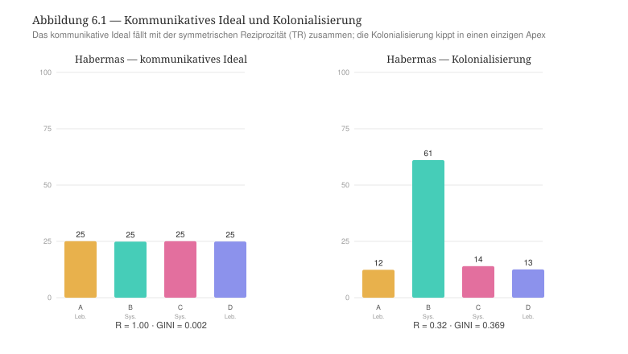

*** Robustheit
Der Befund ist robust. Bei Veränderung der Kettenkonfiguration und des Keimes kann der digitale Zwilling keine stabile Bipolarität erzeugen. Es entsteht entweder einen symmetrischen Zustand, oder die Macht satellisiert die drei anderen Relationsstrukturen. Der Grund liegt in der Verbreitungsdynamik der Relationsstrukturen selbst, die der digitale Zwilling simuliert. Eine selbständige Relationsstruktur, die sich verbreitet, wächst und wird mächtiger, weil sie die anderen Relationsstrukturen schwächt bzw. diese anderen Relationsstrukturen ihre eigene Dynamik aufzwingt. Im digitalen Zwilling geschieht es proportional zum Produkt der Größen der Relationsstrukturen, was bedeutet, dass eine Relationsstruktur, die mächtiger wird, die anderen Relationsstrukturen immer stärker satellisiert und dabei selbst immer stärker wird, bis diese Satellisierung so stark ist, dass sie die satellisierende Relationsstruktur selbst gefährdet. Deshalb können zwei gleich starke Relationsstrukturen nicht stabil koexistieren. Jede minimale Asymmetrie zwischen ihnen wird verstärkt, bis eine Relationsstruktur gewinnt und die anderen Relationsstrukturen satellisiert. Ein Zwei-Apex-Zustand bildet im digitalen Zwilling deshalb nur einen flüchtigen Moment in der Entwicklung von Satellisierungsstrategien und kann demzufolge nicht stabilisiert werden. Dies stimmt mit der relationalen Ontologie der TR, die genau zwei stabile Regime kennt — die symmetrische Reziprozität und den einzigen Apex. Wenn etwa die Konzentration zum Pol (alpha) bei symmetrischen Ketten gesteigert wird, so springt die Zahl der herrschenden Relationsstruktur von null (Symmetrie) auf eins (Apex), aber sie kann niemals zwei herrschende Relationsstrukturen gleichzeitig ergeben.

#+CAPTION: Bei wachsender Konzentration springt die Zahl der herrschenden Relationsstrukturen von 0 (symmetrische Reziprozität) auf 1 (einziger Apex) — niemals auf 2.
#+NAME: fig:habermas-bifurkation
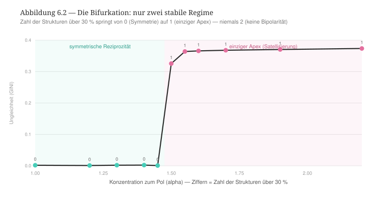

*** Lesart
Auf der dreistufigen Skala der sozialen Ungleichheiten, die der digitale Zwilling misst, zeigt sich die Kolonialisierung der Lebenswelt als die Dynamik der Produktion von einer transversalen Ungleichheit, die weitere horizontalen und vertikalen Ungleichheiten zuerst in der Wirtschaft (C mit einem Reziprozitätswert von 0,35) und dann verstärkt in der Lebenswelt (etwa A mit einem Reziprozitätswert von 0,28) produziert. Diese Berücksichtigung der Verbreitung von sozialen Ungleichheiten in den beherrschten Relationsstrukturen vervollständigt die Lesart einer grundlegenden Unterscheidung zwischen Habermas' Theorierahmen und dem Rahmen der TR. Unterschiedlich als Habermas setzt die TR keine Opposition zwischen dem System und der Lebenswelt voraus. Im Rahmen der TR ist jede Relationsstruktur potentiell Kolonisatorin und Kolonisierte. Die Herrschaft von einer Relationsstruktur ist eine emergente Eigenschaft aller Relationsstrukturen, die nicht a priori zu bestimmten Relationsstrukturen zugeschrieben wird. Habermas' kategoriale Unterscheidung zwischen dem System und der Lebenswelt und seine Auffassung des normativen Vorrangs der kommunikativen Reproduktion ist eine inhaltliche Festlegung, von der die TR absieht. Oder anders gesagt: Habermas' kategoriale Unterscheidung setzt eine Reziprozitätsdynamik innerhalb des Systems zwischen der Wirtschaft und dem Verwaltungsapparat, die identisch funktionieren soll, damit die Herrschaft vom System in der Theorie gewährleistet werden kann, was gegen die Annahme geht, die die TR unterstützt, nach dem die Wirtschaft und das Verwaltungsapparat nach einem eigenen modus operandi und einer entsprechenden eigenen Konsekration von diesem modus operandi funktionieren würden. Mit Habermas sollte dann angenommen werden, dass die Reziprozität nicht nur in der Lebenswelt existiere, in der es gegen die Herrschaft des Systems widerstanden wird, sondern auch im System, in dem es gegen die Herrschaft der Lebenswelt widerstanden wird. Diese Ausgangslage von zwei Systemen gegen zwei anderen Systemen produziert formal eine Blockade in einem Herrschaftsverhältnis, das nicht abgebaut werden kann. Das ist zugleich der Grund, warum der digitale Zwilling diese Bipolarität nicht abbilden kann: Die relationale Ontologie kennt keine eingebaute 2-gegen-2-Strukturen, sondern nur die monistische Konzentrationsdynamik zu einer herrschenden Relationsstruktur, die zum Vorteil von einer anderen Relationsstruktur abgebrochen werden kann.

Diese Lesart erlaubt auch, Habermas’ eigene Kritik an Luhmann genau zu verorten. Habermas wirft Luhmann vor, „schlicht voraus[zusetzen; CP], daß die Strukturen der Intersubjektivität zerfallen“ würden, was die Individuen aus ihrer Lebenswelt herauslösen würde [cite:@habermas1985diskurs S. 409]. Dagegen wirkt die herrschaftsfreie, verständigungsorientierte Kommunikation [cite:@habermas1971theorie S. 138]. Unser Befund zeigt, warum diese Auseinandersetzung unauflöslich ist. Habermas und Luhmann konvergieren in der relationalen Konfiguration (selbstständige, differenzierte Systeme), aber sie unterscheiden sich in Bezug auf die Grundannahmen, wobei beide Autoren zur ähnlichen Folge kommen. Luhmanns operative Schließung gewährleistet die Unterscheidung der Systeme unter Ausschluss jeglicher Art von Einflussnahme der Systeme aufeinander, wenn Habermas' Kommunikationsansatz eine solche operative Schließung nicht unterstützt, davon der Preis die blockierte Asymmetrie zwischen System und Lebenswelt ist, die von keinen der beiden Polen verändert werden kann bzw. nicht beeinflusst werden kann. Oder anders bzw. relational umformuliert: Bei Habermas produziert die Kolonialisierung der Lebenswelt als Spezialfall der Satellisierung -- ähnlich wie bei Parsons -- den Widerstand als Anti-Satellisierung an der Seite der Lebenswelt, daraus sich die Logik der dopplten Apex herausgebildet wird und System wie Lebenswelt in einer Asymmetrie aufbewahrt, die konstant reproduziert wird.

*** Vergleichende Synthese: Parsons, Luhmann, Habermas
Talcott Parsons, Niklas Luhmann und Jürgen Habermas vertreten mit ihren jeweiligen Theorierahmen drei unterschiedlichen Standpunkte zu relationalen Ansätzen in der Soziologie, die im digitalen Zwilling der TR abgebildet werden können, damit es veranschaulicht werden kann, welche Ansätzen dieser Theorierahmen mit der TR geteilt und nicht geteilt werden können. Aus diesem Vergleich ergibt sich eine Gemeinsamkeit, die im Ideal der Theorierahmen liegt. Was Parsons die integrierte Ordnung, Luhmann die funktionale hierarchielose Differenzierung und Habermas die kommunikativ reproduzierte Lebenswelt nennen, stimmt im digitalen Zwilling mit dem Zustand der symmetrischen, reziproken Selbstständigkeit der vier Relationsstrukturen überein, der das Ideal der TR darstellt.

Der Unterschied zwischen diesen Rahmen und der TR liegt in der eigenen Geste der jeweiligen Autoren und in ihrem Verhältnis zur relationalen Ontologie. Parsons kann im digitalen Zwilling dargestellt werden. Seine kybernetische Hierarchie passt im relationalen Rahmen der TR, und der digitale Zwilling deckt seine verborgene Konsequenz auf, die die Satellisierung jeder Ordnung von Relationen durch die Politik ist. Gleichzeitig befindet sich die Unterscheidung von Parsons gerade in dieser typischen Satellisierung, die weitere Formen der Satellisierung durch andere Relationsstrukturen fast vollständig ausschließt bzw. unwahrscheinlich macht. Luhmann und Habermas dagegen überschreiten die relationale Ontologie der TR einerseits ab der Grundlage ihres Theorierahmen und andererseits jeweils in entgegengesetzte Richtungen. Luhmanns operative Schließung überschreitet sie „nach unten“. Der digitale Zwilling kann Luhmanns operative Schließung nicht darstellen und kehrt deshalb zur Ausgangslage der perfekte Relation bzw. der symmetrischen Reziprozität zurück. Habermas' System/Lebenswelt-Dualität überschreitet die TR „nach oben“. Die von Habermas vorgesehene Bipolarität des Systems kann der digitale Zwilling nicht abbilden, und er produziert eine Satellisierung mit einem einzigen Apex (Politik).

#+CAPTION: Drei Wege in einem relationalen Raum. Das gemeinsame Ideal ist die symmetrische Reziprozität; Parsons’ Hierarchie ist darstellbar (interne Spannung); Luhmanns Schließung und Habermas’ Dualität überschreiten die relationale Ontologie der TR in entgegengesetzte Richtungen.
#+NAME: fig:synthese-drei
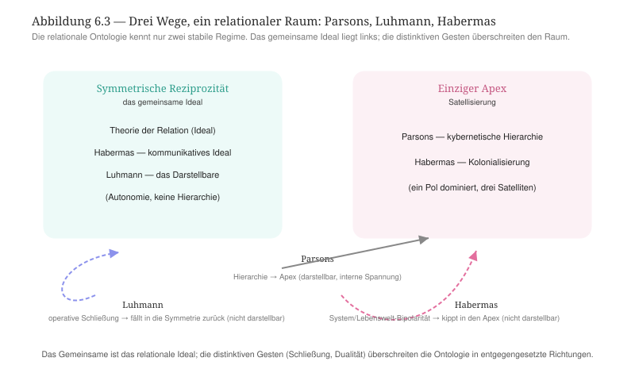

Diese Ergebnisse bedeuten, dass der Rahmen der TR einerseits diese drei Ansätze einbezieht, sie aber im Vergleich zu den Theorierahmen von Parsons, Luhmann und Habermas anders aufgreift. Im Rahmen der Theorie der Relation gibt es sowohl die Perspektive von einer operativen Schließung und von einer Satellisierung, die sich gegenseitig beeinflussen, weshalb die TR nicht zu einer operativen Schließung der Relationsstrukturen ohne Satellisierung (Luhmann), nicht zu einer dualen Satellisierung (Habermas) und nicht zu einer einzigen Satellisierung (Parsons) gelangt. Die operative Schließung von Relationsstrukturen aufgrund ihrer besonderen Ordnung der Sequenzen (die Kette im digitalen Zwilling) stärkt diese Relationsstruktur und ihren Einfluss auf andere Relationsstrukturen, deren operative Schließung deshalb geschwächt wird, was sich aber im Lauf der Entwicklung von Relationsstrukturen unterschiedlich auf diese Relationsstrukturen auswirkt. Eine satellisierende Relationsstruktur in einer bestimmten Zeit kann zu einer satellisierten Relationsstruktur werden, wenn sie geschwächt wird. Und sie kann geschwächt werden, weil die Zirkulation von Akteuren zu ihrer Einschreibung mit Vermittlungsinstanzen der Relationsstrukturen weniger optimal verläuft. Dieser Ansatz der Zirkulation ist das, was die TR von den drei Theorierahmen, mit denen wir sie verglichen haben, unterscheidet und schließlich eine im Rahmen der TR kohärente Integration von der operativen Schließung der Relationsstrukturen und deren Satellisierungsmacht bereitstellt.

Nach dieser vergleichende Analyse vom Theorierahmen der TR und seinen distinktiven Merkmalen zu Theorierahmen, die eine unterschiedliche Position zu einer relationalen Ontologie beziehen, kommen wir zu Theorierahmen, die fester in der relationalen Ontologie eingeschrieben werden und der relationalen Soziologie wichtige Grundimpulsen gegeben haben. Wir fangen mit dem Theorierahmen von Harrison White um die Analyse der Gesellschaft als Netzwerk.

** Kapitel 7 — Netzwerkanalyse: Harrison White
:PROPERTIES:
:STATUS: DRAFT
:END:
Mit Harrison White begegnet die TR einen Rahmen, der ihr verwandt ist. Anders als Parsons, Luhmann und Habermas ist Whites netzwerktheoretische Soziologie grundlegend relational. Sie kennt keine vorgegebenen Funktionssphären, keine substantiellen Akteure, keine Spitzeninstanz, sondern Identitäten, Bindungen und Positionen, die sich wechselseitig ko-konstituieren. Auf dem Papier steht Whites Netzwerktheorie der TR deshalb näher als jeder der bisher behandelten Theorierahmen. Der Kontrast verschiebt sich entsprechend von der relationalen Ontologie zu dem, was diese relationale Ontologie ausmacht bzw. ihre treibende Kraft darstellt. Bei Whites Netzwerktheorie ist es nicht die Reziprozität wie in der TR, sondern die Kontrolle. Sein Begriff der Positionen versteht White nicht in einem Einschreibungsverhältnis mit Vermittlungsinstanzen der Gesellschaft, sondern als reine relationale Position, die strukturell äquivalent sind. Dies bildet die Ausgangslage von unserer Behandlung Whites Netzwerktheorie mit dem digitalen Zwilling der TR, die wir nach den gleichen Stufen entwickeln, wie wir es mit Parsons, Luhmann und Habermas gemacht haben.

*** Ontologische Korrespondenz und Residuum
Im digitalen Zwilling der TR entspricht Whites netzwerkartige Auffassung von Positionen den vier Relationsstrukturen die zu vier Netzwerkpositionen werden, die allein strukturell durch ihr Beziehungsmuster — ihre strukturelle Äquivalenz, die im digitalen Zwilling die Sequenzen von Relationsstrukturen darstellen — definiert sind. Die Akteure in den Akteurkategorien der TR entsprechen Whites Auffassung von Identitäten, die nach einem "footing" bzw. nach Kontrolle suchen. Die Ketten der Relationsstrukturen im digitalen Zwilling entsprechen den Bindungen und, enger gefasst, den Vakanzketten der Mobilität in Whites Theorierahmen. Aus dieser Überführung von Whites Theorierahmen in den digitalen Zwilling der TR ergibt sich ein doppeltes Residuum.

Erstens entleert White die Positionen von jedem Gehalt, weshalb in seinem Theorierahmen eine Position ein reines Beziehungsmuster darstellt. Da diese Positionen nicht von einem Inhalt bestimmt werden, werden zwei Identitäten die mit zwei strukturell äquivalenten Positionen verbunden sind, austauschbar. Die Relationsstrukturen im digitalen Zwilling, damit Whites Positionen in Verbindung gesetzt werden, enthalten im Unterschied zu Whites Auffassung von Positionen Vermittlungsinstanzen, die nach der TR nicht gegenseitig ausgetauscht werden können. Genau diese Unterscheidung — Position ohne Gehalt vs. Relationsstruktur mit Vermittlungsinstanzen — ist die im Methodenkapitel angekündigte Kontrastachse. Wie wir es sehen werden, kann der digitale Zwilling einen solchen Kontrast nicht verfehlen, und es wird entsprechend erwartet, dass er den Kontrast markiert. Zweitens ist Whites Kernansatz mit dem Begriff der Kontrolle verbunden bzw. nicht mit einem Begriff der Reziprozität. An der Seite des digitalen Zwillings kann deshalb erwartet werden, dass die Reziprozitätsmetrik Whites Kontrolldynamik tendenziell als Asymmetrie abbilden wird. Schließlich drittens haben die /switchings/ zwischen Netzwerk-Domänen, die für White wichtig sind, weil dort entsteht die Bedeutung für die Akteure, keine saubere Entsprechung im digitalen Zwilling und bleiben deshalb ausdrücklich als Residuum vermerkt.

*** Theoretischer Kern
Die Überführung Whites Theorierahmen in den digitalen Zwilling stützt sich auf vier Grundorientierungen, die wie folgt beschrieben werden können.

Die erste Orientierung ist der Kontrolltrieb. Nach White ist die Identität kein Substrat, sondern das Ergebnis von Kontrollanstrengungen im unruhigen Kontext: „Identities spring up out of efforts at control in turbulent context“ [cite:@white2008identity S. 1]. Identitäten suchen einen Halt bzw. ein "footing" im Universum der Kontingenz. Entscheidend — und für den Kontrast zur Herrschaft folgenreich — ist Whites ausdrückliche Klarstellung, dass dieser Kontrollbegriff zunächst nichts mit Herrschaft über andere zu tun hat. Kontrolle „does not have anything to do with domination over other identities“ [cite:@white2008identity S. 1]. Kontrolle heißt Selbstverortung und nicht Unterwerfung, und genau diese Bestimmung werden wir im digitalen Zwilling auf die Probe stellen.

Die zweite Orientierung ist die Bestimmung der Positionen durch strukturelle Äquivalenz. Einen Halt zu gewinnen heißt bei White strukturelle Äquivalenz zu erzeugen: „to gain footings means to fashion structural equivalence“ [cite:@white2008identity S. 7]. Positionen und Rollen sind nicht inhaltlich aufgrund von besonderen immanenten Merkmalen bestimmt, sondern rein relational definiert. Es sind Blöcke gleicher Beziehungsmuster, wie dies die Methode des Blockmodelling formuliert: Soziale Struktur wird aus mehreren Netzwerken als ein System von Rollen und Positionen rekonstruiert, die durch ihre Äquivalenzklassen bestimmt sind [cite:@whiteboorman1976social S. 730]. Dies ist das, was wir oben beschrieben haben, wenn wir gesagt haben, dass nach White Positionen Stellungen im Beziehungsgeflecht signalisieren.

Die dritte Orientierung bezieht sich auf die Kristallisation der Kontrolle in drei Disziplinen. Nach White werden die Kontrollanstrengungen zu drei Typen sozialer Formation verfestigt: „I introduce three different species of disciplines — Interfaces, Arenas and Councils" [cite:@white2008identity S. 9], die er im dritten Kapitel seines Buches /Identity and Control/ ausführlich beschreibt [cite:@white2008identity S. 63 ff.]. Das Interface konstruiert eine Ordnung in Bezug auf die Qualität und Produktion (etwa der Markt in der Wirtschaft). Das Council baut diese Ordnung über Vermittlung und Einbettung auf (wie ein Gremium von einer Behörde oder einer Firma). Die Arena entwickelt eine Ordnung über Auswahl und Prestige (etwa die Wahl von Mitgliedern in einem Verein). Interessant für unsere Diskussion ist die Art und Weise, wie White diese drei Disziplinen der Kontrolle ausdrücklich neben Parsons’ analytischem Funktionsschema bzw. sie demselben analytischen Ort zuschreibt, den Parsons mit seinem AGIL-Muster zu besetzen versucht [cite:@white2008identity S. 112ff.]. Die drei Disziplinen sind drei Arten und Weisen, wie aus der Suche nach der Kontrolle die Ordnung entsteht.

Die vierte Orientierung ist die Mobilität als Zirkulation durch Positionen. Whites frühes Modell der Vakanzketten versteht die Mobilität nicht im Sinne der Mobilität von Personen, sondern im Sinne der Mobilität von Leerstellen bzw. von Vakanzen bzw. von Positionen, die leer sind. Eine Vakanz wandert durch eine Kette von Positionen, während sich die Personen gegen diese Vakanz bewegen [cite:@white1970chains]. Märkte schließlich begreift White als Rollenstrukturen, die aus aufeinander bezogenen Netzwerken hervorgehen [cite:@white2002markets]. In beiden Fällen ist die Position der Knoten der Zirkulation, und genau hier berührt Whites Theorierahmen die TR am unmittelbarsten.

Quer zu diesen vier Orientierungen geht schließlich Whites These über die Entstehung von Ungleichheiten. Ungleichheiten ergeben sich für White nicht aus einem verborgenen Plan und sie können nicht als Ziel der gesellschaftlichen Entwicklung konzipiert werden. Ungleichheiten bilden ein unbeabsichtigtes Nebenprodukt der Suche nach der Kontrolle, des „getting action“. Geplante Ungleichheiten, wenn sie existieren, erreichen nie das Ausmaß jener, die sich als unbeabsichtigte Nebenprodukte der Suche nach der Kontrolle ergeben. Solche unvorhersehbare Ungleichheiten sind am bedeutsamsten gerade an den Bruchstellen zwischen sozialen Formationen [cite:@white2008identity S. 184]. Die Herrschaft entspringt mithin der relationalen Dynamik selbst. In seinem französischen Aufsatz zur Herrschaft aus 1995 fasst White sie als „Grammatik der Domination“, die aus den netzwerkartigen Passagen und aus den Umschaltungen hervorgeht und sich in ihnen niederschlägt [cite:@white1995domination S. 705]. Dass die Kontrolle „nichts mit Herrschaft zu tun hat“ und die Herrschaft gleichwohl als Nebenprodukt der Kontrolle entsteht, ist kein Widerspruch, sondern Whites genaue Pointe und der Punkt, an dem ihn der digitale Zwilling am schärfsten prüfen kann.

*** Operationalisierung
Die vier Orientierungen können als Reglerprofil formalisiert werden, das dann in den digitalen Zwilling überführt werden kann. Der Kontrolltrieb (O1) erhöht die Konzentration zum dominanten Pol (alpha) auf 1,6. Jede Identität sucht ihren Halt, jeder Akteur sucht nach der Kontrolle. Die strukturelle Äquivalenz (O2) wird durch symmetrische, gehaltlose Ketten abgebildet. Damit sagt der digitale Zwilling in der Sprache von White, dass die Positionen untereinander austauschbar sind. Keine Position trägt folglich einen inhaltlichen Vorrang. Die Zirkulation durch Bindungen und Vakanzketten (O4) setzt die Zirkulation der Akteure (rate) auf 1,8 bei mittlerer Durchlässigkeit zwischen Strukturen (over) von 1,0. Die drei Disziplinen (O3) liefern drei Varianten desselben Profils: das /Council/ (die Vermittlung) senkt alpha auf 1,2; die /Arena/ (Auswahl, winner-take-all) hebt es auf 1,8; das /Interface/ (Stratifikation nach Qualität) prüft den Bereich um die Schwelle mit einer kaskadierenden Kettenführung. Der gemeinsame Nullpunkt bleibt das neutrale, symmetrische Szenario der TR, der den Zustand der perfekten Relation wiedergibt.

*** Vorregistrierte Hypothesen
Drei Hypothesen werden getestet. /H1/ besagt, dass die Kontrolle eine Asymmetrie produziert. Da Whites Ansatzkern die Kontrolle und nicht die Reziprozität ist, sollte das Profil in der Ausgangslage den symmetrischen Zustand des digitalen Zwilling nicht von selbst halten, sondern in einen einzigen /Apex/ kippen lassen. Dies bedeutet, dass eine Identität gewinnt die Kontrolle über die anderen. Nach /H2/ bleibt die Symmetrie nur durch Vermittlung vorhanden. Allein die Council-Disziplin als Vermittlung sollte die Symmetrie im digitalen Zwilling rehabilitieren. Arena und Interface sollten die Entwicklung der Herrschaft begünstigen. H3 legt nah, dass der Apex austauschbar ist. Wenn die strukturelle Äquivalenz gilt, dann darf die Identität des Apex keine Rolle spielen. Welche Position herrscht, müsste allein von der netzwerkartige Konstitution der Position abhängen und bei Veränderung dieser Beziehungsgeflecht des Netzes mit wandern. So bleiben die Positionen gehaltlos und austauschbar.

*** Lauf und Ergebnisse
Der Lauf im digitalen Zwilling bestätigt H1 unmittelbar. Das Grundprofil „identities seek control“ kippt aus der Symmetrie in einen einzigen Apex. Eine Relationsstruktur wächst auf 61 % und die drei anderen Relationsstrukturen werden gestört bzw. schrumpfen. Die soziale Ungleichheit wird bedeutsamer (0,36) und die systemische Reziprozität bricht ein (0,34; vgl. Abbildung 7.1). Die Kontrolle erzeugt dann tatsächlich die Herrschaft, was die These Whites bestätigt: Die soziale Ungleichheit entsteht als unbeabsichtigtes Nebenprodukt der Kontrollsuche. Der digitale Zwilling reproduziert damit Whites Pointe: Die Suche nach Kontrolle ist nicht mit der Absicht gekoppelt, eine Herrschaft in der Gesellschaft zu produzieren. Nichtsdestotrotz gelangt die Suche nach der Kontrolle zwangsläufig zur Herrschaft.

#+CAPTION: Abbildung 7.1 — Das Profil „identities seek control“ hält die Symmetrie nicht, sondern kippt in einen einzigen Apex. Die Herrschaft entsteht als Nebenprodukt der Kontrollsuche, nicht als deren Zweck.
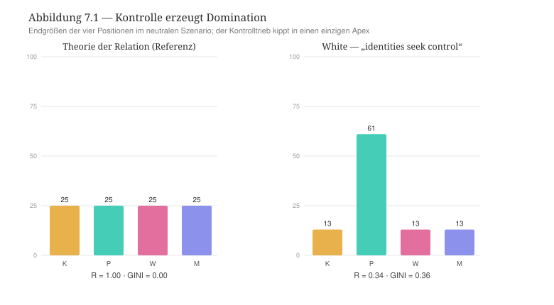

H2 wird ebenfalls bestätigt. Wenn im Sinne der Council-Disziplin der Kontrolldruck gesenkt wird (alpha 1,2), dann kehrt die reziproke Symmetrie zurück (Reziprozität 0,98, Ungleichheit 0,001). Die Arena-Disziplin (alpha 1,8) führt dagegen wie das Grundprofil in den Apex. Oder anders gesagt: Nur die Vermittlung unterstützt die Symmetrie.

H3 kann nicht bestätigt werden, was der eigentliche Ertrag dieses Kapitels darstellt. Verändert man das Netzwerk so, dass jeweils eine andere Position die kontrollierende Stellung einnimmt und zum Apex wird, dann sieht man, dass der Apex nur teilweise dieser neuen Konfiguration der Positionen folgt (Abbildung 7.2). Macht man etwa Kultur zur Kontrollposition, so führt sie nur schwach (27 %). Wird die Politik zur Kontrollposition, dann herrscht sie deutlich stärker (59 %). Wenn die Wirtschaft oder die Medien zur Kontrollposition steigen, dann setzt sich dennoch die Politik durch und sie wird zum Apex. Die Positionen sind also nicht ohne weiteres austauschbar bzw. ein inhaltlicher Rest haftet an den Positionen, die im digitalen Zwilling die Relationsstrukturen darstellen, der White netzwerkartigen Theorierahmen nicht vollständig reproduziert. Im Rahmen der TR kann deshalb Whites Vorschlag der reinen strukturellen Äquivalenz nicht unterstützt werden. Tatsächlich setzt die TR voraus, dass Relationsstrukturen aufgrund der Umstrukturierung der Ketten im digitalen Zwilling bzw. auf der Grundlage der Veränderung ihrer Dynamik verbreitet oder geschrumpft werden. Dies hat Folgen für die Bedeutung der Akteurpositionen sowie für die Kraft der Vermittlungsinstanzen in Relationsstrukturen, die bei einer Verbreitung die Dynamik einer Relationsstruktur stärken und bei einer Schrumpfung immer weniger in der Lage sind, eine solche Stärkung der Relationsstruktur zu unterstützen. Es gibt deshalb in der TR keine reine strukturelle Äquivalenz der Positionen, sondern eine solche Äquivalenz dem Status einer Relationsstruktur entspricht, die von einer anderen Relationsstruktur vollständig satellisiert werden würde bzw. zu einem Satellit der satellisierenden Relationsstruktur werden würde. In der TR kann eine solche vollständige Satellisierung geschehen, selbst wenn diese Art von Satellisierung nicht auf Dauer gehalten werden kann, ohne die satellisierende Relationsstruktur zu schwächen. Whites reine strukturelle Äquivalenz ist dann im Vergleich zur TR als ein ihrer Grenzfälle zu deuten.

#+CAPTION: Abbildung 7.2 — Bei Veränderung der netzwerkartigen Struktur von Positionen kann Whites strukturelle Äquivalenz nicht vollständig reproduziert werden.
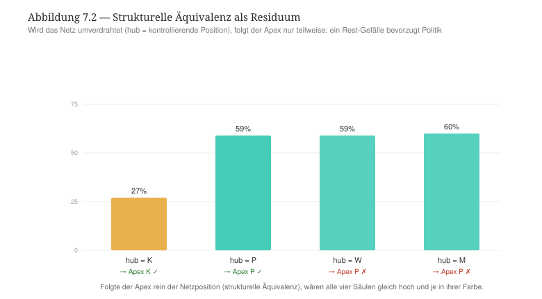

*** Robustheit
Der Apex-Befund bleibt in den Läufen mit Zufallskeimen stabil. Über sechs Keime hinweg liefert das Grundprofil unverändert dieselbe Endkonfiguration. Das Ergebnis ist also kein Artefakt, dass der digitale Zwilling aus sich selbst heraus produzieren würde. Die drei Disziplinen der Kontrolle ergeben keine feinere Abstufung, sondern fallen je nach Kontrolldruck entweder in die Symmetrie (Council) oder in den Apex (Arena, Interface oberhalb der Schwelle). Eine mittlere, stratifizierte Ordnung, wie sie das Interface als Steuerungsmechanismus durch Qualitätskontrolle nahelegt, bildet der digitale Zwilling nicht ab. Auch hier kennt das Modell nur die reziproke Symmetrie und den einzelnen Apex.

*** Lesart: Nähe, Differenz und verborgene Prämisse
Auf der dreistufigen Skala der sozialen Ungleichheiten entspricht Whites Auffassung von Ungleichheit den transversalen Ungleichheiten mit voller Kaskade (Apex 0,36, Stratifizierung der Beherrschten), die jedoch flach bleibt. Unter der Bedingung der sozialen Mobilität ist die transversale Ungleichheit reversibel, was bedeutet, dass die Kaskade der sozialen Ungleichheiten nicht dauerhaft nach unten reicht und die horizontalen sowie vertikalen Ungleichheiten verstärkt. Es gibt eine Erschöpfung der Verbreitung von sozialen Ungleichheiten, weil die strukturelle Äquivalenz der Positionen greift.

Zusammengefasst zeigen diese Ergebnisse, dass Whites Theorierahmen in der Form einer netzwerkartigen relationalen Soziologie mit der TR gut verwandt ist. Beide Theorierahmen machen die Relation, nicht die Substanz, zur Grundlage der soziologischen Erklärung. Beide unterstützen die Entstehung von einem Apex, ohne dass dieser Apex die Herrschaft von stets der selben Relationsstruktur darstellt. Beide Theorierahmen fassen die soziale Mobilität vom Standpunkt der Zirkulation von Akteuren durch Positionen auf. In dieser Hinsicht spiegeln Whites Vakanzketten [cite:@white1970chains] die Ketten des digitalen Zwilling der TR strukturell wider. Im Regime der Council-Disziplin, der die Kontrolle über Vermittlung ausübt, führen beide Theorierahmen zum selben Ergebnis der Rückkehr der Positionen bzw. Relationsstrukturen zur reziproken Symmetrie und der Verflachung von Herrschaftsstrukturen.

Es gibt jedoch wichtige Unterscheidungen zwischen Whites Theorierahmen und der TR, die damit verbunden sind, dass die Suche nach einer Reziprozität, damit die TR argumentiert, zur Suche nach der Kontrolle bei White wird. Unterschiedlich als in der TR führt diese Suche nach der Kontrolle unmittelbar zur Asymmetrie zwischen Positionen und erzeugt somit eine Herrschaft. Dies ist die freigelegte verborgene Prämisse Whites Theorierahmen: Seine Soziologie ist relational, aber sie ruht auf der Asymmetrie. Im Rahmen seiner Theorie versteht White die Herrschaft nicht als das, was durch eine äußere Instanz oder durch einen verborgenen Plan produziert werden würde, sondern als Wirkung der relationalen Dynamik selbst bzw. als unbeabsichtigtes Nebenprodukt des Spiels um "footing" und Position [cite:@white2008identity §5.2.6; @white1995domination S. 705]. Der digitale Zwilling der TR zeigt diesen Mechanismus formal: Aus dem gleichmäßig verteilten Kontrolltrieb ohne jede Herrschaftsabsicht werden drei Relationsstrukturen von einer vierten Relationsstruktur satellisiert. Bemerkenswert ist dabei, dass White damit einen ähnlichen Endzustand wie Parsons erreicht, selbst wenn White einen ganz anderen Weg geht. Die Produktion von Herrschaft erfolgt nicht über eine kybernetische Werthierarchie, sondern über die wechselseitige Kontrollsuche gleichgestellter Identitäten.

Schließlich und wie oben erwähnt, unterscheiden sich die TR und Whites Theorierahmen in der Auffassung von Positionen bzw. Relationsstrukturen. Nach White sind Positionen durch strukturelle Äquivalenz rein relational bestimmt und daher austauschbar [cite:@white2008identity §1.3; @whiteboorman1976social S. 730]. Der digitale Zwilling kann diese Gehaltlosigkeit nicht restlos einlösen. Wie die Abbildung 7.2 zeigt, ist eine strukturelle Äquivalenz der Relationsstrukturen in der TR nur als Grenzfall der Satellisierung denkbar, weil Positionen sowohl von Akteuren als auch von Vermittlungsinstanzen nicht austauschbar sind, sondern im Laufe der Verbreitung und Schrumpfung von Relationsstrukturen immer wieder neu definiert werden. Eine vollständige Entleerung des Gehaltes von Positionen in der TR würde bedeuten, dass eine oder mehrere Relationsstrukturen vollständig als Satelliten und daher als Sequenzen einer einzigen Relationsstrukturen funktionieren würde, was nicht undenkbar ist, jedoch ein Grenzfall der Entwicklung von Relationsstrukturen darstellt. Insofern überschreitet Whites strukturelle Äquivalenz die relationale Ontologie des digitalen Zwillings, wie oben Luhmanns operative Schließung und Habermas' System/Lebenswelt-Dualität sie ebenfalls überschreiten. Whites Geste in dieser Hinsicht ist besonders deshalb, weil er die radikale Voraussetzung formuliert, dass eine Position nichts anders als ihr relationales Muster sei.

*** Entwicklungslinien
Mit White lernen wir, dass /relational/ und /reziprok/ nicht dasselbe sein müssen. Eine durch und durch relationale Soziologie wie die Netzwerktheorie von Harrison White kann gleichwohl auf der Grundlage von einer asymmetrischen Prämisse argumentieren, die zur Herrschaft führt. Die TR, die Reziprozität und Relation miteinander verbindet, erscheint deshalb nicht als die einzige mögliche Antwort der Soziologie auf das Problem der Auffassung von Relation und der Erklärung von gesellschaftlichen Phänomenen durch Relation, sondern sie stellt eine dieser Antworten dar, die die Suche nach der Kontrolle durch das Primat der Reziprozität bändigt. So kann die TR die Folgen aus der Netzwerktheorie Whites beibehalten, selbst wenn diese Folge nicht mehr im Zentrum der soziologischen Erklärung rückt, sondern eher einen Grenzfall darstellt. Unter der Voraussetzung, dass Relationsstrukturen vollständig satellisiert werden können, dann kann eine vollständige Entleerung von satellisierten Relationsstrukturen erfolgen. Die TR lässt einen solchen Fall explizit zu, wenn sie etwa vom möglichen Aufbau Meta-Relationsstrukturen aus der Satellisierung, die durch die strukturelle Homogeneisierung von Vermittlungsinstanzen quer durch die Relationsstrukturen getragen werden. Gleichzeitig gibt jedoch die TR zu, dass eine solche Meta-Relationsstruktur mit der allgemeinen Schwächung von satellisierten Relationsstrukturen einhergeht, die auf Dauer die satellisierende Relationsstruktur selbst schwächt. Deshalb kann eine Meta-Relationsstruktur als Sonderfall einer vollständige Satellisierung erfolgen, wo Positionen strukturell äquivalent werden würden und deshalb auch ausgetauscht werden könnten. Aber ein solcher Zustand kann nicht lange aufrecht erhalten werden.

Damit bereiten wir den Übergang zum folgenden Kapiteln vor, indem wir uns mit Charles Tillys Auffassung von dauerhaften sozialen Ungleichheiten auseinandersetzen. Von White persönlich und theoretisch nahe, hat Tilly seine Theorie der dauerhaften Ungleichheiten im Rahmen der Entwicklung einer relationalen Soziologie entwickelt, die sich von Whites Netzwerktheorie unterscheidet. Wo White die Ungleichheit als emergentes Nebenprodukt der Suche nach der Kontrolle versteht, sucht Tilly die Mechanismen — Ausbeutung, Gelegenheitshortung, Nachahmung, Anpassung —, die die sozialen Ungleichheiten dauerhaft etablieren. Mit diesem Vergleich wollen wir wissen, ob die Herrschaft, die White eher als emergentes Produkt der Suche nach der Kontrolle versteht, auch ähnlich bei Tilly in seiner Auffassung der dauerhaften sozialen Ungleichheiten vorkommt, oder ob sie eher als kategorial verankerter Mechanismus der Gesellschaft zu denken ist.

** Kapitel 8 — Relationale Ungleichheit: Charles Tilly
:PROPERTIES:
:STATUS: DRAFT
:END:
Charles Tilly stand Harrison White persönlich wie theoretisch nahe, und seine Theorie der dauerhaften Ungleichheit ist in einem kritischen Gespräch mit White entstanden. Beide teilen die relationale Ausgangslage in Bezug auf die Frage der sozialen Ungleichheiten: Ungleichheit ist nicht in den Personen, sondern in den Beziehungen zu suchen. Doch wo White die Ungleichheit als emergentes Nebenprodukt der Kontrollsuche auf gehaltlosen bzw. leeren Positionen versteht, sucht Tilly die Mechanismen, die Ungleichheit dauerhaft machen. Anschließend verankert Tilly die sozialen Ungleichheiten nicht in gehaltlosen Positionen, sondern in gehaltvollen, gepaarten und ungleichen Kategorien. In diesem Kapitel wird Tillys Verständnis von sozialen Ungleichheiten im digitalen Zwilling der TR übernommen. Seine Mechanismen werden geprüft und mit Whites Auffassung der sozialen Ungleichheiten verglichen. Dabei verlaufen wir nach den sieben Schritten, wie wir bis jetzt am Beispiel der anderen Theorierahmen verlaufen sind.

*** Ontologische Korrespondenz und Residuum
Die vier Relationsstrukturen des digitalen Zwillings entsprechen bei Tilly vier gepaarten, ungleichen Kategorien wie etwa der Linie zwischen einer Elite und ihren Außenseitern. Anders als Whites Begriff der Positionen, haben diese Kategorien bei Tilly einen Gehalt. Sie können nicht ausgetauscht werden. Die Akteure der TR entsprechen Tillys Mitgliedern von Netzwerken, die nach Kategorien sortiert sind. Die Ketten bzw. die immanente Strukturierung der Relationsstrukturen im digitalen Zwilling entsprechen den organisatorischen Grenzen, an denen bei Tilly innere und äußere Kategorien aufeinander abgebildet werden. Das Residuum aus der Ungleichheitstheorie Tillys, das der digitale Zwilling nicht abbilden kann, bezieht sich auf den Ursprung der äußeren Kategorien. Diese Kategorien werden aus der Gesellschaft importiert und sind dem digitalen Zwilling exogen. Deshalb kann der digitale Zwilling eine Kategorie verorten, aber er kann nicht erklären, woher sie kommt bzw. wieso sie sich dort befindet, wo sie sich befindet. Zum anderen aber — und dies ist der entscheidende Befund aus dem digitalen Zwilling — wird jenes Rest-Gefälle, das im Kapitel zu White die strukturelle Äquivalenz der Positionen irritierte, zur Ressource: Dass die Strukturen des digitalen Zwillings gehaltvoll sind und entsprechend nicht restlos ausgewechselt werden können, ist genau das, was Tilly behauptet. Der Gehalt, der bei White als Grenzfall erschien, ist bei Tilly der eigentliche Gegenstand.

*** Theoretischer Kern

Die erste Orientierung betrifft Tillys relationale, anti-essentialistische Grundannahme. Tilly lehnt es ab, Ungleichheit aus den Eigenschaften der Personen wie etwa aus ihrem Talent, ihrem Fleiß, ihren Einstellungen abzleiten. Solche Erklärungen kreisen um „self-propelling essences (individuals, groups, or societies)“ und um den methodologischen Individualismus, dem er die relationale Sicht entgegensetzt [cite:@tilly1998durable S. 17]. Selbst persönliche Überzeugungen, wie man sie etwa im Rassismus, im Sexismus, in der Fremdenfeindlichkeit finden kann, zwar verstärken die Ungleichheiten, aber sie produzieren sie nicht. Die Wurzel der sozialen Ungleichheiten liegt in den gesellschaftlichen Mechanismen, nicht in den Köpfen von Menschen [cite:@tilly1998durable S. 15]. Ungleichheit ist demzufolge ein Verhältnis zwischen Kategorien, kein Aggregat individueller Unterschiede [cite:@tilly2000relational S. 782].

Die zweite Orientierung bezieht sich auf zwei etablierten Mechanismen. Der erste Mechanismus ist die Ausbeutung. Sie wirkt, „when powerful, connected people command resources from which they draw significantly increased returns by coordinating the effort of outsiders whom they exclude from the full value added by that effort“ [cite:@tilly1998durable S. 10]. Der zweite Mechanismus ist das Hortung von Gelegenheiten (opportunity hoarding), der wirkt, „when members of a categorically bounded network acquire access to a resource that is valuable, renewable, subject to monopoly“ [cite:@tilly1998durable S. 10]. Die Ausbeutung führt zur Entwertung der Außenseiter. Die Gelegenheitshortung schließt ihnen den Zugang zu Netzwerken. Beide zusammen etablieren die kategoriale Ungleichheit.

Die dritte Orientierung berücksichtigt zwei verallgemeinernden Mechanismen. Der erste Mechanismus ist die Nachahmung (emulation) bzw. „the copying of established organizational models and/or the transplanting of existing social relations from one setting to another“ (ebd.). Der zweite Mechanismus ist die Anpassung (adaptation) als „the elaboration of daily routines“ um bestehende Kategorien (ebd.). Tilly fasst das Ineinandergreifen der vier Mechanismen wie folgt zusammen: Die Ausbeutung und das Gelegenheitshortung begünstigen „the installation of categorical inequality, while emulation and adaptation generalize its influence“ [cite:@tilly1998durable S. 13].

Die vierte Orientierung betrifft das Geheimnis der Dauerhaftigkeit, damit Tilly die Abbildung der inneren auf die äußeren Kategorien meint. Die sozialen Ungleichheiten werden zu dauerhaften Ungleichheiten, wenn eine äußere Kategorie (eine breite gesellschaftliche Grenze wie Geschlecht oder Herkunft) auf eine innere Kategorie bzw. eine Kategorie innerhalb von Organisationen der Gesellschaft (Leitung/Belegschaft, Offizier/Mannschaft) abgebildet wird [cite:@tilly1998durable S. 75]. Die reine äußere Ungleichheit bleibt instabil und ruft Widerstand hervor. Die Verschränkung mit inneren Grenzen verankert sie: „These inequalities rest on interior paired categories“ [cite:@tilly1998durable S. 80]. Genau diese Verschränkung und nicht die bloße Existenz von einer Kategorie macht die Ungleichheit dauerhaft, und genau dies prüfen wir im digitalen Zwilling.

*** Operationalisierung
Die vier Orientierungen überführen wir in den digitalen Zwilling wie folgt. Die Kategorien der Ausbeutung und der Gelegenheitshortung erhöhen die Konzentration zum herrschenden Pol (alpha) auf 1,6. Über die Ketten der Relationsstrukturen werden soziale Ungleichheiten etabliert, daraus eine kategoriale Grenze zwischen den Außenseiter und Elite entsteht, die zum Vorteil der Elite kommt. Die Hortung als Monopol senkt die Durchlässigkeit zwischen Relationsstrukturen (over) auf 0,6 und schließt somit den Zugang zur Elite. Die Nachahmung und die Anpassung verankern die kategorialen Ungleichheiten in einem Zustand von geringer Plastizität (plast=0,2) und vom geringen Verfall (decl=0,25). So bildet der digitale Zwilling eine Situation ab, in der selbst die Routinen die kategoriale Grenze nicht erodieren lassen. Mit dieser Operationalisierung erhalten wir das Gegenstück zu Whites Theorierahmen. Bei White hatten wir im digitalen Zwilling dieselbe Konzentration als bei Tilly, aber wir hatten keine kategoriale Grenze, eine offene Durchlässigkeit zwischen Relationsstrukturen und keine Verankerung von kategorialen Ungleichheiten, wie es bei Tilly mit den Kategorien der Ausbeutung und der Gelegenheitshortung geschieht. Oder anders gesagt: Die Überführung Whites Theorierahmen in den digitalen Zwilling ergibt einen Apex, der unabhängig von der Etablierung kategorialer Ungleichheiten ausgebildet wird.

*** Vorregistrierte Hypothesen
wir formulieren eine erste Hypothese /H1, die/ besagt, dass wie bei White Tillys Theorierahmen der dauerhaften sozialen Ungleichheiten zu einer Herrschaft münden sollte bzw.  denselben Apex erzeugen sollte, wie dies bei White mit seinem Kontrolle-Ansatz geschieht. Eine zweite Hypothese /H2 zur sozialen Mobilität kann ebenfalls formuliert werden, danach bei Tilly die dauerhaften sozialen Ungleichheiten die soziale Mobilität verhindern./ Mit dieser Hypothese wollen wir wissen, ob sich Tilly von White unterscheidet. In unserer Untersuchung Whites Theorierahmen haben wir festgestellt, dass der emergente Apex, den die Theorie erzeugt, unter steigender Migration zerfallen soll. Tillys kategorial etablierter Apex hingegen sollte /bestehen bleiben/ und an die kategoriellen Ungleichheiten /gebunden/ bleiben. /Mit einer letzten Hypothese H3 wollen wir ebenfalls das Argument von Tilly zu gehaltvollen Positionen testen, die ihn von White unterscheiden, der einen Begriff der Position vorschlagt, der leer von jeglichen Inhalt ist./ Das Residuum Whites bzw. die strukturelle Äquivalenz der Positionen sollte hier in der Form der gepaarten, ungleichen Kategorie Tillys auftauchen und vom digitalen Zwilling abgebildet werden können.

*** Lauf und Ergebnisse
Der Lauf des digitalen Zwillings bestätigt unsere Hypothese H1. Tillys Profil erzeugt wie Whites Kontrolle einen einzigen Apex, d. h. dass Tillys Auffassung der dauerhaften Ungleichheiten tatsächlich zur Herrschaft führt, wie bei White die Suche nach Kontrolle in einer Herrschaft gipfelt, die nicht geplant oder gewollt wurde. Die zweite Hypothese H2 wird ebenfalls bestätigt (vgl. Abbildung 8.1). Mit White haben wir gesehen, dass wenn wir im digitalen Zwilling die Migration steigen lässt, dann /zerfällt/ Whites Apex. Bei mig ≥ 1,1 sinkt die Ungleichheit auf null, die Struktur wird wieder symmetrisch, und welche Struktur eben noch dominierte, wechselt sogar zufällig. Tillys Apex hingegen /hält/. Die Ungleichheit bleibt positiv (GINI um 0,09 statt 0,00) und bleibt an der ungleichen Kategorie gebunden. Die Mobilität, die Whites emergente Ungleichheit schrumpfen lässt, hat nur einen sehr kleinen Einfluss auf Tillys kategoriale Ungleichheit, die nur leicht schrumpft. Mit der Bestätigung von H2 bestätigen wir ebenfalls unsere Hypothese H3. Weil Tillys gehaltvolle Positionen voraussetzt, und weil solche Positionen nicht austauschbar sind bze. von bestimmten Akteuren bezogen werden, hält die kategorielle Ungleichheit in der Gesellschaft und durch die Etablierung von einer solchen Ungleichheit hält sie lange.

#+CAPTION: Abbildung 8.1 — Unter steigender Mobilität fällt Whites GINI auf null (die Ungleichheit verschwindet), während Tillys positiv bleibt: Die kategoriale Grenze hält, wenn sie bei White zerfällt.
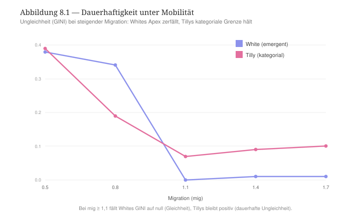

*** Robustheit
Unser Befund bleibt über Läufe mit Zufallskeimen stabil. Etwa bei starker Mobilität (mig 1,4) über fünf zufällige Keime hinweg zerfällt Whites Apex (GINI ≈ 0,01), wenn Tillys Apex hält (GINI ≈ 0,09). Jedoch müssen zwei Einschränkungen benannt werden, die im Lauf der Testen aufgetaucht sind. Wie wir es oben erwähnt haben, mindert eine wachsende Mobilität auch Tillys sozialer Ungleichheiten (der GINI fällt von 0,39 auf 0,09). Oder anders gesagt: wenn wir von dauerhaften sozialen Ungleichheiten sprechen, setzt dies nicht voraus, dass sich diese Ungleichheiten nicht verändern. Zweitens führen nicht alle strukturelle Kategorien zum Apex, sondern nur die strukturell bedeutsamsten Kategorien wie etwa Geschlechtermerkmale, Alters- oder auch noch Ethniemerkmale. Strukturell schwache Kategorien tun es nicht, oder wie es Tilly selbst sagt: Eine soziale Ungleichheit wird erst dann dauerhaft, wenn die äußere Kategorie strukturell schwer genug wiegt und mit einer tragenden Grenze innerhalb von einer Organisation zusammenfällt [cite:@tilly1998durable S. 79 f.].

*** Lesart. Der aufrechterhaltene kategoriale Mechanismus
Der Kern Tillys Auffassung von dauerhaften Ungleichheiten lässt sich an einem einzigen Bild zusammenfassen (vgl. Abbildung 8.2). Nehmen wir zwei Kategorien vor. Eine Kategorie bezeichnet die Elite, und die andere Kategorie bezeichnet ihre Außenseiter. Beide Kategorien sind durch eine Grenze voneinander getrennt. An dieser Grenze laufen stets zwei Operationen ab. Die erste Operation ist die /Ausbeutung/: Die Außenseiter leisten eine Arbeit, deren Mehrwert zur Elite geht bzw. deren Mehrwert sie nicht beziehen. Die zweite Operation ist die /Gelegenheitshortung/: Die Elite hält die wertvolle Ressource unter Verschluss, als Monopol, und versperrt den Außenseitern den Zugang zu dieser Ressource. Diese beiden Operationen geschehen nicht ein einziges Mal, sondern sie werden immer wieder produziert, was dazu führt, dass die sozialen Ungleichheiten aufrecht erhalten werden.

Die Dauerhaftigkeit von sozialen Ungleichheiten wird sogar dadurch verstärkt, dass beide Operationen die Grenze zwischen Kategorien und nicht die Akteure betreffen. Somit übersteht die soziale Ungleichheit den Wechsel der Akteure im Laufe der Zeit. Einzelne Akteure können aufsteigen, abwandern, ersetzt werden, aber die Grenze bleibt und trennt die Akteure weiter ungleichmäßig. Diesen Mechanismus hebt der digitale Zwilling hervor. Im Tillys Reglerprofil füttern die Außenseiter über die kategoriale Grenze die Elite ständig, weshalb der Apex hält, wenn die Akteure abwandern. Die Nachahmung verbreitet diese Grenze auf weitere Kontexte bzw. Tätigkeitsbereichen in den Sequenzen und in den Relationsstrukturen. Die Anpassung verfestigt sie in den alltäglichen Routinen. Beide tragen somit dazu bei, den aufgerichteten Mechanismus der dauerhaften sozialen Ungleichheiten weiter zu entwickeln. Am dauerhaftesten wird die Ungleichheit, wenn die innere Grenze (etwa die Grenze zwischen Leitung und Belegschaft in einer Firma) mit einer äußeren Kategorie (etwa die Kategorie Geschlecht oder die Kategorie Herkunft) zusammenfällt, weil sie dann zugleich strukturell verankert wird und wie ein Naturgesetz wirkt bzw. als natürlich und selbstverständlich wahrgenommen wird [cite:@tilly1998durable S. 75, 80].

#+CAPTION: Abbildung 8.2 — Die Ausbeutung lässt den Wert nach oben fließen, die Gelegenheitshortung schließt die Grenze. Die Personen wandern, aber die Grenze bleibt.
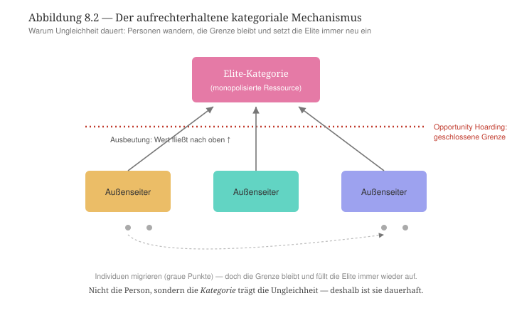

Eine Erörterung, die die dreistufigen bzw. transversalen, horizontalen und vertikalen Ungleichheiten betrifft, schärft die Lesart von H1. Misst man die transversale Ungleichheit (zwischen den Relationsstrukturen), die horizontale Ungleichheit (zwischen den Sequenzen) und die vertikale Ungleichheit (zwischen den Akteurkategorien) getrennt voneinander, dann wird ersichtlich, dass Tillys Apex nicht auf dieselbe Ebene der Ungleichheiten wie Whites Apex liegt. Whites Kontrolle erzeugt einen Apex mit einer starken transversalen Ungleichheit. Im digitalen Zwilling herrscht eine Relationsstruktur über die anderen (GINI 0,36). Tillys Apex dagegen lässt die Relationsstrukturen nahezu gleich (die transversale Ungleichheit liegt bei 0,03). Aber er erzeugt eine hohe horizontale Ungleichheit (0,15), die sich gleichmäßig in allen Strukturen durchsetzt. Selbst unter der Bedingung der Mobilität der Akteure bleibt sie erhalten. Dies bedeutet, dass im Kontrast zu White Tillys Herrschaftsauffassung ist mit einer Auffassung von horizontalen Ungleichheiten bzw. Ungleichheiten zwischen Sequenzen von Relationsstrukturen verbunden. Dies widerlegt H1 nicht, sondern ergibt eine verfeinerte Deutung von dieser Hypothese: Tilly und White teilen zwar den Ansatz einer relationalen Erzeugung von sozialen Ungleichheiten, aber sie sehen der Auslöser von sozialen Ungleichheiten an unterschiedlichen Stellen. Bei White entstehen sozialen Ungleichheiten auf der Ebene der Konkurrenz zwischen Positionen bzw. in den Begriffen der TR auf der Ebene von Relationsstrukturen. Bei Tilly entwickeln sie sich ab der Ebene der unterschiedlichen Tätigkeitsbereichen in Verbindung mit den Institutionen und Organisation in diesen Bereichen, die diese Ungleichheiten verfestigen und dauerhaft etablieren können.

Wie der digitale Zwilling nahelegt, stellt die Mobilität der Akteure die Bedingung dar, die die beiden Lesarten trennt. Unter der Bedingung der sozialen Mobilität von Akteuren besteht die im Sinne von einem relationalen Ansatz gedeutete soziale Ungleichheit nur dann, wenn sie an einer bedeutsamen strukturellen Kategorie gebunden und in den unterschiedlichen Tätigkeitsbereichen von einer Gesellschaft durch die Vermittlungsinstanzen von diesen Bereichen verbreitet werden kann.

Ein letzter Blick auf die Vermittlung schärft schließlich den Unterschied zwischen beiden Theorierahmen. Misst man das Volumen der vermittelten Zirkulation zwischen den Relationsstrukturen im digitalen Zwilling (crossOff), dann sieht man, dass sie überall von der Herrschaft verkleinert wird. Dies geschieht am tiefsten bei Tilly (0,139 gegenüber Whites 0,170 und der TR 0,266), und es ist kein Zufall. Tillys Mechanismus der Etablierung von dauerhaften Ungleichheiten ist ein Schließungsmechanismus, der zwischen der Elite und dem Rest der Gesellschaft operiert und zum Schutz der Elite funktioniert. Die Gelegenheitshortung verriegelt die Grenze zwischen Elite und Gesellschaft und stellt die sozialen Ressourcen unter dem Monopol der Elite. Entsprechend zerfällt die Zirkulation am tiefsten bei Tilly (0,418), wenn bei White dagegen die Vermittlungsinstanzen korrigieren ihre formalen Operationen innerhalb der Relationsstrukturen und lösen somit langsam die Sperre (crossOff steigt auf 0,581). So zeigt sich an der Operation der Vermittlung durch Vermittlungsinstanzen von Relationsstruktur das, was die Mobilität nahelegte: Tillys Elite sperrt sich aus dem Rest der Gesellschaft und schließt den Zugang zu ihr selbst vollständig mit der Beihilfe von Institutionen und Organisationen der Gesellschaft. Damit kann diese Barriere die Wanderung von Akteuren dauerhaft überstehen.

*** Entwicklungslinien
In Bezug auf die TR ist der Beitrag Tillys zu dauerhaften sozialen Ungleichheiten wichtig, weil er die Rolle der Zeitdimension unterschtreicht. Die TR, die Reziprozität und Zirkulation miteinander verbindet, kennt mit dem idealen und nie realisierbaren symmetrischen Zustand von Relationsstrukturen, die perfekt harmonieren würden, und der Realität des Apex-Regimes zwei Zustände. Mit Tilly verstehen wir, dass zwischen beiden Zuständen die Frage der Aufrechterhaltung gestellt wird. Wann hält eine Asymmetrie und wann schrumpft sie, sind Fragen, die, wie der digitale Rahmen der TR Nahlegt, sich nicht nur an der Mobilität der Akteure entscheidet, sondern auch und vielleicht insbesondere an der Art der Vermittlung, die Instanzen der Gesellschaft entwickeln, um sich mit Akteuren in den unterschiedlichen Verhältnissen einzuschreiben, die den Puls der Dynamik von Relationsstrukturen ergeben. Oder anders gesagt: Die TR untersucht, wie Mechanismen der sozialen Ungleichheiten ab dieser Operationen der doppelten Einschreibung von Akteuren und Vermittlungsinstanzen in Relationsstrukturen entstehen, die solche Ungleichheiten auf Dauer anzulegen versuchen, und wie eine Schwächung von solchen Mechanismen die Entstehung von anderen Mechanismen mit der Produktion von entsprechenden spezifischen sozialen Ungleichheiten vorbereiten.

Eine Theorie der sozialen Ungleichheiten, die in mancher Hinsichten an Tilly nah ist, ergibt sich aus dem Theorierahmen von Pierre Bourdieu. In diesem Theorierahmen findet man das Phänomen der Entstehung von einer Herrschaft wieder, die sozialen Ungleichheiten etabliert, verfestigt und verbreitet. Diese These entwickelt Bourdieu in Verbindung mit den zentralen Begriffen seiner Theorie, d. h. mit den Begriffen des Kapitals, des Feldes und des Habitus als strukturierender Struktur von inkorporierten Dispositionen, die aus der primären und sekundären Sozialisation gewonnen werden. Nicht zufällig werden beide Autoren in der jüngeren relationalen Soziologie häufig zusammen erwähnt: Als große Denker der sozialen Ungleichheit verorten beide Autoren deren Entstehungsort weder in den Personen noch im Zufall, sondern in den sozialen Verhältnissen.

** Kapitel 9 — Die Praxeosoziologie Pierre Bourdieus
:PROPERTIES:
:STATUS: DRAFT
:END:
Mit Pierre Bourdieu schließen wir unseren Vergleich der TR mit Theorierahmen ab, die fester im Kontext der relationalen Soziologie positioniert sind. Bei Bourdieu finden wir das, was White und Tilly in ihrer Auffassung der relationalen Soziologie je für sich entwickelt haben, d. h. eine relationale Produktion von Herrschaft und ihre dauerhafte Verankerung in der Gesellschaft. Dies taucht bei Bourdieu in der Form vom Machtverhältnis als der bedeutsamen Art der Relation in der Gesellschaft, die die soziale Praxis strukturiert. Dieses Machtverhältnis entwickelt Bourdieu mit seinem Begriffswerzeug bzw. mit seiner Theorie der Kapitalarten, der sozialen Felder, des Habitus, und er macht deutlich, dass Herrschaft auf dieses Machtverhältnis generiert wird und in der Form der symbolischen Gewalt konkretisiert wird. Bourdieus entscheidender Schritt gegenüber der TR besteht in der Dialektisierung vom kulturellen Kapital (symbolisiert durch die Relationsstruktur A in der TR) und vom ökonomischen Kapital (symbolisiert durch die Relationsstruktur C in der TR). Die TR hält Kultur (A) und Wirtschaft (C) für relational entfernt, und als Relationsstrukturen sind sie in einer Relation nur durch die Vermittlung von den anderen Relationsstrukturen, die im digitalen Zwilling mit den Begriffen der Politik (B) und der Medien (D) vereinfacht bezeichnet werden. Bourdieu behandelt die Kultur als Ressource der Akteure bzw. als Kapital, das wie andere Arten von Kapital unmittelbar ins ökonomische Kapital konvertiert werden kann. Damit kurzschließt Bourdieu die Vermittlung von Ressource von Tätigkeitsbereichen in andere Tätigkeitsbereiche, die die TR für notwendig hält. Deshalb testen wir in diesem Kapitel, wie die These der Konvertierbarkeit von Kapitalarten im digitalen Zwilling der TR simuliert werden kann und zu welchen Feststellung sie führt.

*** Ontologische Korrespondenz und Residuum
Die vier Realtionsstrukturen der TR können als Ressourcen von Akteuren verstanden werden, und somit können sie wie die vier Kapitalarten von Bourdieu verstanden werden, die bei Bourdieu ähnlich wie in der TR den Polen des sozialen Raums bilden. A würde dann mit dem kulturellen Kapital, C mit dem ökonomischen, B mit dem symbolischen und D dem sozialen Kapital übereinstimmen. Die Akteure werden von ihrem Habitus als strukturierender und strukturierter bzw. von den inkorporierten Dispositionen geformte Struktur getrieben. Die Felder und Subfelder sind innerhalb der unterschiedlichen Relationsstrukturen verteilt, und sie werden durch die Verteilung der Kapitalarten definiert und ausdifferenziert, die die Vermittlungsinstanzen in diesen Relationsstrukturen und deren Sequenzen leisten. Das Residuum ist hier präzise lokalisierbar. Die TR vermittelt A↔C über D und B, Bourdieu kurzschließt diese Vermittlung durch die unsichtbare Hand der Konvertibilität der Kapitalarten. Was im digitalen Zwilling als Eingriff erscheinen soll — A und C unmittelbar zu koppeln —, ist genau Bourdieus ontologische Voraussetzung. Ein zweites Residuum betrifft die symbolische Gewalt. Die Verkennung der Kriterien, die dazu beigetragen haben, die Macht zu beziehen und die Herrschaft auszuüben, bleiben von der Gesellschaft außerhalb der Elite unbekannt, weshalb die Herrschaft legitim wird und sich in Akten der symbolischen Gewalt ungestört manifestieren kann. Eine solche Erklärung hat im zirkulatorischen Modell der TR keine Entsprechung und bleibt vermerkt.

*** Theoretischer Kern

Die erste Orientierung zur Operationalisierung Bourdieus These der sozialen Ungleichheiten im digitalen Zwilling betrifft die Konvertibilität der Kapitalarten. Bourdieu fasst die Kapitalarten als ineinander überführbar: Sie können „gegenseitig ineinander transformiert werden“, wobei das ökonomische Kapital „unmittelbar und direkt in Geld konvertierbar“ und in der Form vom Eigentumsrecht institutionalisiert wird, das kulturelle Kapital unter bestimmten Bedingungen ins ökonomische Kapital konvertierbar und in der Form von Bildungstiteln institutionalisiert wird [cite:@bourdieu1983formen]. Das inkorporierte kulturelle Kapital ist dabei "das legitime Mittel der Vermögensübertragung schlechthin" [cite:@bourdieu1979capital S. 3]. Konvertibilität und Institutionalisierung gehören zusammen. Der Markt und der Titel machen aus dem Kulturellen eine direkt ökonomisch verwertbare Größe.

Die zweite Orientierung betrifft das Feld als relationaler Raum. Nach Bourdieu ist die soziale Welt ein Raum von Positionen, die durch ihre wechselseitigen Abstände und durch die Verteilung der Kapitalarten definiert sind. Der soziale Raum ist deshalb relational definiert, was Bourdieu an der TR nähert.

Die dritte Orientierung bezieht sich auf das Habitus bzw. auf das einverleibte Prinzip der Produktion der Praxis, das die objektiven Strukturen in Dispositionen übersetzt und so die soziale Ordnung reproduziert [cite:@bourdieu1972esquisse].

Die vierte Orientierung bezieht sich auf die Herrschaft durch institutionalisierte Vermittlung: In den /Modes de domination/ unterscheidet Bourdieu die Abhängigkeit von der Herrschaft, weil „les relations de domination sont médiatisées par des mécanismes objectifs et institutionnalisés“ — durch Markt, Schule, Titel —, und genau diese vermittelte, „médiate et durable“ Aneignung die Herrschaft in den modernen Gesellschaft kennzeichnet [cite:@bourdieu1976modes S. 122]. Schließlich sichern die Verkennung und die Konkretisierung der Herrschaft in der symbolischen Gewalt die Legitimität der Herrschaft ab. Sie beruht auf den „conditions sociales de la dissimulation“ [cite:@bourdieu1977pouvoir S. 405], und sie wird insbesondere durch die Instanzen der sekundären Sozialisation und dabei insbesondere die Instanzen des Ausbildungssystem wie etwa die Schule verbreitet. Somit trägt die Herrschaft über die Selektions- und Sanktionsperationen von Vermittlungsinstanzen der Felder „à la reproduction de l'ordre établi“ bei [cite:@bourdieu1970reproduction].

*** Operationalisierung
Im digitalen Zwilling bilden wir zwei Fälle ab, die auf ein dialektisiertes und ein nicht dialektisiertes Bourdieu-Profil basieren. Das dialektisierte Bourdieu-Profil setzt wie im Theorierahmen Bourdieus die unmittelbare Beziehung zwischen A und C. Im Schmetterlingspfad bzw. in der Kette der Relationsstruktur A steht die Sequenz C voran, und umgekehrt steht in der Kette der Relationsstruktur C die Sequenz A voran. Damit wird die Vermittlung über D und B im digitalen Zwilling nicht stattfinden und die Durchlässigkeit (over) zwischen A und C höher sein. Das nicht-dialektisierte Bourdieu-Profil verändert die Grundlagen des digitalen Zwilling nicht. Es gilt die mediatisierte Distanz zwischen Relationsstrukturen. In beiden Fällen wird die Konzentration (alpha) der Akteure in den Relationsstrukturen über die Schwelle gehoben, da erst dann die Dynamik der Herrschaft einsetzt.

*** Vorregistrierte Hypothesen
Vor dem Lauf des digitalen Zwilling formulieren wir folgende Hypothesen, die wir testen werden. /H1/ testet die Ko-Reproduktion vom kulturellen und ökonomischen Kapital bei Bourdieu bzw. deren gegenseitigen unterstützende Wirkung. Mit der Dialektisierung von A und C sollten das kulturelle und das ökonomische Kapital die Reproduktion vom relationalen Rahmen oder, in den Begriffen von Bourdieu, vom sozialen Raum erzeugen. H2 erlaubt, das Residuum zu prüfen, das der Theorie Bourdieus eigen ist und vom digitalen Zwilling nicht abgebildet werden sollte. Da der digitale Zwilling nach dem Prinzip vom winner-take-all funktioniert, sollte ein stabiler Doppelapex mit Herrschaft von A und C unmöglich sein, weil sie die relationale Ontologie der TR überschreiten würde. Die Hypothese /H3/ besagt, dass die Konvertibilität den Erhalt des kulturellen Kapitals gewährleisten sollte, oder anders gesagt: Die ökonomische Herrschaft unterstützt die Herrschaft vom kulturellen Kapital unter der Bedingung ihrer gegenseitigen unmittelbaren Konvertibilität. Mit der Hypothese /H4/ zur Hysterese wird schließlich behauptet, dass die etablierte Herrschaft reproduziert wird und somit nicht nachlässt, wenn sie einmal errichtet wurde.

*** Lauf und Ergebnisse
Der Lauf im digitalen Zwilling zeigt, dass in beiden Szenari der Dialektisierung von A und C oder der Nicht-Dialektisierung von A und C H1 und H2 nicht unterstützt werden können (Abbildung 9.1). Die Dialektisierung erzeugt keinen stabilen Doppelpol. Unterhalb der Schwelle sind A und C nur schwach und gemeinsam erhöht (je etwa 26 %). Oberhalb der Schwelle greift das winner-take-all Prinzip der TR und beide Relationsstrukturen werden zu Satelliten von anderen Relationsstrukturen (je etwa 13 %), während eine einzelne Relationsstruktur zum Apex wird. Dies bedeutet, dass im digitalen Zwilling das kulturelle und das ökonomische Kapital nie gemeinsam steigen, weil sie die relationale Ontologie der TR überschreiten.

#+CAPTION: Abbildung 9.1 — Auch bei direkter A↔C-Kopplung steigen das kulturelle und das ökonomische Kapital nie gemeinsam zum Doppelapex.
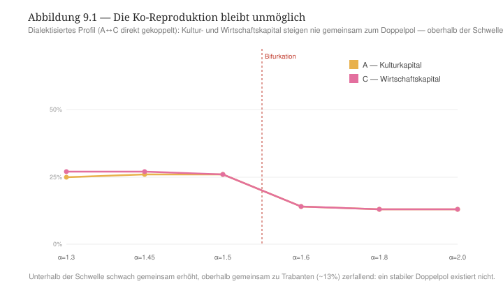

Unsere Hypothese H3 wird dagegen bestätigt, und sie zeigt, dass der digitale Zwilling der TR einen bedeutsamen Ansatz Bourdieus Theorie repliziert. Wenn die Herrschaft des ökonomischen Kapitals verabsolutiert wird (C als Apex), dann hängt die Entwicklung des kulturellen Kapitals (A) von der Konvertibilität zwischen dem ökonomischen und dem kulturellen Kapital. Wenn das ökonomische Kapital nicht ins kulturelle Kapital konvertiert werden kann -- das Vermögen ist da, führt aber nicht zum Studium an den Spitzenuniversitäten --, dann verfällt das kulturelle Kapital. Es weist die niedrigste innere Reziprozität auf (0,30), und es zerfällt als kohärente Struktur. Mit der Konvertibilität vom ökonomischen Kapital ins kulturelle Kapital wird das kulturelle Kapital weiter entwickelt (die innere Reziprozität von A wird zu 0,62), und im Szenario der Dialektisierung von A und C trägt das kulturelle Kapital dazu bei, das ökonomische Kapital zum eigentlichen Apex zu entwickeln (45 %). Dies entspricht Bourdieus Bild der Produktion und Reproduktion von sozialen Ungleichheiten. Das kulturelle Kapital ist die Konvertibilitätsform, dadurch das ökonomische Kapital die Herrschaft etabliert bzw. reproduziert.

H4 wird ebenfalls und deutlich bestätigt (Abbildung 9.2). Wenn die Konzentration der Akteure in den Relationsstrukturen zunächst hoch und dann niedriger gesetzt wird (1,8 → 1,2), dann bleibt das ökonomische Kapital als Apex bestehen (61 %), während dieselbe niedrige Konzentration der Akteure in Relationsstrukturen ohne vergangene etablierte Herrschaft den digitalen Zwilling zur Symmetrie bringt (Apex 25 %). Oder anders gesagt: Wenn die Herrschaft etabliert ist, dann reproduziert sie sich selbst und widersteht die Schrumpfung der Bedingungen, darunter sie entwickelt wurde. Diese Hysterese bildet der digitale Zwilling ab, die zur strukturellen Reproduktion des sozialen Raum führt.

#+CAPTION: Abbildung 9.2 — Hysterese: Die Herrschaft ist Geschichtsprodukt. Einmal installiert, wird sie reproduziert.
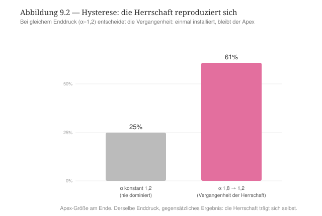

*** Robustheit
Die Befunde sind über die Keime stabil. Zwei Vorbehalte müssen jedoch eingeräumt werden. Erstens trägt der Init-Bias der gegenwärtigen Version vom digitalen Zwilling dazu bei, dass ohne erzwungene Dialektisierung die Relationsstruktur B bzw. die Politik zum Apex wird. Deshalb wurde ein dialektisiertes Bourdieu-Profil hergestellt, um die Aussagen zu A und C in einer Konfiguration zu prüfen, in der der Init-Bias nicht wirkt, damit Bourdieus Prämisse besser abgebildet werden kann. Zweitens ist die Hysterese ein Produkt aus dem selbstverstärkenden relationalen Raum der TR (die Großen wachsen). Dies bedeutet, dass die Reproduktion, davon Bourdieu spricht, als Pfadabhängigkeit im digitalen Zwilling abgebildet wird. Die Reproduktion ist dann nicht das bloße Ergebnis aus der Verstärkung von Relationsstrukturen.

*** Lektüre: die gekaperte Vermittlung
Auf der dreistufigen Skala der sozialen Ungleichheiten ist Bourdieus soziale Ungleichheit eine transversale soziale Ungleichheit mit voller Kaskade bzw. mit entsprechender Wirkung auf der drei Ebenen des digitalen Zwillings (Relationsstrukturen, Sequenzen und Sequenzfragmente, Akteurkategorien). Durch die Hysterese wird diese soziale Ungleichheit auf allen drei Ebenen so verriegelt, dass sie nicht mehr gelöst werden kann.

Hier lässt sich die Frage nach der Vermittlung, die wir im Tillys Kapitel zu den dauerhaften sozialen Ungleichheiten, zu Ende entwickelt. Wenn wir das Volumen der vermittelten Zirkulation fokussieren (crossOff), dann merken wir, dass im symmetrischen Zustand des digitalen Zwilling die Vermittlung vollständig wirksam ist (0,266). Unter Herrschaft sinkt sie sowohl bei Tilly, also auch bei Bourdieu, selbst wenn sie nicht in der selben Art und Weise. Bei Tilly fällt sie tief (0,139) und bleibt selbst unter wieder Belebung der Mobilität von Akteuren geschrumpft (0,418). Bei Bourdieu bleibt sie höher (0,172), und gerade dieses Ergebnis ist interessant. Denn es sagt, wie in jedem Theorierahmen die Vermittlung zerfällt. Bei Tilly wird die Vermittlung abgeschlossen, weil die Gelegenheitshortung die Grenze zwischen Elite und dem Rest der Gesellschaft verriegelt und die sozialen Ressourcen unter dem Monopol der Elite stellt. Die Zirkulation fällt entsprechend am tiefsten, weil es buchstäblich um die Sperrung vom Zugang zur Elite geht. Bei Bourdieu sieht man, dass die Vermittlung nicht ständig abgeschlossen wird, sondern wird geschwächt. Die Zirkulation zirkuliert weiter, weshalb wir ein höheres crossOff haben, was voraussetzt, dass die Zirkulation in eine private Media -- die direkte A↔C-Konvertibilität -- umgeleitet wird, die die öffentliche Vermittlung kurzschließt. Folglich verriegeln die Herrschenden im Theorierahmen von Bourdieu nicht das Tor zum Rest der Gesellschaft, sondern sie verschaffen sich einen eigenen Raum, und sie machen es mit der Beihilfe der Vermittlungsinstanzen. In Bourdieus Theorie konvertieren die Vermittlungsinstanzen und beispielhaft die Instanzen des Ausbildungssystems das vererbte kulturelle Kapital in legitimen Vorteilen (etwa in Rechten), und diese Konversion reproduziert die Klassenherrschaft [cite:@bourdieu1983formen; @bourdieu1976modes S. 122]. Die Sperre ist somit legitimiert: Die symbolische Gewalt, die Dialektik der Anerkennung/Verkennung machen den Raum der Herrschenden für den Rest der Gesellschaft unsichtbar und unbewusst [cite:@bourdieu1977pouvoir S. 405; @bourdieu1970reproduction]. Im Unterschied von Tilly braucht dann Bourdieu Bourdieu die Verkennung als nicht materielles bzw. als symbolisches Schliessungsmechanismus, damit der private Raum der Elite als der gemeinsame Raum erscheint.

#+CAPTION: Vermittlung unter Herrschaft (crossOff): Bei White kehrt die Zirkulation unter Mobilität zurück (Erschöpfung), bei Tilly bleibt sie am tiefsten gekappt (Schließung), bei Bourdieu ist sie höher, weil sie umgeleitet statt versperrt wird.
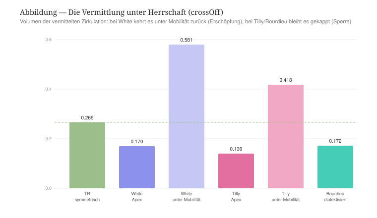

Tilly wie Bourdieu sprechen also von dauerhaften sozialen Ungleichheiten, aber hier auch verändert sich die Bedeutung von "dauerhaft" je nachdem, was der Theorierahmen beider Autoren voraussetzt. Bei Tilly wird die Dauer in der Kategorie verankert. Bourdieu verortet sie in den gesellschaftlichen Institutionen und im Habitus. Nichtsdestotrotz könne beide Autoren festhalten, dass einmal etabliert die Herrschaft nicht mehr abgeschafft werden kann, weil sie sich von den Bedingungen löst, die zu ihrer Entstehung geführt haben.

*** Entwicklungslinien
Einmal in den digitalen Zwilling der TR überführt, zeigt sich Bourdieus Theorierahmen an der Schnittstelle zwischen Whites und Tillys Theorierahmen. Er vereint die relationale Produktion der Herrschaft (White) und ihre Dauerhaftigkeit (Tilly), und er fügt das hinzu, was wir bei White und Tilly nicht finden. Es ist die Theorie der Konvertibilität der Kapitalarten, die die Vermittlung schwächt, und eine Theorie der Verkennung, die eine solche schwache Vermittlung und somit sowohl die Konvertibilität der Kapitalarten als auch die Reproduktion der Herrschaft privilegierter Klassen legitimiert. Der digitale Zwilling verdeutlicht Bourdieus Ansatz, selbst wenn er auch seine Grenzen zeigt: Die Reproduktion der Kapitalarten, der (Klassen)Habitus und der Vermittlungsinstanzen ist im winner-take-all Zustand bzw. im Laufe der Satellisierung kein stabiler Zustand. Die magische Operation der Invisibilisierung des speziellen Raumes der Herrschenden unterstützt Bourdieus Reproduktionsansatz insofern, als sie die Dauerhaftigkeit des herrschenden Apex postuliert, die mit der Annahme verbunden ist, dass einmal etabliert die Herrschaft der herrschenden Klassen nie gestört wird. Im Theorierahmen der TR wird eine solche starke Annahme nicht unterstützt, sondern relativiert. Zwar kann man mit Bourdieu von der Konvertibilität der Kapitalarten sprechen, aber man muss diese Konvertibilität nicht als eine notwendige, sondern als eine mögliche Kurzschließung der Vermittlungsoperationen von Vermittlungsinstanzen in Sequenzen von Relationsstrukturen und in diesen Relationsstrukturen auffassen. Dies ändert die Begründung der Dauerhaftigkeit von sozialen Ungleichheiten insofern, als diese sozialen Ungleichheiten nicht mit dem erreichten stabilen Zustand der sozialen Herrschaft von herrschenden Klassen verharren, sondern sich dynamisch im Laufe der wechselseitigen Satellisierung von Relationsstrukturen erneut konstituieren und ebenfalls erneut verbreitet werden. Diese Ko-Konstitution von sozialen Ungleichheiten in einem relationalen Raum mit wechselnden Apex ähnelt der Auffassung von sozialen Ungleichheiten, die wir im Kontext der Intersektionalitätsforschung finden, zu der wir jetzt kommen.

** Kapitel 10 — Intersektionalität
:PROPERTIES:
:STATUS: DRAFT
:END:
Im Vergleich zu den Theorierahmen von Charles Tilly und Pierre Bourdieu spricht die Intersektionalitätsforschung ebenfalls von Herrschaft und von Ungleichheit, aber sie tut es auf einer Art und Weise, die der TR erstaunlich nahe kommt. Diese Ähnlichkeit wollen wir in diesem Kapitel vertiefen, weshalb wir die wichtigsten Ansätze der Intersektionalitätsforschung im digitalen Zwilling der TR abbilden möchten.

Der Kerngedanke der Intersektionalitätsforschung zu sozialen Ungleichheiten besteht darin, dass die Kernachsen der Ungleichheit — Klasse, Geschlecht, „race“ bzw. "ethnicity" — nicht additiv verstanden werden, sondern sie konstituieren sich wechselseitig. Die soziale Situation einer afro-amerikanischen Arbeiterin ergibt sich nicht aus der Summe dreier Nachteile, sondern wird in der Wechselwirkung mit solchen sozialen benachteiligten Merkmalen konstituiert. Dieses Kapitel prüft diesen Ansatz im digitalen Zwilling mit Bezug auf drei bedeutsamen Werke der Intersektionalitätsforschung: Das Werk von Patricia Hill Collins, das die Relationalität ins Zentrum der Intersektionalität rückt; das Werk von Kimberlé Crenshaw, das die Ausgangslage der Intersektionalitätsforschung bestimmt hat; das Werk von Joya Misra, das erlaubt, die Kategorien der Intersektionalitätsforschung zu schärfen.

*** Ontologische Korrespondenz und Residuum
Die Intersektionalität kennt keine vier Relationsstrukturen. Etwa die Grundmerkmale Klasse, Geschlecht, „race“ bzw. "ethnicity" sind Achsen der sozialen Ungleichheit, die einen sozialen Raum durchkreuzen. Deshalb bildet der digitalen Zwilling den Ansatz der Intersektionalitätsforschung nicht auf der Ebene der Relationsstrukturen, sondern auf der Ebene der dreifachen sozialen Ungleichheiten bzw. der transversalen, horizontalen und vertikalen sozialen Ungleichheiten: Die soziale Situation von einem Akteur hängt immer von seiner Zirkulation innerhalb und zwischen Akteurkategorien (vertikale sozialen Ungleichheiten), Sequenzen von Relationsstrukturen (horizontale sozialen Ungleichheiten) und Relationsstrukturen (vertikale sozialen Ungleichheiten). Diese drei Ebenen sind kreuzende Achsen, entlang derer Nachteile akkumuliert werden können, wie dies die Intersektionalitätsforschung voraussetzt. Das Residuum entspricht hier keine defizitäre Abbildung vom Ansatz der Intersektionalitätsforschung, sondern es ist mit der Entwicklung vom Ansatz der Intersektionalitätsforschung im Laufe der Zeit verbunden. Wenn die Intersektionalitätsforschung in ihren Anfängen die Kategorien Klasse, Geschlecht, „race“ als grundlegend, als gegeben, und als Kategorien mit eigener Geschichte versteht, entwickelt sich diese Betrachtung immer mehr relational. Bei Collins sieht man eine solche Wende am deutlichsten, die davon ausgeht, dass diese Kategorien ihre Bedeutung erst relational gewinnen. Eine solche Annahme kommt dem Rahmen der TR nah.

*** Theoretischer Kern
Die erste Grundorientierung für die Operationalisierung der Intersektionalitätsforschung im digitalen Zwilling der TR liefert die Ausgangslage dieser Forschung, wie sie Crenshaw definiert. Die Erfahrung der sozialen Ungleichheiten wird an der Kreuzung mehrerer benachteiligten Merkmalen gemacht, davon die Zusammenstellung eine je eigene verschärfte benachteiligte Lage für die Akteure bildet [cite:@crenshaw1991mapping]. Die sozialen Ungleichheiten werden somit von den Akteuren unterschiedlich erfahren und erlebt, weil sie je nach der sozialen Situation der Akteure unterschiedlich zusammengestellt werden.

Der zweite Grundorientierung entspricht der Intersektionalitätsforschung in der Auffassung von Collins. Die benachteiligten kategoriellen Merkmale, die zu sozialen Ungleichheiten führen, werden relational herausgebildet bzw. sind nicht gegeben. Collins Auffassung „verschiebt den Fokus weg von den essentiellen Qualitäten, die nur scheinbar im Zentrum der Kategorien liegen, hin zu den relationalen Prozessen, die sie verbinden“. Klasse, Geschlecht, „race“ werden „durch relationale Prozesse konstituiert und aufrechterhalten“ und gewinnen so ihren Sinn und ihre soziale Bedeutung [cite:@collins2019intersectionality]. Dieses Argument von Collins entspricht Wort für Wort dem Argument der TR, wenn sie den Essentialismus der sozialen Kategorien kritisiert und sagt, dass solche Kategorien relational produziert werden.

Die dritte Grundorientierung betrifft das, was Collins sagt, wenn sie von den Modi des relationalen Denkens spricht. Die Relationalität erfolgt unterschiedlich. Sie kann durch Addition, durch Artikulation und durch Ko-Konstitution erfolgen [cite:@collins2019intersectionality]. Die Relationalität nach der Addition der Merkmale wie etwa in der Auffassung von Crenshaw kann als heuristisches Werkzeug verwendet werden, weil sie das zeigt, was in einer bestimmten Konstellation von benachteiligten Merkmalen fehlt bzw. berücksichtigt werden muss, um die sozialen Ungleichheiten vollständig zu verstehen und abbilden zu können. Aber diese Relationalität nach Addition erlaubt nicht, es zu verstehen, wie die Wechselwirkungen zwischen unterschiedlichen sozialen Systeme die sozialen Ungleichheiten hervorbringen. Deshalb muss die Intersektionalitätsforschung den Übergang vom Additiven zur wechselseitigen Konstitution von sozialen Ungleichheiten leisten, und somit kann sie beschreiben, wie die kritische Analyse „sich wechselseitig konstituierender Herrschaftssysteme“ von Klasse, Geschlecht, „race“ und Sexualität die sozialen Ungleichheiten produziert, denen etwa die afro-amerikanischen Frauen in den Vereinigten Staaten ausgesetzt sind [cite:@collins2015dilemmas].

Der vierte Orientierung berücksichtigt die Arbeit von Joya Misra, wenn sie sagt, dass die intersektionalen Kategorien zugleich strukturell und relational konzipiert werden müssen. Diese Kategorien sind keine Behälter von benachteiligten Merkmalen, sondern es sind Verhältnisse [cite:@misra2018categories], die sich aufeinander wechselseitig beziehen und somit dazu beitragen, die Struktur von Gesellschaft mit zu konstruieren.

*** Operationalisierung
Da wir zwei bedeutsame Ansätze in der Intersektionalitätsforschung haben, die jeweils nach einem kategoriellen und nach einem relationalen Ansatz argumentieren, erstellen wir im digitalen Zwilling zwei entsprechenden Reglerprofile. Das erste Profil prüft die Überadditivität von Kategorien bzw. von kategoriellen Merkmalen im Sinne Crenshaws. Es kombiniert zwei morphologische Nachteile — eine unterkritische Konzentration der Akteure in Relationsstrukturen (alpha 1,45, unterhalb der Bifurkation) und eine entsprechende gesperrte Mobilität dieser Akteure (mig 0,2) —, die allein betrachtet zu schwach wären, um die sozialen Ungleichheit zu erzeugen. Das zweite Profil prüft den Ko-Konstitution-Ansatz von Collins. Es bildet eine Herrschaft ab (alpha 1,8), und es setzt eine entsprechende  Deklassierung von Akteuren (decl 0,95), um zu messen, ob diese Deklassierung von der Entstehung dieser Herrschaft abhängt. Die Profile liegen als =profil_Intersekt_suradditivitaet.csv= und =profil_Intersekt_koconstitution.csv= bei.

*** Vorregistrierte Hypothesen
Wir formulieren eine erste Hypothese /H1/ zur Überadditivität. Wenn wir Crenshaw folgen, dann sollten wir davon ausgehen, dass zwei Nachteile, die an sich keine große Folgen für die sozialen Ungleichheiten haben, mehr Ungleichheit produzieren, wenn sie in Interaktion treten, als wenn sie bloß zusammen genommen werden. Diese Interaktion von Nachteilen ist die Intersektion als qualitativer Indikator der sozialen Situation von Akteuren. Eine Hypothese /H2/ formulieren wir, um die Besonderheit der Kategorien zu berücksichtigen, die als intersektionale Achsen im digitalen Zwilling abgebildet werden. Mit H2 setzen wir voraus, dass die Überadditivität nicht achsenspezifisch ist bzw. dass sie für jede Art von Achsen gelten würde. Eine Hypothese /H3/ betrifft Collins' Ko-Konstitution These. Dieselbe Bildung von vertikalen Ungleichheiten sollte je nach struktureller Lage verschiedene spezifische bzw. entgegengesetzte Wirkungen zeitigen. Schließlich bezieht sich eine Hypothese /H4/ auf das Additive als ein Modus der Relationalität von Nachteilen. Ein rein additiver Nachteil reicht nicht aus, um die soziale Ungleichheit zu produzieren bzw. zu stärken, weil Nachteile relational bzw. intersektional ko-konstituiert werden und soziale Ungleichheiten entsprechend hervorbringen.

*** Lauf und Ergebnisse
Im digitalen Zwilling wird H1 vollkommen bestätigt (Abbildung 10.1). Die unterkritische Konzentration der Akteure in Relationsstrukturen allein erzeugt nichts (GINI 0,001). Die gesperrte Mobilität der Akteure allein erzeugt nichts (GINI 0,000). Doch zusammen genommen kippen sie den relationalen Raum in die Herrschaft (GINI 0,445). Dieses Ergebnis bleibt über fünf Keime sehr robust. Die Intersektion von Nachteilen bringt einen qualitativen Unterschied, der im digitalen Zwilling als eine Schwelle abgebildet wird, die keiner der beiden Nachteile allein überschreitet, und die dann überschreitet wird, wenn beide Nachteile gemeinsam genommen werden. Dieses Ergebnis bestätigt den Ansatz von Crenshaw: Die Intersektion von Nachteilen und nicht ihre Addition produziert einen Übermaß an sozialen Ungleichheiten.

#+CAPTION: Abbildung 10.1 — Überadditivität an der Schwelle: Konzentration und Mobilitätssperre erzeugen allein nichts; gemeinsam produzieren sie eine Herrschaft (GINI 0,445).
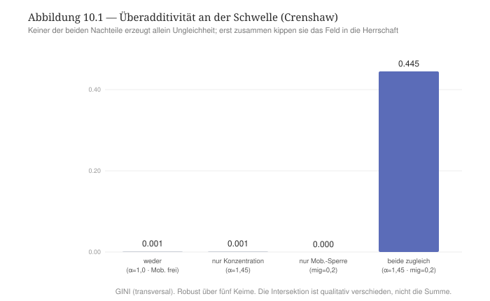

Dagegen wird H2 im digitalen Zwilling revidiert. Die Überadditivität von Nachteilen ist achsenspezifisch. Ersetzt man die Mobilitätssperre durch die Deklassierung, so verschwindet der Effekt. Dies bedeutet, dass in dieser Konfiguration die Deklassierung allein nahezu wirkungslos ist, und sie staffelt sich nicht mit der Konzentration der Akteure in den Relationsstrukturen (der Interaktionswert ist um null, sogar leicht negativ). Dies bedeutet, dass Nicht jeder Nachteil mit anderen Nachteile interagiert, sondern intersektional werden das, was die TR die morphologischen Determinanten nennt, die Zirkulation und die Mobilität der Akteure bestimmen und die Verbreitung und Satellisierung der Relationsstrukturen mittelbar beeinflussen.

H3 wird ebenso klar bestätigt (Abbildung 10.2). Im symmetrischen Zustand des digitalen Zwillings trifft die Deklassierung der Akteure alle Relationsstrukturen im vergleichbaren Maßen (die vertikale Ungleichheit ist überall im relationalen Raum 0,49). Unter der Herrschaft von einer Relationsstruktur wird diese Wirkung dennoch gespaltet. Im Apex bzw. in der herrschenden Relationsstruktur sinkt die Deklassierung auf 0,26 (die Relationsstruktur wird homogener bzw. die Stratifikation wird vereinfacht), in den beherrschten Relationsstrukturen steigt sie auf 0,57 (sie werden stärker stratifiziert). Dieses Ergebnis zeigt, dass dieselbe Deklassierung je nach Lage von einer Relationsstruktur eine unterschiedliche Bedeutung für die soziale Ungleichheit in einer Relationsstruktur hat. Dies bestätigt Collins' Relationalitätsansatz: Die Wirkung von einem intersektionalen Nachteil hängt von dem relationalen Kontext ab. Er nimmt seine Bedeutung von einem anderen Nachteil, der sich an der Intersektion mit diesem Nachteil befindet.

#+CAPTION: Abbildung 10.2 — Ko-Konstitution: Dieselbe Deklassierung trifft im symmetrischen digitalen Zwilling alle Relationsstrukturen gleichermaßen; unter Herrschaft hat die selbe Deklassirung eine unterscheidliche Wirkung auf die Relationsstrukturen je nach der spezifischen Lage, in der sich diese Relationsstruktur befindet (Apex 0,26 / Beherrschte 0,57).
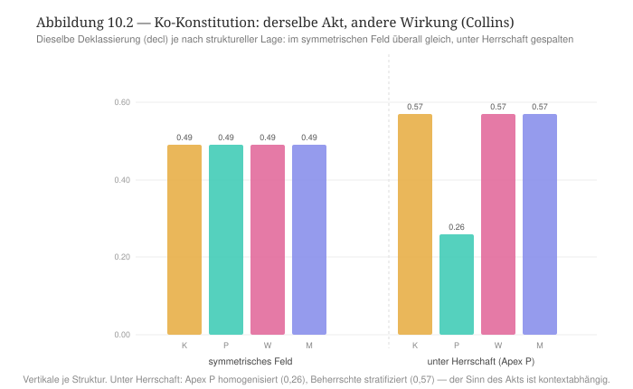

H4 als Kehrseite von H2 wird ebenfalls bestätigt. Die Deklassierung allein erzeugt fast keine soziale Ungleichheit. Dies ist der Befund, dass ein Nachteil allein nicht zwangsläufig weitere Nachteile zu sich zieht, sondern Nachteile sind in einer Relation der Ko-Konstitution und produzieren so die sozialen Ungleichheiten.

*** Robustheit
Die Befunde sind stabil über verschiedene Läufe mit unterschiedlichen Konfigurationen des digitalen Zwillings. Die Überadditivität bleibt über fünf Keime identisch (GINI 0,445). Sie ist eine strukturelle Tatsache und kein Artefakt, das von der Ausgangslage des digitalen Twins erzeugt werden würde. Die Achsenspezifität wurde durch den Vergleich mehrerer zweiter Achsen (Deklassierung vs. Mobilitätssperre) kontrolliert und bestätigt. Die Ko-Konstitution ist über die Keime invariant, und die gemessenen Spaltung der Wirkung von Nachteilen (0,31) in der Lage Apex vs. beherrschter Relationsstrukturen geht in Unterstützung von diesem Ergebnis. Ein Vorbehalt bleibt: Der Simulator kennt die Geschichte der Kategorien der Intersektionalität nicht (Geschlecht, „race“). Er kann diese Geschichte nicht abbilden, weshalb das, was der digitale Zwilling abbildet, ist die Form der Komposition und der Ko-Konstitution ohne deren konkreten sozialen Gehalt.

*** Lesart. Zwei Auffassung der sozialen Ungleichheit vom Standpunkt der Intersektionalität
Der digitale Zwilling reproduziert beide Auffassung der Intersektionalität, und er kann sie zwei Determinantentypen der TR zuordnen. Die Überadditivität Crenshaws gilt für die morphologischen Determinanten der Relationsstrukturen. Zwei Nachteile, die eine Zirkulation bestimmen, überschreiten gemeinsam eine Schwelle, die keiner allein erreicht. Die Ko-Konstitution Collins' gilt für die strukturellen Determinanten der Relationsstrukturen. Der Sinn von einem kompositionellen Nachteil (etwa der Deklassierung) hängt von der strukturellen Lage einer Relationsstruktur ab. Die beiden Auffassungen der Intersektionalität sind deshalb keine entgegengesetzte Formen der Intersektionalität, sondern sie greifen zwei Klassen von sozialen Determinanten auf und befinden sich deshalb zwei verbundenen Aspekten der selben relationalen Ontologie. Die Auffassung von Crenshaw ist mit dem Ansatz der Komposition von Kategorien zur Produktion von sozialen Ungleichheiten. Diejenige von Collins spricht von der Ko-Konstition solcher Kategorien zur Produktion von sozialen Ungleichheiten.

Damit lässt sich auch Collins' eigene Modi — Addition, Artikulation, Ko-Konstitution — am digitalen Zwilling wiederfinden. Die reine Addition von Kategorien führt zu keinem Schneeballeffekt -- die Deklassierung allein bleibt folgenlos. Die Artikulation erscheint als die kontextuelle Kopplung zwischen Kategorien und Kontext -- dieselbe Nachteile haben andere Wirkungen je nach dem Kontext, in dem sie wirken. Die Ko-Konstitution bezeichnet die überadditive Schwelle, an der zwei Nachteile in Intersektion einen qualitativ neuen Nachteil hervorbringen.

Aber Der eigentliche Befund von dieser Prüfung der Intersektionalitätsforschung im digitalen Zwilling ist die Konvergenz der beiden Ansätzen von Crenshaw und Collings mit der Auffassung der sozialen Ungleichheit in der TR. Die TR dimensioniert die soziale Ungleichheit durch die Wirkung dreier Ebenen aufeinander — der Ungleichheit innerhalb der Sequenzen (der vertikalen Ungleichheit), zwischen den Sequenzen (der horizontalen Ungleichheit) und zwischen den Relationsstrukturen (der transversalen Ungleichheit) —, die sich im Wandel des relationalen Raumes wechselseitig konstituieren. Eben dies tut die Intersektionalität nach Collins: Sie dimensioniert die Ungleichheit durch die wechselseitige Konstitution ihrer Kategorien. Die Ko-Konstitution der drei Ebenen der TR und die Ko-Konstitution der Kategorien der Intersektionalität stimmen formal vollständig überein.

*** Entwicklungslinien
Die Intersektionalität erweist sich damit als der Theorierahmen, der an dem Theorierahmen der TR ausdrücklich nah steht. Beide Theorierahmen konditionieren das Aufschichten von benachteiligten sozialen Merkmalen an ihrer relationalen Ko-Konstitution. Das Residuum — Kategorien der sozialen Ungleichheiten sind in der Intersektionalitätsforschung grundlegend historisch gegebene Kategorien — bleibt bestehen, und unterscheidet die Intersektionalitätsforschung von der TR, wie die TR im digitalen Zwilling modelliert wird. Der digitale Zwilling prüft die Form und nicht den Inhalt von Kategorien ab. Doch Collins' Relationalität verkleinert diesen Unterschied zwischen der Intersektionalität und der TR, bis er fast verschwindet, weil sie die Relationalität von Kategorien der sozialen Ungleichheiten nicht nur formal, sondern auch historisch denkt. Soziale Ungleichheiten werden im Laufe der Geschichte von Gesellschaften unterschiedlich in Inhalt und Form, und deshalb wirkt ihre Intersektionalität unterschiedlich in Zeit und Raum und produziert entsprechend unterschiedliche sozialen Ungleichheiten je nach Kontext.

Mit diesem Kapitel beenden wir die Untersuchung der Theorierahmen, die bedeutsame Impulse für die Entwicklung einer relationalen Soziologie gegeben haben, darauf sie maßgeblich gewirkt haben bzw. immer noch wirken. Im nächsten Kapitel nähern wir uns der zeitgenössischen Diskussion im Bereich der relationalen Soziologie, die seit dem Manifesto for a relational Sociology von Mustafa Emirbayer lanciert wurde und von unterschiedlichen Relationisten aufgenommen und weiter entwickelt wurde. Im kommenden Kapitel wollen wir uns einige der bedeutsamen Vorschlägen widmen, die im zeitgenössischen Kontext der relationalen Soziologie angeboten wurden, und wir nehmen wir sie im digitalen Zwilling auf, um sie näher zu untersuchen.

** Kapitel 11 — Gegenwärtige relationale Soziologien
:PROPERTIES:
:STATUS: DRAFT
:END:
Die bisherigen Kapitel haben große Theorierahmen vom Theorierahmen der TR kontrastiert. Diese Rahmen, die zwar wichtige Impulse für die Entwicklung einer relationalen Soziologie gebracht haben, gehen in ihren Annahmen und Zielen in eine eigene Richtung, in die die TR nicht geht. Das sind Grenzen, die im digitalen Zwilling sichtbar gemacht worden sind, und eine Diskussion zwischen der TR und diesen Theorierahmen ermöglicht haben. In dieser Diskussion ist es möglich gewesen, es zu zeigen, wie die TR in ihren Annahmen, in ihrer Konstruktion, ihrer Auffassung von Gesellschaft und deren Folgen auf der Ebene der Erklärung, die die TR von sozialen Phänomen vorschlägt, ihre Postion im Rahmen von relationalen Ansätzen in der Soziologie und im besonderen Kontext der relationalen Soziologien bezieht.

Mit diesem Kapitel wechseln wir zum Vergleich zwischen der TR und den zeitgenössischen relationalen Soziologien, im Austausch mit denen die TR ihren Ansatz mehrheitlich entwickelt hat und eine Verwandtschaft aufweist. Der Kontrast zwischen TR und diesen relationalen Soziologien wird die Nähe und die Unterscheidungen fokussieren. Es geht dabei darum, was jeder Verwandte von der TR einfängt, was ihm fehlt, was er ihr voraus hat. Die sieben Schritte, nach der wir bis jetzt vorgegangen sind, werden diesen Kontrast strukturieren. Die Frage nach dem Residuum verschiebt sich jedoch. In diesem Kapitel geht es nicht darum, die verborgenen Prämisse, die den digitalen Zwilling der TR überschreitet, zu verdeutlichen, sondern es geht um die Frage, wie weit jede verwandte relationale Soziologie die Vorschläge der TR teilt und wo sie eigene Akzente setzt.

Dieser Kontrast betrifft nicht jeden möglichen relationalen Ansatz, der in der zeitgenössischen Theorieproduktion im Bereich der Soziologie formuliert wurde. Hier bleiben wir unserer /Skizze/ treuen: Wir bilden die vier Haupttendenzen der relationalen Soziologie ab, davon sich die TR gleichzeitig inspiriert und differenziert. Es handelt sich zum einen um die Nachfolge Whites (Netzwerke aus Dyaden), zum zweiten um den symbolischen Interaktionismus und die (Akteur-)Netzwerktheorie (Relation als Zusammenstellung von Interaktionen), zum dritten um den deweyschen Pragmatismus (Relation als Transaktion zwischen Ego und Alter) und schließlich um Donatis ontologische Auffassung der Relation (die Relation als unabhängige Realität) [cite:@papilloud2022skizze S. 1 ff.]. Diese vier Familien der zeitgenössischen relationalen Soziologie bilden den Stand der heutigen Diskussion ab, den wir wie folgt modelliert werden. Wir fangen zuerst mit dem Impuls Emirbayers Transaktionalismus. Dann machen wir mit dem Emergenz-Ansatz von Donati und Margaret Archer weiter. Wir berücksichtigen anschließend die Sinn-und-Netzwerk-Perspektive von Jan Fuhse und Ann Mische, und wir verlängern unseren Vergleich mit einem gestrafften Überblick über die Arbeiten von François Dépelteau, die zur Vernetzung der zeitgenössischen Relationisten maßgeblich beigetragen hat.

*** Mustafa Emirbayer: der Transaktionalismus
/Nähe und Differenz./ Emirbayer stellt die Soziologie vor ein „grundlegendes Dilemma“: besteht die soziale Welt „primär aus Substanzen oder aus Prozessen“ [cite:@emirbayer1997manifesto S. 281]? Er entscheidet für die Relation. Die Entitäten haben keine vorgängige Essenz, sondern sie sind ihre Transaktionen. Dieser Vorschlag bildet fast wörtlich ab, was die TR als das Primat der Zirkulation definiert. Die Unterscheidung zwischen dem Transaktionalismus von Emirbayer und der TR liegt im Aufbau. Emirbayer argumentiert in der Nachfolge seiner Kritik an White rein prozessual und netzwerkartig. In seiner Auffassung der relationalen Soziologie spielen Strukturen und Vermittlungsordnungen keine bedeutsame Rolle. Relation ist im Sinne Emirbayer eine „reine Relation“, die im digitalen Zwilling der TR die symmetrische Ausgangslage des relationalen Raumes mit diesem wichtigen Kontrast entsprechend würde, dass bie Emirbayer ein solchen Raum nicht von Relationsstrukturen und mit ihren Vermittlungsinstanzen dimensioniert werden würde.

/Theoretischer Kern./ Emirbayer /Manifesto/ bezieht sich auf den Transaktionalismus von John Dewey und Aurthur Bentley, die drei Arten und Weisen unterscheiden, Prozesse zu fassen: 1) die Selbst-Aktion, nach der Dinge aus eigener Kraft handeln; 2) die Inter-Aktion, nach der vorgegebene Entitäten sich aufeinander beziehen; 3) die /Trans-Aktion/, in der die Polen von einer Relation innerhalb und durch ihre Relation bestimmt werden [cite:@emirbayer1997manifesto S. 287]. Die zwei ersten Arten und Weisen, Prozesse aufzugreifen, beschreiben zwei Arten vom Substantialismus, die gleichermaßen die „Entitäten für das Erste und Beziehungen für das Zweite“ halten. Der relationale Standpunkt kehrt diesen Gedanken um, und er denkt die soziale Wirklichkeit in „dynamischen, kontinuierlichen und prozessualen“ Begriffen [cite:@emirbayer1997manifesto S. 281, 289]. Handlungen und Personen sind „von der Transaktion untrennbar“, in der sie stehen [cite:@emirbayer1997manifesto S. 294]. Deshalb trägt keine Struktur eine Entität, sondern diese Entität ist nur das, was sie als Relation unterstützt.

/Operationalisierung und Lauf./ Daraus folgt ein präziser, am digitalen Zwilling prüfbarer Anspruch. Wären die Positionen reine Relation ohne Substanz, wie Emirbayer mit seinem Anti-Substantialismus voraussetzt, so dürfte keine Reihenordnung der Strukturen geben. Oder anders gesagt: Unter der Voraussetzung von rein symmetrischen Schmetterlingspfaden bzw. Ketten in den Relationsstrukturen — eine Einstellung im digitalen Zwilling, der Emirbayer am besten darstellt — müsste die Apex-Relationsstruktur keimabhängig und damit zufällig sein bzw. jede Relationsstruktur könnte gleich gut zum Apex werden bzw. über die anderen Relationsstrukturen herrschen. Unser Lauf im digitalen Zwilling zeigt jedoch, dass diese Hypothesen nicht bestätigt werden. Erstens ist der Apex über acht Keime hinweg stets dieselbe Relationsstruktur — die Politik bei 61 %. Zweitens ist der Apex über alle Läufe hinweg ungleichmäßig hoch bzw. seine Stärke variiert je nach der Relationsstruktur, die zum Apex wird: Politik 59 %, Wirtschaft 46 %, Kultur und Medien je nur 27 % (Abbildung 11.1). Wenn man die Relationsstrukturen so manipuliert, dass je eine „leichte“ Relationsstruktur (etwa die Kultur, oder die Medien) herrschen soll, so wird diese Relationsstruktur nicht zum Apex. Dies bedeutet grundsätzlich, dass die Relationsstrukturen nicht austauschbar sind bzw. dass sie eine bestimmte Vermittlungsstruktur und daher eine bestimmte Zirkulation abbilden.

#+CAPTION: Abbildung 11.1 — Residuale Substanz: Über alle Läufe hinweg trägt jede Relationsstruktur den Apex unterschiedlich gut (Politik 59 %, Wirtschaft 46 %, Kultur/Medien je 27 %). Die Austauschbarkeit von Relationsstrukturen wird revidiert.
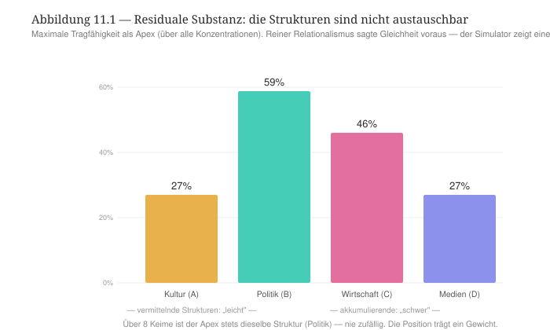

/Lesart/. Unser Befund widerlegt Emirbayer nicht, sondern er verfeinert seinen Vorschlag. Emirbayers reiner Anti-Substantialismus erweist sich als Asymptote. Selbst das relationalste System enthält eine residuale Substanz, die jedoch keine Essenz ist, sondern selbst relational begründet werden kann. Dies zeigt unseren Versuch, die Relationsstrukturen so zu manipulieren, dass eine „leichte“ Relationsstrukturen zum Apex wird. Dies funktioniert nicht, weil leichte Relationsstrukturen relationieren vergleichsweise unterschiedlich, weil sie eine bestimmte Art der Vermittlung und der Zirkulation aufweisen. Dies gilt für alle Relationsstrukturen im digitalen Zwilling, was zur Interpretation führt, dass dieses Residuum als Substanz nichts anders als ein sedimentiertes Relationsverhältnis darstellt. Deshalb ist Emirbayers Argument begründet, wenn er sagt, dass eine relationale Soziologie grundsätzlich anti-essentialistisch argumentiert, was nicht bedeutet, dass Relationen nicht sedimentieren und somit zu einem Residuum werden, die das Argument von einer reinen Relation nicht unterstützen. Die TR spricht deshalb von Relationsstrukturen mit unterschiedlichen Vermittlungsstrukturen und Zirkulationen, weil sie diesen Residuum-Ansatz aufnimmt -- Relationsstrukturen ergeben sie nicht aus dem Nichts, sondern sind Produktsgeschichte der Arbeit an relationalen Ereignissen, die schon deshalb nicht zu einer perfekten Relation führt, sondern zu verschiedenen Sedimenten von Relationen, die die TR als Sequenzen und Relationsstrukturen abbildet.

*** 11.2 Pierpaolo Donati und Margaret Archer: Relation als Emergenz
/Nähe und Differenz./ Wo Emirbayer die Substanz in den Prozess auflöst, gehen Donati und Archer den umgekehrten Weg: Sie /erheben/ die Relation zu einer eigenen, emergenten Wirklichkeit. Bei Donati ist die Beziehung ein realer Dritter, der ein /relationales Gut/ erzeugt, das weder den Individuen noch ihrer Summe gehört; bei Archer entfaltet sich das Soziale in /morphogenetischen Zyklen/ durch die Zeit, auf dem Boden eines kritischen Realismus mit geschichteter, emergenter Ontologie. Die Nähe zur TR liegt in der Emergenz: Die Relation bringt /mehr/ hervor als ihre Glieder — eben das, was im Simulator die systemische Reziprozität ist. Die Differenz ist ontologisch: Donati und Archer verleihen diesem Mehr den Status einer /realen Entität/ (einer geschichteten Wirklichkeit), während der Simulator den emergenten /Effekt/ zeigt, ohne ihn zu einem Ding zu verdinglichen.

/Theoretischer Kern (Schritt 1)./ Für Donati ist das relationale Gut „unteilbar in dem Sinne, dass der Versuch, es zu teilen, eben die soziale Beziehung zerstört, die es erzeugt“; es lässt sich „nicht aufteilen“ [cite:@donati2011relational S. 298 f.]. Die soziale Ordnung ist daher „eine relationale Entität, sui generis, weil emergent ihrer Art nach“ [cite:@donati2011relational S. 307], und eine solche emergente relationale Ontologie lässt sich nicht vom Individuum her denken [cite:@donati2011relational S. 298 f.; @donati2015manifesto]. Archer liefert dazu die /Zeitform/: Der morphogenetische Ansatz ruht auf dem /analytischen Dualismus/ von Struktur und Handlung und entfaltet einen Zyklus aus /struktureller Konditionierung/, /sozialer Interaktion/ und /struktureller Elaboration/, der entweder reproduziert (Morphostase) oder verwandelt (Morphogenese) [cite:@archer1995realist]. Gemeinsam denken sie das /relationale Subjekt/ als Träger dieser emergenten Ordnung [cite:@donatiarcher2015subject].

/Operationalisierung und Lauf (Schritte 2–4)./ Zwei prüfbare Ansprüche ergeben sich. Donati behauptet, das relationale Gut sei /emergent/ und den Teilen /irreduzibel/. Der Simulator bestätigt es scharf (Abbildung 11.2): Im Apex-Zustand ist die herrschende Struktur (Politik) /innerlich vollkommen gesund/ — ihre innere Reziprozität liegt bei 0,95, so hoch wie im symmetrischen Zustand —, und /dennoch/ ist das System unreziprok (R = 0,33). Das Übel sitzt also in /keiner/ Struktur; es lebt in der /Relation zwischen/ ihnen. Die Reziprozität lässt sich nicht aus den Strukturen aufsummieren — sie ist ein emergentes relationales Gut, genau im Sinne Donatis. Archer behauptet, das Soziale entfalte sich in /Zyklen/. Auch dies zeigt der Lauf (Abbildung 11.3): Bei niedriger Konzentration bleibt der Gini über die ganze Zeit bei null — reine /Morphostase/, Reproduktion. Bei hoher Konzentration durchläuft die Trajektorie sichtbar den /morphogenetischen Zyklus/: eine Phase der Konditionierung (Gini 0 → 0,08), eine Phase der Elaboration (0,08 → 0,32) und eine Stabilisierung (0,37). Und die Elaboration /verriegelt sich/: Senkt man die Konzentration nach der Elaboration wieder, bleibt der Gini bei 0,36 — die elaborierte Struktur konditioniert die nächste Runde, wie es der Zyklus verlangt.

#+CAPTION: Abbildung 11.2 — Emergenz: Im Apex-Zustand ist der Dominante (P) innerlich maximal reziprok (0,95), doch das System bleibt unreziprok (R = 0,33). Das relationale Gut/Übel sitzt zwischen den Strukturen, nicht in ihnen.
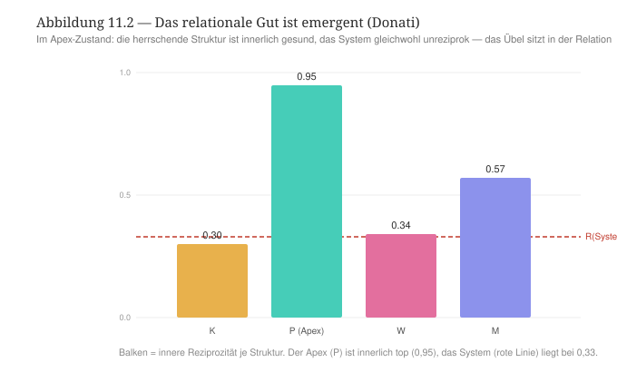

#+CAPTION: Abbildung 11.3 — Der morphogenetische Zyklus: Morphostase reproduziert (Gini bleibt null), Morphogenese durchläuft Konditionierung → Elaboration → Stabilisierung und verriegelt sich (die elaborierte Struktur konditioniert die Zukunft).
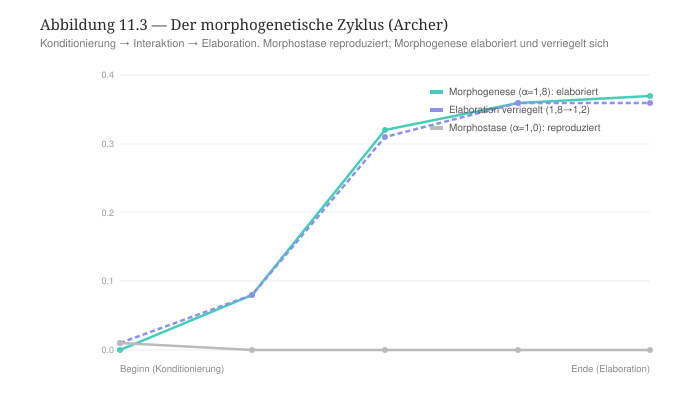

/Lektüre: die Relation als Gut, der Lauf als Zyklus (Schritt 5)./ Beide Verwandte werden vom Simulator /eingeholt/ — und zwar genau an ihrer je eigenen Stelle. Die systemische Reziprozität der TR /ist/ Donatis emergentes relationales Gut: unteilbar, sui generis, in keiner Struktur lokalisierbar. Und der deterministische Lauf des Simulators /ist/ Archers morphogenetischer Zyklus: Konditionierung, Interaktion, Elaboration, mit Morphostase und Morphogenese als den beiden Ausgängen und der Pfadabhängigkeit als der Brücke zwischen den Zyklen. Das Residuum ist allein /ontologisch/: Donati und Archer verdinglichen das Emergente zu einer realen, geschichteten Entität; der Simulator zeigt es als /Eigenschaft der Zirkulation/, nicht als Ding. Eben darin liegt die schöne Symmetrie dieses Kapitels: Emirbayer löst die Substanz in den Prozess auf, Donati/Archer erheben die Relation zur emergenten Substanz — und die TR hält die /Mitte/: Sie kennt das emergente relationale Gut (mit Donati), gründet es aber in der Zirkulation (mit Emirbayer), ohne es zu einer Entität zu verdinglichen. Sie ist der mittlere Ort zwischen den beiden Polen der relationalen Soziologie.

/Entwicklungslinien (Schritt 7)./ Damit zeichnen sich zwei Pole ab — der prozessuale (Emirbayer) und der emergentistische (Donati/Archer) —, zwischen denen die TR vermittelt. Die nächste Familie, Fuhse und Mische, bringt eine dritte Dimension ein, die beiden fehlt: den /Sinn/, der in den Netzwerken zirkuliert.

*** 11.3 Jan Fuhse und Ann Mische: Sinn und Netzwerk
/Nähe und Differenz (Schritt 0)./ Fuhse und Mische stehen in der Nachfolge Harrison Whites (Kapitel 7) — sie denken in /Netzwerken/ —, doch sie fügen hinzu, was den beiden vorigen Familien fehlte: den /Sinn/, der in den Bändern zirkuliert. Ein Netzwerkband ist für sie nicht bloß vorhanden oder abwesend, es /trägt eine Bedeutung/: Erwartungen, Identitäten, Geschichten. Fuhse geht weiter und nimmt ausdrücklich die /Systemtheorie/ Luhmanns ins Visier: Der Sinn, Luhmanns „Grundbegriff der Soziologie“, soll Whites Netzwerke mit Luhmanns Kommunikation /koppeln/. Die Nähe zur TR ist offensichtlich — die sinntragenden Bänder sind genau das Residuum, das Whites Rekablungstest sichtbar machte: dass die Positionen nicht leer sind. Die Differenz liegt im Anspruch des Sinns: Fuhse will, dass der Sinn /Luhmanns Werk verrichtet/ — die Kontingenz auflösen.

/Theoretischer Kern (Schritt 1)./ Fuhse setzt bei Luhmanns Satz an, „dass Sinn der Grundbegriff der Soziologie ist“, und entwickelt daraus eine Netzwerktheorie, in der die Bänder /Bedeutungsstrukturen/ sind: Erwartungen, die aus Kommunikation hervorgehen und die Beziehung stabilisieren [cite:@fuhse2009meaning S. 51]. Die ausdrückliche /White-Luhmann-Verbindung/ soll die Netzwerkstruktur (White) mit der Sinnverarbeitung (Luhmann) verschmelzen — beide, so Fuhse, von einer fundamentalen Unsicherheit geprägt, die der Sinn reduziert. Mische ergänzt die /kulturelle und kommunikative/ Dimension: Relationale Soziologie verbindet Netzwerke mit Kultur, Öffentlichkeiten und Handlungsfähigkeit, sodass das Soziale „intrinsisch relational“ ist und doch durch Sinn und Kommunikation geformt wird [cite:@mische2011relational].

/Operationalisierung und Lauf (Schritte 2–4)./ Die These „die Bänder tragen Sinn“ wird mit Whites Rekablungstest geprüft: Trägt das /gleiche/ strukturelle Substrat je nach orientiertem Sinn /verschiedene/ Ausgänge? Es trägt sie (Abbildung 11.4). Orientiert man den Sinn (die Ketten) auf die Politik, so herrscht die Politik (55 %); auf die Wirtschaft, so herrscht die Wirtschaft (45 %); auf die Kultur, so geschieht — fast nichts (27 %). Der Sinn formt also den Ausgang: Die Bänder sind nicht leer. Doch zwei Präzisierungen treten hervor. Erstens wirkt der Sinn /im Gewicht/: Er kann eine „schwere“ Struktur (Politik, Wirtschaft) zur Herrschaft verstärken, eine „leichte“ (Kultur) aber nicht — die residuale Substanz aus 11.1 begrenzt, was der Sinn vermag. Zweitens, und das trifft Fuhses Luhmann-Visier ins Mark: Der /sinnlose/ symmetrische Zustand ist der am stärksten /aufgelöste/ — Reziprozität 1,00, Spannung null. Legt man Sinn auf eine schwere Struktur, so /sinkt/ die Reziprozität (auf 0,33) und die Spannung /steigt/ (meanResid 0 → 0,144). Der Sinn löst die Kontingenz hier also nicht auf — er erzeugt Herrschaft.

#+CAPTION: Abbildung 11.4 — Die Bänder tragen Sinn: dasselbe Substrat, anders orientierter Sinn, andere Ausgänge (Politik 55 %, Wirtschaft 45 %, Kultur 27 %). Doch der Sinn wirkt im Gewicht, und der sinnlose Zustand ist der reziprokste (R = 1) — die Zirkulation löst auf, nicht der Sinn.
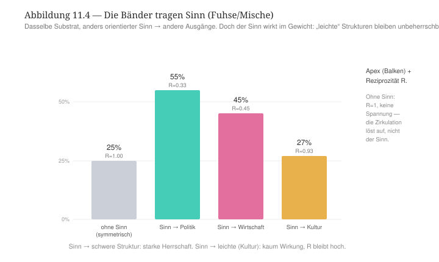

/Lektüre: der Sinn im Band, die Auflösung in der Zirkulation (Schritt 5)./ Gegen den reinen Strukturalismus behalten Fuhse und Mische recht: Die Bänder /tragen Sinn/, das Substrat ist nicht stumm — es ist Whites Residuum, nun als Sinn benannt. Doch der Simulator fügt zwei Korrekturen hinzu, die beide zur tragenden Einsicht dieses Berichts gehören. Die erste: Der Sinn ist nicht souverän, er arbeitet /im/ residualen Gewicht (Emirbayer) — er verstärkt, was schwer ist, und verpufft an dem, was leicht ist. Die zweite trifft Fuhses Kopplung mit Luhmann: Fuhse will, dass der Sinn die Kontingenz /auflöst/; der Simulator zeigt, dass die Auflösung nicht vom Sinn, sondern von der /Zirkulation/ kommt. Der vollkommen reziproke Zustand ist der sinnlose, symmetrische — und der Sinn, auf eine schwere Struktur gelegt, /stört/ ihn zur Herrschaft hin. Die White-Hälfte von Fuhses Programm (das sinntragende Band) wird mithin eingeholt, die Luhmann-Hälfte (der Sinn als Auflösung der Kontingenz) wird /subvertiert/ — und zwar genau durch die Zirkulation, wie schon Luhmanns operative Schließung (Kapitel 5) sich dem Medium entzog. Es ist dieselbe Geste, die die TR gegen Donatis Substanz und gegen Fuhses Luhmann gleichermaßen vollzieht: Die Ontologie der Relation wird durch die Zirkulation unterlaufen.

/Entwicklungslinien (Schritt 7)./ Damit sind drei Familien vermessen: der prozessuale Pol (Emirbayer), der emergentistische (Donati/Archer) und der sinnhaft-netzwerkförmige (Fuhse/Mische). Jede fügt der TR eine Facette hinzu, die sie aufnimmt, ohne deren Primat der Zirkulation preiszugeben. Der folgende Abschnitt prüft, ob die gegenwärtigen Tendenzen — von Dépelteaus Transaktionalismus bis zu den jüngsten Vorstößen des zweiten Sammelbands — neue Facetten oder Wiederholungen dieser drei bringen.

*** 11.4 Gegenwärtige Tendenzen (Dépelteau; Vol. II)
Die jüngsten Vorstöße der relationalen Soziologie versammeln sich in zwei Sammelbänden — /New Directions in Relational Sociology/, herausgegeben von Vandenberghe und Papilloud (Vol. 1) und von Papilloud (Vol. 2). Statt jeden Beitrag dem vollen Gabarit zu unterziehen, /verortet/ dieser Abschnitt eine Auswahl von Tendenzen auf der Karte, die Teil I und die vorigen Familien gezeichnet haben — die drei Ungleichheitsebenen, die Vermittlung, die residuale Substanz, die drei Pole (Prozess, Emergenz, Sinn) —, und prüft jede dort mit einem /gezielten Test/, wo sie einen eigenen Mechanismus einbringt.

/Der radikale Prozessualismus: François Dépelteau und Nick Crossley./ Dépelteau hat Emirbayers Manifest in eine Bewegung verwandelt und im /Palgrave Handbook/ gebündelt [cite:@depelteau2018handbook]; in seinem posthum erschienenen Text radikalisiert er den Transaktionalismus zu einer „radikal prozessualen“ relationalen Soziologie, die — Elias und Latour folgend — /jeden Bezug auf emergente soziale Strukturen/ zurückweist, die Handeln bestimmen oder mitbestimmen [cite:@depelteau2025love S. 12]. Crossley steht in der benachbarten Tendenz des symbolischen Interaktionismus und der (Akteur-)Netzwerktheorie, für die die Relation eine Zusammenstellung von Interaktionen ist, formalisiert als Netzwerk [cite:@papilloud2022skizze; @crossley2011towards]. Beide besetzen, mit Emirbayer, den /mikro-prozessualen Pol/ — und stellen die schärfste Probe an die Frage, ob das relationale Medium ohne Makro-Struktur auskommt.

Der gezielte Test prüft eben dies: Hält die /flache/ Ontologie, oder gibt es ein irreduzibles Makro-Faktum? Es gibt deren zwei. Erstens, ein /Makro-Attraktor/: Aus einem rein symmetrischen, „flachen“ Mikro-Anfang organisiert sich der Apex über fünf Keime hinweg /stets dieselbe/ Struktur (Politik) — eine Makro-Ordnung, die sich nicht aus den Mikro-Transaktionen wegrechnen lässt. Zweitens, /Abwärtskausalität/: Dieselbe Mikro-Operation — eine erhöhte Mobilität — zeitigt /entgegengesetzte/ Makro-Wirkungen je nach Makro-Lage. Im symmetrischen Feld bewirkt sie nichts (Gini 0,005); auf einem emergenten White-Apex /löst/ sie ihn auf (von 0,36 auf 0,006); auf einem kategorialen Tilly-Apex /hält/ er stand (0,09). Was die Mobilität tut, entscheidet die Makro-Struktur — die flache Ontologie, für die Makro nur verdichtetes Mikro ist, kann dies nicht fassen. Der Einwand bleibt /freundlich/: Dépelteau hat recht, dass alles prozessual und relational ist — der Apex /entsteht/ aus der Zirkulation —, doch er irrt, wenn er die emergente Makro-Struktur leugnet, die sich aus ihr verfestigt und auf sie zurückwirkt. Crossley, der mit der Feldtheorie (Bottero und Crossley) eine Makro-Ebene zulässt, steht der Mitte der TR bereits näher als Dépelteaus radikale Flachheit. Die TR hält auch hier die Mitte: emergente Makro-Ordnung, in der Zirkulation gegründet. Bemerkenswert schließlich, dass Dépelteaus letzter Text die „deep relational sociology“ an Brüderlichkeit und Solidarität bindet — eine normative Wendung, die zu Kunneman zurückkehren wird.

/Feld und Macht: Larissa Buchholz/Andreas Schmitz und Isaac Reed./ Eine zweite Tendenz denkt das Relationale als /Feld/ und /Macht/. Buchholz und Schmitz entwickeln einen Relationalismus der (globalen) Feldtheorie, der Whites Netzwerke mit Bourdieus Feldern verbindet und die Macht als „entscheidenden relationalen Begriff“ behandelt — wobei sie redlich anmerken, dass „nicht alles auf dieser Welt relational ist“ [cite:@buchholzschmitz2026field]. Reed liefert die feinste Theorie der Macht: In seiner /Rector-Actor-Other/-Theorie verwandelt der „Rector“ einen Akteur in seinen Agenten, indem er „positive Bänder“ zwischen sich und dem Agenten knüpft und „negative Bänder“ zu den Ausgeschlossenen — und eben diese Kombination „konfiguriert die Machtstruktur der Gesellschaft“ [cite:@reed2026rector]. Macht ist hier keine Eigenschaft, sondern eine /Konfiguration von Bändern/.

Der gezielte Test bestätigt Reeds Bild im Simulator mit überraschender Genauigkeit. Erstens /folgt die Macht der Bänderkonfiguration/: Orientiert man die Ketten auf die Politik, herrscht die Politik (55 %); auf die Wirtschaft, herrscht die Wirtschaft (45 %) — der Rector ist nicht festgelegt, er ist die relationale Position. Zweitens zeigt sich die /positive/negative/-Struktur unmittelbar: Der Rector ist innerlich /gesund/ (innere Reziprozität 0,95 bzw. 0,92 — die positiven Bänder lassen ihn gedeihen), während die „Anderen“ /beschädigt/ und ausgeschlossen sind (0,30–0,43 — die negativen Bänder). Die Macht sitzt also, wie schon bei Donati, /zwischen/ den Strukturen, nicht /in/ einer — sie ist relational, keine Eigenschaft. Drittens aber stößt der Relationalismus an die /residuale Substanz/, die Buchholz und Schmitz selbst ahnen: Der leichtere Rector (Wirtschaft) erreicht nur 45 %, wo der schwere (Politik) 55 % hält — „nicht alles ist relational“, das Gewicht bleibt. Die TR gibt beiden recht: Die Macht ist eine relationale Konfiguration (Reed), aber sie wirkt im Gewicht (Buchholz/Schmitz), und ihr Apex-Mechanismus ist genau die transversale Domination, die Kapitel 9 an Bourdieu vermessen hat.

/Das Dritte und das Dazwischen: Andrea Brighenti/Lorenzo Sabetta und Daniel Silver./ Eine dritte Tendenz sucht das Soziale nicht in den Termen, sondern /zwischen/ ihnen. Brighenti und Sabetta denken die Relation als /Reaktion/ und treiben sie bis zu den „Relationen dritter Ordnung — Relationen von Relationen“ [cite:@brighentisabetta2026reaction S. 165]; Silver erneuert das simmelsche Erbe, für das „das Soziale“ in der Wechselwirkung, im /Dritten/ und in der triadischen Figur liegt [cite:@silver2026simmel S. 327]. Beider Pointe: Das Soziale ist weder in der einen Struktur noch in der anderen, sondern in dem /Dazwischen/, das sie verbindet.

Der gezielte Test gibt ihnen recht — und macht das Dazwischen /messbar/. Das Soziale (die Reziprozität R) folgt nicht der Gesundheit der Strukturen, sondern dem /Dazwischen/ (dem crossOff, dem Volumen der vermittelten Zirkulation). Bei vollem Dazwischen ist das Soziale lebendig (crossOff 0,26, R 0,96); kappt die Herrschaft das Dazwischen, so /stirbt/ das Soziale (crossOff 0,17, R 0,33) — und zwar, wie wir bei Donati sahen, /obwohl/ der Apex innerlich gesund ist; öffnet die Mobilität das Dazwischen wieder, so /kehrt/ das Soziale zurück (crossOff 0,58, R 0,99). Das beigefügte Profil zeigt den entscheidenden Fall: Hält man unter dem Druck der Herrschaft das Dazwischen durch Mobilität offen, so überlebt das Soziale (R 0,99) trotz aller Konzentration — das Dritte trägt es. Das Soziale /ist/ also das Dazwischen, das relationale Dritte, und es lässt sich am crossOff ablesen. Das verbindet sich mit Donatis emergentem Gut (das im Zwischen sitzt), mit Reeds Macht (die zwischen den Strukturen liegt) und mit der tragenden Vermittlungsachse der Synthese (§12.1): Für die TR ist das Soziale die Zirkulation, die die Strukturen verbindet — Simmels „das Soziale“, in der messbaren Vermittlung wiedergefunden.

/Das Nicht-Menschliche: David Gunkel und Mark Coeckelbergh./ Eine vierte Tendenz dehnt das Relationale auf das /Mehr-als-Menschliche/ aus. Gunkel und Coeckelbergh vertreten einen relationalen Zugang zum /moralischen Status/: Dieser ruht nicht auf intrinsischen Eigenschaften eines Wesens, sondern wird /in der Beziehung/ zugeschrieben — die Relation geht dem Relatum voraus, und so kann auch das Nicht-Menschliche (die Maschine, die KI) moralischen Stand gewinnen, aus der Andersheit der Relation heraus [cite:@gunkelcoeckelbergh2026standing]. Hier ist Vorsicht im Kontrast geboten, denn die TR /ignoriert das Nicht-Menschliche nicht/: Schon ihr erstes Kapitel führt die /Aktanten/ neben den Akteuren ein, und die Medien (Struktur D) sind als symbolische und formale Medien in die Zirkulation und Reziprozität /integriert/, wo sie die Diffusion der Erwartungen und die Satellisierungsstrategien /kanalisieren/ [cite:@papilloud2022skizze]. Der Unterschied liegt nicht im Ob, sondern im /Status/ des Relatums: Gunkel und Coeckelbergh neigen dazu, das Relatum /neutral/ zu setzen — der moralische Stand ist rein relational zugeschrieben, die Unterscheidung von Mensch und Nicht-Mensch löst sich in einen funktionalen Relais auf, ähnlich der unpersönlichen Kommunikation Luhmanns. Die TR hingegen /positioniert/ das Nicht-Menschliche.

Der gezielte Test prüft eben dies: Ist der Vermittler ein /neutraler Relais/ oder eine /situierte/ Position? Wäre er neutral, so müsste es gleichgültig sein, welche Struktur die Zirkulation relaisiert. Es ist nicht gleichgültig. Lässt man alles über die Kultur (A) laufen, bleibt das Soziale offen und reziprok (R 0,94, kein Apex); lässt man es über die Medien (D), die Politik (B) oder die Wirtschaft (C) laufen, /kippt/ es in die Herrschaft (R 0,33). Und feiner noch: Selbst unter den „leichten“ Strukturen relaisieren Kultur und Medien /verschieden/ — die Kultur hält das Dazwischen offen, die Medien /kanalisieren die Satellisierung/ (das beigefügte Profil: Medien als Relais → Apex 60 %, crossOff auf 0,166 gesenkt). Das Nicht-Menschliche der TR ist also kein neutraler Relais, sondern ein /situierter Vermittler/ mit eigenem Gewicht (leicht, nie Apex) und eigener Rolle (Kanalisierung). Redlicherweise ist anzumerken, dass Gunkel und Coeckelbergh in der /Ethik/ argumentieren (moralischer Stand), die TR in der /Sozialontologie/; der Kontrast trifft gleichwohl die geteilte ontologische Frage — sind die Relata neutral oder positioniert? Die TR antwortet: positioniert, auch das Nicht-Menschliche. Damit besetzt sie einen genauen Ort, zwischen dem Übersehen des Nicht-Menschlichen und seiner Neutralisierung.

/Der normative Humanismus: Harry Kunneman./ Eine letzte Tendenz öffnet das Relationale zum /Normativen/ und zum /Biotischen/. Kunneman, kritischer Humanist, entwirft eine „biotische Perspektive“, die das Relationale auf das Lebendige ausdehnt; gegen Parsons hält er fest, dass der Grad der Integration „nicht nur von der normativen Ordnung abhängt … sondern auch von einem Sinn für das Soziale“ — von Solidarität, Sorge, der /amor complexitatis/, der Liebe zur lebendigen Komplexität [cite:@kunneman2026biotic S. 233]. Dieser Register lässt sich nicht als Mechanismus modellieren — moralischer Wert ist keine Reglergröße. Doch die TR hält ein formales Korrelat bereit: Die /Reziprozität/ ist eine /normative Kompassnadel/. Der vollkommen reziproke Zustand (R ≈ 1), in dem alle Strukturen gleichermaßen getragen werden, ist die /gute/, lebendige Relation; die Herrschaft, in der einige verkümmern, ist das vitale und moralische Versagen (R fällt von 0,96 über 0,37 auf 0,33). Das beigefügte Profil zeigt diesen Pol — die getragene Komplexität, in der keine Struktur die andere zum Verschwinden bringt. So schließt das Panorama dort, wo der späte Dépelteau es „mit Liebe“ ansiedelte und wo Donatis relationales Gut wohnt: Die Reziprozität ist nicht nur ein Zustand, sondern eine /Richtung/ — die Norm, auf die die TR zeigt.

*** 11.5 Synthese: die relationale Familie und der Ort der TR
Die geprüften Verwandten ordnen sich zu einer Familie mit drei /Polen/ (Abbildung 11.5). Der /prozessuale/ Pol (Emirbayer, von Dépelteau radikalisiert, von Crossley vernetzt) löst die Substanz in die reine Relation auf. Der /emergentistische/ Pol (Donati, Archer) erhebt die Relation zur emergenten Wirklichkeit. Der /sinnhafte/ Pol (Fuhse, Mische) lädt das Band mit Bedeutung und koppelt es an Luhmann. Um diese Pole gruppieren sich die gegenwärtigen Tendenzen: die Macht als /Dazwischen/ (Reed, Buchholz/Schmitz), das /Dritte/ als messbare Vermittlung (Brighenti/Sabetta, Silver), das /Nicht-Menschliche/ als situierter Vermittler (Gunkel/Coeckelbergh), die /Reziprozität als Norm/ (Kunneman).

Die TR ist in dieser Familie kein weiterer Pol, sondern die /Mitte/. An jedem Verwandten hat der Simulator dieselbe Geste vorgeführt: Was der Verwandte erfasst, wird /aufgenommen/; was er übertreibt, wird durch die /Zirkulation/ unterlaufen. Emirbayers reine Relation behält recht gegen die Essenz — doch die Zirkulation /sedimentiert/ zu einer residualen Substanz, die der reine Prozessualismus (und mit ihm Dépelteaus flache Ontologie) leugnet. Donatis relationales Gut ist wirklich emergent — doch es ist in der Zirkulation /gegründet/, nicht zu einer Entität /verdinglicht/. Fuhses Bänder tragen wirklich Sinn — doch die Auflösung der Kontingenz leistet nicht der Sinn (gegen Luhmann), sondern die Zirkulation. Reeds Macht ist wirklich eine relationale Konfiguration — doch sie wirkt im Gewicht und ist die transversale Domination selbst. Das Dritte von Brighenti und Silver ist wirklich der Ort des Sozialen — doch es ist der messbare crossOff, die vermittelte Zirkulation. Das Nicht-Menschliche von Gunkel und Coeckelbergh gehört wirklich dazu — doch positioniert, nicht als neutraler Relais. Und Kunnemans Norm ist wirklich der Fluchtpunkt — doch sie ist die Richtung der Reziprozität, eines messbaren Zustands.

In einem Satz, den der Autor dieser Theorie einmal Donati gegenüber gebraucht hat: Wo dessen starke ontologische Position die Relation zur Substanz hin trägt, /unterläuft die TR die Ontologie der Relation durch die Zirkulation/ [cite:@papilloud2022skizze]. Das ist die wiederkehrende Pointe dieses ganzen Kapitels. Die relationale Soziologie hat sich, von White bis zur Gegenwart, immer wieder vor dieselbe Wahl gestellt gesehen — die Relation in den Prozess aufzulösen oder sie zur Wirklichkeit zu erheben, sie als Netzwerk, als Feld, als Sinn, als Drittes, als Norm zu fassen. Die TR nimmt diese Bestimmungen nicht als Alternativen, sondern als /Facetten/ desselben Mediums, dessen Boden die Zirkulation ist. Darin liegt ihr eigener Beitrag: nicht eine weitere Definition der Relation, sondern die Einsicht, dass die Relation /zirkuliert/ — und dass aus dieser Zirkulation Substanz, Gut, Sinn, Macht, das Dritte und die Norm als /Effekte/ hervorgehen, messbar und prüfbar. Das Residuum gegenüber den reinsten Relationalismen (Emirbayer, Dépelteau) bleibt: die residuale Substanz, das Gewicht der Position. Doch auch sie ist relational — sie ist sedimentierte Zirkulation. Damit ist die relationale Familie nicht zerstreut, sondern um ihre Mitte versammelt.

#+CAPTION: Abbildung 11.5 — Die relationale Familie: drei Pole (Prozess, Emergenz, Sinn) und die gegenwärtigen Tendenzen, um die Mitte der TR versammelt, die alles in der Zirkulation gründet.
[[file:figures/synthese_relationale_familie.svg]]

** Kapitel 12 — Synthese: Kontrastachsen und das Gespräch mit der TR
:PROPERTIES:
:STATUS: DRAFT
:END:

# Synoptische Matrix (Rahmen x Reglerdimension); die tragenden Kontrastachsen: direkte Konvertibilität vs. Vermittlung; Schließung vs. Zirkulation; Position ohne Gehalt vs. Struktur mit Instanzen; primäre ko-konstituierte Kategorien vs. relational erzeugte Kategorien; Vermittlung und Reflexivität als Ort der Nähe.

*** 12.1 Eine tragende Kontrastachse: die Vermittlung unter Herrschaft
:PROPERTIES:
:STATUS: DRAFT
:END:
Quer durch Teil I zieht sich eine Achse, die das Gespräch mit der TR besonders scharf führt: das Schicksal der /Vermittlung/. Für die TR ist die Beziehung wesentlich /vermittelt/ — Kultur erreicht die Wirtschaft nur über die Medien und die Politik, und der vollkommene Zustand ist die symmetrische, vermittelte Reziprozität; eigens den Vermittlungsinstanzen, die diese Vermittlung formalisieren und kanalisieren, ist ein ganzes Kapitel der Theorie gewidmet [cite:@papilloud2022skizze S. 186 ff.]. Mit dem Volumen der vermittelten Zirkulation (crossOff) lässt sich diese Vermittlung messen, und es zeigt sich, dass die Herrschaft in jedem der Rahmen die Vermittlung /kappt/ — aber auf je eigene Weise, und mit je eigener Dauer.

Bei White ist die Kappung /bedingt/: Der Apex entsteht als Nebenprodukt der Kontrollsuche und drückt die Vermittlung herab (crossOff von 0,266 auf 0,170), doch unter steigender Mobilität flutet sie zurück (0,581) und die Herrschaft erschöpft sich. Bei Tilly ist die Kappung eine /Schließung/: Die Gelegenheitshortung verriegelt die Grenze, die Vermittlung fällt am tiefsten (0,139) und /bleibt/ unter Mobilität gekappt (0,418) — die Sperre überdauert die Wanderung der Personen, weil die Ungleichheit in der Kategorie sitzt [cite:@tilly1998durable S. 9 f.]. Bei Bourdieu schließlich ist die Kappung eine /Kaperung/: Die Zirkulation hört nicht auf (crossOff bleibt mit 0,172 höher), sie wird in einen privaten, institutionell verwalteten Kanal umgeleitet — die direkte Konvertibilität von kulturellem und ökonomischem Kapital, die die offene Vermittlung kurzschließt und durch die Verkennung als gemeinsame Straße erscheint [cite:@bourdieu1976modes S. 122; @bourdieu1977pouvoir S. 405].

Daraus ergibt sich ein Spektrum, dessen Maß die /Ablösung der Herrschaft von ihren Entstehungsbedingungen/ ist. Whites Herrschaft erschöpft sich, weil ihr kein Mechanismus zugrunde liegt, der sie nachfüllte. Tilly und Bourdieu lösen sie von ihren Bedingungen ab — Tilly durch die /Schließung/ der Kategorie, Bourdieu durch die /gekaperte, legitimierte Vermittlung/ —, und nur Bourdieu braucht dafür die Verkennung, während Tilly die materielle Schließung genügt. Für die TR ist dies der genaue Ort des Gesprächs: Da sie die Reziprozität mit der /Vermittlung/ identifiziert, erscheint jede dieser Herrschaftsformen als ein bestimmter Weg, die Vermittlung zu unterbrechen oder zu privatisieren — und ihre eigene Pointe, das Primat der vermittelten Reziprozität, als die Bedingung, unter der Herrschaft sich gerade /nicht/ verfestigt.

*** 12.2 Eine zweite Kontrastachse: die Kaskade der Ungleichheit
:PROPERTIES:
:STATUS: DRAFT
:END:
Die TR unterscheidet drei Ebenen der sozialen Ungleichheit, die als /Kaskade/ entlang der morphologischen und strukturellen Determinanten zusammenhängen [cite:@papilloud2022skizze S. 166 ff.]: die /vertikale/ Ungleichheit innerhalb einer Sequenz (zwischen den Akteurkategorien — Etablierte, Aspiranten, Konservative, Enttäuschte), die /horizontale/ zwischen den Sequenzen einer Struktur, und die /transversale/ zwischen den Relationsstrukturen. Der Simulator misst alle drei: der Gini zwischen den Strukturen erfasst die transversale, der binnenstrukturelle Gini (über die Sequenzen) die horizontale, und ein Status-Gini über die Akteurkategorien die vertikale Ebene. Führt man dieses dreistufige Maß durch alle sechs Rahmen, so wird sichtbar, /wo/ jeder seine Ungleichheit ansiedelt — und wie weit sie die Kaskade hinabreicht (Abbildung).

#+CAPTION: Abbildung — Die Kaskade der Ungleichheit über drei Ebenen. Luhmann: keine Ebene. Parsons, Habermas, White, Bourdieu: transversale Herrschaft mit voller Kaskade. Tilly: allein horizontal.
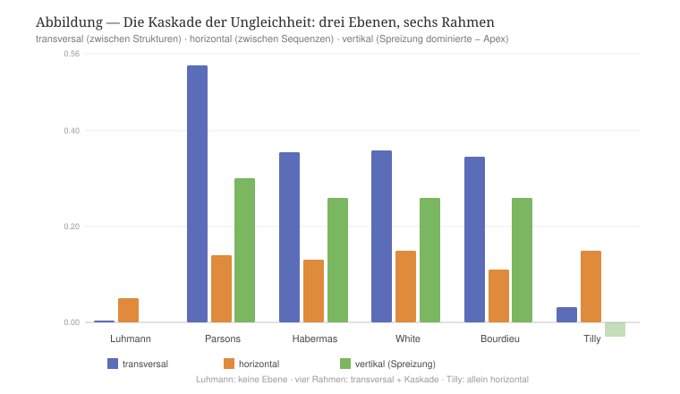

Drei Regime treten hervor. /Luhmann/ kaskadiert nicht: Keine Ebene hebt sich vom symmetrischen Etalon ab. Das ist stimmig — seine Ungleichheit (Inklusion/Exklusion) sitzt in einer /codierten/ Vertikalen, die der auf der Transversalen gebaute Simulator nicht darstellt; es ist das bereits vermerkte Residuum.

/Parsons, Habermas, White und Bourdieu/ zeigen die /volle transversale Kaskade/. Eine starke Herrschaft zwischen den Strukturen (transversal 0,35–0,54) steigt in die horizontale Ebene hinab (die Sequenzen der beherrschten Strukturen verlieren ihr Gleichgewicht) und von dort in die vertikale — und zwar /asymmetrisch/: Der Apex /homogenisiert sich/ (die vertikale Ungleichheit fällt auf etwa 0,26, beim Sieger werden alle zu Etablierten), während die beherrschte Struktur sich /stratifiziert/ (die vertikale Ungleichheit steigt auf etwa 0,53, die Etablierten fliehen, die Enttäuschten häufen sich an). Die Herrschaft /schließt/ also den Statusabstand beim Dominanten und /öffnet/ ihn bei den Beherrschten — genau die Kaskade entlang der Determinanten.

/Tilly/ steht allein. Seine transversale Ungleichheit ist nahezu null (0,031; die Strukturen bleiben bei 24/23/27/26 %), seine horizontale aber hoch (0,15), und /alle/ Strukturen sind gleichermaßen binnenstratifiziert — und dies bleibt unter Mobilität erhalten. Tillys Ungleichheit ist also kein transversaler Apex wie bei White, sondern eine /horizontale/, /unterstrukturelle/ Ungleichheit zwischen kategorial gebundenen Sequenzen. Das ist von vollkommener Treue zu seiner Theorie: Seine gepaarten Kategorien sind intra-organisational, nicht inter-strukturell. Das dreistufige Maß trennt damit, was der bloße Gini zusammenzog, und verfeinert die Lesart aus Kapitel 8 (siehe dort den Hinweis zu H1).

Damit ergibt sich eine zweite Kontrastachse neben der Vermittlung: die /Tiefe und der Ort/ der Kaskade. Sie ordnet die sechs Rahmen — von Luhmanns Verweigerung über Tillys rein horizontale bis zur vollen transversalen Kaskade der Übrigen — und bereitet zugleich die Intersektionalität vor, die nichts anderes ist als die Kaskade /mehrerer, sich verstärkender Determinanten/ zugleich — die wechselseitige Konstitution der Achsen, die Collins als das relationale Herz der Intersektionalität benennt [cite:@collins2019intersectionality; @collins2015dilemmas].

*** 12.3 Bilanz I: Was die großen Rahmen beigetragen haben (a)
Die in Teil I geprüften Rahmen — von Parsons bis zur Intersektionalität — verstanden sich zumeist /nicht/ als relationale Soziologie. Und doch hat jeder von ihnen ein Stück desselben wissenschaftlichen Programms verwirklicht, das die relationale Soziologie später aufgenommen hat: die Verdrängung der /Substanz/ durch die /Relation/, in aufeinanderfolgenden Gestalten.

Parsons denkt die Gesellschaft als ein System von /Austauschen/ zwischen Teilsystemen, vermittelt durch generalisierte Medien und durch die Interpenetration der Subsysteme — die Gesellschaft ist nicht eine Summe von Substanzen, sondern ein Geflecht von Interdependenzen [cite:@parsons1966societies S. 7; @parsons1951social S. 211]. Luhmann radikalisiert diesen Schritt: Nicht Personen, sondern /Kommunikationen/ sind die elementare Operation des Sozialen; das Soziale besteht aus Relationen, nicht aus Trägern [cite:@luhmann1984soziale S. 31]. Habermas verlagert den Grund in die /Intersubjektivität/: Das Soziale entsteht im kommunikativen Handeln zwischen Subjekten, deren Verständigung der Koordination vorausgeht [cite:@habermas1981tkh2 S. 274]. White gibt der Relation ihre /Form/: das Netzwerk, in dem Identität und Kontrolle nicht vorgegeben sind, sondern aus den Relationen hervorgehen [cite:@white1995domination S. 705; @whiteboorman1976social S. 730].

Mit Tilly und Bourdieu wird das Programm auf die /Ungleichheit/ angewandt. Tilly lokalisiert die dauerhafte Ungleichheit nicht in Attributen, sondern in /relationalen/ Mechanismen zwischen gepaarten Kategorien — die Ungleichheit sitzt in der Beziehung, nicht im Einzelnen [cite:@tilly1998durable S. 17; @tilly2000relational S. 782]. Bourdieu fasst den /Raum/ als Feld relationaler Positionen und die Position als relational definiert, mit einer institutionell verbürgten Konvertibilität der Kapitalien [cite:@bourdieu1979capital S. 3; @bourdieu1976modes S. 122]. Die Intersektionalität schließlich, in Collins' Lesart, macht die /Ko-Konstitution/ der Ungleichheitskategorien zum Kern und stellt die Relationalität an die Spitze ihrer Leitthemen [cite:@collins2019intersectionality; @collins2015dilemmas].

So unterschiedlich diese Rahmen sind, zeichnet sich ein gemeinsames /Programm/ ab: der Vorrang der Relation vor der Substanz, in der Folge ihrer Gestalten — Austausch (Parsons), Kommunikation (Luhmann), Verständigung (Habermas), Netzwerk (White), kategorialer Mechanismus (Tilly), Feld (Bourdieu), Ko-Konstitution (Collins). Eben dieses Programm ist das Erbe, das die relationale Soziologie antritt; und die TR liest ihre Vorläufer ausdrücklich in dieser Linie, als aufeinanderfolgende Bestimmungen desselben relationalen Mediums [cite:@papilloud2022skizze S. 1 ff.].

*** 12.4 Bilanz II: Was die relationale Soziologie übernahm und was sie ließ (b)
Die relationale Soziologie, die aus diesen Rahmen hervorging, verfuhr nach einem einzigen Kriterium: Sie übernahm, was die Relation /primär/ setzt, und ließ, was sie /unterordnet/. Die Skizze selbst sichtet die Tendenzen in dieser Absicht [cite:@papilloud2022skizze S. 1 ff.].

Übernommen wurde zuerst der /Vorrang der Relation/ als solcher. Emirbayers Manifest macht ihn explizit: Nicht die Substanz, sondern die Transaktion ist das Erste; der relationale Standpunkt kehrt das Verhältnis von Entität und Beziehung um [cite:@emirbayer1997manifesto S. 281, 287]. Von White übernahm die Linie Fuhse/Mische die /Form/ des Netzwerks, von Luhmann den /Sinn/ als Grundbegriff [cite:@fuhse2009meaning S. 51], von Donati die /Emergenz/ der Relation als sui generis Wirklichkeit [cite:@donati2011relational S. 298, 307], von Collins die /Ko-Konstitution/ der Kategorien.

Gelassen wurde, was die Relation einem Übergeordneten unterstellt. Luhmanns operative /Schließung/ und sein binärer Code — die Autopoiesis, die die Relation der Selbstreproduktion des Systems unterordnet — wurden /nicht/ übernommen: Fuhse nimmt Luhmanns Sinn, aber nicht die Schließung, weil diese das /System/ primär setzt, nicht die Relation [cite:@luhmann1995recht S. 103, 105]. Ebenso blieb Parsons' /funktionalistische/ Teleologie zurück, die das Geschehen den Funktionserfordernissen des Systems unterordnet [cite:@parsons1951social S. 211]. Und gelassen wurde vor allem die /Substanz/ — die Auffassung, die Entitäten gingen ihren Beziehungen voraus —, deren Verabschiedung Emirbayers Manifest geradezu zum Gründungsakt erhebt [cite:@emirbayer1997manifesto S. 281].

In einem Punkt entzweit sich die Familie über das, was zu lassen sei: Der radikale Transaktionalismus (Dépelteau, im Anschluss an Latour) lässt auch noch die emergente Makro-Struktur fahren und hält die soziale Welt flach [cite:@depelteau2025love S. 12], während Donati und Archer gerade die Emergenz festhalten [cite:@archer1995realist]. Eben diese Differenz hat Teil I am Simulator vermessen: Die residuale Substanz und das emergente Gut zeigen, dass die flache Variante /zu viel/ lässt. Die TR zieht daraus ihre eigene Konsequenz — sie übernimmt den Vorrang der Relation und die Emergenz, lässt Substanz, Schließung und Funktion, und gründet das Ganze in der /Zirkulation/, die weder System noch Substanz, sondern die Bewegung der Vermittlung selbst ist.

*** 12.5 Bilanz III: Wohin die gegenwärtige relationale Soziologie geht (c)
Die gegenwärtige relationale Soziologie, wie Kapitel 11.4 sie versammelt, zeichnet vier neue Richtungen und stellt mit ihnen ebenso viele neue Fragen. Die erste öffnet das Relationale zum /Mehr-als-Menschlichen/: zur Maschine (Gunkel/Coeckelbergh) und zum Lebendigen (Kunnemans biotische Perspektive) [cite:@gunkelcoeckelbergh2026standing; @kunneman2026biotic S. 233]. Die neue Frage lautet: Wie lässt sich das Nicht-Menschliche einbeziehen, /ohne/ es zu neutralisieren? Die zweite sucht das /messbare Dritte/: Wenn das Soziale im Dazwischen liegt (Brighenti/Sabetta, Silver), wie wird dieses Dazwischen /messbar/, statt nur postuliert zu werden [cite:@brighentisabetta2026reaction S. 165; @silver2026simmel S. 327]? Die dritte denkt die /Macht relational/, als Konfiguration von Bändern statt als Eigenschaft (Reed, Buchholz/Schmitz) [cite:@reed2026rector; @buchholzschmitz2026field]. Die vierte öffnet das Relationale zum /Normativen und Vitalen/: zur Richtung, die in der Relation selbst liegt — Kunnemans amor complexitatis, Dépelteaus „with Love“ [cite:@kunneman2026biotic S. 233; @depelteau2025love S. 12]. Quer dazu liegt die Intersektionalität als /Ko-Konstitution/ der Ungleichheitsachsen [cite:@collins2019intersectionality].

Diese Richtungen teilen eine einzige, tiefer liegende Frage: Wie lässt sich das Relationale /situieren/ und /messen/, ohne es zu /verdinglichen/ (Donatis Exzess) und ohne es /flach/ zu machen (Dépelteaus Exzess)? Eben das ist der Ort, an dem dieser Bericht ansetzt. Denn der Simulator der TR tut genau dies: Er /misst/ das Relationale — die transversale Ungleichheit am Gini, das Dazwischen am crossOff, das relationale Gut an der Reziprozität, die Kaskade über drei Ebenen — und er /situiert/ es — in vier Strukturen mit eigenem Gewicht, in einer Vermittlungsordnung, in der das Nicht-Menschliche seinen Platz hat. Damit schließt sich der Bogen von Teil I: Von Parsons bis zur Intersektionalität wurde dasselbe Programm entfaltet, der Vorrang der Relation; die relationale Soziologie hat daraus übernommen, was die Relation primär setzt, und gelassen, was sie unterordnet; und ihre gegenwärtigen Fragen — das Nicht-Menschliche, das messbare Dritte, die relationale Macht, die Norm — laufen alle auf die eine Aufgabe hinaus, das Relationale messbar und situiert zu denken. Die TR beantwortet sie mit einem einzigen Begriff: der /Zirkulation/, die weder Substanz noch System ist, sondern die Bewegung, aus der Substanz, Gut, Sinn, Macht, das Dritte und die Norm als messbare Effekte hervorgehen. Teil II nimmt diesen Begriff beim Wort und führt ihn über den Kontrast hinaus.

* Teil II — Über den Kontrast hinaus
:PROPERTIES:
:STATUS: TODO
:END:

# Anlage wird im Lichte der Ergebnisse von Teil I bestimmt.

* Anhang
:PROPERTIES:
:STATUS: TODO
:END:

# A. Profile (CSV) je Rahmen. B. Methodische Protokolle der Läufe. C. Eichartefakte.

* Literatur
#+print_bibliography:
