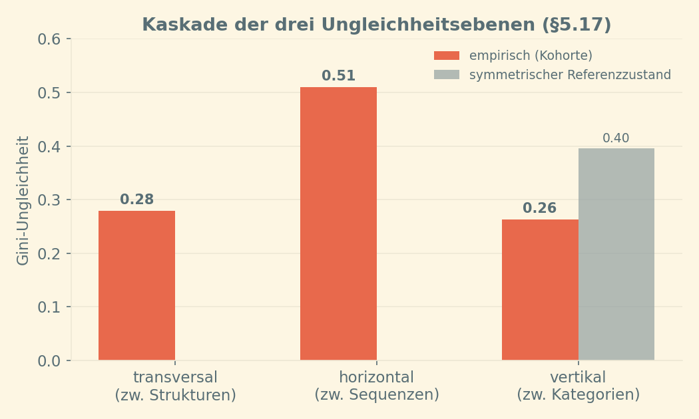
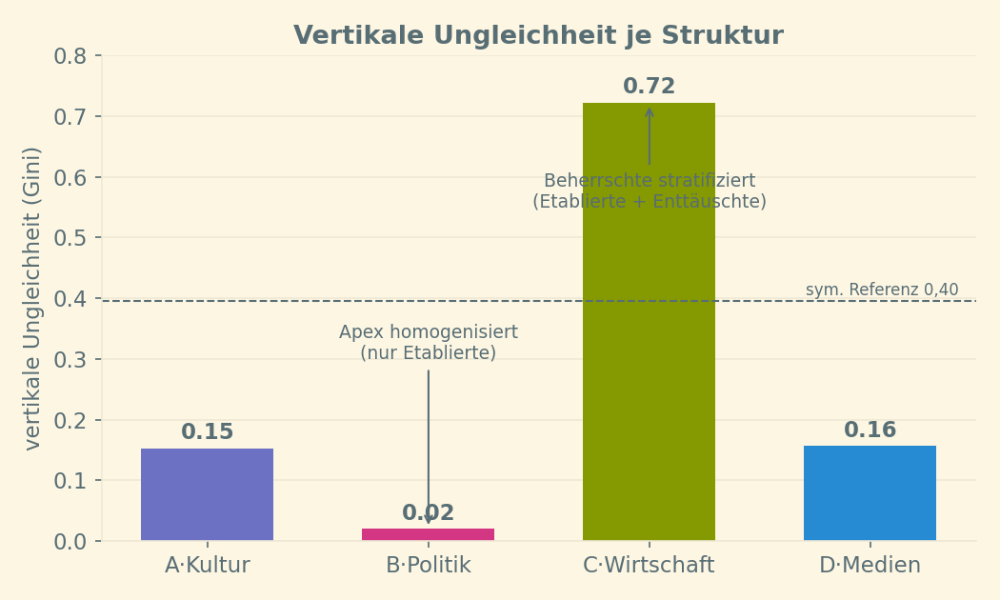
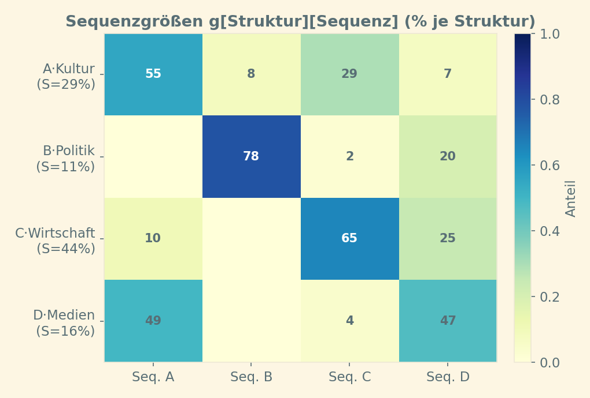
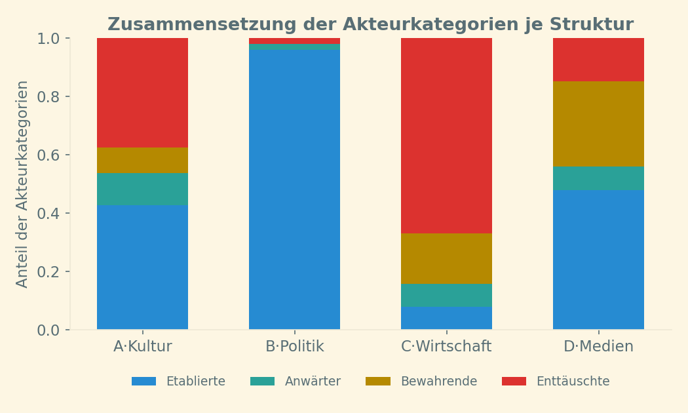
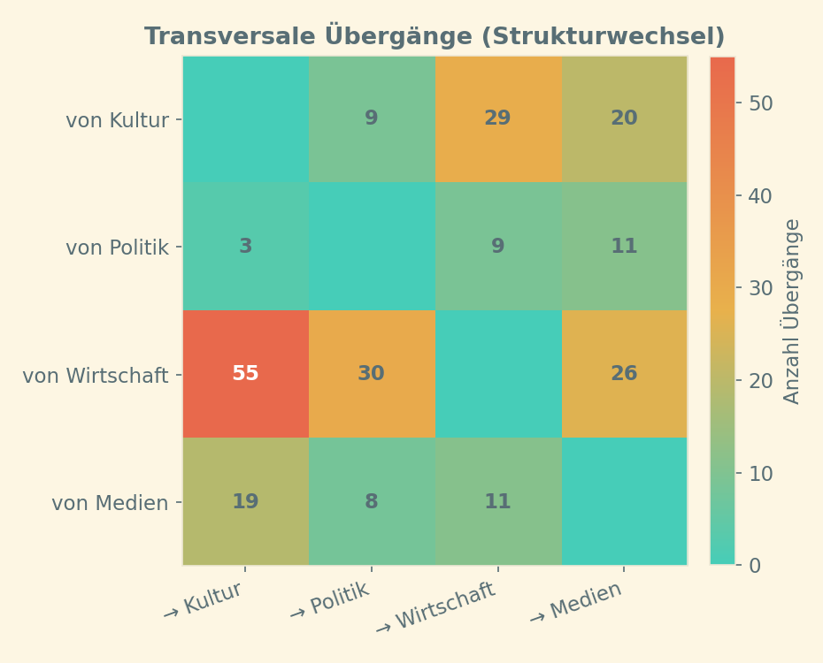
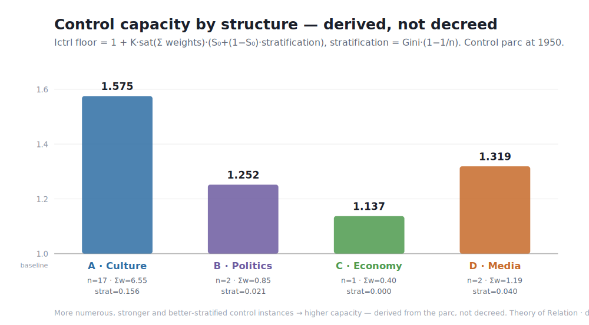
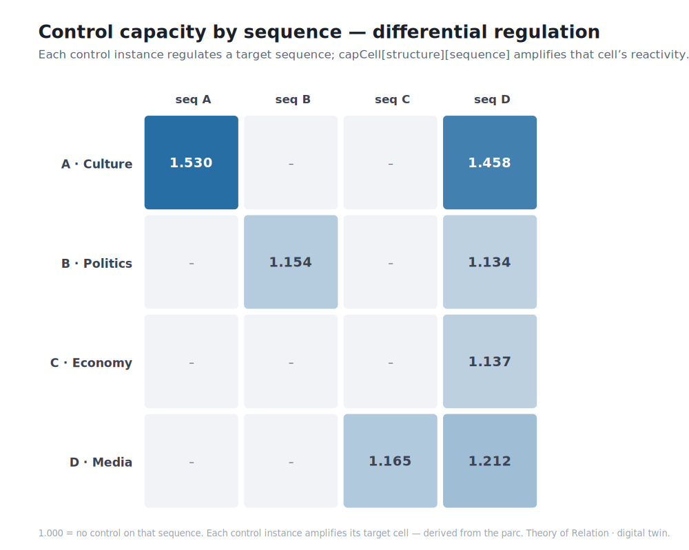
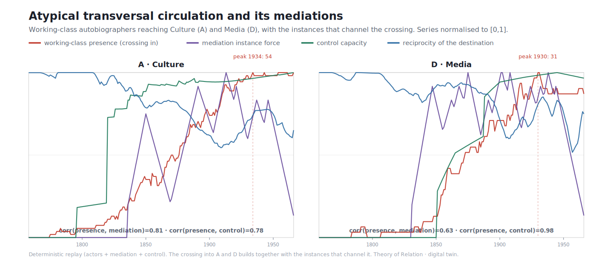
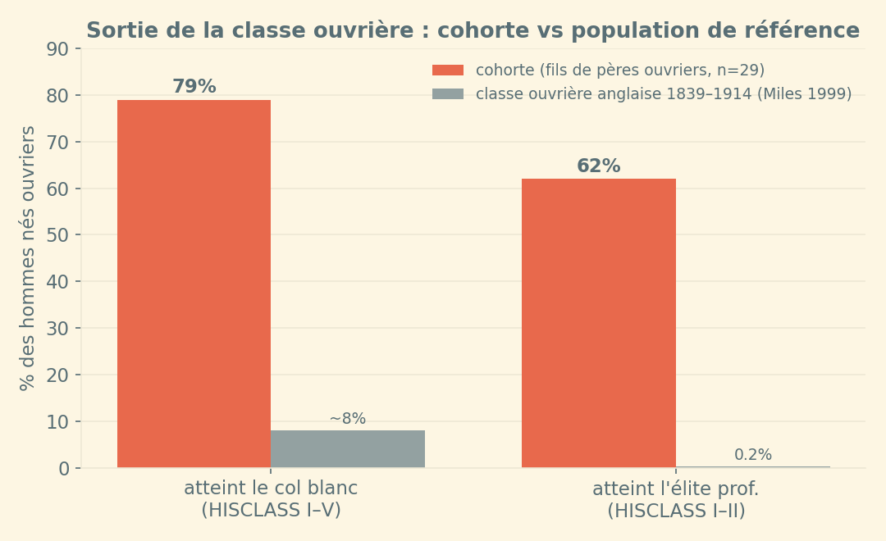
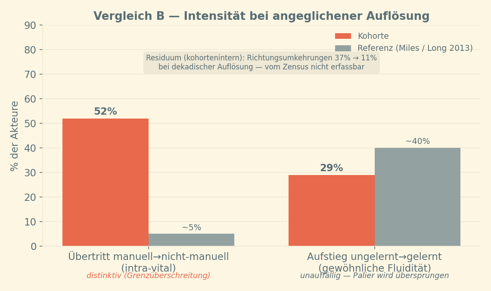

#+TITLE: Zirkulation, Ungleichheit und Atypizität: eine relationssoziologische Auswertung von 163 Arbeiterautobiographien (England, 1790–1945)
#+SUBTITLE: Operationalisierung und empirische Prüfung der Theorie der Relation mit dem digitalen Zwilling
#+AUTHOR:
#+DATE: 2026-06-24
#+LANGUAGE: de
#+OPTIONS: toc:t num:t ^:nil
#+cite_export: basic author-year
#+bibliography: references.bib

# Hinweis zur Verarbeitung: Dieses Dokument nutzt die org-cite-Syntax (Org 9.5+). Zitate stehen in der Form cite-Doppelpunkt-At-Schluessel in eckigen Klammern;
# die Bibliographie wird unten über #+print_bibliography: aus references.bib erzeugt. Für den LaTeX/PDF-Export ggf.
# #+cite_export: csl mit einer CSL-Datei wählen. Alle Zeilen sind bewusst lang (ein Absatz = eine Zeile).

* Zusammenfassung

In dieser Arbeit fragen wir danach, ob die innerbiographische Zirkulation einer Kohorte englischer Arbeiterautobiographen typisch oder atypisch für die Arbeiterklasse in dieser Zeit in England ist. Zur Untersuchung dieser Frage verwenden wir den digitalen Zwilling der Theorie der Relation (in der Folge als TR abgekürzt) [cite:@papilloud2022skizze] als Mess- und Deutungsrahmen. Aus 163 Lebensläufen (996 Berufsetappen) des Korpus von [cite/t:@burnettvincentmayall1984] werden in einem ersten Schritt die Berufe nach HISCO/HISCLASS/HISCAM kodiert [cite:@vanleeuwen2002hisco;@vanleeuwenmaas2011hisclass;@lambert2013hiscam]. In einem zweiten Schritt werden diese Berufe auf die vier Relationsstrukturen (im digitalen Zwilling mit den folgenden abgekürzten Bezeichnungen benannt: Kultur, Politik, Wirtschaft, Medien) und auf die vier Akteurkategorien verteilt, die die TR vorsieht. Mit dem digitalen Zwilling wird die soziale Ungleichheit entsprechend der drei Ebenen der sozialen Ungleichheiten in der TR (der transversalen Ungleichheit zwischen Relationsstrukturen, der horizontalen Ungleichheit zwischen Sequenzen von Relationsstrukturen, der vertikalen Ungleichheit zwischen Akteurkategorien in diesen Sequenzen) untersucht. Diese Untersuchung bringt drei Hauptbefunde. Der erste Befund ist empirischer Natur. Die untersuchte Kohorte von Arbeitern ist gemessen an ihrer Zielposition radikal atypisch. 62 % der Söhne von Vätern, die einen manuellen Beruf ausüben, steigen in die professionelle Elite auf. Im Vergleich verweist die Literatur zur Arbeiterklasse in England, die wir als Referenz in dieser Arbeit nehmen, einen Aufstieg der Söhne von Vätern mit manuellem Beruf in die Elite von etwa 0,2 % [cite:@miles1999 S. 26]. Jedoch und selbst wenn die Arbeiter von unserer Kohorte auffällig im Überschreiten der Klassengrenze sind, in der gewöhnlichen Mobilität innerhalb der manuellen Tätigkeiten ihre Mobilität unauffällig bleibt. Der zweite Befund bezieht sich auf die Theorie. Der digitale Zwilling der TR lässt im voraus die Folgen im Sinne der sozialen Ungleichheiten von einer solchen atypischen Mobilität der Arbeiter in unserer Kohorte beobachten. Die TR besagt, dass sich unter Herrschaft der Apex homogenisiert, während sich der beherrschte Pol stratifiziert. Herrschaft meint dabei, dass eine Relationsstruktur über die anderen herrscht und sie dadurch satellisiert. An der Spitze der herrschenden Struktur stehen dann fast nur Etablierte, am beherrschten Pol koexistieren Etablierte und Enttäuschte. Die Daten bestätigen dies. Die Politik als Apex zeigt eine vertikale Ungleichheit von 0,02, die Wirtschaft als beherrschter Pol eine von 0,72. Der dritte Befund ist mechanistischer Natur. Er fragt nicht mehr, /wo/ sich die Ungleichheit lagert, sondern /wodurch/ die atypische Überschreitung zustande kommt. In den Blick geraten damit die konkreten Instanzen, durch die die Akteure hindurchtreten. Lädt man Akteure, Vermittlungs- und Kontrollinstanzen gemeinsam in den digitalen Zwilling, so erweisen sich diese Instanzen als die /Kanäle/ der Überschreitung. In den Medien sind sie mit den Eintretenden ko-emergent (Korrelation Präsenz–Kontrolle 0,98, eine im Entstehen begriffene Sphäre). In der Kultur bilden sie dagegen einen vorbestehenden Zertifizierungs- und Konsekrationsapparat (0,78), den die Autodidakten erklimmen. Die relationale Auflösung macht damit eine Dimension messbar, die die klassische Mobilitätsforschung in einer einzigen Rate verschmilzt.

* 1. Einleitung und Fragestellung

Die historische Mobilitätsforschung misst zumeist /eine/ Größe. Diese Größe ist der Abstand zwischen der Klasse des Vaters und der des Sohnes. Zwei Maße drücken diesen Abstand gewöhnlich aus. Das erste ist die /Outflow-Rate/ (Abstromrate). Sie gibt an, welcher Anteil der Söhne aus einer bestimmten Herkunftsklasse diese Klasse verlässt. Man liest an ihr zum Beispiel ab, wie viele Söhne von Arbeitern selbst keine Arbeiter mehr werden [cite:@hout1983;@eriksongoldthorpe1992]. Das zweite ist der /Persistenzkoeffizient/. Er misst, wie stark der Status des Vaters den des Sohnes bestimmt, und entspricht der Steigung einer Geraden, die den einen aus dem anderen schätzt. Ein Wert nahe eins bedeutet, dass die Position fast unverändert weitergegeben wird und die Mobilität gering ist. Ein Wert nahe null bedeutet, dass die Herkunft kaum noch etwas festlegt und die Mobilität hoch ist. Bezieht sich der Koeffizient auf das Einkommen, spricht man von der intergenerationellen Einkommenselastizität [cite:@solon1999;@blackdevereux2011;@torche2015]. Lebensläufe sind jedoch keine zwei Punkte, sondern Bahnen. Sie kennen Auf- und Abstiege, Umkehrungen und Wechsel zwischen ganz verschiedenen gesellschaftlichen Ordnungen. Die hier vorgelegte Arbeit fragt nach genau dieser /Bahn/: Wie intensiv und auf welchen Achsen zirkulieren die Autoren von Arbeiterautobiographien im Verlauf ihres Lebens? Und ist diese Zirkulation für die englische Arbeiterklasse des langen 19. Jahrhunderts typisch oder atypisch?

Den Rahmen dafür liefert die Theorie der Relation [cite:@papilloud2022skizze;@papilloud2025postskriptum]. Sie denkt Gesellschaft als ein Geflecht von Relationsstrukturen, in denen Akteure zirkulieren, und sie verknüpft diese Zirkulation mit Stratifikation, Vermittlung und Ungleichheit. Zirkulationsmuster, so der Grundgedanke, „spiegeln die Ungleichheiten zwischen Akteuren“ [cite:@papilloud2022skizze S. 17]. Sie ergeben sich aus dem Zusammenspiel der Position, die ein Akteur in den Relationsstrukturen einnimmt, und der Bewegung, mit der er innerhalb dieser Strukturen und zwischen ihnen zirkuliert. Ihr operationaler Kern ist ein digitaler Zwilling. Diese Webanwendung modelliert die dynamische Struktur der TR nach einem Ansatz des Austausches von Energie. Ursprünglich als Werkzeug gedacht, um die immanente Kohärenz der TR zu überprüfen, wurde der digitale Zwilling zu einem Werkzeug für die epistemologische Analyse und für die empirische Forschung ausgebaut. Er nimmt reale Daten auf und liest daraus Ungleichheits- und Reziprozitätsmaße. Die Leitidee dieser Arbeit ist, die Theorie nicht nur als Beschreibungssprache, sondern als /Messinstrument/ und als Quelle /prüfbarer Vorhersagen/ zu verwenden. Damit stellt sich die Arbeit in die Tradition der mechanismenbasierten Erklärung. Diese hält einen sozialen Zusammenhang nicht schon dann für erklärt, wenn eine statistische Assoziation zwischen Herkunft und Ankunft belegt ist, sondern erst dann, wenn der Mechanismus benannt ist, durch den er zustande kommt [cite:@hedstromswedberg1998;@hedstrom2005].

Ob diese Zirkulation typisch oder atypisch ist, lässt sich nur im Vergleich mit der Arbeiterklasse insgesamt beantworten. Die Antwort darauf fällt zweiteilig aus, weil die Referenzliteratur die beiden relevanten Dimensionen sehr ungleich abdeckt. Die /Zielposition/ (wohin die Bahn führt) ist gut dokumentiert, die /Intensität/ der Bewegung dagegen kaum. Vor den verknüpften Zensus gab es keine belastbare quantitative Information über die Mobilität im individuellen Erwerbsleben für England und Wales [cite:@long2013 S. 4]. Das eigentliche Herzstück der Arbeit liegt jenseits dieser Empirie in einem strukturellen Befund, den erst die relationale Auflösung sichtbar macht (Abschnitt 4.2).

* 2. Theoretischer Rahmen: die Theorie der Relation

Das Modell bildet vier wechselseitig beeinflusste Relationsstrukturen ab (A·Kultur, B·Politik, C·Wirtschaft, D·Medien), die jeweils in vier Sequenzen gegliedert sind (die Selbst-Replik X.X bildet den Kern). In jeder Sequenz verteilen sich die Akteure auf vier Kategorien, nämlich Etablierte, Anwärter (Aspiranten), Bewahrende (Konservative) und Enttäuschte. Mobilität verläuft auf drei Achsen. Die vertikale Achse liegt zwischen den Akteurkategorien innerhalb einer Teilsequenz, die horizontale zwischen den Sequenzen einer Struktur und die transversale zwischen den Relationsstrukturen. Aus der ungleichen Zirkulation sowie der Deklassierung entstehen soziale Ungleichheiten [cite:@papilloud2022skizze].

Für die vorliegende Untersuchung ist eine Unterscheidung entscheidend, die die TR trifft und die die gewöhnliche Mobilitätsforschung meist übergeht. Die TR trennt die /Zirkulation/ eines Akteurs von seiner /Mobilität/. Die Zirkulation meint zunächst nur, /ob/ ein Akteur überhaupt in Bewegung ist oder stillsteht. Die Mobilität meint die Richtung und die Art dieser Bewegung. Sie fragt, ob ein Akteur aufsteigt oder absteigt und ob er die Sequenz oder die Relationsstruktur wechselt, in der er sich befindet. Die Zirkulation ist damit das grundlegendere Faktum, die Mobilität ihre Gestalt. Für die TR fällt deshalb das Primat der Relationsstrukturen mit dem „Primat der Zirkulation“ zusammen [cite:@papilloud2022skizze S. 120]. Sie bestimmt, wie sich die Akteure innerhalb einer Struktur und über deren Grenzen hinweg bewegen [cite:@papilloud2022skizze S. 167]. Eine aufsteigende Zirkulation etwa, die die Relationsstruktur wechselt und sich dort stabilisiert, versteht die TR als eine „aufsteigende transversale Mobilität“ [cite:@papilloud2025postskriptum S. 92].

Diese Unterscheidung ist folgenreich, weil die Mobilität und die Zirkulation über zwei verschiedene Zustände Auskunft geben. Die Mobilität informiert über den Zustand der sozialen Ungleichheiten. Wer aufsteigt, wer absteigt und wie sich die Positionen verteilen, zeigt sich an ihr. Die TR behandelt soziale Ungleichheit denn auch wesentlich als „Ungleichheit und Hierarchie zwischen kurzen und langen Zirkulationspfaden“ [cite:@papilloud2022skizze S. 326]. Die Zirkulation dagegen informiert über den Zustand der /systemischen Reziprozität/. Gemeint ist die Reziprozität sowohl in den einzelnen Sequenzen und Relationsstrukturen als auch im gesamten relationalen Raum der vier Strukturen. Bleibt die Zirkulation flüssig, so ist die Reziprozität intakt. Stockt sie, ist die Reziprozität gestört. Die TR fasst die Reziprozität eben deshalb nicht nur als Instanz, die Akteure verteilt, sondern auch als „Schließungsinstanz zwischen Zirkulationen“ innerhalb und zwischen den Relationsstrukturen [cite:@papilloud2022skizze S. 36].

Theoretisch zentral ist die Verknüpfung von Herrschaft und Stratifikation: Eine gut vermittelte, dominante Struktur konsolidiert gerade dadurch eine Hierarchie. Sie nimmt viele auf und verteilt sie auf ungleiche Positionen. Die Theorie unterscheidet die /interne Legitimität/ einer Struktur (ihre Vermittlungsinstanzen funktionieren) von der /systemischen Reziprozität/ (die Zirkulation zwischen den Strukturen bleibt flüssig und wenig ungleich); beide fallen nicht zusammen. Daraus folgt die für diese Arbeit entscheidende Vorhersage. Unter Herrschaft /homogenisiert sich der Apex/ (an der Spitze stehen fast nur Etablierte), während sich /die Beherrschten stratifizieren/ (an ihrem Pol koexistieren Etablierte und Enttäuschte). Diese Aussage ist struktur-lokalisierend und an Daten prüfbar. Sie wird in Abschnitt 4.2 geprüft.

Im Zuschnitt dieser Arbeit adressiert die Unterscheidung unmittelbar die Fragestellung. Sie erlaubt zu prüfen, ob die Bewegung der Arbeiterautobiographen typisch für die englische Arbeiterklasse der betrachteten Zeit ist oder atypisch. Mit beiden Begriffen zugleich zeigt sich ein Ergebnis, das eine einzige Mobilitätsrate verdecken würde. Die /Mobilität/ dieser Autoren ist atypisch, während ihre /Zirkulation/ typisch bleibt. Die Arbeit erklärt damit, wieso eine typische Zirkulation dieser Arbeiter zu einer atypischen sozialen Mobilität führt. Eben darin liegt der Gewinn des Ansatzes. Das Primat der Zirkulation berücksichtigt, wie Zirkulation und Position zusammenwirken, und erlaubt so „im Kontrast zu gängigen Ansätzen soziologischer Mobilitätsforschung eine Neuperspektivierung von sozialer Mobilität“ [cite:@papilloud2025postskriptum S. X]. Mit dieser Perspektive werden im Folgenden die Ergebnisse der Analyse verbunden.

* 3. Daten und Methoden

Die Grundlage ist das annotierte Korpus englischer Arbeiterautobiographien von [cite/t:@burnettvincentmayall1984]. Wir haben die Bände dieses Werks eingescannt und aus den gescannten Vorlagen für jeden Akteur eine eigene Datei erstellt. Diese Dateien sind einheitlich aufgebaut, sodass jede Zeile eine bestimmte Art von Information über den Akteur trägt. Die erste Zeile enthält die biographischen Eckdaten, insbesondere das Geburts- und das Sterbejahr. Die zweite Zeile enthält die Familienbiographie und die Entwicklung des Zivilstands, also etwa, ob die Person geheiratet hat, Kinder bekommen hat, ledig geblieben ist oder gereist ist. Die dritte Zeile enthält die verschiedenen beruflichen Tätigkeiten, die die Person im Lauf ihres Lebens ausgeübt hat. Die vierte Zeile enthält ihre Nebentätigkeiten. Die fünfte Zeile enthält die Werke, die die Person über ihre Autobiographie hinaus verfasst hat, sowie sonstige Besonderheiten, die sie auszeichnen.

Aus dieser Struktur gewinnen wir die Berufsverläufe. Jede einzelne berufliche Station in der dritten Zeile einer Akteursdatei zählt als eine /Berufsetappe/. Aus den eingescannten Bänden sind zunächst 390 Textdateien hervorgegangen. Mehrfache Vorlagen zu derselben Person wurden zusammengeführt und unbrauchbare aussortiert. Danach verbleiben 163 eindeutige Personen, für die je eine strukturierte Datei vorliegt. Deren dritte Zeilen summieren sich zu insgesamt 996 Berufsetappen. Ein Geburtsjahr liegt für 92 % der Personen vor. Ein Vaterberuf liegt für 66 % vor. Er wurde heuristisch bestimmt, das heißt dort, wo er nicht ausdrücklich genannt war, über Faustregeln aus dem Text erschlossen.

Der Bestand gehört demselben Genre an, das [cite/t:@humphries2010] für die industrielle Revolution ausgewertet hat. Mit ihm teilt er eine Stärke und eine Schwäche. Die Stärke ist die feinkörnige Innensicht auf den Lebenslauf. Die Schwäche ist die Selbstselektion „erzählbarer“ Leben. In ein solches Korpus gelangen bevorzugt Leben, die sich als kohärente, erzählbare Laufbahn darstellen lassen. Dass eine solche Kohärenz jedoch weniger die Wirklichkeit eines Lebens abbildet als ein Artefakt der Erzählung ist, hat Bourdieu als „biographische Illusion“ beschrieben [cite:@bourdieu1990]. Für die Mobilitätsmessung folgt daraus, dass das Korpus die Berufsstruktur zwar abbildet, hinsichtlich der Mobilität aber verzerrt sein dürfte. Auf diese Grenze kommen wir in Abschnitt 6 zurück.

** 3.1 Berufskodierung (HISCO / HISCLASS / HISCAM)

Jede Berufsbezeichnung wird zunächst über HISCO kodiert [cite:@vanleeuwen2002hisco]. HISCO (Historical International Standard Classification of Occupations) ist ein standardisiertes Schema, das historische Berufsbezeichnungen einheitlich verschlüsselt und dadurch über Länder und Epochen hinweg vergleichbar macht. An den HISCO-Code sind zwei weitere Größen geknüpft. Die erste ist eine soziale Klassenlage nach HISCLASS (Historical International Social Class Scheme), die jeden Beruf einer von zwölf sozialen Klassen zuordnet [cite:@vanleeuwenmaas2011hisclass]. Die zweite ist ein Statuswert nach HISCAM, einer historischen Fassung der CAMSIS-Skala (Cambridge Social Interaction and Stratification Scale), die jeden Beruf auf einer kontinuierlichen Skala von etwa 0 (sehr niedriger Status) bis 100 (sehr hoher Status) einstuft [cite:@lambert2013hiscam].

Ein exakter Abgleich zwischen den Berufstiteln der Quellen und den HISCO-Codes existiert nicht. Wir haben deshalb eine mehrstufige Zuordnung aufgebaut. Sie kombiniert ein Lexikon bekannter Titel, eine Suche nach Synonymen und eine Volltext-Rettung, bei der der ganze Text einer Datei durchsucht wird, um Berufsangaben zu bergen, die im bloßen Titel fehlen. Gestützt ist die Zuordnung auf den Crosswalk von [cite:@cedarhisco]. Ein Crosswalk ist eine Übersetzungstabelle zwischen zwei Klassifikationssystemen. Er ordnet jeder Berufsbezeichnung des einen Systems den passenden Code des anderen zu. Im Sinne einer /Präzision-zuerst/-Strategie blieben generische Titel wie manager, clerk oder agent zunächst unkodiert. Dokumentierte Kompromisse, etwa die Einstufung eines Gewerkschafts- oder Parteisekretärs auf Generaldirektor-Niveau oder eines working-class engineer als Maschinenschlosser, sind im methodischen Anhang verzeichnet.

Auf diese Weise wurden 420 der 996 Berufsetappen kodiert (42 %). Nach Wiedereingliederung der generischen Titel über Näherungswerte steigt der Anteil auf 48 %. Ein solcher Näherungswert (Proxy) ist ein stellvertretender Code, der einem generischen Titel ersatzweise zugewiesen wird, solange keine genauere Zuordnung möglich ist. Die resultierende HISCAM-Verteilung ist /bimodal/. Ihre Häufigkeitskurve bildet also zwei getrennte Gipfel. Rund 40 % der Etappen liegen niedrig (manuelle Herkunft), rund 45 % hoch (kulturelles oder mediales Ziel). Diese Zweigipfligkeit ist ein erster Hinweis auf die große Amplitude der Bahnen, die später gemessen wird.

** 3.2 Operationalisierung der Theorie

Die vier Akteurkategorien der TR (Etablierte, Anwärter, Bewahrende und Enttäuschte) werden nicht vorgegeben, sondern aus den Daten bestimmt. Jede Kategorie ergibt sich aus zwei Angaben. Die erste ist das Statusniveau eines Akteurs, sein HISCAM-Wert. Die zweite ist die Richtung seiner Laufbahn, also ob er auf- oder absteigt. Für die Zuordnung haben wir zwei Varianten berechnet und beide beibehalten. Die absolute Variante teilt die Kohorte in Statusdrittel (Terzile) und legt zusätzlich eine Schwelle fest, ab der eine Statusänderung als Auf- oder Abstieg gilt und nicht als bloßes Gleichbleiben (hier eine Änderung von mindestens drei HISCAM-Punkten). Die relative Variante bemisst die Position eines Akteurs innerhalb seiner eigenen HISCAM-Spannweite, also zwischen seinem niedrigsten und seinem höchsten erreichten Status. Auf dem dünn kodierten Korpus, auf dem im Median nur zwei kodierte Etappen je Akteur vorliegen, erwies sich die absolute Regel als belastbarer.

Jede Etappe wurde außerdem einer Relationsstruktur und einer Sequenz zugeordnet. Die Relationsstruktur ist eine der vier gesellschaftlichen Sphären der TR (Kultur, Politik, Wirtschaft, Medien), die Sequenz einer von vier Modi innerhalb dieser Struktur, nämlich Investition, Repräsentation, Materialität oder Attraktivität. Ein Etappencode kombiniert beide Angaben. Der erste Buchstabe bezeichnet die Relationsstruktur (A·Kultur, B·Politik, C·Wirtschaft, D·Medien). Der zweite bezeichnet die Sequenz in derselben Reihenfolge, also A für Investition, B für Repräsentation, C für Materialität und D für Attraktivität. A.C meint demnach die Sequenz der Materialität in der Kultur. Diese Zuordnung wurde an Ankerfällen geprüft. Pfarrer und Missionar besetzen in der Kultur die Sequenz der Repräsentation (A.B), Drucker und Setzer dagegen die der Materialität (A.C). Ergänzt wurde sie um drei Einzelfallkorrekturen. Diese betreffen die Tätigkeiten /salesman/, /soldier/ und /policeman/ und sind in der Validierungstabelle im Anhang dokumentiert. Eine zusätzliche /avokationale/ Schicht erfasst kulturelle, politische und mediale Tätigkeiten jenseits des Hauptberufs, also das, was ein Akteur neben- oder ehrenamtlich betreibt. Diese Schicht ist wesentlich, weil die Ankunft in Kultur oder Medien oft nicht über den Hauptberuf, sondern über solche Nebentätigkeiten erfolgt. Bezieht man sie ein, steigt die Quote erreichter Zielstrukturen von 46 % auf 57 %.

** 3.3 Messung: Zirkulationsindex und Messkaskade des digitalen Zwillings

Auf der Ebene der einzelnen Akteure fasst ein zusammengesetzter Zirkulationsindex die drei Bewegungsachsen zu einer Kennzahl zusammen. Die vertikale Achse erfasst die Statusspanne einer Laufbahn (HISCAM-Amplitude), ihre Umkehrungen und ihre Schwankungen. Die horizontale Achse zählt die Wechsel zwischen Sequenzen, die transversale die Wechsel zwischen Relationsstrukturen. Jede Achse wird perzentilskaliert, das heißt in einen Rangplatz zwischen 0 und 100 übersetzt, und alle drei gehen gleich gewichtet in den Index ein.

Auf der Ebene des Systems bzw. des gesamten relationalen Raums der vier Relationsstrukturen wird der empirische Zustand der Kohorte in den digitalen Zwilling eingespeist. Dieser Zustand fasst zusammen, wie sich die Kohorte zu einem Zeitpunkt über die Strukturen und Sequenzen verteilt, und besteht aus drei Größen. Die erste, S, beschreibt das relationale Gewicht jeder der vier Relationsstrukturen (normiert, in der Summe 1). Die zweite, g, beschreibt die Größe jeder Sequenz innerhalb ihrer Relationsstruktur. Die dritte, act, beschreibt die Zusammensetzung der vier Akteurkategorien in jeder der sechzehn Sequenzen. Diese Daten liegen in der Vertragstabelle =cohorte_contrat.csv= vor. Aus ihnen liest der Zwilling seine Messkaskade ab. Diese Kaskade löst die Ungleichheit in drei ineinander geschachtelte Ebenen auf. Sie wird unmittelbar aus dem eben beschriebenen Zustand (S, g, act) berechnet, und zwar mit den Formeln, die im Zwilling bereits hinterlegt sind. Es kommt dabei keine neue Mechanik hinzu, also kein zusätzlicher Simulations- oder Rechenschritt. Die Ungleichheitsmaße werden allein aus dem gegebenen Zustand abgelesen und nicht durch einen weiteren Prozess erzeugt. Als Ungleichheitsmaß dient auf jeder Ebene der Gini-Koeffizient. Es ist eine Standardgröße, die von 0 (völlige Gleichheit) bis 1 (maximale Ungleichheit) reicht.

Die drei Ebenen unterscheiden sich darin, worüber die Ungleichheit gemessen wird. Transversal ist es der Gini der relationalen Größen zwischen den Relationsstrukturen. Horizontal ist es den Durchschnitt der Gini-Werte innerhalb der einzelnen Sequenzen. Vertikal ist es der Gini der Statusverteilung innerhalb der jeweiligen Sequenzen, der nach deren Größe sowohl global als auch je Relationsstruktur gewichtet ist. Für diese vertikale Rechnung werden die Akteurkategorien mit absteigenden Werten belegt (Etablierte = 3, Anwärter = 2, Bewahrende = 1, Enttäuschte = 0). Alle Formeln wurden dem Code des digitalen Zwillings entnommen und originalgetreu nachgerechnet.

* 4. Ergebnisse

** 4.1 Zirkulationsprofile

Auf den 113 Akteuren, die analysiert werden können (≥ 2 kodierte Etappen), beträgt die HISCAM-Amplitude im Median 29 (Maximum 133), die Spannweite im Median 24, und der Nettoaufstieg +17. Der Nettoaufstieg ist der Abstand zwischen dem letzten und dem ersten kodierten Status einer Laufbahn. Ein Median von +17 bedeutet, dass eine typische Bahn 17 HISCAM-Punkte höher endet, als sie begonnen hat. 37 % der Bahnen weisen mindestens eine Richtungsumkehr auf, 18 % zwei oder mehr. Die Volatilität (Amplitude geteilt durch Spannweite) liegt im Durchschnitt bei 1,4. Die Bahnen legen also rund 40 % mehr Weg zurück, als ihr Nettoabstand verlangt. Der Nettoabstand ist die Spannweite, also die direkte Distanz zwischen dem niedrigsten und dem höchsten erreichten Status. Er ist der Weg, den eine geradlinige Laufbahn ohne Umwege zurücklegen würde. Die Bahnen entwickeln sich also nicht-monoton. Der zusammengesetzte Index (110 Akteure) hat einen Median von 49,7 und reicht von 14,7 bis 88,8. Er steigt erwartungsgemäß mit der erreichten Zielstruktur (nur Kultur 35 < nur Medien 48 < Kultur und Medien 56). Das dient als interne Validierung, denn ein Index, der die Zirkulation misst, sollte gerade bei den Akteuren am höchsten sein, die am weitesten zirkuliert und die meisten Zielrelationsstrukturen erreicht haben. Dass er sich genau so verhält, bestätigt, dass er misst, was er messen soll.

** 4.2 Die Ungleichheitskaskade und der theoretische Ertrag

Die globale Kaskade ergibt eine transversale Ungleichheit von 0,28, eine horizontale von 0,51 und eine vertikale von 0,26. Zum Vergleich dient der symmetrische Referenzzustand des Modells, dessen Werte 0, 0 und ≈ 0,40 lauten. Dieser Referenzzustand ist die neutrale Grundstellung des digitalen Zwillings, in der die vier Strukturen und ihre Sequenzen ausgewogen besetzt sind. Transversale und horizontale Ungleichheit verschwinden dort definitionsgemäß, während eine vertikale Restungleichheit von etwa 0,40 bleibt, die sich aus der geordneten Statuskodierung (3 / 2 / 1 / 0) und der Standardzusammensetzung der Akteurkategorien ergibt. Auf den oberen beiden Ebenen ist die Kohorte also weit von der Gleichverteilung entfernt (die Aktivität ballt sich in wenigen Strukturen und je Struktur in wenigen Sequenzen), während die vertikale Ungleichheit im Durchschnitt sogar unter dieser Referenz bzw. diesem Referenzzustand des digitalen Zwillings liegt (Abbildung 1). Die durchschnittliche vertikale Ungleichheit der Kohorte (0,26) liegt damit unter dem neutralen Modellwert von etwa 0,40. Im Durchschnitt ist die Kohorte auf dieser Ebene etwas gleicher als die Grundstellung des Modells.

#+CAPTION: Kaskade der drei Ungleichheitsebenen, empirisch gegen den symmetrischen Referenzzustand des digitalen Zwillings.
#+NAME: fig:kaskade

Der Mittelwert verdeckt jedoch den bedeutsamen Befund. Die vertikale Ungleichheit je Struktur unterscheidet sich extrem (Abbildung 2): B·Politik 0,02, A·Kultur 0,15, D·Medien 0,16, C·Wirtschaft 0,72. Damit bestätigen unabhängig kodierte Daten die in Abschnitt 2 formulierte Vorhersage der Theorie [cite:@papilloud2022skizze S. 75], nach der die Zirkulation erschwert wird, wenn die Relationsstrukturen und ihre Sequenzen stärker stratifiziert werden. In dieser Kohorte ist die Politik der erreichte Apex. Wer sie erreicht, ist nahezu durchweg etabliert; die interne vertikale Ungleichheit verschwindet (0,02). Die Wirtschaft ist der erlittene Ursprung. Dort koexistieren die aufgestiegenen und die gescheiterten Akteure, und die vertikale Ungleichheit ist maximal (0,72). Die Theorie sagt diesbezüglich vorher, an welchem Pol des relationalen Raumes sich die Ungleichheit lagert, bevor diese Lagerung mit den Daten konkret geprüft wird. Für die TR ist ein solches struktur-lokalisierendes Ergebnis der bedeutsamste Ertrag dieser Arbeit.

#+CAPTION: Vertikale Ungleichheit je Struktur: homogener Apex (Politik) gegen stratifizierten Pol (Wirtschaft).
#+NAME: fig:vertikal

** 4.3 Strukturen, Sequenzen und transversale Ströme

Die relationalen Größen, also die in Abschnitt 3.3 eingeführten Gewichte S der vier Relationsstrukturen (der Anteil jeder Relationsstruktur an der gesamten relationalen Tätigkeiten), verteilen sich auf C·Wirtschaft 44 %, A·Kultur 29 %, D·Medien 16 % und B·Politik 11 %. Innerhalb jeder Struktur dominiert eine Sequenz (Abbildung 3). Die Kategorienzusammensetzung je Struktur (Abbildung 4) macht die Politik als reinen Etabliertenraum und die Wirtschaft als gemischten Raum sichtbar. Die transversalen Übergänge (Abbildung 5) weisen die Wirtschaft als große Quelle der Zirkulation aus. Aus der Wirtschaft geht der stärkste Strom in die Kultur (55 Übergänge). Für die Arbeiter von dieser Kohorte ist diese Route der Weg vom manuellen Beruf zur kulturellen Tätigkeit.

#+CAPTION: Sequenzgrößen je Relationsstruktur (Anteile).
#+NAME: fig:seq

#+CAPTION: Zusammensetzung der Akteurkategorien je Relationsstruktur.
#+NAME: fig:kat

#+CAPTION: Transversale Übergänge zwischen den Relationsstrukturen.
#+NAME: fig:flux

** 4.4 Vermittlungs- und Kontrollinstanzen: die Kanäle der transversalen Überschreitung

Die bisherigen Abschnitte messen die Bahnen der Akteure. Die Theorie der Relation kennt jedoch einen zweiten Träger der Zirkulation. Es sind die Instanzen, mit denen sich die Akteure in Sequenzen und Relationsstrukturen einschreiben und durch die sie Sequenzen und Relationsstrukturen überschreiten [cite:@papilloud2022skizze]. Aus dem Korpus wurden 60 solcher Instanzen extrahiert. Es sind Schulen und Universitäten, literarische Revuen und Gesellschaften, Museen, Zeitungen und Nachrichtenagenturen. Für die im Korpus kaum belegte Politik treten im digitalen Zwilling zwei illustrative Kontrollinstanzen hinzu, die parlamentarische Aufsicht und die Royal Commission, sodass die folgende Kapazitätsrechnung auf 62 Instanzen beruht. Jede Instanz wurde mit einer zeitveränderlichen Autoritätskurve versehen, die ihren Verlauf von der Gründung über den Höhepunkt bis zum Niedergang oder zur Fortdauer nachzeichnet. Damit ein symbolisches Merkmal wie /Autorität/ überhaupt messbar wird, übersetzen wir es explizit in Zahlen. Jeder Instanz ist in der Tabelle =instances_full_empirical.csv= für mehrere Zeitpunkte ein Gewicht zugewiesen (Spalte =poids=), ein Wert auf einer Skala von etwa 0 bis 1. Diese Stützpunkte bilden die Autoritätskurve; zwischen ihnen interpoliert der Zwilling, sodass jede Instanz zu jedem Jahr einen Autoritätswert erhält. Die Werte sind an der Geschichte der jeweiligen Instanz kalibriert. Die /University of London/ etwa steigt von 0,2 (1836) über 0,45 (1858, mit der Einführung ihrer externen Prüfungen) auf 0,6 (1900). /Reuters/ steigt von 0,25 (1851) auf einen Höhepunkt von 0,7 (um 1900) und geht danach leicht zurück. Die /Financial Times/ baut sich von 0,2 (1888) allmählich auf 0,5 (1945) auf. Der Anstieg einer Kurve markiert den Aufstieg einer Instanz zur anerkannten Autorität, ihr Rückgang deren Nachlassen. Der digitale Zwilling trennt dabei zwei Funktionen bzw. zwei unterschiedlichen Arten von Instanzen. Die Vermittlungsinstanzen vermitteln den Sinn für die Sequenzen und die Relationsstrukturen, in denen sie tätig sind. Die Kontrollinstanzen (Bewertung, Zertifizierung, Konsekration, Gatekeeping) korrigieren die formalen Operationen von Vermittlungsinstanzen und tragen somit dazu bei, die Vermittlungsinstanzen zu stärken. Aus diesen Kontrollinstanzen leitet der digitale Zwilling für jede Relationsstruktur eine /Kontrollkapazität/ ab. Sie ergibt sich aus zwei Größen. Die erste ist, wie viel Autorität die Kontrollinstanzen einer Struktur zu einem Zeitpunkt insgesamt bündeln; dazu werden ihre Autoritätswerte gewichtet aufsummiert. Die zweite ist, wie ungleich diese Autorität unter ihnen verteilt ist; diese Konzentration wird mit dem Gini-Koeffizienten gemessen. Die Kontrollkapazität ist das Produkt beider Größen. Eine Struktur hat also dann eine hohe Kontrollkapazität, wenn ihre Kontrollinstanzen viel Autorität besitzen und diese Autorität zugleich stark gebündelt ist. Damit liegen zwischen der Autorität und der Kontrollkapazität zwei Ebenen. Die Autoritätsgewichte der einzelnen Instanzen sind die kalibrierte Eingabe. Die Kontrollkapazität einer Struktur ist demgegenüber kein weiterer, frei gewählter Parameter, sondern wird aus diesen Gewichten berechnet, also aus dem Bestand gelesen und nicht zusätzlich gesetzt. Kontrolle ist in diesem Modell kein einzelner Punkt und kein einzelner Torwächter, sondern ein ganzer Apparat aus vielen Instanzen, die gemeinsam bewerten, zertifizieren, konsekrieren und den Zugang regeln.

Die so abgeleitete Kontrollkapazität kehrt die theoretische Erwartung A < B < C < D um (Abbildung 8): A·Kultur trägt den stärksten Kontrollapparat (Zertifizierung durch die Universitäten und die prüfende University of London; Konsekration durch Revuen, literarische Gesellschaften und das Victoria-and-Albert-Museum), D·Medien folgt (Gatekeeping durch Reuters; ökonomische Bewertung durch die /Financial Times/), Wirtschaft und Politik bleiben zurück. Diese Umkehrung betrifft die erwartete Stärke-Reihenfolge der Kontrollkapazität. Nicht Wirtschaft und Politik, sondern Kultur und Medien tragen den stärksten Kontrollapparat, und das ist für die betrachtete Epoche erwartbar. Die mediale Sphäre wird gerade erst entwickelt und löst sich aus der staatlichen Vormundschaft, indem sie ihre eigenen Kontrollinstanzen aufbaut. Etwa Reuters wächst in diesen Jahrzehnten zur „imperial institution“ des Nachrichtenwesens heran [cite:@read1999]. Dagegen führt die Kultur mit sich einen längst etablierten Apparat der Zertifizierung und Konsekration [cite:@perkin1989;@rose2001]. Die Beglaubigung kulturellen Werts durch den Titel und seine Weihe durch Kritik und Museum sind genau die Mechanismen, die eine relationale Soziologie des kulturellen Feldes gut hervorgehoben hat [cite:@bourdieu1992].

Die Kontrolle wirkt zudem nicht gleichmäßig auf alle Sequenzen einer Relationsstruktur. Jede Kontrollinstanz reguliert eine Zielsequenz, und die Kapazität wird je Zelle gelesen (Abbildung 9). In der Kultur zertifizieren die Universitäten die Kernproduktion (A·Sequenz A), während Kritik, die säkularen Gesellschaften und die Sonntagsschul-Presse die kulturelle Distributionssequenz (A·Sequenz D) absegnen und moralisieren [cite:@royle1980;@laqueur1976]. In den Medien kontrolliert Reuters die Nachrichtensequenz (D·Sequenz D), während die /Financial Times/ die Wirtschaft aus den Medien heraus bewertet (D·Sequenz C). Die Regulierung ist mithin differenziell. Die literarische Kritik trägt nicht auf dieselbe Sequenz wie eine Publikumserhebung, und der Apparat einer Struktur verstärkt ihre Sequenzen ungleich.

Lädt man schließlich Akteure, Vermittlungs- und Kontrollinstanzen gleichzeitig, so lässt sich fragen, was die atypische Überschreitung aus Abschnitt 5 getragen hat. Für die beiden Zielstrukturen A und D baut sich die Präsenz der Arbeiterautoren im Gleichschritt mit den Instanzen auf und am engsten mit dem Kontrollapparat. Doch die beiden Relationsstrukturen erzählen verschiedene Geschichten (Abbildung 10). In den Medien ist die Kopplung nahezu vollständig. Gemeint ist die zeitliche Kopplung zwischen der wachsenden Präsenz der Arbeiterautoren und dem wachsenden Kontrollapparat der Struktur. Beide entwickeln sich fast im Gleichschritt (Korrelation Präsenz–Kontrolle 0,98). Reuters (ab 1851) und die /Financial Times/ (ab 1888) entstehen gleichzeitig mit dem Eintritt der Arbeiter in die Medien. Die Relationsstruktur und ihre Eintretenden sind ko-konstituiert. In der Kultur ist sie lockerer (0,78), weil der Zertifizierungsapparat schon vorhanden ist. Die Arbeiter erklimmen eine bereits errichtete Leiter, die den Autodidakten an entscheidenden Punkten geöffnet wurde. Dies geschah vor allem durch die externen Prüfungen der University of London (ab 1858) [cite:@harte1986], die institutionelle Form jenes selbstunterrichteten Aufstiegs, den die Autobiographien selbst erzählen [cite:@vincent1981;@rose2001]. Die atypische transversale Zirkulation ist damit kein Sprung ins Leere, sondern ein vermittelter Eintritt. In den Medien ist er mit den Instanzen ko-emergent. In der Kultur zeigt er sich dagegen als Aufstieg über einen Apparat, der bereits vor den Eintretenden bestand. Der in der Zieldimension gemessene Übertritt in die professionelle Elite (62 % gegenüber etwa 0,2 %, [cite:@miles1999 S. 26]) verläuft, strukturell gelesen, durch eben diese Kontrollinstanzen.

#+CAPTION: Abgeleitete Kontrollkapazität je Relationsstruktur (Gründung-zu-Niedergang-Kurven, Stand 1950): hergeleitet, nicht gesetzt. A·Kultur trägt den stärksten Kontrollapparat.
#+NAME: fig:kontrollkapazitaet

#+CAPTION: Kontrollkapazität nach Sequenz (capCell[Struktur][Sequenz]): differenzielle Regulierung — Zertifizierung in A·Sequenz A, Konsekration in A·Sequenz D, Gatekeeping in D·Sequenz D, ökonomische Bewertung in D·Sequenz C.
#+NAME: fig:kontrollprofil

#+CAPTION: Transversale Kanäle: Präsenz der Arbeiterautoren in A·Kultur und D·Medien gegen die sie kanalisierenden Vermittlungs- und Kontrollinstanzen (deterministischer Replay; Korrelationen über die Jahre mit Präsenz > 0).
#+NAME: fig:kanaele

** 4.5 Der Binnenweg in die Kultur: Direktsprünge und konservative Zählung

Die transversale Ankunft in der Kultur wirft eine Frage auf, die die TR unmittelbar berührt. Nach der Theorie sollte ein Akteur, der die Wirtschaft für die Kultur verlässt, zunächst an deren Sequenz der Materialität eintreten, also dort, wo die konkrete kulturelle Produktion wie Druck und Satz angesiedelt ist (A.C). Dort sollte er neu sozialisiert werden und den Kern der Kultur, das eigentliche Schaffen wie die Autorschaft (A.A), erst über einen inneren Weg durch die Sequenzen erreichen (A.C → A.D → A.A über die Sequenz der Attraktivität). Die Berufsdaten zeigen jedoch das Gegenteil. Diese Zahlen lassen sich aus der Vertragstabelle =cohorte_contrat.csv= nachvollziehen, in der jede kodierte Etappe eines Akteurs mit ihrem Jahr, ihrer Relationsstruktur und ihrer Sequenz verzeichnet ist. Ordnet man die Etappen eines Akteurs nach dem Jahr, ergibt sich die Folge seiner Struktur- und Sequenzpositionen. Aus diesen Folgen zählen wir aus, an welcher Sequenz ein Akteur die Kultur betritt und welche Position einem Schritt in den Kern A.A unmittelbar vorausgeht. Von den 40 Akteuren, die unmittelbar aus der Wirtschaft in die Kultur wechseln, landen 20 direkt im Kern A.A und nur 14 in der Sequenz der Materialität (A.C). Von den 52 Akteuren, die A.A überhaupt erreichen, gelangen nur 5 über einen inneren Schritt innerhalb der Kultur dorthin. 17 treten unmittelbar aus der manuellen Wirtschaft (C.C) ein, und 14 stehen bereits zu Beginn ihres kodierten Verlaufs bei A.A. Der von der TR erwartete Binnenweg ist in den Daten also fast nicht vorhanden. Bei einem Median von drei kodierten Etappen je Akteur und 60 von 159 Akteuren mit höchstens zwei Etappen wäre er dort auch nur schwer zu sehen.

Dieser Befund widerlegt die TR nicht, sondern macht eine ihrer Grundentscheidungen sichtbar. Die TR konzipiert die Zirkulation der Akteure konservativ. Als vollzogen gilt ein Sequenzwechsel erst dann, wenn eine offizielle Instanz der Relationsstruktur ihn ratifiziert hat, also durch eine neue Sozialisation mit ihren positiven oder negativen Sanktionen. Kulturelles Kapital, das die Autodidakten der Kohorte außerhalb dieser Instanzen erwarben -- etwa durch Selbststudium, Lektüre, Kapelle oder die radikale Presse --, zirkuliert nach dieser Logik erst mit seiner Absegnung [cite:@bourdieu1992]. Der innere Weg durch die kulturellen Sequenzen wurde also durchaus zurückgelegt, aber überwiegend außerberuflich. Sichtbar wird er erst im Moment der Ratifizierung, etwa wenn ein Manuskript angenommen wird, in der Anstellung oder im Mandat. Weil die Relationsstruktur- und Sequenzzuordnung aus den Berufen gewonnen wird (Abschnitt 3.2), erfasst sie nur die ratifizierten Endpunkte dieses Weges, die manuelle Herkunft und die kulturelle Ankunft. Die unratifizierten Zwischenstufen werden somit unsichtbar. Der scheinbare Direktsprung ist deshalb kein Messfehler, sondern ergibt sich einerseits aus der Struktur der Daten selbst und daraus, dass die TR die Zirkulation in Bezug auf konkrete von Vermittlungsinstanzen abgesegneten Einschreibungsschritte auffasst.

Wo die Zwischenstufe selbst ein Beruf war -- wie etwa auf dem Weg vom Weber über den Setzer zum Autor --, erscheint sie auch in den Daten. Die 14 Eintritte über die Sequenz der Materialität (A.C) dürften großenteils solche Fälle sein, in denen die kulturelle Produktion als bezahlte Arbeit die Brücke von der Relationsstruktur C Sequenz C zur der Relationsstruktur A Sequenz C bildete. Wo die kulturelle Sozialisation dagegen außerberuflich blieb, zeigt der digitale Zwilling den Direktsprung von C.C nach A.A.

* 5. Atypizität: Vergleich mit der Referenzpopulation

** 5.1 Referenzlage und Vergleichsdesign

Die maßgebliche Referenz in der Literatur zur englischen Arbeiterklasse 1839–1914 liefern [cite/t:@miles1999] (10 835 Heiratsregister), [cite/t:@mitch1993] sowie die verknüpften Zensus-Schätzungen von [cite/t:@long2013] und [cite/t:@longferrie2013]. Drei wichtige Befunde können aus dieser Literatur aufgenommen werden. Die intergenerationelle Aufwärtsmobilität über die Klassengrenze war gering. Rund 90 % der als Arbeiter Geborenen blieben Arbeiter [cite:@miles1999 S. 32]. Etwa 5 % der Arbeiter erreichten die Mittelklasse [cite:@miles1999 S. 23–24]. Nur etwa 0,2 % der Arbeiter erreichten die obere professionelle Schicht [cite:@miles1999 S. 26]. Innerhalb der manuellen Ränge war die Fluidität jedoch erheblich. Etwa ein Drittel der Ungelernten blieb ungelernt, rund 40 % stiegen zu gelernter Arbeit auf [cite:@long2013 S. 10]. Die intragenerationelle Zirkulation ist dagegen kaum dokumentiert. Da kein Zugang zu Mikrodaten besteht, beruht der Vergleich, den wir hier anbieten, auf publizierten Aggregaten, die als Bandbreite zwischen der niedrigen Mobilität der Heiratsregister (Gesamtmobilität 34,8 % bei Miles 1859–1874) und der höheren der verknüpften Zensus (Gesamtmobilität 47,5 % für 1851–1881; die intergenerationelle Einkommenselastizität von etwa 0,37 liegt nahe dem Wert von 1972, der bei 0,32 war) verstanden wird [cite:@long2013 S. 10,17], wobei letztere umstritten ist [cite:@bailey2020]. Methodisch wird die Auflösung angeglichen: Die hochaufgelösten Bahnen werden auf die Auflösung der Referenzliteratur herabgestuft (zwei Punkte bzw. dekadisches Raster), und die Differenz zur feinen Messung wird als eigener Beitrag der Autobiographien ausgewiesen.

** 5.2 Vergleich A — Zieldimension

Vergleich A lässt sich nur für die Akteure führen, bei denen sowohl der Beruf des Vaters als auch die eigene Zielposition kodiert vorliegen und der Vater der manuellen Arbeiterklasse angehört. Das trifft auf 29 Akteure zu. Für diese 29 Söhne manueller Väter erreichen 62 % die professionelle Elite (95 %-Konfidenzintervall 44–77 %) gegenüber etwa 0,2 % in der Referenzliteratur. Es ist ein Verhältnis (62/0,2) von rund 310 Mal mehr (konservativ an der unteren Konfidenzgrenze von 44% berechnet, ist das Verhältnis bei noch 220 Mal mehr). Der Aufstieg ins Nicht-Manuelle liegt bei 79 % (KI 62–90 %) gegenüber etwa 5 % in der Referenzliteratur (Verhältnis bei rund 16 Mal mehr; vgl. Abbildung 6). Da nur zwei Positionen verglichen werden, ist dieser Befund auflösungsrobust.

#+CAPTION: Vergleich A — Austritt aus der Arbeiterklasse: Kohorte gegen Referenzliteratur [cite:@miles1999].
#+NAME: fig:atyp

** 5.3 Vergleich B — Intensität bei angeglichener Auflösung

Analysierbar sind hier die 109 Akteure, die mindestens zwei kodierte Berufsetappen mit einem Klassenwert (HISCLASS) aufweisen. Das ist die Mindestvoraussetzung, um zu verfolgen, ob jemand im Lauf seines Lebens die Grenze zwischen manueller und nicht-manueller Arbeit überschreitet. Auf diesen 109 Akteuren zeigt sich ein zweigeteiltes Bild (Abbildung 7). Das Überschreiten der Grenze manuell → nicht-manuell innerhalb von einem Leben erreicht 52 % gegenüber einem in der Referenzliteratur „sehr seltenen“ intra-generationellen Übertritt ins Nicht-Manuelle [cite:@long2013 S. 10] (intergenerationell etwa 5 %). Es handelt sich zudem um einen großen, dauerhaften Sprung, der die Herabstufung auf dekadische Auflösung übersteht. Auf der gewöhnlichen Fluidität dagegen ist die Kohorte unauffällig und sogar unterdurchschnittlich. Von den ungelernt Akteuren erreichen nur 29 % die gelernte Stufe gegenüber rund 40 % bei [cite:@long2013 S. 10]. Sie überspringen die gelernte Stufe (76 % von ihnen erreichen unmittelbar das Nicht-Manuelle). Nicht die Zirkulation innerhalb der manuellen Ränge unterscheidet die Kohorte also, sondern das Überschreiten der Grenze und die erreichte Zielposition.

#+CAPTION: Vergleich B — distinktiv im Grenzübertritt zwischen Relationsstrukturen, unauffällig in der gewöhnlichen Fluidität zwischen Sequenzen.
#+NAME: fig:atypB

Wenn man sich schließlich die Autobiographien anschaut, dann sieht man, dass die Richtungsumkehrungen von 37 % (fein) auf 11 % (dekadisch) fallen. Die feinkörnige Berücksichtigung der Einzelschritte aus den Autobiographien erlaubt es dann, mehr Zirkulationswege aufzudecken, als es eine Reduktion der Schritte auf Dekaden erlauben würde. Ebenfalls wird die transversale Reichweite zwischen Relationsstrukturen sehr deutlich eingeblendet, wenn sie in der Referenzliteratur kein Gegenstück hat. Dieser Ertrag ist zugleich eine untere Schranke für die unbekannte wahre Intensität der gesamten Arbeiterklasse in England in dieser Zeit.

* 6. Schlussbetrachtung

Diese Arbeit hat eine besondere Gruppe von Arbeitern, die Autoren von Arbeiterautobiographien des langen 19. Jahrhunderts, mit dem digitalen Zwilling der Theorie der Relation vermessen. Das empirische Ergebnis ist ein Kontrast, den eine einzige Mobilitätsrate nicht sichtbar machen könnte. Gemessen an ihrer Zielposition und am Überschreiten der Klassengrenze ist die Kohorte radikal atypisch, in ihrer gewöhnlichen Fluidität dagegen typisch. Lesbar wird dieser Kontrast erst, weil die Theorie der Relation trennt, was die klassische Mobilitätsforschung in einer einzigen Zahl verschmilzt. Sie unterscheidet die vertikale Ankunft, die transversale Überschreitung zwischen den Relationsstrukturen und die horizontale Fluidität zwischen den Sequenzen. In dieser Arbeit wirkt die Theorie damit als Messinstrument und nicht als Dekor.

Der theoretisch wichtigste Ertrag liegt jedoch nicht in der Rate, sondern in einer struktur-lokalisierenden Vorhersage. Die Theorie sagt voraus, /wo/ im relationalen Raum sich die Ungleichheit lagert, bevor die Daten diese Lagerung prüfen. Sie erwartet einen homogenen Apex an der Spitze der herrschenden Struktur und einen stratifizierten beherrschten Pol. Genau dieses Muster bestätigen die unabhängig kodierten Daten. Die Politik als erreichter Apex zeigt eine verschwindende interne Ungleichheit von 0,02, die Wirtschaft als erlittener Ursprung eine maximale von 0,72. Eine relationale Theorie, die nicht nur beschreibt, sondern vorhersagt, wo die Ungleichheit sich bildet, und deren Vorhersage an Beobachtungsdaten standhält, gewinnt damit eine seltene empirische Stütze.

Zu diesem /Wo/ der Ungleichheit tritt ein /Wodurch/ der Überschreitung. Lädt man Akteure, Vermittlungs- und Kontrollinstanzen gemeinsam in den Zwilling (Abschnitt 4.4), so erweisen sich die Instanzen als die Kanäle des atypischen Übertritts. In den Medien sind sie mit den Eintretenden ko-emergent, denn die mediale Sphäre entsteht mit ihren Akteuren zugleich. In der Kultur bilden sie einen bereits bestehenden Apparat der Zertifizierung und Konsekration, den die Autodidakten erklimmen [cite:@bourdieu1992;@rose2001]. Die Atypizität ist damit nicht nur als Rate belegt (Abschnitt 5), sondern als vermittelter Vorgang verstanden. Der theoretische Befund aus Abschnitt 4.2 und der empirische aus Abschnitt 5 verbinden sich über die Instanzen zu einer einzigen Erzählung.

Ein letzter Befund betrifft die Zählweise der Theorie selbst. Die Theorie der Relation verbucht Zirkulation konservativ, das heißt, ein Sequenzwechsel gilt erst dann als vollzogen, wenn eine offizielle Instanz der Relationsstruktur ihn ratifiziert hat. Der in Abschnitt 4.5 beschriebene Direktsprung aus der manuellen Wirtschaft in den kulturellen Kern ist die erwartbare Spur dieser Entscheidung, denn der außerberuflich zurückgelegte Binnenweg der Autodidakten wird erst mit seiner Konsekration sichtbar. Der Befund stützt die Theorie damit an einer Stelle, an der man ihn zunächst für eine Anomalie halten könnte.

Diese Ergebnisse stehen unter mehreren Vorbehalten. Der erste betrifft die Quelle selbst. Die Autobiographien sind nach erzählbaren Leben selbstselektiert, und wie [cite/t:@clarkcummins2014] am Beispiel von [cite/t:@humphries2010] zeigen, dürften solche Texte die Berufsstruktur zwar abbilden, hinsichtlich der Mobilität aber unrepräsentativ sein. Der Atypizitätsbefund ist daher als Beleg robust, nicht als unverzerrte Schätzung einer Rate. Hinzu tritt eine Auflösungsasymmetrie, denn die feinkörnige Innensicht der Quellen übertrifft die der Referenz. Belastbar verglichen werden kann daher nur die Zielposition, während die Intensitätsmaße kohortenintern bleiben und als untere Schranke zu lesen sind. Auch die Kodierungsabdeckung ist begrenzt, denn nur 42 bis 48 Prozent der Etappen und 45 Väterberufe sind kodiert. Die Raten von Vergleich A ruhen also auf kleiner Basis, wenngleich der Abstand zur Referenz sehr groß bleibt. Die Referenz selbst ist überdies keine feste Größe, sondern eine Bandbreite, weil die Heiratsregister anglikanisch verzerrt sind [cite:@vincent1989 S. 281] und Lebenszyklus-Versatz sowie mögliche Verknüpfungsfehler hinzukommen [cite:@bailey2020]. Schließlich liest die Kaskade den Zustand und nicht die Modelldynamik, und der sequenzielle transversale Binnenweg bleibt aus den Berufsdaten unteridentifiziert, weil seine außerberuflichen Zwischenstufen unsichtbar sind (Abschnitt 4.5).

Die vorliegende Arbeit belässt es bei diesem Befund, doch mehrere Erweiterungen sind denkbar, ohne dass wir sie hier vornehmen. Zum einen ließe sich der in Abschnitt 4.4 begonnene Instanzen-Layer ausbauen, indem man die im Korpus nur dünn und teils illustrativ besetzten Strukturen Politik und Wirtschaft empirisch mit eigenen Vermittlungs- und Kontrollinstanzen hinterlegt, um die transversalen Kanäle auch jenseits von Kultur und Medien zu schließen. Zum anderen würde eine dichtere Kodierung der Väterberufe die Konfidenzintervalle von Vergleich A verengen. Und sofern der Zugang erreichbar wäre, könnten verknüpfte Zensus-Mikrodaten [cite:@icem2014] das Bounding-Argument in eine angeglichene Schätzung überführen, die auch die Intensität erfasst. Diese Wege deuten wir an, ohne sie in dieser Arbeit zu beschreiten.

* Anhang: Begleitmaterialien

Die folgenden Materialien dokumentieren die empirische Auswertung und sind im GitHub-Repositorium der Arbeit hinterlegt. Die Links führen zur Online-Ansicht auf GitHub, von der aus sich jede Datei auch herunterladen lässt.

** Methodische Berichte

- [[https://github.com/cp1972/TR-Twin/blob/main/examples/working-class-authors/report/anhang/Kodierbericht_HISCO.org][Kodierbericht_HISCO.org]] — Kodierbericht (deutsch): Methode und Kompromisse der Kodierung nach HISCO, HISCLASS und HISCAM. Er enthält die Entscheidungsregeln, die drei Proxy-Kompromisse (secretary/union_official, lecturer, engineer) und die Definition der Akteurkategorien mit der Richtungsschwelle δ = 3.
- [[https://github.com/cp1972/TR-Twin/blob/main/examples/working-class-authors/report/anhang/Validation_structure_sequence.xlsx][Validation_structure_sequence.xlsx]] — Validierung der Zuordnung von Relationsstruktur und Sequenz (Referenzschema A.A bis D.D) samt den drei Einzelfallkorrekturen (salesman, soldier, policeman).
- [[https://github.com/cp1972/TR-Twin/blob/main/examples/working-class-authors/report/anhang/Bericht_Atypizitaet.org][Bericht_Atypizitaet.org]] — Bericht zum Vergleich mit der Referenzpopulation (Grundlage von Abschnitt 5).
- [[https://github.com/cp1972/TR-Twin/blob/main/examples/working-class-authors/report/anhang/Bericht_Referenztabelle.org][Bericht_Referenztabelle.org]] — Aufbau und Quellen der Referenztabelle.
- [[https://github.com/cp1972/TR-Twin/blob/main/examples/working-class-authors/report/anhang/Protokoll_Referenzvergleich.org][Protokoll_Referenzvergleich.org]] — Protokoll des Referenzvergleichs.
- [[https://github.com/cp1972/TR-Twin/blob/main/examples/working-class-authors/report/anhang/Bericht_Zirkulationsanalyse.org][Bericht_Zirkulationsanalyse.org]] — Bericht zur Zirkulationsanalyse.

** Skripte

Die Auswertung ist vollständig skriptbasiert und in der angegebenen Reihenfolge wiederholbar. Eine Übersicht gibt [[https://github.com/cp1972/TR-Twin/blob/main/examples/working-class-authors/report/anhang/README_Pipeline.md][README_Pipeline.md]].

- [[https://github.com/cp1972/TR-Twin/blob/main/examples/working-class-authors/report/anhang/parse_bios.py][parse_bios.py]] — zerlegt die 390 Textdateien in Akteure und Etappen.
- [[https://github.com/cp1972/TR-Twin/blob/main/examples/working-class-authors/report/anhang/code_occupations.py][code_occupations.py]] — HISCO-Kodierung mit Lexikon, Synonymen und Volltext-Rettung.
- [[https://github.com/cp1972/TR-Twin/blob/main/examples/working-class-authors/report/anhang/finalize_coding.py][finalize_coding.py]] — Bereinigungsregeln (Präzision zuerst).
- [[https://github.com/cp1972/TR-Twin/blob/main/examples/working-class-authors/report/anhang/code_structure_seq.py][code_structure_seq.py]] — Zuordnung von Relationsstruktur und Sequenz samt avokationaler Schicht.
- [[https://github.com/cp1972/TR-Twin/blob/main/examples/working-class-authors/report/anhang/densify_tr.py][densify_tr.py]] — TR-Akteurkategorien (absolut und relativ) und gezielte Verdichtung über die generischen Proxys.
- [[https://github.com/cp1972/TR-Twin/blob/main/examples/working-class-authors/report/anhang/circulation_profiles.py][circulation_profiles.py]] — vertikale Zirkulationsprofile je Akteur.
- [[https://github.com/cp1972/TR-Twin/blob/main/examples/working-class-authors/report/anhang/circulation_index.py][circulation_index.py]] — zusammengesetzter Drei-Achsen-Zirkulationsindex.
- [[https://github.com/cp1972/TR-Twin/blob/main/examples/working-class-authors/report/anhang/tr_measures.py][tr_measures.py]] — empirischer Zustand (S, g, act) und Ungleichheitskaskade nach den Formeln des digitalen Zwillings.
- [[https://github.com/cp1972/TR-Twin/blob/main/examples/working-class-authors/report/anhang/make_contract_and_figs.py][make_contract_and_figs.py]] — native Vertragstabelle und transversale Flussmatrix.
- [[https://github.com/cp1972/TR-Twin/blob/main/examples/working-class-authors/report/anhang/figures.py][figures.py]] — erzeugt die Abbildungen 1–7.
- [[https://github.com/cp1972/TR-Twin/blob/main/examples/working-class-authors/report/anhang/father_coding.py][father_coding.py]] — heuristische Bestimmung des Vaterberufs und Herkunft-Ziel-Vergleich.
- [[https://github.com/cp1972/TR-Twin/blob/main/examples/working-class-authors/report/anhang/compare_AB.py][compare_AB.py]] — Vergleiche A (Zieldimension) und B (Intensität) gegen die Referenztabelle.

** Daten

- [[https://github.com/cp1972/TR-Twin/blob/main/examples/working-class-authors/report/anhang/stages_long_final.csv][stages_long_final.csv]] — kodierte Berufsetappen mit TR-Kategorie (Hauptausgabetabelle).
- [[https://github.com/cp1972/TR-Twin/blob/main/examples/working-class-authors/report/anhang/hisco_crosswalk.csv][hisco_crosswalk.csv]] — Crosswalk von HISCO zu HISCAM.
- [[https://github.com/cp1972/TR-Twin/blob/main/examples/working-class-authors/report/anhang/occupation_lexicon.csv][occupation_lexicon.csv]] — kodiertes Berufslexikon.
- [[https://github.com/cp1972/TR-Twin/blob/main/examples/working-class-authors/report/anhang/circulation_index.csv][circulation_index.csv]] — Werte des Zirkulationsindex je Akteur.
- [[https://github.com/cp1972/TR-Twin/blob/main/examples/working-class-authors/report/anhang/referenztabelle_mobilitaet.csv][referenztabelle_mobilitaet.csv]] — Referenztabelle für den Mobilitätsvergleich.
- [[https://github.com/cp1972/TR-Twin/blob/main/examples/working-class-authors/report/anhang/tr_measures.json][tr_measures.json]] — Ausgabemaße des digitalen Zwillings.

** Abbildungen

Die zehn Abbildungen des empirischen Teils liegen unter =figures/= und werden in den Abschnitten 4 und 5 eingebettet.

- [[https://github.com/cp1972/TR-Twin/blob/main/examples/working-class-authors/report/figures/fig1_kaskade.png][fig1_kaskade.png]] — Ungleichheitskaskade (Abschnitt 4.2).
- [[https://github.com/cp1972/TR-Twin/blob/main/examples/working-class-authors/report/figures/fig2_vertikal_struktur.png][fig2_vertikal_struktur.png]] — vertikale Ungleichheit je Relationsstruktur (Abschnitt 4.2).
- [[https://github.com/cp1972/TR-Twin/blob/main/examples/working-class-authors/report/figures/fig3_struktur_sequenz.png][fig3_struktur_sequenz.png]] — Strukturen und Sequenzen (Abschnitt 4.3).
- [[https://github.com/cp1972/TR-Twin/blob/main/examples/working-class-authors/report/figures/fig4_kategorien.png][fig4_kategorien.png]] — Verteilung der Akteurkategorien (Abschnitt 4.3).
- [[https://github.com/cp1972/TR-Twin/blob/main/examples/working-class-authors/report/figures/fig5_flux.png][fig5_flux.png]] — transversale Ströme (Abschnitt 4.3).
- [[https://github.com/cp1972/TR-Twin/blob/main/examples/working-class-authors/report/figures/fig6_atypicite.png][fig6_atypicite.png]] — Atypizität der Kohorte (Abschnitt 5).
- [[https://github.com/cp1972/TR-Twin/blob/main/examples/working-class-authors/report/figures/fig7_vergleich_AB.png][fig7_vergleich_AB.png]] — Vergleich A und B (Abschnitt 5.2 und 5.3).
- [[https://github.com/cp1972/TR-Twin/blob/main/examples/working-class-authors/report/figures/fig8_kontrollkapazitaet.png][fig8_kontrollkapazitaet.png]] — Kontrollkapazität (Abschnitt 4.4).
- [[https://github.com/cp1972/TR-Twin/blob/main/examples/working-class-authors/report/figures/fig9_kontrollprofil.png][fig9_kontrollprofil.png]] — Kontrollprofil (Abschnitt 4.4).
- [[https://github.com/cp1972/TR-Twin/blob/main/examples/working-class-authors/report/figures/fig10_transversale_kanaele.png][fig10_transversale_kanaele.png]] — transversale Kanäle (Abschnitt 4.4).

* Literatur

#+print_bibliography:
